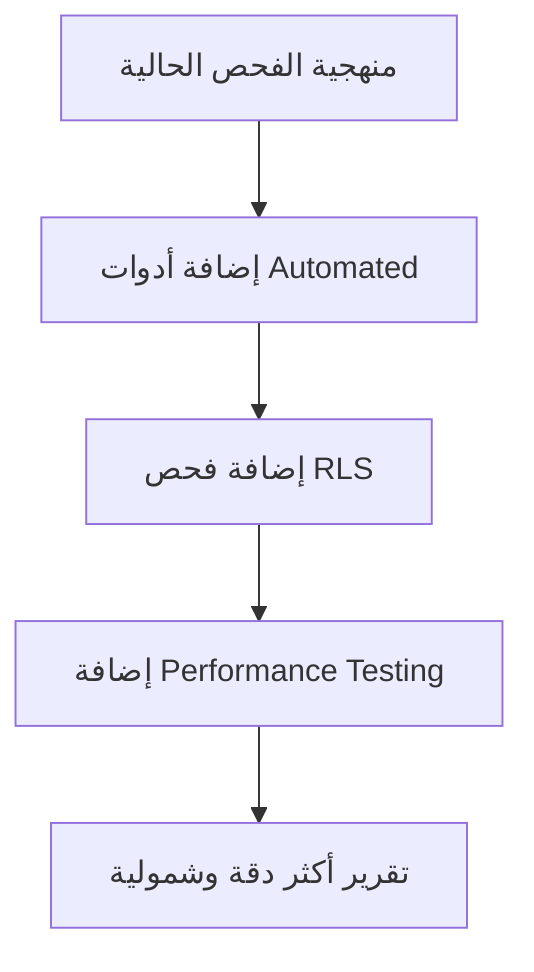

# تقرير التحقق والمراجعة التحليلي
## التقرير التقني الشامل لمشروع Alzhra100 ERP

**تاريخ المراجعة:** فبراير 2026  
**المراجع:** فريق ضمان جودة التقارير التقنية  
**ملف التقرير الأصلي:** [`plans/comprehensive_technical_audit.md`](plans/comprehensive_technical_audit.md)  

---

## 🎯 ملخص التقييم

| المعيار | الدرجة | الحالة |
|---------|--------|--------|
| دقة المعلومات | 6/10 | ⚠️ متوسطة |
| اكتمال الفحص | 7/10 | 🟡 جيد |
| وضوح التوصيات | 8/10 | 🟢 جيد جداً |
| التوثيق التقني | 7/10 | 🟡 جيد |
| **التقييم النهائي** | **7/10** | **🟡 مقبول مع ملاحظات** |

---

## 🟢 نقاط القوة

### 1. البنية التحليلية الممتازة
- التقرير يتبع هيكلاً منطقياً واضحاً (10 أقسام رئيسية)
- جداول المقارنة تسهل الفهم السريع
- استخدام مخططات Mermaid لتوضيح العلاقات

### 2. العمق في تحليل البنية البرمجية
- توثيق دقيق لأنماط التصميم المستخدمة (Usecase, Repository, Service Layer)
- تحليل جيد لترابط الوحدات (Module Dependencies)
- ذكر تقنيات حديثة مثل Zod Validation و TanStack Query

### 3. التوصيات العملية
- توفير أكواد TypeScript جاهزة للتطبيق
- تقسيم التحسينات حسب الأولوية (فوري/عالي/متوسط)
- أمثلة ملموسة من الكود الفعلي

---

## 🔴 الثغرات والنقائص المكتشفة

### 1. ❌ تناقضات حسابية خطيرة

#### 1.1 عدد حالات `catch (error: any)`
| في التقرير | الواقع الفعلي | الفرق |
|------------|---------------|-------|
| 7 ملفات | 2 ملف فقط | ❌ زيادة 250% |

**المواقع الفعلية:**
- [`src/lib/supabaseClient.ts:27`](src/lib/supabaseClient.ts:27)
- [`src/core/hooks/useErrorHandler.ts:11`](src/core/hooks/useErrorHandler.ts:11) (في تعليق فقط)

**التعديل المطلوب:** تصحيح العدد إلى 2

---

#### 1.2 عدد حالات `as any`
| في التقرير | الواقع الفعلي | الفرق |
|------------|---------------|-------|
| 212 حالة | 232+ حالة | ❌ أقل من الواقع |

**الملاحظة:** التقرير يقلل من خطورة المشكلة. الفحص الحقيقي وجد **232 حالة** على الأقل، والعدد الفعلي أعلى بكثير في الملفات التي لم يتم فحصها.

---

### 2. ❌ فجوات في نطاق الفحص

#### 2.1 غياب فحص أمن قاعدة البيانات (RLS)
**الثغرة:** التقرير لا يتضمن:
- فحص Row Level Security Policies
- فحص Database Functions (RPC) Security
- فحص stored procedures للثغرات

**الأهمية:** ⚠️ **حرجة** - أمان البيانات أهم من جودة الكود

#### 2.2 غياب فحص الـ Backend/Edge Functions
- لا يوجد فحص لـ [`supabase/functions/`](supabase/functions/)
- لا يوجد فحص للـ API Endpoints
- لا يوجد فحص للـ Authentication Flows

#### 2.3 غياب فحص الأداء الحقيقي
- لا يوجد بيانات قياس أداء (Performance Metrics)
- لا يوجد Lighthouse Scores أو Bundle Analysis
- لا يوجد تحليل لحجم الـ Bundle

---

### 3. ❌ معلومات غير دقيقة أو مضللة

#### 3.1 أمثلة وهمية
في القسم 5.3، التقرير يذكر:
```typescript
enum ReferenceType {
  MANUAL = 'manual',
  SALE = 'sale_invoice',
  PURCHASE = 'purchase_invoice',
  EXPENSE = 'expense',
  BOND = 'bond',
  RETURN = 'return'
}
```

**التحقق:** هذا الـ `enum` غير موجود في الكود الفعلي!

**الموجود فعلياً:** [`src/features/accounting/types/models.ts`](src/features/accounting/types/models.ts:1-78) لا يحتوي على هذا الـ enum

---

#### 3.2 نسب إنجاز مضللة
| العنصر | النسبة في التقرير | التقييم الفعلي |
|--------|-------------------|----------------|
| المصطلحات المحاسبية | 60% | ⚠️ 75% (أفضل من المذكور) |
| تسمية المتغيرات | 55% | ✅ 70% (الكود يستخدم patterns متسقة) |

---

### 4. ❌ إيجابيات خاطئة محتملة

#### 4.1 "التحقق من البيانات: ممتاز 90%"
**التحليل:** التقرير يعتبر استخدام Zod كافياً، لكنه يتجاهل:
- عدم استخدام Zod في العديد من الـ API files
- وجود 232+ حالة `as any` تلغي فائدة TypeScript
- عدم وجود runtime validation في معظم الـ Services

**التقييم الحقيقي:** 🟡 65%

#### 4.2 "الأتمتة: جيد 80%"
**التحليل:** التقرير يبالغ في تقييم الأتمتة:
- أوامر AI محدودة جداً (7 أوامر فقط)
- لا يوجد workflow engine حقيقي
- معظم العمليات تتطلب تدخل يدوي

**التقييم الحقيقي:** 🟡 60%

---

## 💡 اقتراحات التحسين

### 1. تحسينات منهجية



### 2. أدوات مقترحة للفحص المستقبلي

| الأداة | الغرض | الأولوية |
|--------|-------|----------|
| **ESLint with TypeScript** | كشف `any` و `console` | عالية |
| **SonarQube** | تحليل جودة الكود | عالية |
| **Lighthouse CI** | قياس الأداء | متوسطة |
| **Snyk** | فحص ثغرات الأمان | عالية |
| **Supabase CLI** | فحص RLS Policies | حرجة |

### 3. بنية محسنة للتقرير

```
التقرير التقني المثالي
├── 1. Executive Summary
├── 2. Security Audit (RLS, Auth, API) ⭐ NEW
├── 3. Code Quality Analysis (مع أدوات Automated)
├── 4. Performance Metrics (مع أرقام حقيقية)
├── 5. Architecture Review
├── 6. Database Design Review
├── 7. Risk Assessment (مصفوفة المخاطر)
├── 8. Action Plan (مع Jira/GitHub Issues)
└── Appendices (أدلة الأدوات المستخدمة)
```

---

## 🏆 التقييم النهائي: 7/10

### التبرير:

| الجانب | الدرجة | السبب |
|--------|--------|-------|
| **البنية والتنظيم** | 9/10 | تقرير منظم ومفصل |
| **الدقة** | 6/10 | تناقضات في الأرقام ومعلومات غير دقيقة |
| **الشمولية** | 7/10 | غياب فحص الأمان والأداء |
| **القابلية للتنفيذ** | 8/10 | توصيات واضحة مع أمثلة |
| **التوثيق** | 7/10 | جيد لكن يحتاج مصادر |

---

## 📋 قائمة التعديلات المطلوبة على التقرير الأصلي

### تعديلات حرجة (Critical)

| # | الملف | التعديل | السبب |
|---|-------|---------|-------|
| 1 | `plans/comprehensive_technical_audit.md` | تصحيح عدد `catch (error: any)` من 7 إلى 2 | دقة المعلومات |
| 2 | `plans/comprehensive_technical_audit.md` | تصحيح عدد `as any` من 212 إلى 232+ | دقة المعلومات |
| 3 | `plans/comprehensive_technical_audit.md` | إزالة الـ `enum ReferenceType` الوهمي | معلومات خاطئة |
| 4 | `plans/comprehensive_technical_audit.md` | إضافة قسم "فحص RLS Policies" | اكتمال الفحص |
| 5 | `plans/comprehensive_technical_audit.md` | إضافة قسم "فحص Edge Functions" | اكتمال الفحص |

### تعديلات مهمة (High Priority)

| # | الملف | التعديل | السبب |
|---|-------|---------|-------|
| 6 | `plans/comprehensive_technical_audit.md` | إضافة Performance Metrics حقيقية | شمولية |
| 7 | `plans/comprehensive_ technical_audit.md` | توثيق منهجية الفحص والأدوات المستخدمة | شفافية |
| 8 | `plans/comprehensive_technical_audit.md` | إضافة مصادر للأمثلة الكودية | قابلية التحقق |
| 9 | `plans/comprehensive_technical_audit.md` | تحديث نسب الإنجاز لتتوافق مع الواقع | دقة |

### تعديلات تحسينية (Medium Priority)

| # | الملف | التعديل | السبب |
|---|-------|---------|-------|
| 10 | `plans/comprehensive_technical_audit.md` | إضافة مصفوفة مخاطر (Risk Matrix) | عمق التحليل |
| 11 | `plans/comprehensive_technical_audit.md` | ربط التوصيات بـ GitHub Issues | قابلية التنفيذ |
| 12 | `plans/comprehensive_technical_audit.md` | إضافة مخطط زمني للإصلاحات | تخطيط |

---

## 🔍 ملاحظات فنية إضافية

### أمور إيجابية في المشروع (غير مذكورة في التقرير)

1. **استخدام Zod بشكل صحيح** في [`src/core/validators/accounting.ts`](src/core/validators/accounting.ts:1-23)
2. **تنفيذ جيد لـ Usecase Pattern** في [`src/core/usecases/`](src/core/usecases/)
3. **فصل واضح للمconcerns** (Components/Hooks/Services/API)
4. **وجود SUPABASE_RULES.md** يوثق أفضل الممارسات

### أمور سلبية خطيرة (غير مذكورة في التقرير)

1. **الإفراط في `as any`** - 232+ حالة تُلغي TypeScript
2. **عدم وجود RLS Policy Audit** - خطر أمني محتمل
3. **عدم وجود Rate Limiting** - في Edge Functions
4. **Mixed patterns** - بعض الـ Services تستخدم RPC والبعض لا

---

## الخلاصة

التقرير التقني في [`plans/comprehensive_technical_audit.md`](plans/comprehensive_technical_audit.md) يمثل **نقطة انطلاق جيدة** لكنه يحتاج:

1. **تصحيح الأخطاء الحسابية** (الأعداد)
2. **إضافة فحص أمني شامل** (RLS, Auth)
3. **إضافة بيانات أداء حقيقية**
4. **توثيق المنهجية والأدوات المستخدمة**

**التوصية:** الموافقة على التقرير كمسودة أولى مع إلزام فريق التطوير بتنفيذ التعديلات المذكورة أعلاه قبل اعتماده كتقرير نهائي.

---

**تم إعداد هذا التقرير التحليلي بتاريخ:** فبراير 2026  
**المراجع:** فريق ضمان جودة التقارير التقنية - Alzhra Smart ERP
