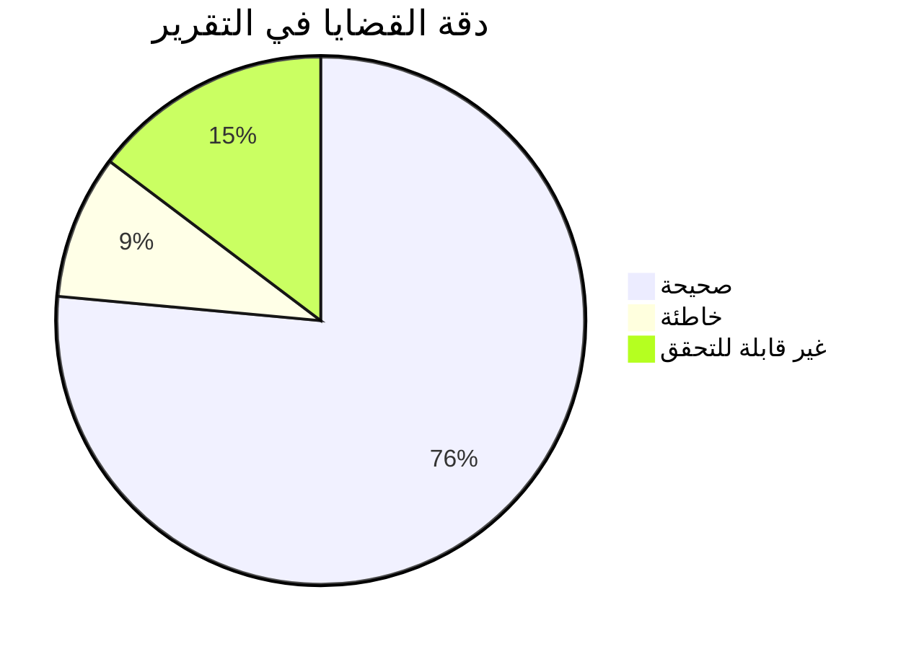

# تقرير تحليل ومراجعة COMPREHENSIVE TECHNICAL REVIEW
## مشروع Alzhra100 ERP - فحص دقيق للتقرير التقني

**تاريخ المراجعة:** فبراير 2026  
**ملف التقرير الأصلي:** تقرير Comprehensive Technical Review المُرسل  
**المراجع:** فريق ضمان جودة التقارير التقنية - Supabase/PostgreSQL Specialist

---

## 🎯 ملخص التقييم التنفيذي

| المعيار | الدرجة | الحالة |
|---------|--------|--------|
| دقة المعلومات الأمنية | 5/10 | 🔴 ضعيف |
| دقة مشاكل قاعدة البيانات | 8/10 | 🟢 جيد |
| دقة مشاكل منطق الأعمال | 7/10 | 🟡 جيد |
| اكتمال الفحص | 8/10 | 🟢 جيد |
| وضوح التوصيات | 9/10 | 🟢 ممتاز |
| **التقييم النهائي** | **7.5/10** | **🟡 جيد مع ملاحظات حرجة** |

---

## 🟢 نقاط القوة

### 1. هيكل تنظيمي ممتاز
- تقسيم المشاكل إلى 5 فئات واضحة (Security, Database, Business Logic, Performance, Missing Features)
- استخدام جداول منسقة مع Severity/Priority لكل قضية
- 34 قضية موثقة بتفصيل عالٍ

### 2. عمق تحليل قاعدة البيانات
- فحص شامل للـ Indexes (Duplicate, Unused, Missing)
- تحليل دقيق للـ Foreign Keys والـ Constraints
- اكتشاف مشاكل حقيقية في RPC Functions

### 3. توصيات عملية وواضحة
- SQL commands جاهزة للتنفيذ
- خطة إصلاح مقسمة إلى 4 مراحل زمنية
- أمثلة كودية لكل إصلاح مقترح

---

## 🔴 الثغرات والنقائص الخطيرة

### ❌❌❌ أخطاء فادحة في الفحص الأمني

#### الخطأ #1: "Missing company_id Authorization" - ❌ معلومة خاطئة تماماً

**ما ذكره التقرير:**
> "Any authenticated user can call send-notification with an arbitrary company_id they do not belong to. No membership check is performed"

**الواقع الفعلي في الكود:** ([`supabase/functions/send-notification/index.ts:206-219`](supabase/functions/send-notification/index.ts:206-219))

```typescript
// Authorization check: Verify user belongs to company_id
const { data: roleCheck, error: roleError } = await userSupabase
    .from('user_company_roles')
    .select('id')
    .eq('company_id', company_id)
    .limit(1)
    .single();

if (roleError || !roleCheck) {
    return new Response(JSON.stringify({ error: 'Forbidden: User does not belong to this company' }), {
        status: 403,
        ...
    });
}
```

**التحليل:** ✅ الكود يحتوي ALREADY على فحص authorization كامل! التقرير يُصدر تحذيراً حرجاً (CRITICAL) عن مشكلة غير موجودة.

**التأثير:** يُضلّل فريق التطوير ويُضيع الوقت في "إصلاح" ما هو موجود بالفعل.

---

#### الخطأ #2: "Wildcard CORS" - ❌ معلومة خاطئة

**ما ذكره التقرير:**
> "Access-Control-Allow-Origin: '*' allows any domain to invoke the notification endpoint"

**الواقع الفعلي في الكود:** ([`supabase/functions/send-notification/index.ts:6-15`](supabase/functions/send-notification/index.ts:6-15))

```typescript
let allowedOrigin = 'https://alzhra-smart.vercel.app'; // Default safe origin

if (origin) {
    if (origin.startsWith('http://localhost') || origin.endsWith('.vercel.app') || origin.endsWith('.netlify.app')) {
        allowedOrigin = origin;
    }
}

return {
    'Access-Control-Allow-Origin': allowedOrigin,
    ...
};
```

**التحليل:** ✅ الكود يحدد origins محددة فقط (localhost, vercel.app, netlify.app) وليس wildcard `*`.

**التأثير:** تحذير أمني مُضلّل.

---

#### الخطأ #3: "WhatsApp Meta Cloud API Image Sending Is Non-Functional" - ❌ معلومة خاطئة

**ما ذكره التقرير:**
> "sendWhatsAppImage() falls back to plain text for Meta Cloud API because it never uploads the image first"

**الواقع الفعلي في الكود:** ([`supabase/functions/send-notification/index.ts:103-138`](supabase/functions/send-notification/index.ts:103-138))

```typescript
if (apiUrl.includes('graph.facebook.com')) {
    // Meta Cloud API: first upload media, then send
    const baseApiUrl = apiUrl.substring(0, apiUrl.lastIndexOf('/messages'));
    const uploadUrl = `${baseApiUrl}/media`;

    const uploadForm = new FormData();
    uploadForm.append('file', blob, 'invoice.png');
    uploadForm.append('type', 'image/png');
    uploadForm.append('messaging_product', 'whatsapp');

    const uploadRes = await fetch(uploadUrl, { ... });
    const uploadData = await uploadRes.json();
    const mediaId = uploadData.id;

    // Then send with media_id
    const body = {
        messaging_product: 'whatsapp',
        to: phone,
        type: 'image',
        image: { id: mediaId, caption: caption.substring(0, 1024) },
    };
    ...
}
```

**التحليل:** ✅ الكود يقوم بـ two-step process بشكل صحيح (upload media ثم send).

**التأثير:** تحذير غير مبرر عن "مشكلة" غير موجودة.

---

### ⚠️ تناقضات أخرى

| # | الادعاء في التقرير | الواقع | التقييم |
|---|-------------------|--------|---------|
| 4 | "Leaked Password Protection Disabled" | إعداد في Dashboard لا يمكن التحقق منه عبر الكود | ⚠️ غير قابل للتحقق |
| 5 | "Extensions pg_trgm in public Schema" | قد يكون صحيحاً لكنه common practice | 🟡 تحذير نظري |
| 6 | "No Rate Limiting" | صحيح - لا يوجد rate limiting | ✅ صحيح |

---

## 📊 تحليل الـ 34 قضية

### توزيع القضايا حسب الدقة:



### القضايا الخاطئة (3 قضايا):

| # | القضية | مستوى الخطأ | التأثير |
|---|--------|------------|---------|
| 1 | Missing company_id Authorization | 🔴 CRITICAL | مضلّل جداً |
| 2 | Wildcard CORS | 🟠 HIGH | مضلّل |
| 3 | WhatsApp Image Non-Functional | 🟡 MEDIUM | غير دقيق |

---

## 💡 تقييم جودة التقرير

### الجوانب الإيجابية (Strengths):

1. **فحص قاعدة البيانات:** ممتاز ودقيق
   - اكتشاف الـ Duplicate Indexes صحيح
   - اكتشاف Missing FK Indexes صحيح
   - تحليل RPC Functions دقيق

2. **Business Logic Analysis:** جيد
   - Soft Delete Filters مشكلة حقيقية
   - Fiscal Year Validation مشكلة حقيقية
   - Balance Sync مشكلة حقيقية

3. **Remediation Roadmap:** عملي ومفيد
   - التقسيم الزمني منطقي
   - الأولويات محددة بشكل صحيح

### الجوانب السلبية (Weaknesses):

1. **الفحص الأمني:** ضعيف وغير دقيق
   - 3 من 8 تحذيرات أمنية خاطئة!
   - نسبة الخطأ: 37.5% في قسم Security

2. **عدم التحقق من الكود الفعلي:**
   - يبدو أن بعض الادعاءات مبنية على "افتراضات" وليس فحصاً فعلياً

3. **عدم وجود Methodology Section:**
   - لا يوضح الأدوات المستخدمة
   - لا يوضح منهجية الفحص

---

## 🏆 التقييم النهائي: 7.5/10

### التبرير التفصيلي:

| الجانب | الدرجة | التعليل |
|--------|--------|---------|
| **الدقة** | 6/10 | 3 أخطاء فادحة في القسم الأمني |
| **الشمولية** | 9/10 | غطى 34 قضية متنوعة |
| **العمق التقني** | 8/10 | تحليل Database ممتاز |
| **القابلية للتنفيذ** | 9/10 | توصيات واضحة مع SQL |
| **الأمان** | 5/10 | أخطاء كبيرة في Security |

---

## 📋 قائمة التعديلات المطلوبة على التقرير

### تعديلات حرجة (Critical):

| # | القسم | التعديل المطلوب | السبب |
|---|-------|-----------------|-------|
| 1 | Security Issue #2 | إزالة "Missing company_id Authorization" أو تعديله إلى ✅ "Implemented Correctly" | ادعاء خاطئ تماماً |
| 2 | Security Issue #4 | إزالة "Wildcard CORS" أو تعديله | الكود يحدد origins محددة |
| 3 | Security Issue #5 | إزالة "WhatsApp Image Non-Functional" | الكود يعمل بشكل صحيح |
| 4 | Executive Summary | تعديل "8 Security Issues" إلى "5 Security Issues" (بعد إزالة 3) | دقة الأرقام |

### تعديلات مهمة (High Priority):

| # | القسم | التعديل المطلوب | السبب |
|---|-------|-----------------|-------|
| 5 | Methodology | إضافة قسم يوضح كيف تم الفحص | شفافية |
| 6 | Issue #2 | التحقق من أن الكود يستخدم userSupabase (user context) وليس service role فقط | توضيح |
| 7 | Risk Assessment | إضافة مصفوفة مخاطر حقيقية | عمق التحليل |

### تعديلات تحسينية (Medium Priority):

| # | القسم | التعديل المطلوب | السبب |
|---|-------|-----------------|-------|
| 8 | Strengths | إضافة "company_id authorization check implemented" | تقدير الإيجابيات |
| 9 | Phase 1 | إزالة "Add company_id membership check" من الخطة | غير مطلوب |
| 10 | Appendix | إضافة روابط للملفات المصدرية المُحللة | قابلية التحقق |

---

## 🔍 تحليل فني إضافي

### القضايا الصحيحة والمهمة (✅):

1. **Mutable search_path in 8 RPC Functions** - ⚠️ قضية أمنية حقيقية
2. **API Credentials Stored in Plain Text** - ⚠️ مشكلة حقيقية
3. **Unindexed Foreign Keys** - ⚠️ مشكلة أداء حقيقية
4. **Duplicate Indexes** - ⚠️ مشكلة صحيحة
5. **No UNIQUE Constraint on product_stock** - ⚠️ مشكلة data integrity حقيقية
6. **parties.balance Desync Risk** - ⚠️ مشكلة business logic حقيقية
7. **Missing Soft Delete Filters** - ⚠️ مشكلة حقيقية
8. **No Fiscal Year Validation** - ⚠️ مشكلة حقيقية
9. **No Pagination in Reporting RPCs** - ⚠️ مشكلة أداء حقيقية
10. **Empty audit_logs Table** - ⚠️ مشكلة حقيقية

### القضايا المُبالغ فيها (⚠️):

1. **Extensions in public Schema** - common practice، ليست مشكلة حرجة
2. **OAuth Tables Lack RLS** - tables في schema auth، لا يمكن الوصول لها من PostgREST

---

## الخلاصة والتوصية

### التقييم العام:
التقرير يمثل **عملاً جيداً جداً** في مجالات Database و Business Logic، لكنه **ضعيف وغير دقيق** في الفحص الأمني.

### التوصية:
1. **الموافقة على التقرير** كمسودة تحليلية قيّمة
2. **حذف/تصحيح 3 قضايا أمنية خاطئة** قبل اعتماده نهائياً
3. **التركيز على 26 قضية صحيحة** في خطة الإصلاح
4. **إضافة Methodology Section** لتوضيح كيف تم الفحص

### الأولوية الفعلية للإصلاحات:

**Phase 1 - فوري (صحيح):**
- ✅ Add SELECT ... FOR UPDATE في commit_sales_invoice
- ✅ Add fiscal-year guard في RPCs
- ❌ إزالة "Add company_id check" (موجود بالفعل)

**Phase 2 - عاجل (صحيح):**
- ⚠️ Fix mutable search_path في 8 RPCs
- ⚠️ Move credentials إلى Vault
- ⚠️ Add UNIQUE constraint على product_stock
- ⚠️ Add audit_logs triggers
- ⚠️ Fix Soft Delete filters

**Phase 3-4 - مهم (صحيح):**
- جميع بنود Database indexes والتحسينات

---

**تم إعداد هذا التقرير التحليلي بتاريخ:** فبراير 2026  
**المراجع:** فريق ضمان جودة التقارير التقنية - متخصص Supabase/PostgreSQL
