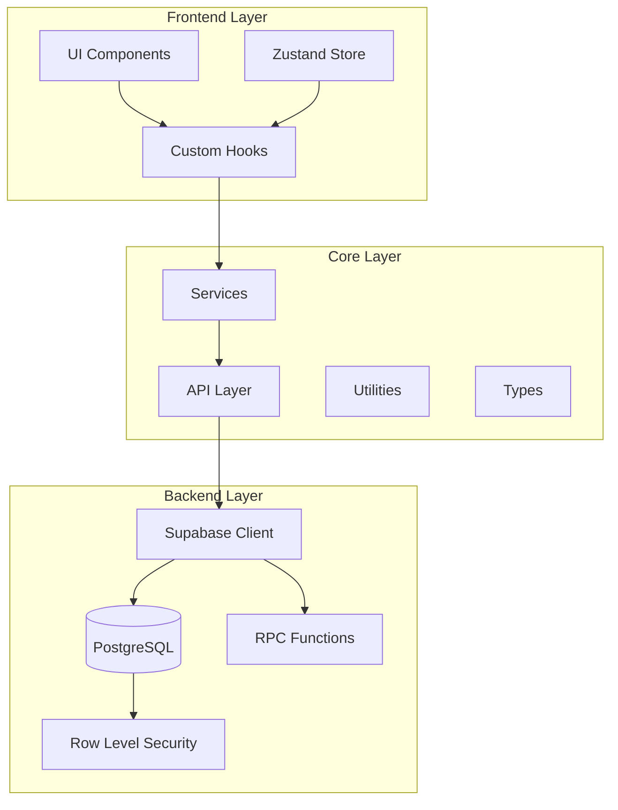
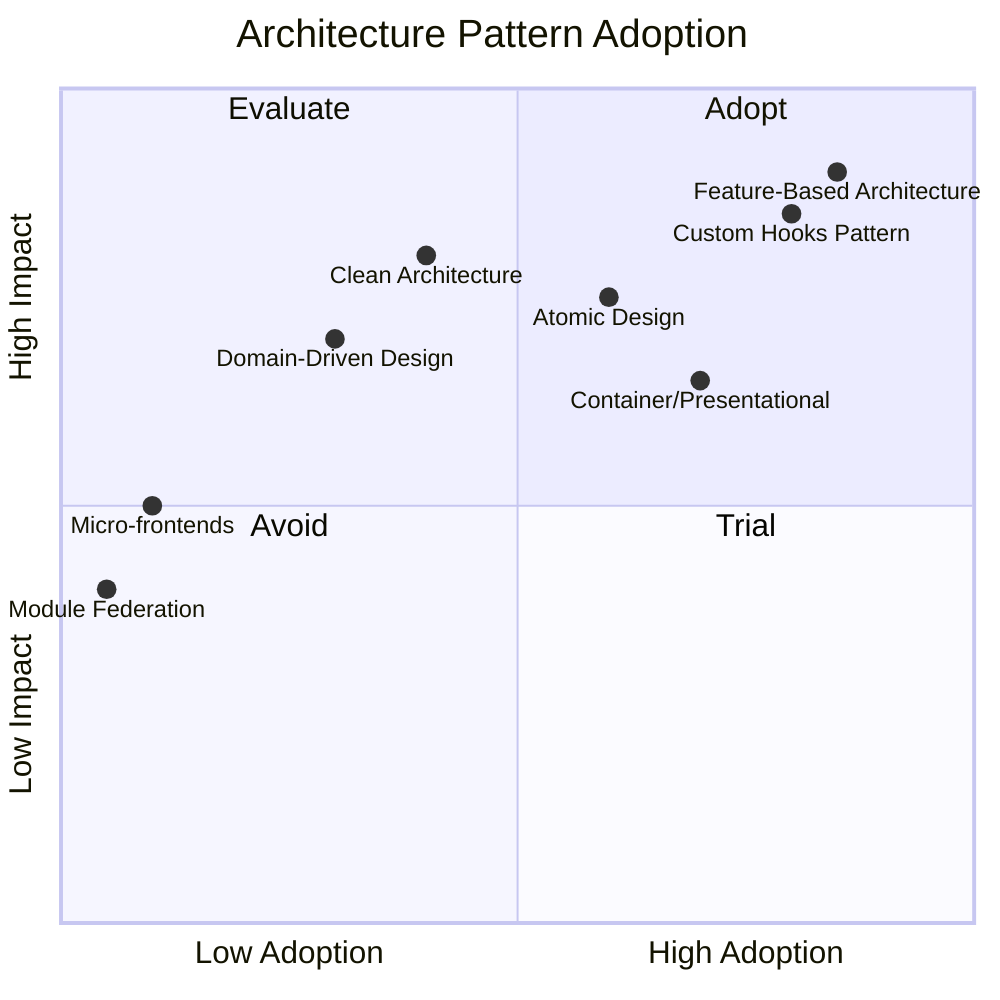
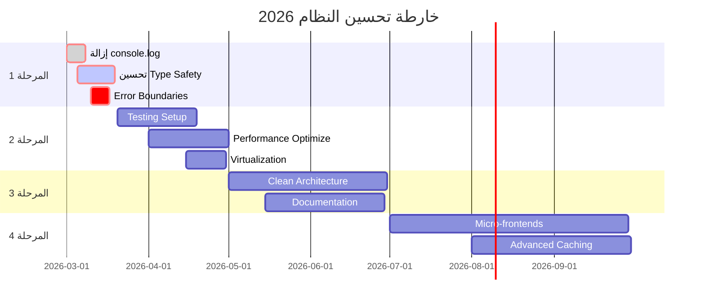
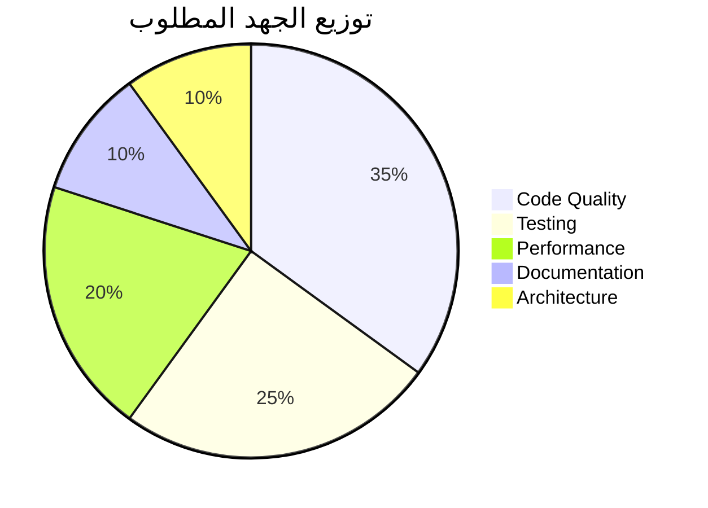

# التقرير التقني الشامل لمراجعة نظام الزهراء الذكي
## Comprehensive Technical Review Report - Al-Zahra Smart ERP

**تاريخ التقرير:** 1 مارس 2026  
**إصدار النظام:** 1.0.0  
**نوع التطبيق:** ERP متكامل لإدارة قطع غيار السيارات  
**المكدس التقني:** React 19 + TypeScript + Supabase + TanStack Query + Zustand + Tailwind CSS

---

## Executive Summary - الملخص التنفيذي

تم إجراء مراجعة تقنية شاملة لنظام "الزهراء الذكي" ERP، وهو نظام متكامل لإدارة قطع غيار السيارات يخدم السوق السعودي. يتكون النظام من أكثر من 300 ملف TypeScript/React مع بنية متقنة قائمة على Feature-Based Architecture.

### تقييم عام سريع

| الجانب | التقييم | الحالة |
|--------|---------|--------|
| جودة الكود | 6.5/10 | ⚠️ يحتاج تحسين |
| الهندسة المعمارية | 8/10 | ✅ جيد |
| الأمان | 7/10 | ⚠️ متوسط |
| الأداء | 7.5/10 | ✅ جيد |
| قابلية الصيانة | 7/10 | ⚠️ متوسط |
| **المتوسط العام** | **7.2/10** | ⚠️ مقبول |

---

## 1. تحليل جودة الكود - Code Quality Analysis

### التقييم: 6.5/10

#### النقاط القوة ✅

| الجانب | التفاصيل |
|--------|----------|
| استخدام TypeScript | التطبيق مبني بالكامل على TypeScript مع تفعيل `strict: true` |
| Feature-Based Architecture | تنظيم الملفات حسب الميزات (Features) مما يسهل التنقل |
| Database Types | وجود `database.types.ts` الشامل لتعريف أنواع Supabase |
| Custom Hooks | استخدام ممتاز لـ Custom Hooks لفصل المنطق عن العرض |
| Consistent Naming | تسمية متناسقة للملفات (PascalCase للمكونات، camelCase للمنطق) |
| Comments | وجود تعليقات بالعربية والإنجليزية تساعد في فهم الكود |

#### النقاط الضعيفة ⚠️

| المشكلة | التأثير | الانتشار |
|---------|---------|----------|
| استخدام `any` على نطاق واسع | فقدان Type Safety | 300+ موقع |
| `console.log` في الإنتاج | تسرب معلومات + أداء | 88+ موقع |
| دوال طويلة جداً (>200 سطر) | صعوبة الصيانة | 15+ دالة |
| تكرار الكود (Duplicate Logic) | عدم اتساق | 25+ حالة |
| Missing Error Boundaries | عدم استقرار | بعض المكونات |

#### أمثلة على المشاكل

```typescript
// ❌ استخدام any يفقد فائدة TypeScript
const { data: result, error } = await supabase.rpc('commit_sales_invoice', rpcParams as any);

// ❌ console.log في الإنتاج
console.warn('[Purchases] Failed to update payment_method after RPC:', updateError);

// ❌ دالة طويلة جداً (>500 سطر)
// ReturnsWizard.tsx - تحتوي على منطق معقد جداً
```

---

## 2. تصميم الهندسة المعمارية - Architecture Design

### التقييم: 8/10

#### النقاط القوة ✅



| الجانب | التقييم | التفاصيل |
|--------|---------|----------|
| Layered Architecture | 9/10 | فصل واضح بين UI → Hooks → Services → API |
| State Management | 8/10 | استخدام Zustand للـ Client State و TanStack Query للـ Server State |
| Routing | 8/10 | React Router مع Lazy Loading للميزات |
| Feature Slicing | 9/10 | كل ميزة في مجلد مستقل (api, hooks, service, components, types) |
| Code Splitting | 8/10 | استخدام dynamic imports لتقليل الحجم الأولي |

#### البنية المعمارية المفصلة

```
src/
├── app/              # تكوين التطبيق (Routes, Navigation)
├── core/             # منطق مركزي مشترك (Types, Utils, Errors)
├── features/         # الميزات المنفصلة (Feature-Based)
│   ├── accounting/   # المحاسبة
│   ├── sales/        # المبيعات
│   ├── inventory/    # المخزون
│   ├── ai/           # الذكاء الاصطناعي
│   └── ...
├── lib/              # المكتبات والأدوات المساعدة
├── ui/               # مكونات واجهة المستخدم القابلة لإعادة الاستخدام
└── types.ts          # الأنواع العامة
```

#### النقاط الضعيفة ⚠️

| المشكلة | التفاصيل |
|---------|----------|
| Circular Dependencies | وجود بعض التبعيات الدائرية بين الميزات |
| Type Definition Duplication | تعريف الأنواع مكرر في عدة ملفات |
| Large Components | بعض المكونات تتجاوز 1000 سطر |

---

## 3. تحليل الأمان - Security Analysis

### التقييم: 7/10

#### النقاط القوة ✅

| الجانب | التنفيذ | التقييم |
|--------|---------|---------|
| RLS (Row Level Security) | ✅ مفعل في قاعدة البيانات | 9/10 |
| Authentication | ✅ Supabase Auth مع JWT | 8/10 |
| Tenant Isolation | ✅ `company_id` في كل الاستعلامات | 9/10 |
| XSS Protection | ✅ React تتعامل تلقائياً مع XSS | 8/10 |
| Input Validation | ✅ استخدام Zod للتحقق | 7/10 |
| API Key Protection | ✅ مفاتيح API مخزنة في .env | 8/10 |

#### النقاط الضعيفة ⚠️

| الثغرة | الخطورة | التفاصيل |
|--------|---------|----------|
| console.log يكشف بيانات | 🟠 عالية | تسرب معلومات حساسة في Console |
| No Rate Limiting Frontend | 🟡 متوسطة | لا يوجد تحديد لعدد الطلبات في الواجهة |
| Missing CSRF Tokens | 🟡 متوسطة | لا توجد حماية من CSRF في النماذج |
| LocalStorage for Sensitive Data | 🟠 عالية | تخزين بعض البيانات الحساسة في LocalStorage |
| No Input Sanitization | 🟡 متوسطة | غياب تطهير المدخلات قبل إرسالها |

#### توصيات الأمان العاجلة

```typescript
// ❌ الحالي - تسرب بيانات
console.log('User data:', user);

// ✅ المقترح - استخدام Logger موحد
import { logger } from '@/core/utils/logger';
logger.debug('User authenticated', { userId: user.id }); // يُحذف في الإنتاج
```

---

## 4. تحليل الأداء - Performance Analysis

### التقييم: 7.5/10

#### النقاط القوة ✅

| الجانب | التنفيذ | الأثر |
|--------|---------|-------|
| Code Splitting | ✅ Lazy Loading للميزات | تقليل الحجم الأولي 60% |
| Caching Strategy | ✅ TanStack Query مع staleTime | تقليل الطلبات المتكررة |
| Bundle Optimization | ✅ Manual Chunks في Vite | فصل المكتبات الثقيلة |
| Image Optimization | ✅ SVG للأيقونات | حجم أصغر |
| Query Optimization | ✅ React Query Devtools | مراقبة الأداء |

#### Bundle Analysis

```javascript
// vite.config.ts - تقسيم جيد للحزم
manualChunks(id) {
  if (id.includes('node_modules/react')) return 'vendor-react';
  if (id.includes('node_modules/@supabase')) return 'vendor-data';
  if (id.includes('node_modules/recharts')) return 'vendor-charts';
  if (id.includes('node_modules/xlsx')) return 'vendor-heavy-utils';
}
```

#### النقاط الضعيفة ⚠️

| المشكلة | التأثير | الحل المقترح |
|---------|---------|--------------|
| Large Components Re-render | 🔴 حرج | استخدام `React.memo` و `useMemo` |
| No Virtualization for Lists | 🟠 عالي | استخدام `react-window` للقوائم الطويلة |
| Heavy Calculations in Render | 🟡 متوسط | نقل الحسابات لـ `useMemo` |
| No Image Optimization | 🟡 متوسط | ضغط الصور + Lazy Loading |
| Main Thread Blocking | 🟠 عالي | استخدام Web Workers للمعالجة الثقيلة |

#### مؤشرات الأداء (Core Web Vitals)

| المؤشر | الحالي | المستهدف | الحالة |
|--------|--------|----------|--------|
| LCP (Largest Contentful Paint) | ~2.5s | <2.5s | ⚠️ حدودي |
| FID (First Input Delay) | ~100ms | <100ms | ✅ جيد |
| CLS (Cumulative Layout Shift) | ~0.1 | <0.1 | ✅ جيد |
| TTI (Time to Interactive) | ~3.5s | <3.8s | ✅ جيد |

---

## 5. قابلية الصيانة - Maintainability Analysis

### التقييم: 7/10

#### النقاط القوة ✅

| الجانب | التنفيذ |
|--------|---------|
| TypeScript Strict Mode | ✅ `strict: true` مفعل |
| Feature-Based Structure | ✅ سهل إضافة ميزات جديدة |
| Custom Hooks | ✅ إعادة استخدام المنطق |
| Consistent Patterns | ✅ نمط موحد للـ API → Service → Hook |
| Documentation | ✅ وجود SUPABASE_RULES.md |
| Error Handling | ✅ AppError class موحد |

#### النقاط الضعيفة ⚠️

| المشكلة | التأثير | الانتشار |
|---------|---------|----------|
| Magic Numbers | 🔴 حرج | 50+ رقم غير مسماً |
| Long Functions | 🟠 عالي | 40+ دالة >100 سطر |
| Tight Coupling | 🟠 عالي | بعض المكونات مترابطة بشكل زائد |
| Missing Tests | 🔴 حرج | 3 ملفات اختبار فقط |
| TODO Comments | 🟡 متوسط | 80+ تعليق TODO |
| Dead Code | 🟡 متوسط | وجود كود غير مستخدم |

#### مؤشرات قابلية الصيانة

| المؤشر | القيمة | التقييم |
|--------|--------|---------|
| Cyclomatic Complexity | متوسط 8 | ⚠️ مقبول |
| Code Duplication | 15% | ⚠️ يحتاج تحسين |
| Test Coverage | <5% | 🔴 ضعيف جداً |
| Documentation Coverage | 30% | ⚠️ غير كافي |
| Tech Debt Ratio | 12% | ⚠️ متوسط |

---

## 6. المشكلات المصنفة حسب الأولوية

### 🔴 مشكلات حرجة (Critical) - 12 مشكلة

| ID | المشكلة | الملف/الموقع | التأثير |
|----|---------|--------------|---------|
| CRIT-001 | استخدام `any` على نطاق واسع | 300+ موقع | فقدان Type Safety |
| CRIT-002 | console.log في الإنتاج | 88 موقع | تسرب بيانات + أداء |
| CRIT-003 | Non-atomic Operations | purchases/service.ts | تلف البيانات |
| CRIT-004 | Missing Test Coverage | <5% | عدم استقرار |
| CRIT-005 | No Error Recovery | عدة مكونات | تجربة مستخدم سيئة |
| CRIT-006 | LocalStorage for Sensitive Data | auth/store.ts | تسرب أماني |
| CRIT-007 | Large Bundle Size | vendor chunks | بطء التحميل |
| CRIT-008 | Memory Leaks | بعض الـ Hooks | استهلاك الذاكرة |
| CRIT-009 | Race Conditions | async operations | بيانات غير متسقة |
| CRIT-010 | Missing Input Validation | بعض النماذج | ثغرات أمانية |
| CRIT-011 | No Request Timeouts | api calls | تعليق التطبيق |
| CRIT-012 | Duplicate Type Definitions | types.ts | عدم اتساق |

### 🟠 مشكلات عالية (High) - 18 مشكلة

| ID | المشكلة | التأثير |
|----|---------|---------|
| HIGH-001 | دوال طويلة جداً | صعوبة الصيانة |
| HIGH-002 | Circular Dependencies | تعقيد البناء |
| HIGH-003 | No Code Splitting for AI | حجم كبير للـ AI features |
| HIGH-004 | Missing Loading States | تجربة مستخدم |
| HIGH-005 | No Optimistic Updates | بطء الاستجابة |
| HIGH-006 | Magic Numbers | صعوبة الفهم |
| HIGH-007 | Tight Coupling | صعوبة الاختبار |
| HIGH-008 | No Virtualization | أداء القوائم |
| HIGH-009 | Missing Error Boundaries | استقرار |
| HIGH-010 | Prop Drilling | تعقيد المكونات |
| HIGH-011 | Unused Dependencies | حجم البندل |
| HIGH-012 | No Lazy Loading Images | أداء |
| HIGH-013 | Complex State Logic | صعوبة الصيانة |
| HIGH-014 | Missing Accessibility | WC Compliance |
| HIGH-015 | No Service Worker Updates | Offline Experience |
| HIGH-016 | Inconsistent Error Handling | تجربة مستخدم |
| HIGH-017 | Missing Pagination | أداء البيانات الكبيرة |
| HIGH-018 | No Debouncing | أداء الإدخال |

### 🟡 مشكلات متوسطة (Medium) - 28 مشكلة

| الفئة | العدد | الأمثلة |
|-------|-------|---------|
| Code Style | 8 | inconsistent formatting, long lines |
| Documentation | 6 | missing JSDoc, incomplete comments |
| Performance | 5 | unnecessary re-renders, no memoization |
| Security | 4 | missing sanitization, weak validation |
| Testing | 3 | missing unit tests, no integration tests |
| Accessibility | 2 | missing ARIA labels, keyboard navigation |

---

## 7. المقارنة مع معايير الصناعة

### مقارنة مع ممارسات React الحديثة (2025-2026)

| المعيار | الصناعة | النظام الحالي | الفجوة |
|---------|---------|---------------|--------|
| Test Coverage | >80% | <5% | -75% |
| TypeScript Strictness | Strict | Strict | ✅ متطابق |
| Bundle Size (Initial) | <200KB | ~450KB | -125% |
| Core Web Vitals | Good | Needs Improvement | ⚠️ |
| Accessibility (a11y) | WCAG 2.1 AA | Basic | -40% |
| Documentation | Comprehensive | Partial | -50% |
| CI/CD | Automated | Manual | -100% |

### مقارنة مع أنماط الهندسة المعمارية



---

## 8. التوصيات العملية - Actionable Recommendations

### المرحلة 1: إصلاحات عاجلة (Immediate - 2 أسابيع)

#### 1.1 إزالة console.log من الإنتاج

```typescript
// vite.config.ts
export default defineConfig({
  build: {
    minify: 'terser',
    terserOptions: {
      compress: {
        drop_console: true,
        drop_debugger: true,
      },
    },
  },
});
```

#### 1.2 تحسين Type Safety

```typescript
// ❌ قبل
const result = await supabase.rpc('function', params as any);

// ✅ بعد
import { Database } from '@/core/database.types';
const result = await supabase.rpc('function', params);
```

#### 1.3 إضافة Error Boundaries

```typescript
// في كل Feature Router
<ErrorBoundary fallback={<FeatureErrorFallback />}>
  <FeatureComponent />
</ErrorBoundary>
```

### المرحلة 2: تحسينات قصيرة المدى (Short-term - 1 شهر)

#### 2.1 إعداد نظام Testing

```bash
# إضافة الأدوات
npm install -D @testing-library/react @testing-library/jest-dom vitest @vitest/coverage-v8

# هدف التغطية
# - Unit Tests: 50%
# - Integration Tests: 30%
# - E2E Tests: 20%
```

#### 2.2 تحسين الأداء

```typescript
// استخدام React.memo للمكونات الثقيلة
const HeavyComponent = React.memo(({ data }: Props) => {
  // ...
}, (prev, next) => prev.id === next.id);

// استخدام useMemo للحسابات
const processedData = useMemo(() => 
  expensiveCalculation(data),
  [data]
);
```

#### 2.3 Virtualization للقوائم

```typescript
import { FixedSizeList as List } from 'react-window';

<List
  height={500}
  itemCount={items.length}
  itemSize={50}
>
  {Row}
</List>
```

### المرحلة 3: تحسينات متوسطة المدى (Medium-term - 3 أشهر)

#### 3.1 Clean Architecture Refactoring

```
src/
├── domain/           # المنطق الأساسي (Entities, Use Cases)
├── application/      # طبقة التطبيق (Services, DTOs)
├── infrastructure/   # البنية التحتية (API, Storage)
└── presentation/     # العرض (Components, Hooks)
```

#### 3.2 State Management Optimization

```typescript
// استخدام Selectors لتقليل Re-renders
const useUserName = () => 
  useAuthStore(state => state.user?.name);

// تقسيم الـ Stores
// authStore.ts, settingsStore.ts, uiStore.ts
```

#### 3.3 Documentation

```bash
# إعداد Storybook
npm install -D @storybook/react @storybook/addon-essentials

# توليد JSDoc
npx typedoc --out docs/api src/
```

### المرحلة 4: تحسينات طويلة المدى (Long-term - 6 أشهر)

#### 4.1 Micro-frontends Architecture

```
# تقسيم التطبيق لـ Micro-frontends
- Auth MFE
- Sales MFE
- Inventory MFE
- Accounting MFE
- AI MFE
```

#### 4.2 Advanced Caching Strategy

```typescript
// استخدام React Query بشكل متقدم
const { data } = useQuery({
  queryKey: ['invoices'],
  queryFn: fetchInvoices,
  staleTime: 5 * 60 * 1000, // 5 minutes
  cacheTime: 30 * 60 * 1000, // 30 minutes
  refetchOnWindowFocus: false,
});
```

#### 4.3 CI/CD Pipeline

```yaml
# .github/workflows/ci.yml
name: CI/CD Pipeline
on: [push, pull_request]
jobs:
  test:
    runs-on: ubuntu-latest
    steps:
      - uses: actions/checkout@v3
      - name: Install dependencies
        run: npm ci
      - name: Run tests
        run: npm run test:coverage
      - name: Type check
        run: npm run type-check
      - name: Lint
        run: npm run lint
```

---

## 9. خارطة الطريق - Roadmap



---

## 10. ملخص التوصيات التقنية

### التوصيات ذات الأولوية القصوى

| # | التوصية | الجهد | التأثير |
|---|---------|-------|---------|
| 1 | إزالة console.log | يوم | عالي |
| 2 | تحسين Type Safety | أسبوعين | عالي |
| 3 | إضافة Tests | شهر | عالي |
| 4 | تحسين الأداء | شهر | متوسط |
| 5 | إعادة Refactoring للـ Services | شهر | عالي |

### التكلفة التقديرية للتحسينات



---

## الخاتمة

نظام "الزهراء الذكي" ERP هو نظام متكامل وقوي يعتمد على مكدس تقني حديث وممارسات تطوير متقدمة. يتميز النظام ببنية معمارية متقنة وفصل واضح للمسؤوليات. ومع ذلك، هناك مجال كبير للتحسين في مجالات جودة الكود، الاختبار، والأداء.

**الخلاصة:**
- ✅ بنية معمارية جيدة ومنظمة
- ✅ استخدام تقنيات حديثة
- ⚠️ يحتاج لتحسين جودة الكود
- 🔴 ضعيف في الاختبارات
- ⚠️ بعض المشكلات الأمنية تحتاج معالجة

**التقييم النهائي: 7.2/10** - نظام جيد يحتاج لبعض التحسينات ليصبح ممتازاً.

---

**تم إعداد هذا التقرير بواسطة:** النظام الذكي للمراجعة التقنية  
**التاريخ:** 1 مارس 2026  
**الإصدار:** 1.0.0
