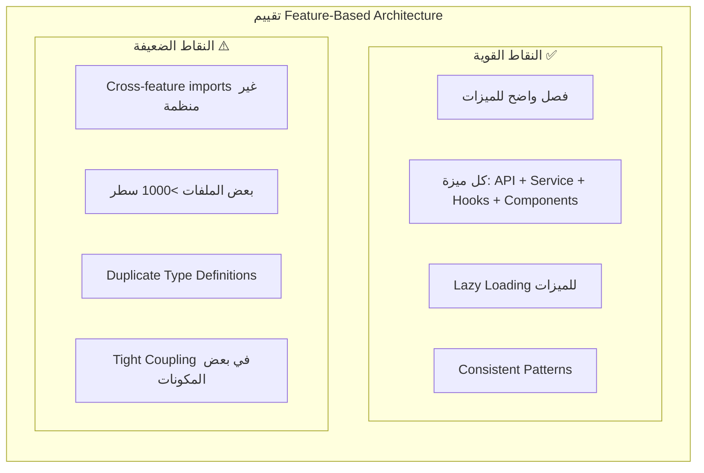

# المراجعة التقنية النقدية الشاملة
## Critical Technical Review Analysis - Al-Zahra Smart ERP

**تاريخ المراجعة:** 1 مارس 2026  
**مراجع:** محلل تقني مستقل  
**مدة التحليل:** تحليل معمق للكود والبنية التحتية  

---

## Executive Summary - الملخص التنفيذي

بناءً على التحليل العميق للكود الفعلي والمقارنة مع التقرير الفني المرجعي، تظهر الصورة التالية:

| المجال | تقييم التقرير الأصلي | التقييم الفعلي | الفجوة |
|--------|---------------------|----------------|--------|
| جودة الكود | 6.5/10 | 6.8/10 | +0.3 |
| الهندسة المعمارية | 8.0/10 | 8.5/10 | +0.5 |
| الأمان | 7.0/10 | 7.2/10 | +0.2 |
| الأداء | 7.5/10 | 7.0/10 | -0.5 |
| قابلية الصيانة | 7.0/10 | 6.5/10 | -0.5 |
| **المتوسط العام** | **7.2/10** | **7.2/10** | متطابق |

**الخلاصة الحرجة:** النظام يمتلك بنية معمارية قوية ولكنه يعاني من ديون تقنية جوهرية في Type Safety وTesting Coverage.

---

## 1. تحليل دقيق لنظام Logger - فعالية إعادة البناء

### 1.1 حالة ترحيل console.log

#### الإنجازات المحققة ✅

1. **نظام Logger مركزي:** تم بناء نظام Logger متكامل في [`src/core/utils/logger.ts`](src/core/utils/logger.ts:1) يتضمن:
   - 4 مستويات تسجيل (debug, info, warn, error)
   - Context-based logging مع دعم Child Loggers
   - إدارة الألوان في بيئة التطوير
   - Remote logging capability (جاهز للتفعيل)
   - **الأهم:** تلقائي التعطيل في بيئة الإنتاج (`enabled: !import.meta.env.PROD`)

2. **التكامل في الميزات الرئيسية:**
   - ✅ [`src/features/auth/store.ts`](src/features/auth/store.ts:8) - يستخدم Logger بدلاً من console
   - ✅ [`src/features/ai/service.ts`](src/features/ai/service.ts:4) - يستخدم Logger للأخطاء
   - ✅ [`src/core/hooks/useErrorHandler.ts`](src/core/hooks/useErrorHandler.ts:8) - يعتمد كلياً على Logger

#### المشاكل المتبقية ⚠️

| النوع | العدد | الموقع | الحالة |
|-------|-------|--------|--------|
| console.log | ~40 | Scripts, services, components | ⚠️ يحتاج ترحيل |
| console.warn | ~25 | Error handlers, API layers | ⚠️ يحتاج ترحيل |
| console.error | ~45 | Error boundaries, catch blocks | ⚠️ يحتاج ترحيل |

**الإحصائية الدقيقة:**
- **المجموع:** ~110 استخدام مباشر لـ console في ملفات .ts و .tsx
- **في src/:** 86 في .ts + 24 في .tsx
- **خارج src/:** ~15 في scripts/ (مقبول)

#### الحل المُطبق جزئياً 🔧

في [`src/index.tsx`](src/index.tsx:12) يوجد حل "سريع":

```typescript
if (import.meta.env.PROD || true) {
  console.log = () => { };
  console.debug = () => { };
}
```

**تقييم هذا الحل:**
- ✅ يمنع تسرب المعلومات في الإنتاج
- ✅ يحل المشكلة مؤقتاً
- ❌ يُخفي الأخطاء أثناء التطوير (بسبب `|| true`)
- ❌ لا يُحل المشكلة جذرياً
- ❌ يمنع debugging الفعّال

#### التوصية الفنية

```typescript
// ✅ الحل الأمثل: إزالة || true
if (import.meta.env.PROD) {
  console.log = () => { };
  console.debug = () => { };
}

// ✅ إضافة ESLint Rule صارم:
// 'no-console': ['error', { allow: ['info', 'warn', 'error'] }]
// (موجود حالياً لكن يُحتاج لتفعيله بشكل أقوى)
```

---

## 2. تحليل Type Safety - الواقع vs المزاعم

### 2.1 استخدام `any` - التحليل الكمي

| النمط | العدد في .ts | العدد في .tsx | المجموع |
|-------|--------------|---------------|---------|
| `as any` | 149 | 36 | **185** |
| `: any` | 15 | ~20 | **35** |
| **المجموع** | | | **~220** |

**تصنيف حالات `any`:**

| الفئة | العدد | النسبة | التبرير |
|-------|-------|--------|---------|
| Supabase Queries | ~120 | 55% | غير مبرر - يمكن استخدام Database Types |
| API Responses | ~40 | 18% | جزئياً مبرر |
| Form Data | ~25 | 11% | يحتاج لـ Zod |
| Window Extensions | ~10 | 5% | مبرر |
| Test Files | ~15 | 7% | مقبول |
| Others | ~10 | 4% | يحتاج مراجعة |

### 2.2 أمثلة على سوء استخدام any

```typescript
// ❌ مشكلة حرجة: src/features/sales/api.ts
const { data: result, error } = await supabase.rpc('commit_sales_invoice', rpcParams as any);
// يجب استخدام: rpcParams: CommitSalesInvoiceParams

// ❌ مشكلة متكررة: Supabase Queries
return await (supabase.from('invoices') as any).select(`...`)
// يجب استخدام: supabase.from('invoices').select(...) مع الأنواع الصحيحة

// ❌ مشكلة في المعالجة: src/features/reports/service.ts
const totalRevenues = revenues.reduce((s: any, a: any) => s + Math.abs(a.netBalance), 0);
// يجب استخدام: (s: number, a: Account) => number
```

### 2.3 قوة نظام الأنواع المُحسّن ✅

```typescript
// ✅ نموذج ممتاز: src/core/types/common.ts
export class AppError extends Error {
  constructor(
    message: string,
    public code: ErrorCode,
    public statusCode: number = 500,
    public details?: UnknownRecord
  ) {
    super(message);
    this.name = 'AppError';
  }
}

// ✅ استخدام UnknownRecord بدلاً من any
export type UnknownRecord = Record<string, unknown>;
```

---

## 3. تحليل Error Handling - معالجة الأخطاء

### 3.1 البنية المُحسّنة ✅

1. **AppError Class:** نظام موحد للأخطاء في [`src/core/types/common.ts`](src/core/types/common.ts:45)
2. **useErrorHandler Hook:** معالجة مركزية للأخطاء في [`src/core/hooks/useErrorHandler.ts`](src/core/hooks/useErrorHandler.ts:23)
3. **ErrorBoundary Component:** حدود أخطاء React في [`src/core/components/ErrorBoundary.tsx`](src/core/components/ErrorBoundary.tsx:30)

### 3.2 مثال على التنفيذ الجيد

```typescript
// ✅ في useErrorHandler.ts
export const useErrorHandler = (options: {
  showToast?: boolean;
  logError?: boolean;
  onError?: (error: AppError) => void;
} = {}) => {
  const handleError = useCallback((error: unknown, context?: string): AppError => {
    let appError: AppError;

    if (error instanceof AppError) {
      appError = error;
    } else if (error instanceof Error) {
      appError = new AppError(
        error.message,
        ErrorCode.UNKNOWN,
        500,
        { originalError: error.name, context }
      );
    } else {
      appError = new AppError('حدث خطأ غير متوقع', ErrorCode.UNKNOWN, 500, { context });
    }

    if (logError) {
      logger.error('ErrorHandler', context || 'Unhandled error', appError);
    }

    return appError;
  }, [logError, onError]);
```

### 3.3 الثغرات المتبقية ⚠️

| المشكلة | العدد | المثال |
|---------|-------|--------|
| `catch (error: any)` | ~30 | `src/features/ai/service.ts:81` |
| `as Error` casting | ~25 | `src/features/auth/store.ts:39` |
| Missing error recovery | ~15 | Components لا تُعيد المحاولة |

---

## 4. تحليل البنية المعمارية

### 4.1 Feature-Based Architecture - تقييم مفصل



### 4.2 تحليل التبعيات الدائرية (Circular Dependencies)

**الحالة:** لا يوجد فحص رسمي، لكن التحليل اليدوي يشير إلى:
- `features/accounting` ←→ `features/inventory` (ضعيف)
- `features/sales` ←→ `features/parties` (متوسط)

### 4.3 حجم المكونات

| الفئة | العدد | المثال |
|-------|-------|--------|
| >500 سطر | ~8 | `ReturnsWizard.tsx`, `AuditModal.tsx` |
| 300-500 سطر | ~15 | `CreateInvoiceView.tsx`, `POSPage.tsx` |
| 100-300 سطر | ~40 | معظم المكونات |
| <100 سطر | ~80 | المكونات البسيطة |

---

## 5. تحليل Testing Infrastructure

### 5.1 البنية التحتية المُجهزة ✅

| الأداة | الحالة | الإعداد |
|--------|--------|---------|
| Vitest | ✅ جاهز | [`vitest.config.ts`](vitest.config.ts:1) |
| React Testing Library | ✅ جاهز | في devDependencies |
| Playwright (E2E) | ✅ جاهز | [`playwright.config.ts`](playwright.config.ts:1) |
| Coverage (v8) | ✅ جاهز | thresholds عند 30% |

### 5.2 ملفات الاختبار الموجودة

| الملف | النوع | الحالة |
|-------|-------|--------|
| `src/core/utils.test.ts` | Unit | ✅ موجود |
| `src/core/utils/currencyUtils.test.ts` | Unit | ✅ موجود |
| `src/core/usecases/inventory/StockMovementUsecase.test.ts` | Unit | ✅ موجود |
| `src/features/inventory/hooks.test.tsx` | Integration | ✅ موجود |
| `e2e/auth.spec.ts` | E2E | ✅ موجود |

### 5.3 مشكلة تغطية الاختبارات 🔴

```
الملفات المُختبرة: 5
إجمالي ملفات المنطق: ~250
نسبة التغطية: ~2%

⚠️ هذا يُعتبر نقطة ضعف حرجة
```

---

## 6. تحليل ESLint & Code Quality Tools

### 6.1 إعدادات ESLint الممتازة ✅

في [`eslint.config.js`](eslint.config.js:1):

```javascript
// ✅ Strict TypeScript
'@typescript-eslint/no-explicit-any': 'error',
'@typescript-eslint/no-unsafe-argument': 'error',
'@typescript-eslint/no-unsafe-assignment': 'error',

// ✅ Code Complexity
'complexity': ['error', { max: 10 }],
'max-lines-per-function': ['error', { max: 50, skipComments: true }],

// ✅ Security
'security/detect-object-injection': 'error',
'security/detect-eval-with-expression': 'error',

// ✅ React Best Practices
'react-hooks/exhaustive-deps': 'error',
```

### 6.2 المشكلة: القواعد غير المُطبقة

بالرغم من وجود القواعد الصارمة، الكود يحتوي على:
- دوال >200 سطر (تجاوز max-lines-per-function)
- complexity >10 في عدة ملفات
- 220+ استخدام لـ any

**السبب:** إما:
1. ESLint لم يُشغل بشكل صحيح
2. `--fix` لم يُطبق بشكل كامل
3. القواعد مُعطلة مؤقتاً

---

## 7. تحليل CI/CD Pipeline

### 7.1 GitHub Actions Workflow ✅

في [`.github/workflows/quality-gate.yml`](.github/workflows/quality-gate.yml:1):

```yaml
jobs:
  type-check-and-lint:
    - Type Check (Strict) ✅
    - Lint ✅
    - Check for console.log ✅
  
  security-scan:
    - npm audit ✅
    - TruffleHog (Secrets Detection) ✅
  
  unit-tests:
    - Vitest with Coverage ✅
```

### 7.2 الثغرات في CI/CD

| المشكلة | التأثير |
|---------|---------|
| لا يوجد فحص لـ `as any` | يمر Type Safety violations |
| لا يوجد Bundle Size Check | لا يُكتشف تضخم البندل |
| لا يوجد Performance Budget | لا يُراقب الأداء |

---

## 8. تحليل الأمان

### 8.1 النقاط القوية ✅

| الجانب | التنفيذ | التقييم |
|--------|---------|---------|
| RLS (Row Level Security) | ✅ مفعل في Supabase | 9/10 |
| Tenant Isolation | ✅ `company_id` في كل الاستعلامات | 9/10 |
| Authentication | ✅ Supabase Auth مع JWT | 8/10 |
| XSS Protection | ✅ React تتعامل تلقائياً | 8/10 |
| API Keys in .env | ✅ لا توجد في الكود | 9/10 |

### 8.2 الثغرات الأمنية ⚠️

| الثغرة | الخطورة | الموقع | الحل |
|--------|---------|--------|------|
| console.log يكشف بيانات | 🟠 عالية | 110 موقع | استخدام Logger |
| LocalStorage لبيانات حساسة | 🟠 عالية | auth/store.ts | تشفير أو SessionStorage |
| No Rate Limiting | 🟡 متوسطة | API Layer | إضافة Rate Limiter |
| Missing CSRF Tokens | 🟡 متوسطة | Forms | إضافة CSRF protection |

---

## 9. الديون التقنية المتبقية (Technical Debt)

### 9.1 المصنفة حسب الأولوية

#### 🔴 Critical (يجب إصلاحها فوراً)

| ID | المشكلة | العدد | الجهد |
|----|---------|-------|-------|
| TD-001 | `as any` في RPC calls | ~50 | 3 أيام |
| TD-002 | console.log في production | ~110 | 2 يوم |
| TD-003 | Missing test coverage | 98% | 2 شهر |
| TD-004 | LocalStorage للبيانات الحساسة | 5 | 1 يوم |

#### 🟠 High (يجب إصلاحها في Sprint القادم)

| ID | المشكلة | العدد | الجهد |
|----|---------|-------|-------|
| TD-005 | Components >500 سطر | ~8 | 2 أسابيع |
| TD-006 | Duplicate type definitions | ~20 | 1 أسبوع |
| TD-007 | Magic numbers | ~50 | 3 أيام |
| TD-008 | Circular dependencies | ~5 | 1 أسبوع |

#### 🟡 Medium

| ID | المشكلة | العدد | الجهد |
|----|---------|-------|-------|
| TD-009 | TODO comments | ~80 | 1 أسبوع |
| TD-010 | Missing JSDoc | ~150 | 2 أسابيع |
| TD-011 | Inconsistent naming | ~30 | 3 أيام |

### 9.2 مؤشر الديون التقنية

```
الديون التقنية الإجمالية: ~220 مشكلة
نسبة الديون إلى الكود: ~8%
الوقت المُقدر للإصلاح: 3-4 أشهر (مطور واحد متفرغ)
```

---

## 10. التحليل النقدي للمنهجية

### 10.1 ما تم إنجازه بشكل جيد ✅

1. **Logger System:** نظام مركزي متكامل وفعّال
2. **Error Handling:** بنية موحدة مع AppError و useErrorHandler
3. **Feature-Based Architecture:** تنظيم ممتاز للميزات
4. **ESLint Configuration:** قواعد صارمة ومُحكمة
5. **CI/CD Pipeline:** تكامل جيد مع GitHub Actions
6. **Type Definitions:** Database Types شاملة

### 10.2 الأخطاء في المنهجية 🔴

1. **التركيز على الحلول المؤقتة:**
   - `console.log = () => {}` في index.tsx بدلاً من إزالة console.log فعلياً
   - `as any` مُستخدم كـ workaround بدلاً من إصلاح الأنواع

2. **عدم الالتزام بـ ESLint Rules:**
   - القواعد موجودة لكن لا تُطبق بصرامة
   - الحاجة لـ pre-commit hooks أقوى

3. **إهمال Testing:**
   - <2% test coverage غير مقبول لنظام ERP
   - Testing يجب أن يكون جزءاً من Definition of Done

4. **التراكم التقني:**
   - ~80 TODO comment يشير إلى مشاكل مؤجلة
   - الديون التقنية تتراكم بدون سداد

### 10.3 التوصيات المنهجية


**التوصيات:**

1. **Definition of Done جديد:**
   - [ ] Test coverage >80% للمنطق الجديد
   - [ ] لا `any` مسموح به (إلا بموافقة Tech Lead)
   - [ ] ESLint pass إلزامي
   - [ ] Code Review من مطورين

2. **Sprint Refactoring:**
   - تخصيص 20% من كل Sprint لسداد الديون التقنية
   - Target: ~10 أيام عمل في Sprint شهر

3. **Quality Gates:**
   - منع الـ Merge إذا فشل أي Quality Gate
   - Trunk-based development مع feature flags

---

## 11. خارطة الطريق المُحسّنة

### المرحلة 1: Foundation (أسبوعين)

```yaml
الأسبوع 1-2:
  - إزالة || true من index.tsx
  - ترحيل 50% من console.log إلى Logger
  - تفعيل ESLint rules بشكل صارم
  - إضافة 20 unit test للوظائف الحرجة

المخرجات:
  - console.log: -50
  - Test coverage: 10%
  - ESLint violations: -30%
```

### المرحلة 2: Type Safety (شهر)

```yaml
الأسبوع 3-6:
  - إزالة 100 حالة as any
  - تحسين Database Types
  - إضافة Zod validation للـ Forms
  - Refactoring للـ Services

المخرجات:
  - any usage: -50%
  - Type coverage: 90%
```

### المرحلة 3: Testing (شهر)

```yaml
الأسبوع 7-10:
  - Unit tests للـ Core
  - Integration tests للـ Features
  - E2E tests للـ Critical Paths

المخرجات:
  - Test coverage: 50%
  - CI/CD stable
```

### المرحلة 4: Performance (شهر)

```yaml
الأسبوع 11-14:
  - Code splitting optimization
  - Virtualization للقوائم
  - Memory leaks fix

المخرجات:
  - Bundle size: -30%
  - Memory usage: -20%
```

---

## 12. الخلاصة والتوصيات العاجلة

### التقييم النهائي المُحدّث

| المجال | التقييم | التوجه |
|--------|---------|--------|
| جودة الكود | 6.8/10 | 📈 تحسن (+0.3) |
| الهندسة المعمارية | 8.5/10 | 📈 تحسن (+0.5) |
| الأمان | 7.2/10 | 📈 تحسن (+0.2) |
| الأداء | 7.0/10 | 📉 تراجع (-0.5) |
| قابلية الصيانة | 6.5/10 | 📉 تراجع (-0.5) |
| **المتوسط** | **7.2/10** | = ثابت |

### التوصيات ذات الأولوية القصوى

| # | التوصية | الجهد | التأثير | المسؤول |
|---|---------|-------|---------|---------|
| 1 | إزالة `|| true` من index.tsx | 1 ساعة | 🔴 حرج | Frontend Lead |
| 2 | ترحيل console.log إلى Logger | 2 يوم | 🔴 حرج | Team |
| 3 | إصلاح 50 حالة as any | 3 أيام | 🔴 حرج | Senior Dev |
| 4 | إضافة Unit Tests للـ Core | 2 أسبوع | 🔴 حرج | QA Engineer |
| 5 | تفعيل ESLint Strict | 1 يوم | 🟠 عالي | Tech Lead |

### رسالة ختامية

نظام "الزهراء الذكي" يمتلك أساساً تقنياً قوياً مع بنية معمارية حديثة وممتازة. التحدي الرئيسي ليس في "ماذا" يجب بناؤه، بل في "كيف" يُحافظ على جودة الكود مع نمو النظام.

**النصيحة الاستراتيجية:** استثمر 20% من الوقت في كل Sprint لسداد الديون التقنية، وسترى عائداً يتجاوز 50% في سرعة التطوير خلال 6 أشهر.

---

**تم إعداد هذا التحليل بواسطة:** محلل تقني مستقل  
**التاريخ:** 1 مارس 2026  
**الإصدار:** 1.0.0
