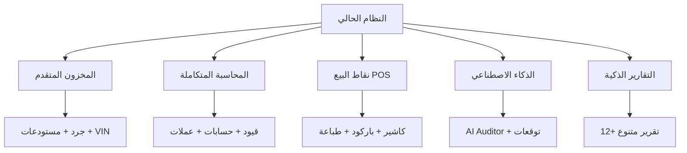
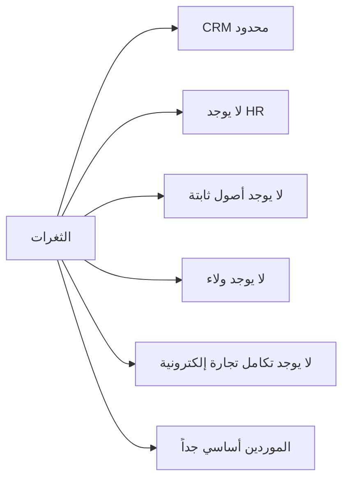
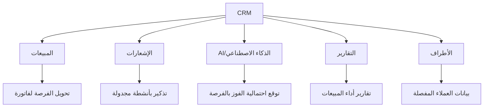
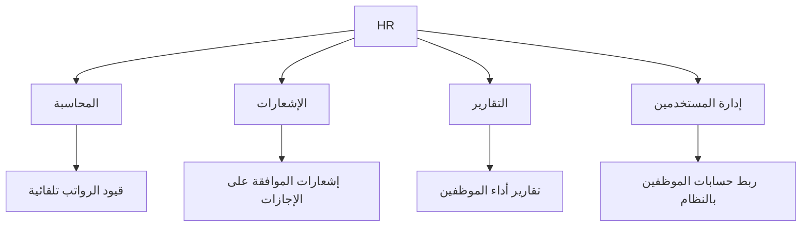
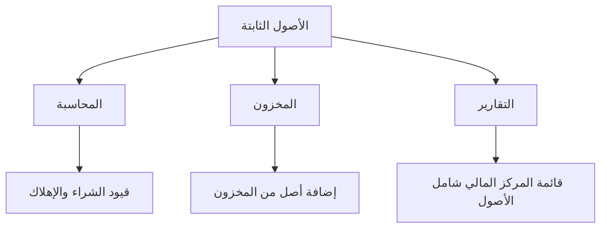
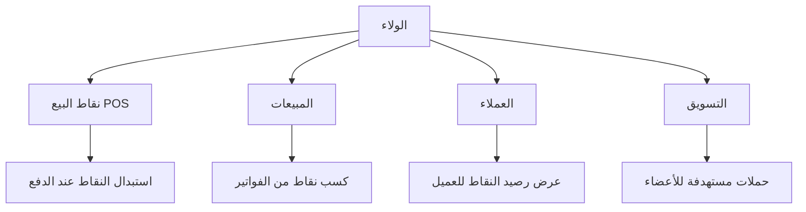
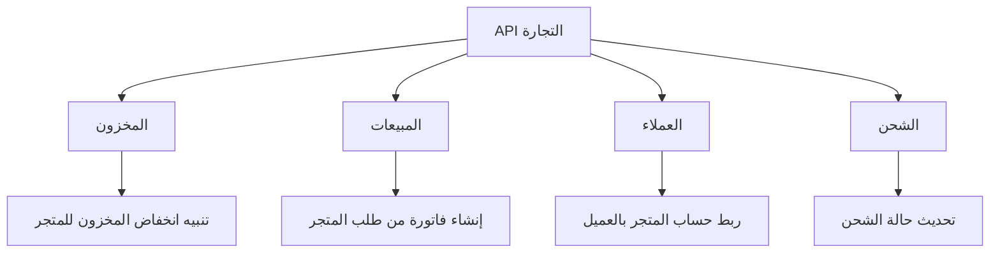
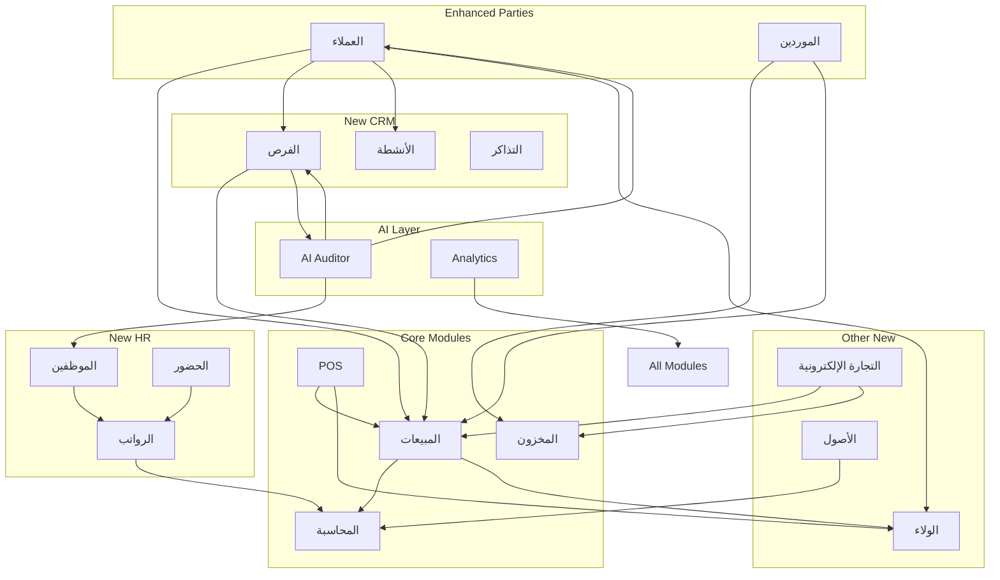

# الخطة التنفيذية الشاملة لتطوير Alzhra Smart ERP

## 🎯 نظرة عامة

هذه الخطة التنفيذية الشاملة تهدف إلى:
1. استكمال الميزات غير المكتملة في النظام الحالي
2. بناء الوحدات المفقودة بالكامل
3. ضمان التكامل السلس مع المكونات الحالية
4. الاستفادة من قدرات الذكاء الاصطناعي الموجودة

**المنهجية:** Agile Scrum مع مراحل MVP متدرجة
**المدة الإجمالية:** 6-8 أشهر
**الفريق المقترح:** 4-5 مطورين + مصمم + مدير منتج

---

## 📊 تحليل الوضع الحالي

### ✅ نقاط القوة الحالية


### ❌ الثغرات الحرجة


---

## 🗓️ خطة المراحل التنفيذية

### المرحلة الأولى: الأساسيات (الشهر 1-2)
**الهدف:** استكمال الميزات غير المكتملة + تحسين التكاملات

#### المهام:
1. **تحسين نظام الأطراف (Parties)**
   - تطوير نظام العملاء ليدعم تاريخ التواصل
   - إضافة تقييم وعلامات للعملاء
   - نظام تصنيف متقدم للأطراف
   - الربط مع فواتير المبيعات والمقبوضات

2. **تطوير نظام الموردين**
   - إضافة تقييم متعدد المعايير
   - تاريخ أسعار ومقارنة
   - الربط مع أوامر الشراء
   - تقارير أداء الموردين

3. **إصلاح واستكمال الميزات الحالية**
   - إكمال نظام الباركود
   - تحسين استيراد PDF الذكي
   - إكمال نظام الموافقات البسيط

#### نقاط التكامل:
- الأطراف ← المبيعات (فواتير)
- الأطراف ← المشتريات (فواتير)
- الأطراف ← السندات (قبض/صرف)
- الأطراف ← المحاسبة (حسابات)

---

### المرحلة الثانية: نظام CRM المتكامل (الشهر 2-4)
**الهدف:** بناء نظام CRM متكامل بالكامل

#### الوحدات المطلوبة:

##### 1. إدارة الفرص البيعية (Opportunities)
```sql
-- هيكل قاعدة البيانات المقترح
create table crm_opportunities (
    id uuid primary key default gen_random_uuid(),
    company_id uuid references companies(id),
    customer_id uuid references parties(id),
    title text not null,
    description text,
    value decimal(15,2),
    currency text default 'SAR',
    stage text check (stage in ('lead', 'qualified', 'proposal', 'negotiation', 'closed_won', 'closed_lost')),
    probability integer check (probability between 0 and 100),
    expected_close_date date,
    assigned_to uuid references users(id),
    source text, -- مصدر الفرصة
    created_at timestamptz default now(),
    updated_at timestamptz default now()
);
```

**الميزات:**
- مسار مبيعات قابل للتخصيص
- خط أنابيب المبيعات (Sales Pipeline)
- التوقعات والتنبؤ بالإيرادات
- تتبع المصادر والحملات

##### 2. إدارة التواصل والأنشطة (Activities)
```sql
create table crm_activities (
    id uuid primary key default gen_random_uuid(),
    company_id uuid references companies(id),
    customer_id uuid references parties(id),
    opportunity_id uuid references crm_opportunities(id),
    type text check (type in ('call', 'email', 'meeting', 'task', 'note', 'visit')),
    subject text not null,
    description text,
    scheduled_at timestamptz,
    completed_at timestamptz,
    status text default 'pending',
    assigned_to uuid references users(id),
    outcome text, -- نتيجة النشاط
    created_at timestamptz default now()
);
```

**الميزات:**
- تقويم أنشطة متكامل
- تذكيرات وإشعارات
- تاريخ تواصل كامل لكل عميل
- قوالب رسائل وإيميلات

##### 3. إدارة الشكاوى والتذاكر (Support Tickets)
```sql
create table crm_tickets (
    id uuid primary key default gen_random_uuid(),
    company_id uuid references companies(id),
    customer_id uuid references parties(id),
    ticket_number text unique,
    subject text not null,
    description text,
    priority text check (priority in ('low', 'medium', 'high', 'urgent')),
    status text check (status in ('open', 'in_progress', 'waiting', 'resolved', 'closed')),
    category text, -- تصنيف الشكوى
    assigned_to uuid references users(id),
    satisfaction_score integer, -- تقييم رضا العميل
    resolution_time interval, -- وقت الحل
    created_at timestamptz default now(),
    resolved_at timestamptz
);
```

##### 4. التسويق والحملات (Campaigns)
```sql
create table crm_campaigns (
    id uuid primary key default gen_random_uuid(),
    company_id uuid references companies(id),
    name text not null,
    type text check (type in ('email', 'sms', 'social', 'event', 'other')),
    status text default 'draft',
    start_date date,
    end_date date,
    budget decimal(15,2),
    target_audience jsonb,
    metrics jsonb, -- إحصائيات الأداء
    created_at timestamptz default now()
);
```

**الميزات:**
- إدارة حملات SMS/Email
- قوالب رسائل قابلة للتخصيص
- تتبع ROI للحملات
- شرائح عملاء (Segmentation)

#### نقاط التكامل CRM:


---

### المرحلة الثالثة: نظام الموارد البشرية (HR) (الشهر 4-5)
**الهدف:** بناء نظام HR أساسي ومتكامل

#### الوحدات المطلوبة:

##### 1. إدارة الموظفين
```sql
create table hr_employees (
    id uuid primary key default gen_random_uuid(),
    company_id uuid references companies(id),
    employee_number text unique,
    full_name text not null,
    email text,
    phone text,
    department_id uuid references hr_departments(id),
    position_id uuid references hr_positions(id),
    hire_date date not null,
    employment_status text check (status in ('active', 'inactive', 'on_leave', 'terminated')),
    employment_type text check (type in ('full_time', 'part_time', 'contract', 'intern')),
    basic_salary decimal(12,2),
    bank_account text,
    bank_name text,
    manager_id uuid references hr_employees(id),
    documents jsonb, -- ملفات الموظف
    created_at timestamptz default now()
);
```

##### 2. الحضور والانصراف
```sql
create table hr_attendance (
    id uuid primary key default gen_random_uuid(),
    company_id uuid references companies(id),
    employee_id uuid references hr_employees(id),
    date date not null,
    check_in timestamptz,
    check_out timestamptz,
    status text check (status in ('present', 'absent', 'late', 'early_leave', 'on_leave')),
    working_hours decimal(4,2),
    overtime_hours decimal(4,2),
    notes text,
    location jsonb, -- موقع GPS للتحقق
    created_at timestamptz default now()
);
```

**الميزات:**
- تسجيل دخول/خروج عبر Web/Mobile
- دعم البصمة/QR Code
- حساب التأخير والخروج المبكر
- تقارير الحضور

##### 3. الإجازات
```sql
create table hr_leaves (
    id uuid primary key default gen_random_uuid(),
    company_id uuid references companies(id),
    employee_id uuid references hr_employees(id),
    leave_type text check (type in ('annual', 'sick', 'emergency', 'unpaid', 'maternity', 'other')),
    start_date date not null,
    end_date date not null,
    days_count integer,
    status text check (status in ('pending', 'approved', 'rejected', 'cancelled')),
    reason text,
    approved_by uuid references users(id),
    approved_at timestamptz,
    attachment_url text,
    created_at timestamptz default now()
);
```

##### 4. الرواتب والأجور
```sql
create table hr_payroll (
    id uuid primary key default gen_random_uuid(),
    company_id uuid references companies(id),
    employee_id uuid references hr_employees(id),
    month integer not null,
    year integer not null,
    basic_salary decimal(12,2),
    allowances jsonb, -- البدلات
    deductions jsonb, -- الاستقطاعات
    overtime_amount decimal(10,2),
    bonus decimal(10,2),
    total_earnings decimal(12,2),
    total_deductions decimal(12,2),
    net_salary decimal(12,2),
    status text default 'draft',
    paid_at timestamptz,
    created_at timestamptz default now()
);
```

**الميزات:**
- حساب تلقائي للرواتب
- دعم البدلات والاستقطاعات
- توليد رواتب جماعية
- قسيمة راتب PDF
- ربط مع المحاسبة (قيود الرواتب)

#### نقاط التكامل HR:


---

### المرحلة الرابعة: نظام الأصول الثابتة (الشهر 5)
**الهدف:** بناء نظام إدارة الأصول الثابتة

#### الوحدات المطلوبة:

##### 1. الأصول
```sql
create table fixed_assets (
    id uuid primary key default gen_random_uuid(),
    company_id uuid references companies(id),
    asset_code text unique,
    asset_name text not null,
    category text,
    acquisition_date date,
    acquisition_cost decimal(15,2),
    depreciation_method text check (method in ('straight_line', 'declining_balance')),
    useful_life_years integer,
    salvage_value decimal(15,2),
    current_value decimal(15,2),
    location text,
    custodian_id uuid references users(id), -- المسؤول
    status text check (status in ('active', 'maintenance', 'disposed', 'sold')),
    barcode text,
    documents jsonb,
    created_at timestamptz default now()
);
```

##### 2. الإهلاك
```sql
create table asset_depreciation (
    id uuid primary key default gen_random_uuid(),
    company_id uuid references companies(id),
    asset_id uuid references fixed_assets(id),
    year integer,
    month integer,
    depreciation_amount decimal(12,2),
    accumulated_depreciation decimal(15,2),
    book_value decimal(15,2),
    journal_entry_id uuid references journal_entries(id),
    created_at timestamptz default now()
);
```

**الميزات:**
- حساب الإهلاك تلقائياً
- قسط ثابت أو متناقص
- قيود إهلاك تلقائية في المحاسبة
- جرد الأصول

##### 3. الصيانة
```sql
create table asset_maintenance (
    id uuid primary key default gen_random_uuid(),
    company_id uuid references companies(id),
    asset_id uuid references fixed_assets(id),
    maintenance_date date,
    type text check (type in ('preventive', 'corrective', 'overhaul')),
    description text,
    cost decimal(12,2),
    provider text,
    next_due_date date,
    documents jsonb,
    created_at timestamptz default now()
);
```

#### نقاط التكامل الأصول:


---

### المرحلة الخامسة: برنامج الولاء والنقاط (الشهر 5-6)
**الهدف:** بناء نظام ولاء متكامل مع المبيعات

#### الوحدات المطلوبة:

##### 1. برنامج الولاء
```sql
create table loyalty_programs (
    id uuid primary key default gen_random_uuid(),
    company_id uuid references companies(id),
    name text not null,
    points_per_currency decimal(10,4), -- نقاط لكل ريال
    currency_per_point decimal(10,4), -- قيمة النقطة
    min_points_redemption integer,
    expiry_months integer,
    tiers jsonb, -- مستويات العضوية
    is_active boolean default true,
    created_at timestamptz default now()
);
```

##### 2. النقاط والمعاملات
```sql
create table loyalty_transactions (
    id uuid primary key default gen_random_uuid(),
    company_id uuid references companies(id),
    customer_id uuid references parties(id),
    invoice_id uuid references invoices(id),
    program_id uuid references loyalty_programs(id),
    transaction_type text check (type in ('earn', 'redeem', 'expire', 'adjust')),
    points integer not null,
    value decimal(10,2), -- القيمة المالية
    balance_after integer,
    description text,
    expiry_date date,
    created_at timestamptz default now()
);
```

##### 3. المكافآت والجوائز
```sql
create table loyalty_rewards (
    id uuid primary key default gen_random_uuid(),
    company_id uuid references companies(id),
    program_id uuid references loyalty_programs(id),
    name text not null,
    description text,
    points_cost integer,
    reward_type text check (type in ('discount', 'product', 'service', 'cashback')),
    value decimal(10,2),
    quantity_available integer,
    is_active boolean default true,
    created_at timestamptz default now()
);
```

**الميزات:**
- كسب نقاط تلقائي عند الشراء
- استبدال نقاط في POS
- مستويات عضوية (Bronze, Silver, Gold)
- عروض حصرية للأعضاء
- تقارير برنامج الولاء

#### نقاط التكامل الولاء:


---

### المرحلة السادسة: التكامل مع التجارة الإلكترونية (الشهر 6-7)
**الهدف:** بناء APIs للتكامل مع المتاجر الإلكترونية

#### الوحدات المطلوبة:

##### 1. API للمنتجات
```typescript
// endpoints
GET /api/v1/products - قائمة المنتجات
GET /api/v1/products/:id - تفاصيل منتج
GET /api/v1/categories - التصنيفات
GET /api/v1/inventory/availability - التوفر
```

##### 2. API للطلبات
```typescript
POST /api/v1/orders - إنشاء طلب
GET /api/v1/orders/:id - تفاصيل الطلب
PUT /api/v1/orders/:id/status - تحديث الحالة
POST /api/v1/webhooks/orders - webhook للتحديثات
```

##### 3. API للعملاء
```typescript
POST /api/v1/customers - إنشاء عميل
GET /api/v1/customers/:id - تفاصيل العميل
PUT /api/v1/customers/:id - تحديث العميل
GET /api/v1/customers/:id/orders - طلبات العميل
```

##### 4. Webhooks
```sql
create table ecommerce_webhooks (
    id uuid primary key default gen_random_uuid(),
    company_id uuid references companies(id),
    platform text, -- shopify, woocommerce, magento
    endpoint_url text not null,
    events text[], -- ['order.created', 'order.updated']
    secret_key text,
    is_active boolean default true,
    last_triggered_at timestamptz,
    created_at timestamptz default now()
);
```

**الميزات:**
- مزامنة المخزون real-time
- استيراد الطلبات تلقائياً
- تحديث حالات الطلبات
- دعم Shopify, WooCommerce, Magento
- مفتاح API للكل عميل

#### نقاط التكامل التجارة الإلكترونية:


---

## 🔄 التكامل مع ميزات الذكاء الاصطناعي الحالية

### استخدام AI في الوحدات الجديدة:

#### 1. CRM + AI
- **توقع الفرص:** AI يتوقع احتمالية إغلاق كل فرصة
- **أفضل وقت للاتصال:** AI يحدث وقت الاتصال المناسب
- **تصنيف العملاء:** AI يصنف العملاء تلقائياً
- **ردود تلقائية:** AI يساعد في صياغة الردود

#### 2. HR + AI
- **تحليل الحضور:** AI يكشف أنماط الغياب
- **توقع الاستقالة:** AI يحذر من احتمالية استقالة موظف
- **توصيات التوظيف:** AI يساعد في فرز السير الذاتية

#### 3. الولاء + AI
- **توقع سلوك العميل:** AI يتوقع العملاء المعرضين للتوقف
- **عروض مخصصة:** AI يقترح عروض مناسبة لكل عميل
- **وقت إرسال مثالي:** AI يحدد أفضل وقت لإرسال العروض

---

## 🗄️ هيكل قاعدة البيانات Supabase

### الجداول الرئيسية الجديدة:
```
┌─────────────────────────────────────────────────────────┐
│                    CRM MODULE                           │
├─────────────────────────────────────────────────────────┤
│ crm_opportunities      │ الفرص البيعية                  │
│ crm_activities         │ الأنشطة والتواصل               │
│ crm_tickets            │ الشكاوى والتذاكر               │
│ crm_campaigns          │ الحملات التسويقية              │
│ crm_notes              │ الملاحظات                      │
└─────────────────────────────────────────────────────────┘

┌─────────────────────────────────────────────────────────┐
│                    HR MODULE                            │
├─────────────────────────────────────────────────────────┤
│ hr_employees           │ الموظفين                       │
│ hr_departments         │ الأقسام                        │
│ hr_positions           │ الوظائف                        │
│ hr_attendance          │ الحضور والانصراف               │
│ hr_leaves              │ الإجازات                       │
│ hr_payroll             │ الرواتب                        │
│ hr_payroll_items       │ بنود الرواتب                   │
└─────────────────────────────────────────────────────────┘

┌─────────────────────────────────────────────────────────┐
│                FIXED ASSETS MODULE                      │
├─────────────────────────────────────────────────────────┤
│ fixed_assets           │ الأصول الثابتة                 │
│ asset_depreciation     │ الإهلاك                        │
│ asset_maintenance      │ الصيانة                        │
│ asset_categories       │ تصنيفات الأصول                 │
└─────────────────────────────────────────────────────────┘

┌─────────────────────────────────────────────────────────┐
│                  LOYALTY MODULE                           │
├─────────────────────────────────────────────────────────┤
│ loyalty_programs       │ برامج الولاء                   │
│ loyalty_transactions   │ معاملات النقاط                 │
│ loyalty_rewards        │ المكافآت                       │
│ loyalty_tiers          │ مستويات العضوية                │
└─────────────────────────────────────────────────────────┘

┌─────────────────────────────────────────────────────────┐
│              ECOMMERCE INTEGRATION                      │
├─────────────────────────────────────────────────────────┤
│ ecommerce_connections  │ اتصالات المتاجر                │
│ ecommerce_orders       │ طلبات المتاجر                  │
│ ecommerce_sync_logs    │ سجل المزامنة                   │
│ api_keys               │ مفاتيح API                     │
└─────────────────────────────────────────────────────────┘
```

---

## 🏗️ هيكل الملفات في المشروع

```
src/
├── features/
│   ├── parties/           (تحسين)
│   │   └── components/
│   │       └── CustomerTimeline.tsx
│   │       └── SupplierRating.tsx
│   ├── crm/               (جديد)
│   │   ├── Opportunities/
│   │   ├── Activities/
│   │   ├── Tickets/
│   │   └── Campaigns/
│   ├── hr/                (جديد)
│   │   ├── Employees/
│   │   ├── Attendance/
│   │   ├── Leaves/
│   │   └── Payroll/
│   ├── fixed-assets/      (جديد)
│   │   ├── Assets/
│   │   ├── Depreciation/
│   │   └── Maintenance/
│   ├── loyalty/           (جديد)
│   │   ├── Programs/
│   │   ├── Points/
│   │   └── Rewards/
│   └── integrations/      (جديد)
│       └── ecommerce/
│           ├── Shopify/
│           ├── WooCommerce/
│           └── APIs/
```

---

## 📅 الجدول الزمني التفصيلي

### الشهر 1: تحسين النظام الحالي
| الأسبوع | المهمة |
|---------|--------|
| 1-2 | تطوير نظام الأطراف + إضافة تاريخ التواصل |
| 3-4 | تطوير نظام الموردين + إضافة تقييمات |

### الشهر 2-3: CRM
| الأسبوع | المهمة |
|---------|--------|
| 1-2 | بناء الفرص البيعية + خط الأنابيب |
| 3-4 | بناء الأنشطة والتقويم |
| 5-6 | بناء نظام التذاكر والشكاوى |
| 7-8 | بناء الحملات التسويقية |

### الشهر 4: HR الجزء 1
| الأسبوع | المهمة |
|---------|--------|
| 1-2 | إدارة الموظفين والأقسام |
| 3-4 | الحضور والانصراف |

### الشهر 5: HR الجزء 2 + الأصول
| الأسبوع | المهمة |
|---------|--------|
| 1-2 | الإجازات والموافقات |
| 3-4 | نظام الرواتب |
| 5-6 | الأصول الثابتة والإهلاك |

### الشهر 6: الولاء + التجارة
| الأسبوع | المهمة |
|---------|--------|
| 1-2 | برنامج الولاء والنقاط |
| 3-4 | APIs التجارة الإلكترونية |
| 5-6 | Webhooks والمزامنة |

### الشهر 7-8: التكامل والاختبار
| الأسبوع | المهمة |
|---------|--------|
| 1-4 | تكامل جميع الوحدات مع الذكاء الاصطناعي |
| 5-6 | الاختبار الشامل |
| 7-8 | الإطلاق والتدريب |

---

## 📊 نقاط التكامل بين جميع الوحدات



---

## ⚠️ المخاطر والحلول

| المخاطر | الحل |
|---------|------|
| تعقيد التكامل | استخدام Events Pattern |
| أداء قاعدة البيانات | إضافة Indexes وMaterialized Views |
| التزامن بين الوحدات | استخدام Supabase Real-time |
| تعقيد الواجهات | تصميم تدريجي مع اختبار المستخدمين |

---

## 🎯 معايير النجاح

- ✅ جميع الوحدات تعمل بشكل مستقل
- ✅ التكامل الكامل مع المحاسبة تلقائياً
- ✅ AI يعمل مع جميع الوحدات الجديدة
- ✅ التقارير الشاملة تعمل بكفاءة
- ✅ واجهة مستخدم موحدة وسلسة

---

**الخطة مرنة ويمكن تعديل الجدول حسب أولويات العمل والموارد المتاحة.**
