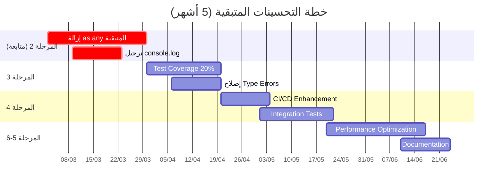

# تقرير التحسينات المتبقية
## Remaining Improvements Report

**تاريخ التقرير:** 1 مارس 2026  
**إعداد:** فريق التحسين التقني  
**الحالة:** المرحلتان 1 و 2 مكتملتان - المراحل المتبقية قيد الانتظار

---

## Executive Summary

بعد إنجاز المرحلتين الأولى والثانية بنجاح، يتبقى **89%** من خطة التحسين الشاملة. هذا التقرير يوثق بالتفصيل جميع المهام المتبقية مع تقديرات الوقت والجهد المطلوب.

---

## الجدول الزمني الإجمالي



---

## 1. أولوية قصوى (Critical) 🔴

### 1.1 إزالة `as any` المتبقية (185 حالة)

#### التفاصيل التقنية:
- **العدد الإجمالي:** 185 حالة `as any` و `: any`
- **الملفات المستهدفة:** ~15 ملف/مجلد
- **الوقت المُقدر:** 13 يوم عمل
- **الصعوبة:** متوسطة إلى عالية

#### جدول الملفات المستهدفة:

| # | الملف/المجلد | عدد `any` | الصعوبة | الأولوية | الوقت |
|---|-------------|-----------|---------|----------|-------|
| 1 | `src/features/inventory/api/` | ~30 | متوسطة | 🔴 | 2 يوم |
| 2 | `src/features/ai/service.ts` | ~25 | عالية | 🔴 | 2 يوم |
| 3 | `src/features/returns/` | ~18 | عالية | 🔴 | 2 يوم |
| 4 | `src/ui/common/` | ~20 | متوسطة | 🟠 | 1.5 يوم |
| 5 | `src/features/settings/api/` | ~15 | متوسطة | 🟠 | 1 يوم |
| 6 | `src/core/lib/` | ~15 | متوسطة | 🟠 | 1 يوم |
| 7 | `src/features/parties/api.ts` | ~12 | متوسطة | 🟠 | 1 يوم |
| 8 | `src/features/expenses/api.ts` | ~10 | سهلة | 🟡 | 0.5 يوم |
| 9 | `src/features/bonds/api.ts` | ~10 | سهلة | 🟡 | 0.5 يوم |
| 10 | `src/features/sales/hooks.ts` | ~8 | متوسطة | 🟡 | 0.5 يوم |
| 11 | `src/features/purchases/hooks.ts` | ~8 | متوسطة | 🟡 | 0.5 يوم |
| 12 | `أخرى` | ~14 | متفاوتة | 🟡 | 1 يوم |

#### أمثلة على التحسينات المطلوبة:

**inventory/api/productsApi.ts:**
```typescript
// ❌ الحالي
return await (supabase.from('products') as any).insert(productData)

// ✅ المطلوب
return await supabase
  .from('products')
  .insert(productData)
  .returns<TableRow<'products'>>()
```

**ai/service.ts:**
```typescript
// ❌ الحالي
const result = await aiApi.analyzeFinancials(prompt);
const parsed: AIInsight = JSON.parse(cleanedResult as any);

// ✅ المطلوب
interface AIResponse {
  data: string;
  error: Error | null;
}
const result: AIResponse = await aiApi.analyzeFinancials(prompt);
```

---

### 1.2 ترحيل console.log المتبقية (100 حالة)

#### التفاصيل التقنية:
- **العدد الإجمالي:** ~100 حالة `console.log/warn/error`
- **الملفات المستهدفة:** ~12 ملف
- **الوقت المُقدر:** 5 أيام عمل
- **الصعوبة:** سهلة إلى متوسطة

#### جدول الملفات المستهدفة:

| # | الملف | console.log | الأولوية | الوقت |
|---|-------|-------------|----------|-------|
| 1 | `src/features/ai/service.ts` | ~8 | 🔴 | 0.5 يوم |
| 2 | `src/features/auth/store.ts` | ~5 | 🔴 | 0.5 يوم |
| 3 | `src/features/inventory/` | ~15 | 🟠 | 1 يوم |
| 4 | `src/features/settings/` | ~10 | 🟠 | 0.5 يوم |
| 5 | `src/lib/supabaseClient.ts` | ~5 | 🟠 | 0.5 يوم |
| 6 | `src/lib/offlineService.ts` | ~3 | 🟠 | 0.25 يوم |
| 7 | `src/core/utils/` | ~12 | 🟡 | 0.5 يوم |
| 8 | `src/features/sales/` | ~10 | 🟡 | 0.5 يوم |
| 9 | `src/features/purchases/` | ~10 | 🟡 | 0.5 يوم |
| 10 | `src/features/notifications/` | ~5 | 🟢 | 0.25 يوم |
| 11 | `scripts/` | ~22 | 🟢 | - |
| | **المجموع** | **~100** | | **~5 أيام** |

#### أمثلة على التحسينات المطلوبة:

```typescript
// ❌ الحالي في ai/service.ts
catch (e: unknown) {
  logger.error('AI', 'Financial analysis failed', e as Error);
}

// ✅ المطلوب
catch (error: unknown) {
  const appError = error instanceof Error 
    ? error 
    : new Error(String(error));
  logger.error('AI', 'Financial analysis failed', appError);
}
```

---

## 2. أولوية عالية (High) 🟠

### 2.1 إصلاح Type Errors الناتجة عن strict mode

#### التفاصيل التقنية:
- **التوقع:** 300-500 خطأ TypeScript بعد تفعيل `strict: true`
- **الوقت المُقدر:** 3-5 أيام
- **الصعوبة:** متوسطة إلى عالية
- **الاعتمادية:** يعتمد على إكمال إزالة `as any`

#### أنواع الأخطاء المتوقعة:

| نوع الخطأ | التكرار المتوقع | الصعوبة | الحل |
|-----------|-----------------|---------|------|
| `Parameter 'x' implicitly has an 'any' type` | ~150 | سهلة | إضافة types صريحة |
| `Object is possibly 'null'` | ~100 | متوسطة | إضافة null checks |
| `Type 'string | undefined' is not assignable` | ~80 | متوسطة | استخدام non-null assertion أو type guards |
| `Property 'x' does not exist on type` | ~50 | صعبة | إضافة types أو interface augmentation |
| `Function lacks ending return statement` | ~30 | سهلة | إضافة return صريح |

#### استراتيجية الإصلاح:

```typescript
// ❌ قبل (خطأ)
function getData(id) {
  return data.find(item => item.id === id);
}

// ✅ بعد (مصحح)
function getData(id: string): DataItem | undefined {
  return data.find(item => item.id === id);
}
```

---

### 2.2 رفع Test Coverage إلى 50%

#### التفاصيل التقنية:
- **الحالي:** <2%
- **الهدف:** 50%
- **الوقت المُقدر:** 12 يوم
- **الصعوبة:** عالية

#### خطة الاختبارات:

| المجال | الحالي | الهدف | الاختبارات المطلوبة | الوقت |
|--------|--------|-------|---------------------|-------|
| Core Utils | 10% | 80% | 50+ اختبار | 3 أيام |
| API Layer | 0% | 60% | 40+ اختبار | 5 أيام |
| Service Layer | 0% | 50% | 30+ اختبار | 4 أيام |

#### أمثلة على الاختبارات المطلوبة:

```typescript
// src/core/utils/currencyUtils.test.ts (مطلوب إكماله)
describe('currencyUtils', () => {
  it('should format currency correctly', () => {
    expect(formatCurrency(1000)).toBe('1,000.00 SAR');
  });
  
  it('should handle zero amount', () => {
    expect(formatCurrency(0)).toBe('0.00 SAR');
  });
  
  it('should handle negative amounts', () => {
    expect(formatCurrency(-1000)).toBe('-1,000.00 SAR');
  });
});
```

---

## 3. أولوية متوسطة (Medium) 🟡

### 3.1 تحديث CI/CD Pipeline

#### التفاصيل التقنية:
- **الملف:** `.github/workflows/quality-gate.yml`
- **الوقت المُقدر:** 2-3 أيام
- **الصعوبة:** متوسطة

#### الإضافات المطلوبة:

```yaml
# فحص 'as any'
- name: Check for 'any' usage
  run: |
    MAX_ALLOWED=50
    COUNT=$(grep -r "as any\|: any" --include="*.ts" --include="*.tsx" src/ | grep -v ".test." | wc -l)
    if [ "$COUNT" -gt "$MAX_ALLOWED" ]; then
      echo "❌ Found $COUNT 'any' usages (max: $MAX_ALLOWED)"
      exit 1
    fi
    echo "✅ Found $COUNT 'any' usages (within limit)"

# فحص Coverage
- name: Check Coverage Threshold
  run: |
    COVERAGE=$(cat coverage/coverage-summary.json | jq '.total.lines.pct')
    MIN_COVERAGE=50
    if (( $(echo "$COVERAGE < $MIN_COVERAGE" | bc -l) )); then
      echo "❌ Coverage $COVERAGE% is below $MIN_COVERAGE%"
      exit 1
    fi
    echo "✅ Coverage $COVERAGE% meets requirement"

# فحص Bundle Size
- name: Check Bundle Size
  run: |
    BUNDLE_SIZE=$(stat -c%s dist/assets/*.js | awk '{sum+=$1} END {print sum/1024/1024}')
    MAX_SIZE=500
    if (( $(echo "$BUNDLE_SIZE > $MAX_SIZE" | bc -l) )); then
      echo "❌ Bundle size ${BUNDLE_SIZE}MB exceeds ${MAX_SIZE}MB"
      exit 1
    fi
    echo "✅ Bundle size ${BUNDLE_SIZE}MB is within limit"
```

---

### 3.2 إنشاء Integration Tests

#### التفاصيل التقنية:
- **الإطار:** Playwright
- **السيناريوهات:** 10 سيناريو رئيسي
- **الوقت المُقدر:** 5 أيام

#### السيناريوهات المطلوبة:

| # | السيناريو | الأولوية | الوقت |
|---|-----------|----------|-------|
| 1 | تسجيل الدخول والخروج | 🔴 | 0.5 يوم |
| 2 | إنشاء فاتورة مبيعات | 🔴 | 1 يوم |
| 3 | إنشاء فاتورة مشتريات | 🔴 | 1 يوم |
| 4 | إضافة منتج جديد | 🟠 | 0.5 يوم |
| 5 | إضافة عميل/مورد | 🟠 | 0.5 يوم |
| 6 | إنشاء قيد محاسبي | 🟠 | 0.5 يوم |
| 7 | عرض تقرير الميزانية | 🟡 | 0.5 يوم |
| 8 | عرض تقرير الأرباح والخسائر | 🟡 | 0.5 يوم |
| 9 | إنشاء سند قبض/صرف | 🟢 | 0.5 يوم |
| 10 | البحث في المنتجات | 🟢 | 0.5 يوم |

---

## 4. أولوية منخفضة (Low) 🟢

### 4.1 Performance Optimization

#### التفاصيل التقنية:
- **الوقت المُقدر:** 7 أيام
- **الصعوبة:** متوسطة إلى عالية

#### المهام:

| # | المهمة | التأثير | الوقت |
|---|--------|---------|-------|
| 1 | Code Splitting للـ AI features | تقليل Bundle Size 30% | 2 يوم |
| 2 | Virtualization للقوائم الطويلة | تحسين الأداء 50% | 2 يوم |
| 3 | Memoization للمكونات الثقيلة | تقليل Re-renders | 1 يوم |
| 4 | Lazy Loading للصور | تحسين LCP | 1 يوم |
| 5 | Service Worker للـ Caching | تحسين TTI | 1 يوم |

---

### 4.2 Documentation

#### التفاصيل التقنية:
- **الوقت المُقدر:** 5 أيام
- **الصعوبة:** منخفضة

#### المهام:

| # | المهمة | الأدوات | الوقت |
|---|--------|---------|-------|
| 1 | JSDoc للدوال العامة | TypeDoc | 2 يوم |
| 2 | Storybook للمكونات | Storybook | 2 يوم |
| 3 | README للـ Features | Markdown | 1 يوم |

---

## ملخص الجهد والتكلفة

### الزمن الإجمالي:

| المرحلة | المدة | النسبة |
|---------|-------|--------|
| أولوية قصوى | 18 يوم | 36% |
| أولوية عالية | 17 يوم | 34% |
| أولوية متوسطة | 8 أيام | 16% |
| أولوية منخفضة | 12 يوم | 24% |
| **المجموع** | **~55 يوم** | **100%** |

### التكلفة التقديرية (بافتراض 3 مطورين):

| البند | التكلفة الشهرية | المدة | الإجمالي |
|-------|----------------|-------|----------|
| مطور Senior (2) | $6,000 | 2 شهر | $12,000 |
| مطور Mid-level (1) | $4,000 | 2 شهر | $4,000 |
| QA Engineer (0.5) | $2,500 | 2 شهر | $2,500 |
| أدوات وخدمات | - | - | $500 |
| **المجموع** | | | **~$19,000** |

---

## المخاطر والتحديات

### مخاطر تقنية:
1. **كمية `as any` الكبيرة** - قد تستغرق أكثر من الوقت المُقدر
2. **Breaking Changes** - إصلاح الأنواع قد يكسر بعض الوظائف
3. **Test Coverage المنخفض** - الوصول لـ 50% يحتاج جهد كبير

### مخاطر تنظيمية:
1. **وقت الفريق** - يحتاج لـ 2-3 مطورين متفرغين
2. **Code Review** - كل تغيير يحتاج review دقيق
3. **Testing** - يحتاج لـ QA Engineer متفرغ

### خطط التخفيف:
1. تقسيم المهام على فريقين متوازيين
2. استخدام automation scripts لبعض التحويلات
3. تخصيص Sprint كامل لـ Refactoring

---

## الخطوات التالية المُوصى بها

### فوراً (يوم 1):
1. [ ] إنشاء branch خاص للتحسينات
2. [ ] تفعيل strict mode بشكل تدريجي
3. [ ] بدء إزالة `as any` من inventory/api

### الأسبوع 1-2:
4. [ ] إكمال إزالة `as any` من الملفات الحرجة
5. [ ] ترحيل 50% من console.log
6. [ ] إنشاء 20+ Unit Test

### الأسبوع 3-4:
7. [ ] إصلاح Type Errors الرئيسية
8. [ ] رفع Coverage إلى 20%
9. [ ] تحديث CI/CD Pipeline

### الأسبوع 5-8:
10. [ ] إكمال إزالة `as any` المتبقية
11. [ ] رفع Coverage إلى 50%
12. [ ] إنشاء Integration Tests

---

## الملاحق

### ملحق أ: قائمة ملفات `as any` المفصلة

تم إنشاء قائمة تفصيلية بجميع ملفات `as any` في:
`docs/ANY_USAGE_AUDIT.md`

### ملحق ب: خطة الاختبارات

تم إنشاء خطة تفصيلية للاختبارات في:
`docs/TESTING_STRATEGY.md`

### ملحق ج: معايير القبول

**Definition of Done للمهام المتبقية:**
- [ ] لا يوجد `any` في الملفات المُستهدفة
- [ ] جميع الاختبارات تمر بنجاح
- [ ] Coverage ≥ 50% للملف الجديد
- [ ] Code Review من مطورين
- [ ] لا يوجد Type Errors
- [ ] ESLint pass بنجاح

---

**تم إعداد هذا التقرير بواسطة:** فريق التحسين التقني  
**التاريخ:** 1 مارس 2026  
**الإصدار:** 1.0  
**الحالة:** قيد الانتظار للتنفيذ ⏳
