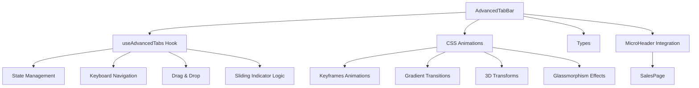

# خطة تنفيذ شريط التبويبات المتقدم (AdvancedTabBar)

## نظرة عامة
إعادة تصميم شريط التبويبات الأفقي الحالي إلى واجهة تفاعلية متقدمة ذات حركات سلسة وتأثيرات بصرية غنية.

## المتطلبات الرئيسية

### 1. نظام التدرجات اللونية الديناميكي (Dynamic Gradient System)
- تدرجات لونية متغيرة عند المرور (Hover) والنقر
- ألوان متناسقة للوضع الفاتح والمظلم
- انتقالات سلسة بين الحالات

### 2. تأثيرات النبض الإيقاعي (Rhythmic Pulsing)
- CSS Keyframes متقدمة للتبويب النشط
- تأثير نبض ناعم وجذاب
- قابلية التحكم في سرعة النبض

### 3. رسوم متحركة معقدة
- مؤشر انزلاق سلس (Sliding Indicator)
- تحولات ثلاثية الأبعاد خفيفة
- تكبير تفاعلي (Scale Transform)
- ظلال متحركة متعددة الطبقات

### 4. تأثيرات بصرية متقدمة
- Glassmorphism / Neo-morphism
- إضاءة خلفية محيطة (Ambient Glow)
- انعكاسات ضوئية

### 5. تفاعلات معقدة
- سحب وإفلات لإعادة ترتيب التبويبات
- تنقل بلوحة المفاتيح مع مؤشرات بصرية
- دعم الوضع المظلم/الفاتح

### 6. أداء وإمكانية الوصول
- 60fps أداء سلس
- WCAG AA compliance
- تصميم متجاوب بالكامل

## الهيكل المعماري



## بنية الملفات

```
src/ui/components/AdvancedTabBar/
├── index.ts                    # التصدير الرئيسي
├── types.ts                    # ✅ موجود - تعريفات TypeScript
├── styles.css                  # CSS المتقدم (Keyframes, Gradients, Effects)
├── AdvancedTabBar.tsx          # المكون الرئيسي
└── useAdvancedTabs.ts          # Hook لإدارة الحالة
```

## تفاصيل المكونات

### 1. AdvancedTabBar Props
```typescript
interface AdvancedTabBarProps {
    tabs: TabItem[];
    activeTab: string;
    onTabChange: (tabId: string) => void;
    onTabsReorder?: (tabs: TabItem[]) => void;
    enableDragDrop?: boolean;
    enableKeyboardNav?: boolean;
    theme?: 'light' | 'dark' | 'auto';
    // ... animation & gradient configs
}
```

### 2. CSS Animation Classes
- `.tab-gradient-active`: تدرج التبويب النشط
- `.tab-gradient-hover`: تدرج عند المرور
- `.tab-pulse-animation`: تأثير النبض
- `.tab-glassmorphism`: تأثير الزجاجية
- `.tab-indicator-slide`: حركة المؤشر المنزلق
- `.tab-3d-transform`: تحولات ثلاثية الأبعاد

### 3. Hook Functions
- `handleTabClick()`: معالجة النقر
- `handleKeyDown()`: معالجة لوحة المفاتيح
- `handleDragStart/End/Drop()`: معالجة السحب
- `updateIndicatorPosition()`: تحديث موقع المؤشر

## خطة التنفيذ

### المرحلة 1: CSS المتقدم
إنشاء أنماط CSS مع:
- CSS Custom Properties للألوان المتغيرة
- @keyframes للنبض الإيقاعي
- Transitions للانتقالات السلسة
- Transform 3D للعمق البصري
- Box-shadow متعدد الطبقات
- Backdrop-filter للزجاجية

### المرحلة 2: Hook - useAdvancedTabs
إدارة الحالة الداخلية:
- Refs للعناصر والمؤشر
- State للتركيز والسحب
- Event handlers للتفاعل
- ARIA attributes للإمكانية

### المرحلة 3: المكون الرئيسي
تجميع كل شيء مع:
- تكامل CSS
- تطبيق الـ Hook
- معالجة أحداث التفاعل
- دعم RTL

### المرحلة 4: التكامل
تحديث:
- MicroHeader.tsx لاستخدام AdvancedTabBar
- SalesPage.tsx للتجربة الأولى

## التأثيرات المرئية المطلوبة

### التبويب النشط
```css
/* نبض إيقاعي */
@keyframes rhythmicPulse {
  0%, 100% { box-shadow: 0 0 0 0 rgba(var(--accent), 0.4); }
  50% { box-shadow: 0 0 20px 5px rgba(var(--accent), 0.2); }
}

/* تدرج ديناميكي */
background: linear-gradient(135deg, var(--gradient-start), var(--gradient-end));

/* ظلال متعددة الطبقات */
box-shadow: 
  0 2px 4px rgba(0,0,0,0.1),
  0 4px 8px rgba(0,0,0,0.1),
  0 8px 16px rgba(var(--accent), 0.15);
```

### عند المرور (Hover)
```css
transform: translateY(-2px) scale(1.02);
background: linear-gradient(135deg, var(--hover-start), var(--hover-end));
box-shadow: 0 8px 25px rgba(var(--accent), 0.3);
```

## ملاحظات الأداء
- استخدام `will-change` على العناصر المتحركة
- تفضيل `transform` و `opacity` للرسوم المتحركة
- استخدام `requestAnimationFrame` للتحديثات
- تقليل إعادة الرسم (Repaints)

## إمكانية الوصول (WCAG AA)
- نسبة تباين الألوان 4.5:1 على الأقل
- دعم التنقل بلوحة المفاتيح (Tab, Arrow, Enter)
- ARIA labels للقراءات الصوتية
- تخطي التبويبات عند الحاجة
- عدم الاعتماد على الألوان فقط للمعلومات
