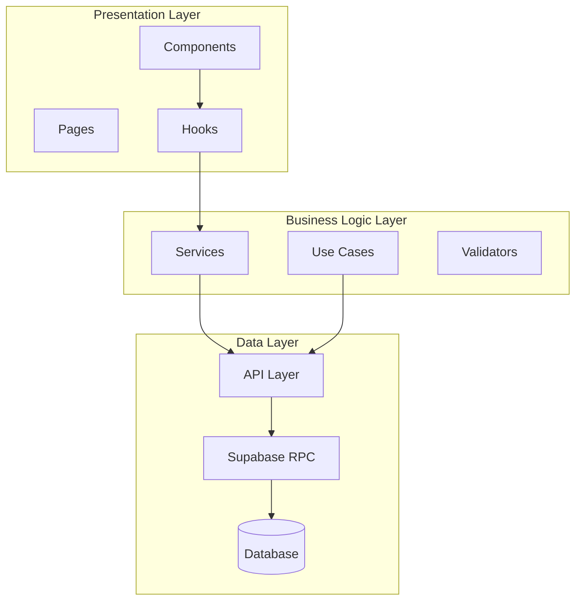
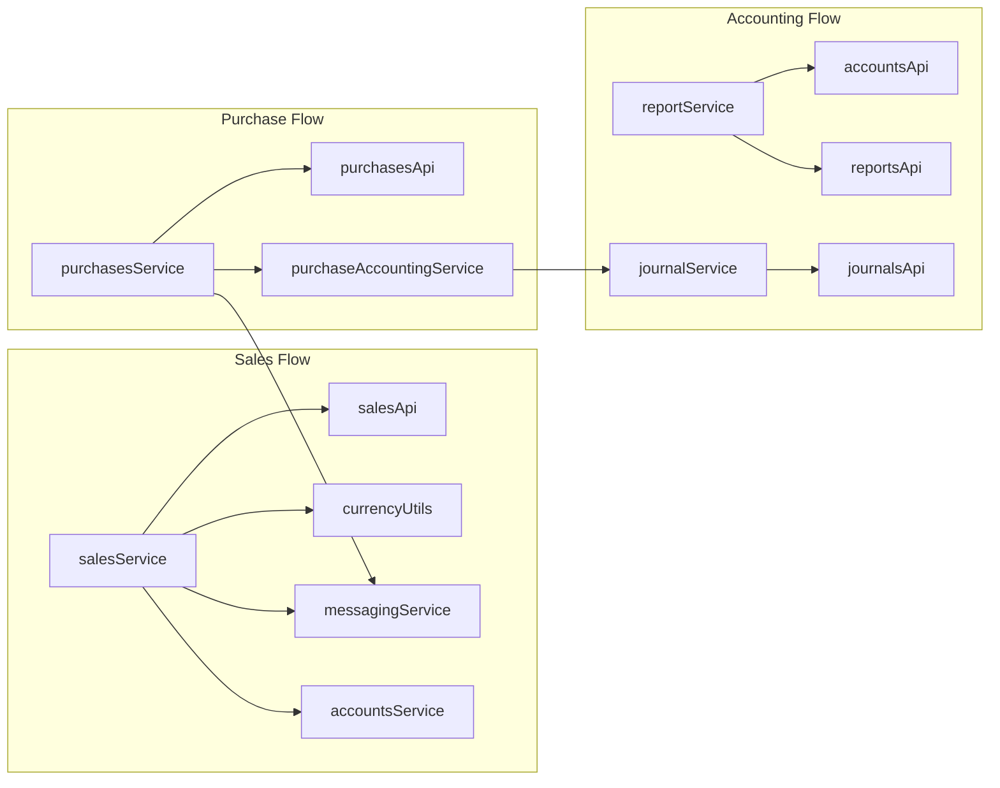
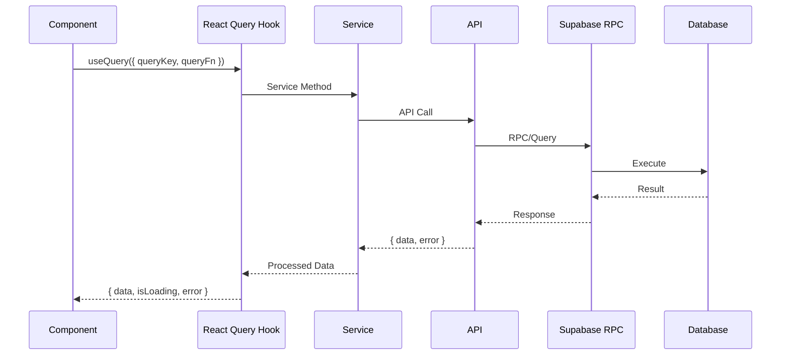
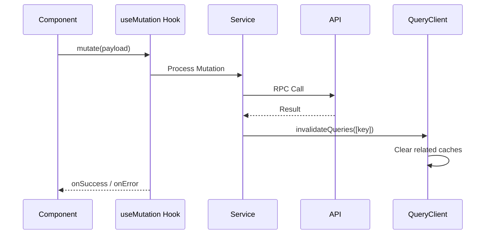
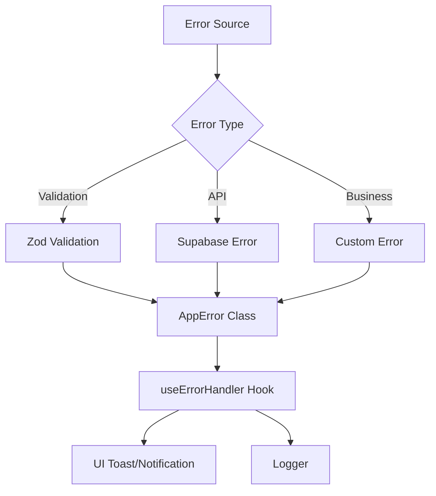
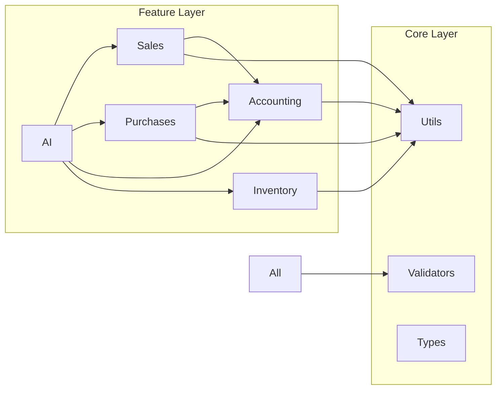
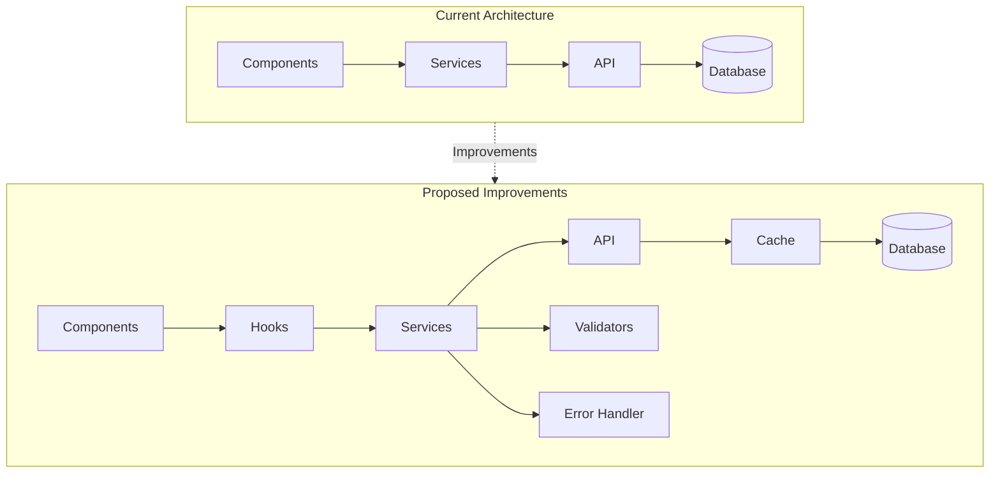

# Al-Zahra Smart ERP - Comprehensive Architectural Review Report

**Date:** 2026-02-28  
**Version:** 1.0  
**Scope:** Full Application Architecture Review

---

## Executive Summary

This document provides a comprehensive architectural review of the Al-Zahra Smart ERP application - a React TypeScript-based enterprise resource planning system built with Supabase as the backend. The review covers architectural patterns, data flow, component relationships, API contracts, type safety, and identifies areas for improvement.

**Overall Architecture Grade:** B+ (Good with areas for improvement)

---

## 1. Architectural Patterns Found

### 1.1 High-Level Architecture Pattern
The application follows a **Feature-Based Modular Architecture** combined with **Clean Architecture** principles:



### 1.2 State Management Pattern
**Hybrid Approach:**
- **React Query (TanStack Query)** for server state management
- **Zustand** for client state management (auth, UI preferences)
- **Local Storage Persistence** via custom persister

### 1.3 Data Flow Pattern
**CQRS-like Pattern** with clear separation:
- Queries: React Query hooks for data fetching
- Commands: Service methods for mutations
- Cache invalidation via query keys

### 1.4 API Pattern
**Repository Pattern** with Supabase:
- Feature-based API modules (e.g., `productsApi.ts`, `accountsApi.ts`)
- RPC calls for complex transactions
- Type-safe database access via generated types

### 1.5 Folder Structure Pattern
```
src/
├── app/          # App-level config (routes)
├── core/         # Shared utilities, types, validators, usecases
├── features/     # Feature modules (sales, inventory, accounting)
│   ├── api/      # Data access layer
│   ├── components/
│   ├── hooks/    # React Query hooks
│   ├── services/ # Business logic
│   └── types/    # Domain types
├── lib/          # 3rd party config (queryClient, supabaseClient)
└── ui/           # UI components
```

---

## 2. Component-Service Coupling Assessment

### 2.1 Coupling Levels by Feature

| Feature | API Layer | Service Layer | Component Coupling | Grade |
|---------|-----------|---------------|-------------------|-------|
| Sales | Good | Good | Medium | B+ |
| Purchases | Good | Good | Medium | B+ |
| Inventory | Good | Good | Low | A- |
| Accounting | Good | Good | Medium | B+ |
| AI Features | Good | Complex | High | C+ |
| Auth | Good | Good | Low | A- |

### 2.2 Coupling Analysis

**Strengths:**
- Clear separation between API and Service layers
- Components primarily consume hooks, not services directly
- Service layer provides abstraction over raw API calls

**Concerns:**
- Some services have tight coupling with notification system
- Circular dependency risk between accounting and purchases services
- AI features show high coupling with multiple domains

### 2.3 Dependency Graph (Key Services)



---

## 3. Data Flow Analysis

### 3.1 Server State Flow



### 3.2 Mutation Flow



### 3.3 Query Key Hierarchy

The application uses a well-structured query key system:

```typescript
// Query Keys Pattern Found
queryKeys = {
  auth: { me, session },
  inventory: { all, products, product(id), categories, warehouses, stock },
  sales: { all, invoices, invoice(id), returns, stats, analytics },
  purchases: { all, invoices, returns, stats },
  accounting: { all, accounts, account(id), journals, trialBalance, balanceSheet },
  parties: { all, customers, customer(id), suppliers, statement },
  dashboard: { stats, recentActivity, topProducts, topCustomers }
}
```

### 3.4 State Management Evaluation

**React Query Configuration:**
```typescript
// Found in queryClient.ts
{
  staleTime: 0,          // Data considered stale immediately
  gcTime: 60 minutes,    // Cache retention
  retry: 1,              // Single retry for non-auth errors
  refetchOnWindowFocus: true
}
```

**Zustand Stores:**
- `useAuthStore` - Authentication state with persistence
- Command store for UI commands

---

## 4. API Contract Validation

### 4.1 Supabase RPC Functions Inventory

| Function | Purpose | Type Safety |
|----------|---------|-------------|
| `commit_sales_invoice` | Atomic sale creation | Strong |
| `commit_sale_return` | Sale return processing | Strong |
| `commit_purchase_invoice` | Purchase creation | Strong |
| `commit_purchase_return` | Purchase return | Strong |
| `create_financial_bond` | Bond issuance | Strong |
| `get_warehouses_with_stats` | Warehouse aggregation | Strong |
| `post_journal_entry` | Accounting entry | Strong |

### 4.2 API Contract Assessment

**Strengths:**
- RPC functions provide atomic transactions
- Consistent return types across similar operations
- TypeScript types generated from database schema

**Inconsistencies Found:**

1. **Mixed Return Patterns:**
   ```typescript
   // Some APIs return: { data, error }
   // Others return: result directly
   // Inconsistent error handling
   ```

2. **Type Assertions:**
   ```typescript
   // Found pattern: excessive use of 'as any'
   (supabase.from('products') as any).insert(...)
   ```

3. **Optional vs Required Fields:**
   Some RPC parameters marked optional in DB but treated as required in code

### 4.3 RPC Contract Example

```typescript
// commit_sales_invoice RPC contract:
Args: {
  p_company_id: string
  p_user_id: string
  p_party_id: string | null
  p_items: Json
  p_payment_method: string
  p_notes: string | null
  p_treasury_account_id: string | null
  p_currency: string
  p_exchange_rate: number
}
Returns: {
  id: string
  invoice_number: string
  total_amount: number
  status: string
}
```

---

## 5. Type Safety Assessment

### 5.1 Type System Architecture

**Strengths:**
1. **Database Types:** Auto-generated from Supabase schema (`database.types.ts`)
2. **Domain Types:** Feature-specific types (e.g., `sales/types.ts`)
3. **Common Types:** Shared types in `core/types/common.ts`
4. **Validation Schemas:** Zod validators with type inference

### 5.2 Type Safety Grades by Area

| Area | Grade | Notes |
|------|-------|-------|
| Database Models | A | Auto-generated types from Supabase |
| API Layer | B+ | Some `any` usage for Supabase results |
| Service Layer | B+ | Good typing, occasional casting |
| Component Props | B | Mixed explicit/implicit typing |
| Hooks | A- | Well-typed React Query hooks |
| Validators | A | Comprehensive Zod schemas |

### 5.3 Type Safety Issues

1. **Excessive Type Assertions:**
   ```typescript
   // Found in multiple files
   (supabase.from('table') as any)
   ```

2. **Implicit any in Callbacks:**
   ```typescript
   // Some map/filter callbacks lack types
   .map((item) => ...) // item: any
   ```

3. **Database Type Overrides:**
   ```typescript
   type ProductUpdate = Database['public']['Tables']['products']['Update']
   // Good pattern, but not consistently used
   ```

### 5.4 Recommended Type Patterns

```typescript
// Pattern 1: Use generated DB types
import { Database } from '../core/database.types';
type ProductRow = Database['public']['Tables']['products']['Row'];

// Pattern 2: Domain-specific types
interface CreateInvoiceDTO {
  partyId: string | null;
  items: CartItem[];
  // ...
}

// Pattern 3: Zod schema with type inference
const invoiceSchema = z.object({...});
type InvoiceInput = z.infer<typeof invoiceSchema>;
```

---

## 6. Error Handling Patterns

### 6.1 Error Handling Architecture

**Pattern Found: Centralized + Feature-Level**



### 6.2 Error Handling Components

1. **AppError Class** (`core/types/common.ts`):
   ```typescript
   class AppError extends Error {
     constructor(
       message: string,
       public code: ErrorCode,
       public statusCode: number = 500,
       public details?: UnknownRecord
     )
   }
   ```

2. **useErrorHandler Hook** (`core/hooks/useErrorHandler.ts`):
   - Centralized error transformation
   - Async error handling helper
   - Context-aware logging

3. **Global Error Masking** (`index.tsx`):
   - Production error sanitization
   - Supabase error interception
   - Security-focused error messages

### 6.3 Error Handling Assessment

| Aspect | Status | Notes |
|--------|--------|-------|
| Error Classification | Good | ErrorCode enum covers main cases |
| Error Transformation | Good | toAppError utility exists |
| Async Handling | Good | handleErrorAsync helper |
| User Feedback | Partial | Toast integration inconsistent |
| Logging | Good | Structured logging with logger |

### 6.4 Error Handling Issues

1. **Inconsistent Usage:**
   - Some services throw raw errors
   - Others wrap in AppError
   - Some catch and silently fail

2. **Silent Failures:**
   ```typescript
   // In purchaseAccountingService:
   catch (accountingError) {
     logger.error(...);
     // Don't throw - invoice already created
   }
   ```

---

## 7. System Cohesion and Modularity

### 7.1 Module Cohesion Analysis

**High Cohesion Modules:**
- ✅ `features/auth/` - Self-contained, clear boundaries
- ✅ `features/inventory/` - Well-organized, consistent patterns
- ✅ `core/validators/` - Single responsibility, reusable

**Medium Cohesion Modules:**
- ⚠️ `features/ai/` - Mixes multiple domains
- ⚠️ `features/dashboard/` - Aggregates from many sources

**Low Cohesion Areas:**
- ❌ `core/utils/` - Mixed concerns (currency, validation, PDF, Excel)
- ❌ Some service files have mixed business logic

### 7.2 Inter-Feature Dependencies



### 7.3 Modularity Recommendations

1. **Extract Cross-Cutting Concerns:**
   - Move currency utilities to standalone module
   - Separate export utilities (PDF, Excel)
   - Create dedicated validation module

2. **Reduce AI Feature Coupling:**
   - AI features depend on almost all domains
   - Consider event-driven approach
   - Use feature flags for AI components

---

## 8. Architectural Issues and Inconsistencies

### 8.1 Critical Issues

| # | Issue | Impact | Location |
|---|-------|--------|----------|
| 1 | Type assertions (as any) reduce type safety | High | Multiple API files |
| 2 | Silent failures in accounting side effects | Medium | purchaseAccountingService |
| 3 | Mixed error handling patterns | Medium | Service layer |
| 4 | AI feature high coupling | Medium | features/ai/ |
| 5 | Large utils file with mixed concerns | Low | core/utils/ |

### 8.2 Inconsistencies

1. **Naming Conventions:**
   ```typescript
   // Found variations:
   getProducts    // camelCase
   get_accounts   // snake_case (shouldn't exist)
   fetchSalesLog  // fetch prefix
   processNewSale // process prefix
   ```

2. **API Return Patterns:**
   ```typescript
   // Pattern 1: Direct return
   return await supabase.from('table')...

   // Pattern 2: Destructure
   const { data, error } = await ...
   if (error) throw error;
   return data;

   // Pattern 3: Transform
   return (data || []).map(...)
   ```

3. **Query Key Patterns:**
   ```typescript
   // Some use arrays:
   ['sales', 'invoices']

   // Some use factory functions:
   salesKeys.invoices()
   ```

4. **Currency Handling:**
   - Some places use `toBaseCurrency()`
   - Others inline the calculation
   - Inconsistent default currency (SAR vs YER)

### 8.3 Code Duplication

Areas with duplication:
1. Currency conversion logic (now mostly consolidated)
2. Date formatting functions
3. Notification toast patterns
4. Loading state components

---

## 9. Recommendations for Improvement

### 9.1 High Priority

1. **Eliminate Type Assertions**
   ```typescript
   // Replace:
   (supabase.from('products') as any)

   // With:
   supabase.from('products')
   ```

2. **Standardize Error Handling**
   - Use `handleErrorAsync` consistently
   - Never silently fail on critical operations
   - Always wrap errors in AppError

3. **API Layer Standardization**
   ```typescript
   // Standard pattern:
   export const api = {
     async operation(): Promise<ApiResponse<DataType>> {
       const { data, error } = await supabase...;
       if (error) throw toAppError(error);
       return { data, error: null, success: true };
     }
   }
   ```

### 9.2 Medium Priority

4. **Consistent Naming**
   - Use camelCase for all JavaScript/TypeScript
   - Standardize prefix conventions (get/fetch/load)

5. **Extract Utilities**
   ```
   core/
   ├── utils/
   │   ├── currency/
   │   ├── date/
   │   ├── export/
   │   └── validation/
   ```

6. **Query Key Standardization**
   - Use factory pattern consistently
   - Document query key hierarchy

### 9.3 Low Priority

7. **AI Feature Refactoring**
   - Use event-driven architecture
   - Reduce direct dependencies
   - Consider micro-frontend approach

8. **Component Documentation**
   - Add JSDoc comments
   - Document props interfaces

### 9.4 Architectural Improvements



---

## 10. Summary and Conclusion

### 10.1 Strengths

1. ✅ **Well-structured modular architecture**
2. ✅ **Strong TypeScript adoption**
3. ✅ **Good separation of concerns**
4. ✅ **Comprehensive validation with Zod**
5. ✅ **Effective state management with React Query**
6. ✅ **Atomic database operations via RPC**
7. ✅ **Security-conscious error handling**

### 10.2 Areas for Improvement

1. 🔧 **Type safety** - Reduce `as any` assertions
2. 🔧 **Error handling** - Standardize across all services
3. 🔧 **API consistency** - Uniform return patterns
4. 🔧 **Code organization** - Split large utility files
5. 🔧 **AI coupling** - Reduce inter-feature dependencies

### 10.3 Action Plan

| Priority | Action | Estimated Effort |
|----------|--------|------------------|
| High | Remove type assertions | 1-2 days |
| High | Standardize error handling | 2-3 days |
| Medium | Refactor utility organization | 1 day |
| Medium | Document API contracts | 2 days |
| Low | AI feature decoupling | 3-5 days |

### 10.4 Final Assessment

The Al-Zahra Smart ERP demonstrates solid architectural foundations with modern React patterns, effective state management, and good separation of concerns. The main areas for improvement center around type safety enforcement, error handling consistency, and reducing tight coupling in the AI features. With the recommended improvements, the architecture would achieve an **A grade** rating.

**Overall: Good architecture with clear paths for refinement.**

---

## Appendix A: Key Files Reference

| Category | Key Files |
|----------|-----------|
| Configuration | `src/lib/queryClient.ts`, `src/lib/supabaseClient.ts` |
| Types | `src/core/database.types.ts`, `src/core/types/common.ts` |
| State | `src/features/auth/store.ts`, `src/core/lib/react-query.tsx` |
| Validation | `src/core/validators/index.ts` |
| Error Handling | `src/core/hooks/useErrorHandler.ts`, `src/core/types/common.ts` |
| Use Cases | `src/core/usecases/**/*` |

## Appendix B: Technology Stack

| Category | Technology |
|----------|------------|
| Framework | React 19.2.4 |
| Language | TypeScript 5.2.2 |
| Build Tool | Vite 5.1.4 |
| Styling | Tailwind CSS 3.4.1 |
| State (Server) | TanStack Query 5.90.20 |
| State (Client) | Zustand 5.0.10 |
| Backend | Supabase |
| Validation | Zod 3.22.4 |
| Charts | Recharts 3.7.0 |

---

*End of Architectural Review Report*
