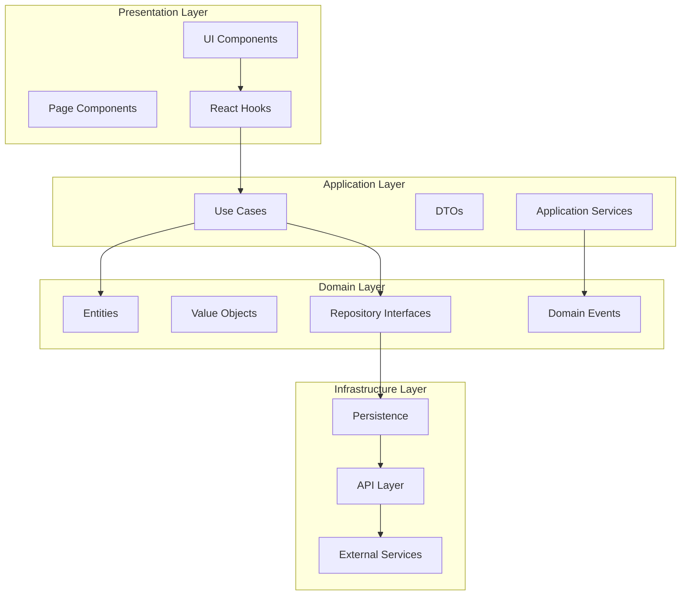
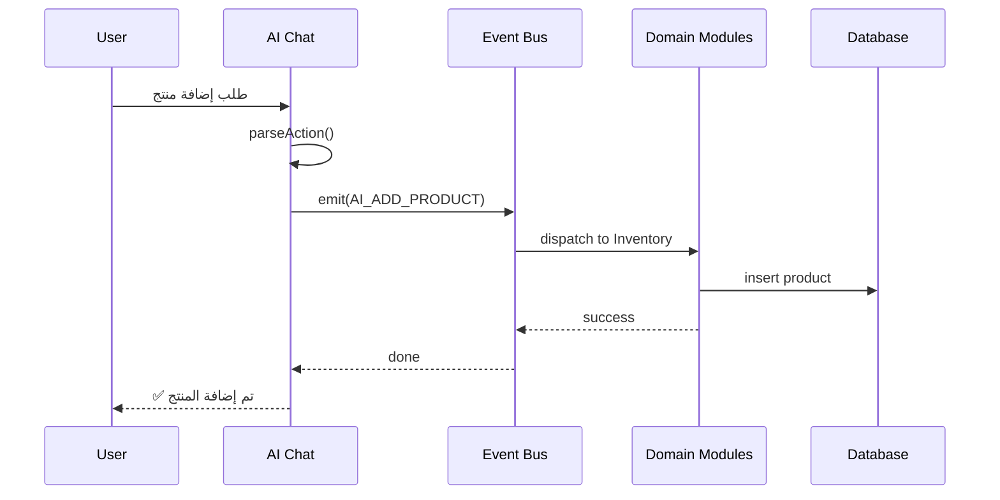
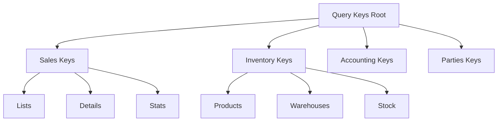
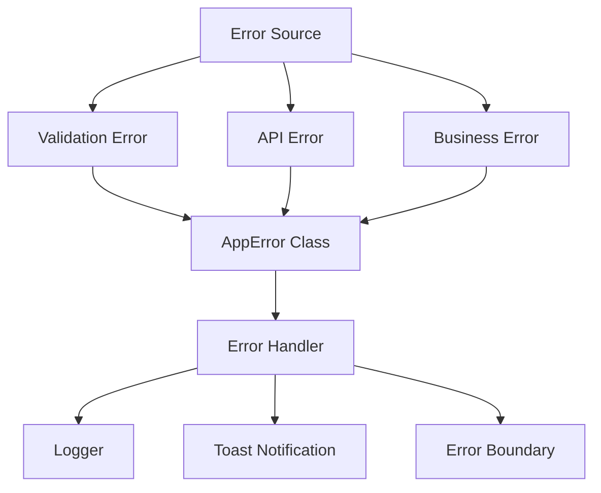
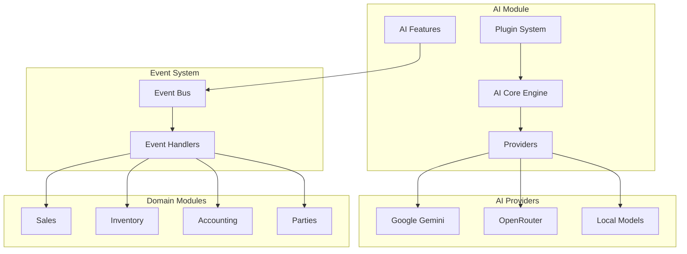
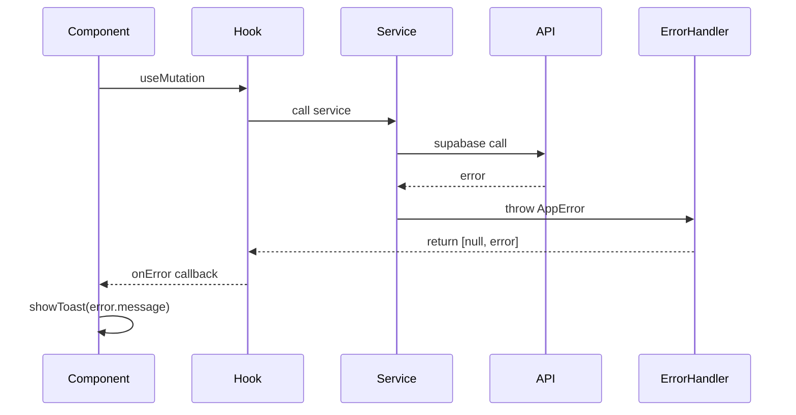
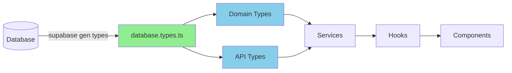
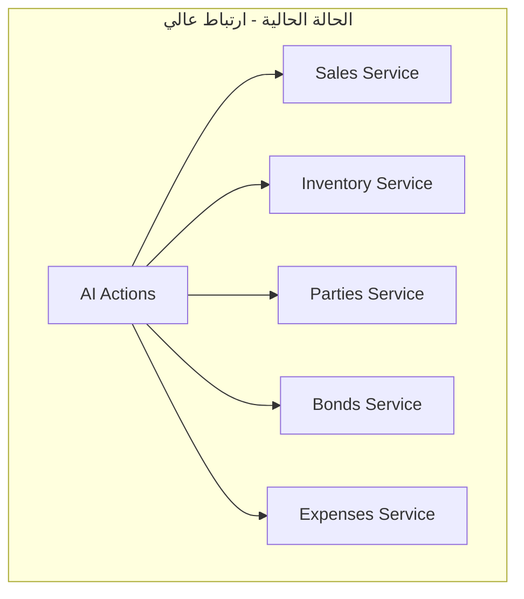
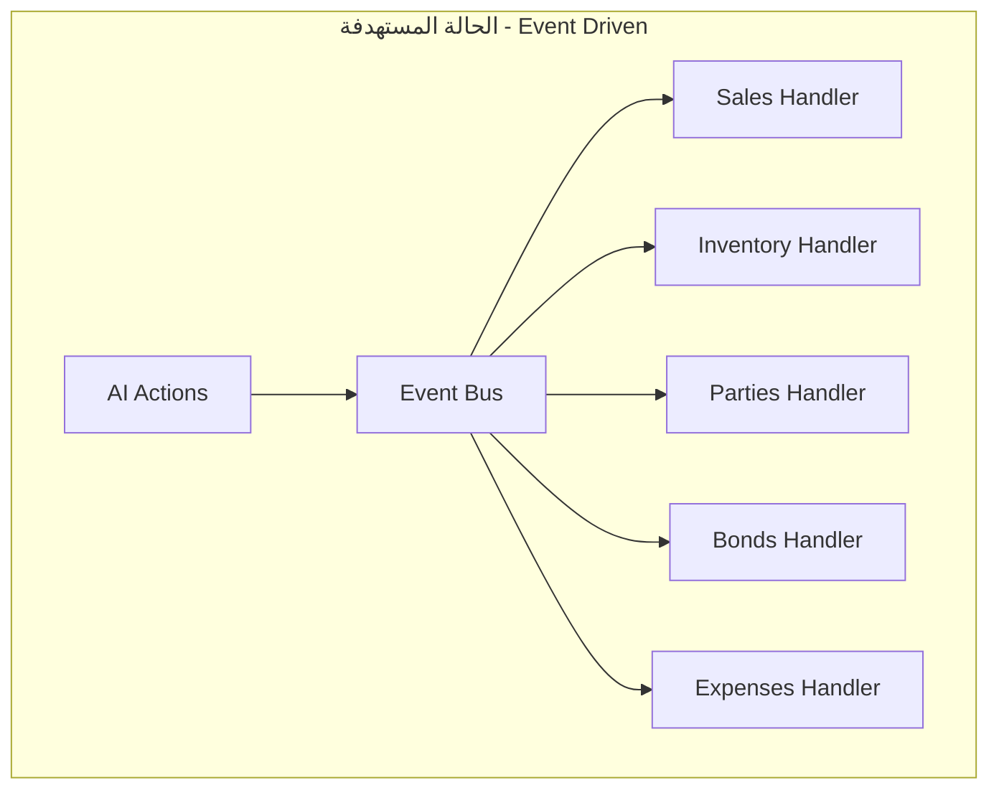
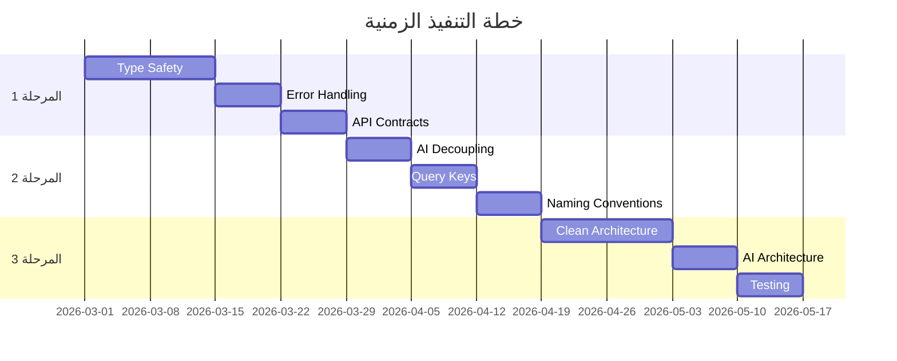

# مخططات معمارية نظام Al-Zahra Smart ERP

## 1. الهيكل المعماري المستهدف (Clean Architecture)



## 2. تدفق البيانات الجديد (مع Event-Driven AI)



## 3. هرمية مفاتيح React Query الموحدة



## 4. نظام معالجة الأخطاء الموحد



## 5. معمارية AI المستقلة



## 6. تدفق Error Handling الموحد



## 7. Type Safety Flow



## 8. Before/After Comparison

### Before (Current State)


### After (Target State)


## 9. API Contract Standardization

```mermaid
graph LR
    subgraph BeforeAPI[Before - Mixed Patterns]
        B1[return data directly]
        B2[{data, error}]
        B3[throw error]
        B4[return null on error]
    end

    subgraph AfterAPI[After - Unified Pattern]
        A1[ApiResponse<T>]
        A2[{data, error, success}]
        A3[Consistent metadata]
    end

    BeforeAPI -->|Standardize| AfterAPI
```

## 10. Migration Timeline


