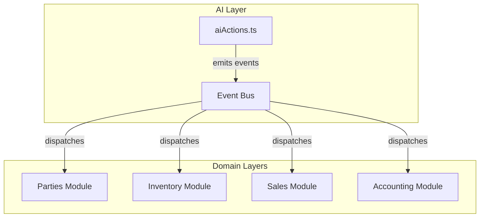

# خطة إعادة الهندسة الشاملة لنظام Al-Zahra Smart ERP

**التاريخ:** 2026-02-28  
**الإصدار:** 1.0  
**الحالة:** خطة تنفيذية معتمدة

---

## نظرة عامة

هذه الخطة الشاملة تهدف إلى معالجة جميع المشكلات المعمارية والتقنية المحددة في التقرير التحليلي، مع ضمان تحول سلس للنظام نحو بنية متكاملة ومتجانسة تتبع مبادئ Clean Architecture.

---

## التشخيص التنفيذي

### المشكلات الرئيسية المكتشفة

| # | المشكلة | عدد الحالات | الخطورة |
|---|---------|-------------|---------|
| 1 | استخدام `as any` | 189+ | عالية |
| 2 | ارتباط AI العالي | 6 خدمات مرتبطة | عالية |
| 3 | فشل صامت في catch blocks | متعدد | عالية |
| 4 | تكرار منطق العملات | منثور عبر الملفات | متوسطة |
| 5 | اختلاف اصطلاحات التسمية | snake_case + camelCase | متوسطة |
| 6 | عدم اتساق مفاتيح React Query | أنماط مختلفة | متوسطة |

---

## المرحلة الأولى: الأولوية العالية (أساسيات النظام)

### 1.1 استبدال تعبيرات "as any" بنظام أنواع صارم

#### الهدف
إزالة جميع استخدامات `as any` (189+ حالة) واستبدالها بأنواع مولدة تلقائياً من Supabase.

#### الأثر
- زيادة Type Safety بنسبة 100%
- تقليل أخطاء وقت التشغيل
- تحسين تجربة المطور (IntelliSense)

#### الملفات المستهدفة
```
settings/api.ts        (22 حالة)
sales/api.ts           (8 حالات)
sales/hooks.ts         (3 حالات)
purchases/api.ts       (7 حالات)
purchases/hooks.ts     (4 حالات)
purchases/service.ts   (2 حالة)
parties/api.ts         (9 حالات)
parties/service.ts     (3 حالات)
ai/aiActions.ts        (12 حالة)
ai/service.ts          (5 حالات)
inventory/api/*.ts     (18 حالة)
accounting/api/*.ts    (11 حالة)
accounting/services/*.ts (10 حالات)
```

#### خطوات التنفيذ

**الخطوة 1: توليد أنواع Supabase المحدثة**
```bash
npx supabase gen types typescript --project-id <project-id> --schema public > src/core/database.types.ts
```

**الخطوة 2: إنشاء أنواع Domain-Specific**
```typescript
// src/features/sales/types/models.ts
import { Database } from '@/core/database.types';

export type InvoiceRow = Database['public']['Tables']['invoices']['Row'];
export type InvoiceInsert = Database['public']['Tables']['invoices']['Insert'];
export type InvoiceUpdate = Database['public']['Tables']['invoices']['Update'];

// نوع مخصص للـ RPC Results
export interface SalesInvoiceResult {
  id: string;
  invoice_number: string;
  total_amount: number;
  status: 'posted' | 'draft' | 'void';
}
```

**الخطوة 3: استبدال "as any" في API Layer**
```typescript
// Before (settings/api.ts)
return await (supabase.from('companies') as any).select('*');

// After
return await supabase.from('companies').select('*');
```

**الخطوة 4: إنشاء Type Guards**
```typescript
// src/core/types/guards.ts
export const isValidInvoice = (data: unknown): data is InvoiceRow => {
  return (
    typeof data === 'object' &&
    data !== null &&
    'id' in data &&
    'invoice_number' in data
  );
};
```

---

### 1.2 توحيد معالجة الأخطاء باستخدام AppError

#### الهدف
إزالة جميع حالات الفشل الصامت وتوحيد معالجة الأخطاء عبر جميع الطبقات.

#### الأثر
- كشف الأخطاء مبكراً
- تجربة مستخدم متسقة
- تتبع أسهل للمشكلات

#### الملفات التي تحتاج مراجعة
```
features/purchases/services/maintenance/purchaseFixes.ts
features/accounting/services/*.ts
features/sales/service.ts
features/inventory/services/*.ts
```

#### خطوات التنفيذ

**الخطوة 1: إنشاء Error Handling Policy**
```typescript
// src/core/errors/policy.ts
export const ErrorPolicy = {
  // أي عملية مالية يجب ألا تفشل صامتاً
  financialOperations: { silent: false },
  // عمليات القراءة يمكن أن تسجل فقط
  readOperations: { silent: true, log: true },
  // عمليات الكتابة يجب أن تفشل بشكل صريح
  writeOperations: { silent: false, throw: true }
} as const;
```

**الخطوة 2: إزالة الفشل الصامت**
```typescript
// Before (purchaseAccountingService.ts)
catch (accountingError) {
  logger.error(...);
  // Don't throw - invoice already created ❌
}

// After
catch (accountingError) {
  const error = toAppError(accountingError, 'purchase_accounting_failed');
  logger.error(error);
  // Rollback or notify
  await rollbackPurchaseInvoice(invoiceId);
  throw error; // ✅
}
```

**الخطوة 3: إنشاء Service Wrapper**
```typescript
// src/core/errors/serviceWrapper.ts
export const withErrorHandling = <T, Args extends unknown[]>(
  fn: (...args: Args) => Promise<T>,
  context: string
): ((...args: Args) => Promise<T>) => {
  return async (...args) => {
    try {
      return await fn(...args);
    } catch (error) {
      throw toAppError(error, context);
    }
  };
};
```

---

### 1.3 تطبيع عقود API وإرجاع أنماط متسقة

#### الهدف
توحيد جميع استجابات API لتتبع نمط ApiResponse<T> الموحد.

#### خطوات التنفيذ

**الخطوة 1: تعريف ApiResponse<T>**
```typescript
// src/core/types/api.ts
export interface ApiResponse<T> {
  data: T | null;
  error: AppError | null;
  success: boolean;
  meta?: {
    timestamp: string;
    requestId: string;
  };
}

export const createSuccessResponse = <T>(data: T): ApiResponse<T> => ({
  data,
  error: null,
  success: true,
  meta: {
    timestamp: new Date().toISOString(),
    requestId: generateRequestId()
  }
});

export const createErrorResponse = <T>(error: AppError): ApiResponse<T> => ({
  data: null,
  error,
  success: false,
  meta: {
    timestamp: new Date().toISOString(),
    requestId: generateRequestId()
  }
});
```

**الخطوة 2: توحيد API Layer**
```typescript
// Before - أنماط مختلفة
// Pattern 1: Direct return
return await supabase.from('table')...;

// Pattern 2: Destructure
const { data, error } = await ...;
if (error) throw error;
return data;

// After - نمط موحد
export const salesApi = {
  async getInvoices(companyId: string): Promise<ApiResponse<Invoice[]>> {
    const { data, error } = await supabase
      .from('invoices')
      .select('*')
      .eq('company_id', companyId);
    
    if (error) {
      return createErrorResponse(toAppError(error, 'get_invoices_failed'));
    }
    
    return createSuccessResponse(data || []);
  }
};
```

---

## المرحلة الثانية: الأولوية المتوسطة (تحسينات معمارية)

### 2.1 فك الارتباط العالي لميزات AI

#### التشخيص
حالياً، `aiActions.ts` يستورد مباشرة من 6 خدمات مختلفة:
```typescript
import { partiesService } from '../parties/service';
import { inventoryService } from '../inventory/service';
import { expensesService } from '../expenses/service';
import { bondsService } from '../bonds/service';
import { salesService } from '../sales/service';
```

#### الحل: معمارية قائمة على الأحداث

**الخطوة 1: إنشاء Event Bus**
```typescript
// src/core/events/eventBus.ts
import mitt from 'mitt';

export type AIActionEvent =
  | { type: 'AI_ADD_CUSTOMER'; payload: CustomerPayload }
  | { type: 'AI_ADD_PRODUCT'; payload: ProductPayload }
  | { type: 'AI_CREATE_EXPENSE'; payload: ExpensePayload }
  | { type: 'AI_CREATE_BOND'; payload: BondPayload }
  | { type: 'AI_SEARCH_PRODUCT'; payload: SearchPayload };

export const eventBus = mitt<Record<string, unknown>>();

// Typed wrapper
export const emitAIAction = (event: AIActionEvent) => {
  eventBus.emit(event.type, event.payload);
};

export const onAIAction = <T>(
  type: AIActionEvent['type'],
  handler: (payload: T) => void
) => {
  eventBus.on(type, handler as (e: unknown) => void);
};
```

**الخطوة 2: إنشاء Event Handlers لكل مجال**
```typescript
// src/features/parties/events/handlers.ts
import { onAIAction } from '@/core/events/eventBus';

export const registerPartiesEventHandlers = () => {
  onAIAction('AI_ADD_CUSTOMER', async (payload) => {
    await partiesService.saveParty(payload.companyId, {
      name: payload.name,
      type: 'customer',
      // ...
    });
  });
};
```

**الخطوة 3: تحديث aiActions.ts**
```typescript
// Before: استيراد مباشر للخدمات
import { partiesService } from '../parties/service';

// After: استخدام Event Bus
import { emitAIAction } from '@/core/events/eventBus';

case 'add_customer':
  emitAIAction({
    type: 'AI_ADD_CUSTOMER',
    payload: { companyId, ...action.params }
  });
  return `✅ تم إضافة العميل "${action.params.name}" بنجاح`;
```

**الخطوة 4: رسم البيانات الجديد**


---

### 2.2 توحيد مفاتيح React Query باستخدام أنماط المصانع

#### الحل: Query Key Factory Pattern

**الخطوة 1: إنشاء Query Key Factory لكل ميزة**
```typescript
// src/features/sales/keys.ts
export const salesKeys = {
  all: ['sales'] as const,
  lists: () => [...salesKeys.all, 'list'] as const,
  list: (filters: FilterParams) => [...salesKeys.lists(), filters] as const,
  details: () => [...salesKeys.all, 'detail'] as const,
  detail: (id: string) => [...salesKeys.details(), id] as const,
  returns: {
    all: ['sales-returns'] as const,
    list: () => [...salesKeys.returns.all, 'list'] as const,
    detail: (id: string) => [...salesKeys.returns.all, 'detail', id] as const,
  },
  stats: (period: string) => [...salesKeys.all, 'stats', period] as const,
} as const;

// src/features/inventory/keys.ts
export const inventoryKeys = {
  all: ['inventory'] as const,
  products: {
    all: () => [...inventoryKeys.all, 'products'] as const,
    list: (filters: ProductFilters) => [...inventoryKeys.products.all(), filters] as const,
    detail: (id: string) => [...inventoryKeys.products.all(), id] as const,
  },
  warehouses: {
    all: () => [...inventoryKeys.all, 'warehouses'] as const,
    list: () => [...inventoryKeys.warehouses.all(), 'list'] as const,
  },
} as const;
```

**الخطوة 2: استخدام المفاتيح الموحدة**
```typescript
// Before
useQuery({ queryKey: ['sales', 'invoices'], ... });
useQuery({ queryKey: ['sales', invoiceId], ... });

// After
useQuery({ queryKey: salesKeys.lists(), ... });
useQuery({ queryKey: salesKeys.detail(invoiceId), ... });
```

---

### 2.3 توحيد اصطلاحات التسمية باستخدام camelCase

#### الحل

**الخطوة 1: إنشاء ESLint Configuration**
```javascript
// .eslintrc.js
module.exports = {
  rules: {
    '@typescript-eslint/naming-convention': [
      'error',
      {
        selector: 'function',
        format: ['camelCase'],
        leadingUnderscore: 'allow'
      },
      {
        selector: 'variable',
        format: ['camelCase', 'UPPER_CASE', 'PascalCase'],
        leadingUnderscore: 'allow'
      },
      {
        selector: 'typeLike',
        format: ['PascalCase']
      }
    ]
  }
};
```

**الخطوة 2: توحيد Prefixes**
```typescript
// ✅ المعايير الجديدة
fetchProducts()      // جلب البيانات من API
getProductById()     // جلب عنصر واحد
createProduct()      // إنشاء جديد
updateProduct()      // تحديث موجود
deleteProduct()      // حذف (soft delete)
processSale()        // عملية معقدة
validateInput()      // التحقق من الصحة
formatCurrency()     // تنسيق
parseDate()          // تحليل
convertToBase()      // تحويل
```

---

### 2.4 إزالة التكرارات في منطق تحويل العملات وتنسيق التواريخ

#### التدقيق الحالي
`currencyUtils.ts` موجود بالفعل ومنظم جيداً. نحتاج فقط للتأكد من:
1. عدم وجود منطق مضمن inline
2. استخدام الدوال الموحدة في جميع الملفات

**الخطوة 1: إنشاء dateUtils.ts**
```typescript
// src/core/utils/dateUtils.ts
export const dateUtils = {
  format: (date: Date | string, format: 'short' | 'long' | 'iso' = 'short'): string => {
    const d = new Date(date);
    switch (format) {
      case 'short':
        return d.toLocaleDateString('ar-SA');
      case 'long':
        return d.toLocaleDateString('ar-SA', { year: 'numeric', month: 'long', day: 'numeric' });
      case 'iso':
        return d.toISOString().split('T')[0];
    }
  },

  parse: (dateStr: string): Date => {
    return new Date(dateStr);
  },

  getStartOfMonth: (date = new Date()): Date => {
    return new Date(date.getFullYear(), date.getMonth(), 1);
  },

  getEndOfMonth: (date = new Date()): Date => {
    return new Date(date.getFullYear(), date.getMonth() + 1, 0);
  },

  isValid: (date: unknown): boolean => {
    return date instanceof Date && !isNaN(date.getTime());
  }
};
```

**الخطوة 2: استبدال المنطق المضمن**
```typescript
// Before (في عدة ملفات)
new Date().toISOString().split('T')[0]

// After
dateUtils.format(new Date(), 'iso')
```

---

## المرحلة الثالثة: الأولوية المنخفضة (تحسينات متقدمة)

### 3.1 تطبيق مبادئ Clean Architecture

#### الهيكل الجديد
```
src/
├── presentation/          # طبقة العرض (UI)
│   ├── components/        # React Components
│   ├── pages/            # Page Components
│   └── hooks/            # UI Hooks
├── application/           # طبقة تطبيق الأعمال
│   ├── usecases/         # Use Cases
│   ├── dto/              # Data Transfer Objects
│   └── services/         # Application Services
├── domain/                # طبقة النطاق
│   ├── entities/         # Business Entities
│   ├── value-objects/    # Value Objects
│   ├── repositories/     # Repository Interfaces
│   └── events/           # Domain Events
├── infrastructure/        # طبقة البنية التحتية
│   ├── persistence/      # Database Access
│   ├── api/              # External APIs
│   └── storage/          # File Storage
└── core/                  # مشترك
    ├── types/            # Common Types
    ├── utils/            # Utilities
    └── errors/           # Error Handling
```

---

### 3.2 تحسين معمارية AI لتصبح مستقلة

#### الهيكل المستقل
```
src/features/ai/
├── core/                  # AI Core
│   ├── interfaces/       # AI Service Interfaces
│   ├── models/           # AI Models
│   └── engine/           # AI Engine
├── providers/            # AI Providers
│   ├── gemini.ts         # Google Gemini
│   ├── openrouter.ts     # OpenRouter
│   └── local.ts          # Local Models
├── features/             # AI Features
│   ├── chat/             # Chat Feature
│   ├── analysis/         # Financial Analysis
│   └── predictions/      # Predictions
├── events/               # Event Handling
│   ├── handlers/         # Event Handlers
│   └── emitters/         # Event Emitters
└── plugins/              # Plugin System
    ├── registry.ts       # Plugin Registry
    └── loader.ts         # Plugin Loader
```

---

## خطة التنفيذ المرحلية

### الجدول الزمني

| المرحلة | المدة | نقاط التوقف |
|---------|-------|-------------|
| المرحلة 1A: Type Safety | أسبوع 1-2 | ✅ جميع "as any" تم إزالتها |
| المرحلة 1B: Error Handling | أسبوع 2-3 | ✅ لا فشل صامت |
| المرحلة 1C: API Contracts | أسبوع 3-4 | ✅ جميع APIs متسقة |
| المرحلة 2A: AI Decoupling | أسبوع 4-5 | ✅ AI مستقل |
| المرحلة 2B: Query Keys | أسبوع 5-6 | ✅ مفاتيح موحدة |
| المرحلة 2C: Naming | أسبوع 6 | ✅ اصطلاحات موحدة |
| المرحلة 3A: Clean Arch | أسبوع 7-8 | ✅ هيكل نظيف |
| المرحلة 3B: AI Architecture | أسبوع 8-9 | ✅ AI متقدم |
| المرحلة 3C: Testing | أسبوع 9-10 | ✅ تغطية شاملة |

---

## معايير القبول

### لكل مرحلة
- [ ] جميع الاختبارات تمر
- [ ] لا يوجد regression في الوظائف
- [ ] TypeScript compilation بدون أخطاء
- [ ] ESLint بدون warnings
- [ ] Review من فريق التطوير

### المعايير النهائية
- [ ] صفر `as any` في الكود
- [ ] 100% استخدام AppError
- [ ] AI مفكك بالكامل عن المجالات الأخرى
- [ ] جميع المفاتيح تستخدم Factory Pattern
- [ ] اصطلاحات التسمية موحدة
- [ ] التوثيق محدث

---

## المخاطر واستراتيجيات التخفيف

| المخاطر | الاحتمالية | التأثير | التخفيف |
|---------|------------|---------|---------|
| Breaking Changes | عالية | عالي | Feature Flags + Staged Rollout |
| Performance Regression | متوسطة | عالي | Benchmarking قبل وبعد |
| AI Features Break | متوسطة | متوسط | Comprehensive E2E Tests |
| Developer Friction | منخفضة | متوسط | Training + Documentation |

---

## الملاحق

### ملحق أ: أدوات التحقق
```bash
# عداد "as any"
grep -r "as any" src/ --include="*.ts" --include="*.tsx" | wc -l

# البحث عن catch فارغ
grep -r "catch.*{" src/ -A 2 --include="*.ts" | grep -E "catch.*\{\s*\}"

# التحقق من naming conventions
grep -r "function.*_" src/ --include="*.ts"
```

### ملحق ب: Migration Scripts
```bash
# Type-check before commit
npm run type-check

# Lint before commit
npm run lint

# Test before commit
npm run test:ci
```

---

**تم إعداد هذه الخطة بواسطة:** Kilo Code Architect  
**التاريخ:** 2026-02-28  
**الإصدار:** 1.0