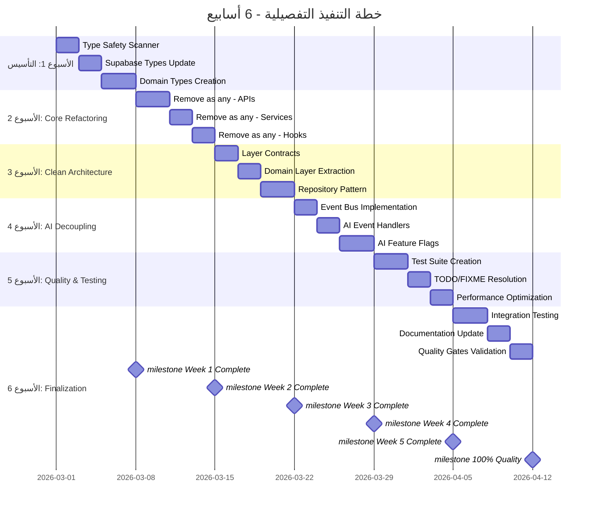

# الخطة التنفيذية التفصيلية لنظام Al-Zahra Smart ERP

**الهدف:** الوصول إلى جودة 100% - Zero Technical Debt  
**المدة:** 6 أسابيع  
**المنهجية:** incremental refactoring مع ضمان عدم كسر الوظائف

---

## الجدول الزمني التفصيلي (6 أسابيع)



---

## الأسبوع 1: التأسيس والأنواع (الأيام 1-7)

### اليوم 1-2: Type Safety Scanner

**المهمة:** إنشاء أداة لفحص وتوثيق جميع حالات "as any"

```typescript
// scripts/type-safety-scanner.ts
import { Project, Node, SyntaxKind } from 'ts-morph';

interface TypeSafetyIssue {
  filePath: string;
  line: number;
  column: number;
  type: 'as_any' | 'implicit_any' | 'missing_return_type';
  context: string;
  suggestedFix: string;
}

export class TypeSafetyScanner {
  private project: Project;
  private issues: TypeSafetyIssue[] = [];

  constructor(tsConfigPath: string) {
    this.project = new Project({ tsConfigFilePath: tsConfigPath });
  }

  scan(): TypeSafetyIssue[] {
    const sourceFiles = this.project.getSourceFiles();
    
    for (const sourceFile of sourceFiles) {
      // البحث عن (expression as any)
      const typeAssertions = sourceFile.getDescendantsOfKind(
        SyntaxKind.TypeAssertionExpression
      );
      
      for (const assertion of typeAssertions) {
        const typeNode = assertion.getTypeArgument();
        if (typeNode.getText() === 'any') {
          this.issues.push({
            filePath: sourceFile.getFilePath(),
            line: assertion.getStartLineNumber(),
            column: assertion.getStart() - sourceFile.getStart(),
            type: 'as_any',
            context: assertion.getParent()?.getText() || '',
            suggestedFix: this.generateFix(assertion)
          });
        }
      }
    }
    
    return this.issues;
  }

  generateReport(): string {
    const grouped = this.groupByFile();
    let report = '# Type Safety Issues Report\n\n';
    report += `Total Issues: ${this.issues.length}\n\n`;
    
    for (const [file, issues] of Object.entries(grouped)) {
      report += `## ${file}\n`;
      report += `Found ${issues.length} issues\n\n`;
      
      for (const issue of issues) {
        report += `- [ ] Line ${issue.line}: ${issue.type}\n`;
        report += `  - Context: ${issue.context.substring(0, 100)}...\n`;
        report += `  - Fix: ${issue.suggestedFix}\n\n`;
      }
    }
    
    return report;
  }

  private generateFix(node: Node): string {
    // تحليل السياق وتوليد fix مناسب
    const parent = node.getParent();
    if (parent?.getKind() === SyntaxKind.CallExpression) {
      return 'Use proper type from Database types';
    }
    return 'Replace with specific type';
  }

  private groupByFile(): Record<string, TypeSafetyIssue[]> {
    return this.issues.reduce((acc, issue) => {
      if (!acc[issue.filePath]) acc[issue.filePath] = [];
      acc[issue.filePath].push(issue);
      return acc;
    }, {} as Record<string, TypeSafetyIssue[]>);
  }
}
```

**معايير القبول:**
- [ ] إنشاء قائمة شاملة بجميع 189+ حالة "as any"
- [ ] تصنيف الحالات حسب الشدة والملف
- [ ] توليد suggestions تلقائية للإصلاح
- [ ] تقرير HTML قابل للتصفح

---

### اليوم 3-4: تحديث أنواع Supabase

**المهمة:** توليد أنواع Supabase الكاملة والمفقودة

```bash
# توليد الأنواع من قاعدة البيانات
npx supabase gen types typescript \
  --project-id <project-id> \
  --schema public \
  > src/core/database.types.ts

# التحقق من اكتمال الأنواع
npm run type-check
```

**إنشاء أنواع إضافية للـ RPCs المفقودة:**

```typescript
// src/core/database.types.ts - إضافات

export interface Database {
  public: {
    Functions: {
      // Existing functions...
      
      // إضافة RPCs المفقودة
      get_inventory_valuation: {
        Args: { p_company_id: string; p_warehouse_id?: string };
        Returns: {
          product_id: string;
          product_name: string;
          quantity: number;
          avg_cost: number;
          total_value: number;
        }[];
      };
      
      get_customer_statement: {
        Args: { 
          p_party_id: string; 
          p_from_date?: string; 
          p_to_date?: string 
        };
        Returns: {
          date: string;
          description: string;
          debit: number;
          credit: number;
          balance: number;
        }[];
      };
      
      // ... جميع RPCs الأخرى
    };
  };
}
```

**معايير القبول:**
- [ ] جميع الجداول مُغطاة بأنواع كاملة
- [ ] جميع RPCs مُوثقة
- [ ] لا يوجد `any` في database.types.ts
- [ ] TypeScript compilation ناجح 100%

---

### اليوم 5-7: إنشاء Domain-Specific Types

**المهمة:** إنشاء أنواع خاصة بكل مجال

```typescript
// src/features/sales/types/domain.ts
import { Database } from '@/core/database.types';

type Tables = Database['public']['Tables'];

// أنواع أساسية من قاعدة البيانات
export type InvoiceRow = Tables['invoices']['Row'];
export type InvoiceInsert = Tables['invoices']['Insert'];
export type InvoiceUpdate = Tables['invoices']['Update'];

// أنواع القيم (Value Objects)
export interface Money {
  amount: number;
  currency: CurrencyCode;
  exchangeRate: number;
}

export type CurrencyCode = 'SAR' | 'YER' | 'USD' | 'EUR';

// أنواع الكيانات المُحسّنة
export interface SalesInvoice {
  id: string;
  invoiceNumber: string;
  issueDate: Date;
  party: Customer | null;
  items: InvoiceItem[];
  total: Money;
  status: InvoiceStatus;
  payments: Payment[];
}

export type InvoiceStatus = 'draft' | 'posted' | 'partial' | 'paid' | 'void';

export interface InvoiceItem {
  id: string;
  productId: string;
  productName: string;
  quantity: number;
  unitPrice: Money;
  total: Money;
  discount: number;
}

// DTOs للعمليات
export interface CreateInvoiceDTO {
  partyId: string | null;
  issueDate: Date;
  items: CreateInvoiceItemDTO[];
  paymentMethod: PaymentMethod;
  notes?: string;
  treasuryAccountId: string | null;
}

export interface CreateInvoiceItemDTO {
  productId: string;
  quantity: number;
  unitPrice: number;
  currencyCode: CurrencyCode;
  exchangeRate: number;
  discount?: number;
}

// Mappers لتحويل بين الأنواع
export const InvoiceMapper = {
  fromDB(row: InvoiceRow): SalesInvoice {
    return {
      id: row.id,
      invoiceNumber: row.invoice_number,
      issueDate: new Date(row.issue_date),
      // ... conversion logic
    };
  },
  
  toDB(domain: CreateInvoiceDTO): InvoiceInsert {
    return {
      party_id: domain.partyId,
      issue_date: domain.issueDate.toISOString(),
      // ... conversion logic
    };
  }
};
```

**إنشاء أنواع لجميع المجالات:**
```
src/features/
├── sales/types/
│   ├── domain.ts          ✓ تم إنشاؤه
│   ├── api.ts             ← أنواع API
│   └── dto.ts             ← DTOs
├── inventory/types/
│   ├── domain.ts
│   ├── api.ts
│   └── dto.ts
├── accounting/types/
│   ├── domain.ts
│   ├── api.ts
│   └── dto.ts
└── parties/types/
    ├── domain.ts
    ├── api.ts
    └── dto.ts
```

**معايير القبول:**
- [ ] جميع المجالات لديها أنواع Domain-Specific
- [ ] Mappers لجميع التحويلات
- [ ] لا يوجد `any` في كود المجالات
- [ ] Validators متزامنة مع الأنواع

---

## الأسبوع 2: إزالة "as any" (الأيام 8-14)

### استراتيجية الإصلاح

**اليوم 8-10: API Layer**

```typescript
// ❌ Before: src/features/settings/api.ts
export const settingsApi = {
  getCompany: async (companyId: string) => {
    return await (supabase.from('companies') as any).select('*');
  }
};

// ✅ After: src/features/settings/api.ts
import { Database } from '@/core/database.types';

type CompanyRow = Database['public']['Tables']['companies']['Row'];

export const settingsApi = {
  getCompany: async (companyId: string): Promise<ApiResponse<CompanyRow>> => {
    const { data, error } = await supabase
      .from('companies')
      .select('*')
      .eq('id', companyId)
      .single();
    
    if (error) {
      return createErrorResponse(toAppError(error, 'get_company_failed'));
    }
    
    return createSuccessResponse(data);
  }
};
```

**اليوم 11-12: Service Layer**

```typescript
// ❌ Before: src/features/ai/aiActions.ts
case 'add_product':
  await inventoryService.createProduct({
    name: prodTitle,
    // ...
  } as any, companyId, userId);

// ✅ After: src/features/ai/aiActions.ts
import { CreateProductDTO, ProductMapper } from '@/features/inventory/types';

case 'add_product': {
  const dto: CreateProductDTO = {
    name: action.params.name,
    sku: action.params.sku || '',
    sellingPrice: action.params.selling_price || 0,
    // ...
  };
  
  const productData = ProductMapper.toDB(dto, companyId, userId);
  await inventoryService.createProduct(productData);
  
  return `✅ تم إضافة المنتج "${dto.name}" بنجاح`;
}
```

**اليوم 13-14: Hooks Layer**

```typescript
// ❌ Before: src/features/purchases/hooks.ts
return data as any; // Cast to any to avoid strict type checks

// ✅ After: src/features/purchases/hooks.ts
import { PurchaseInvoice, InvoiceMapper } from '../types';

return data.map(InvoiceMapper.fromDB);
```

**معايير القبول:**
- [ ] صفر "as any" في الكود
- [ ] TypeScript strict mode مُفعل
- [ ] جميع Functions لها Return Types
- [ ] لا يوجد Implicit Any

---

## الأسبوع 3: Clean Architecture (الأيام 15-21)

### اليوم 15-16: Layer Contracts

```typescript
// src/core/contracts/repository.ts
export interface IRepository<T, TId> {
  findById(id: TId): Promise<T | null>;
  findAll(filters?: Record<string, unknown>): Promise<T[]>;
  create(entity: Omit<T, 'id'>): Promise<T>;
  update(id: TId, entity: Partial<T>): Promise<T>;
  delete(id: TId): Promise<void>;
}

// src/features/sales/contracts/sales-repository.ts
export interface ISalesRepository extends IRepository<SalesInvoice, string> {
  findByInvoiceNumber(number: string): Promise<SalesInvoice | null>;
  findByParty(partyId: string): Promise<SalesInvoice[]>;
  findByDateRange(from: Date, to: Date): Promise<SalesInvoice[]>;
}

// src/features/sales/contracts/sales-service.ts
export interface ISalesService {
  createInvoice(dto: CreateInvoiceDTO): Promise<SalesInvoice>;
  processPayment(invoiceId: string, amount: Money): Promise<void>;
  voidInvoice(invoiceId: string, reason: string): Promise<void>;
  getInvoiceStatement(invoiceId: string): Promise<InvoiceStatement>;
}
```

### اليوم 17-18: Domain Layer

```typescript
// src/features/accounting/domain/entities/account.ts
export class Account {
  private constructor(
    public readonly id: string,
    public readonly code: string,
    public readonly nameAr: string,
    public readonly nameEn: string | null,
    public readonly type: AccountType,
    public readonly balance: Money,
    private readonly _version: number
  ) {}

  static create(props: CreateAccountProps): Result<Account, ValidationError> {
    // Validation logic
    if (!props.code.match(/^\d{4}$/)) {
      return Result.fail(new ValidationError('Account code must be 4 digits'));
    }
    
    const account = new Account(
      generateId(),
      props.code,
      props.nameAr,
      props.nameEn || null,
      props.type,
      Money.zero(props.currency),
      1
    );
    
    return Result.ok(account);
  }

  debit(amount: Money): Result<Account, DomainError> {
    if (amount.currency !== this.balance.currency) {
      return Result.fail(new DomainError('Currency mismatch'));
    }
    
    const newBalance = this.balance.add(amount);
    return Result.ok(new Account(
      this.id,
      this.code,
      this.nameAr,
      this.nameEn,
      this.type,
      newBalance,
      this._version + 1
    ));
  }
}
```

### اليوم 19-21: Repository Pattern

```typescript
// src/features/sales/infrastructure/sales-repository.ts
export class SupabaseSalesRepository implements ISalesRepository {
  constructor(private readonly supabase: SupabaseClient) {}

  async findById(id: string): Promise<SalesInvoice | null> {
    const { data, error } = await this.supabase
      .from('invoices')
      .select(`
        *,
        party:party_id(*),
        items:invoice_items(*)
      `)
      .eq('id', id)
      .single();
    
    if (error || !data) return null;
    
    return InvoiceMapper.fromDB(data);
  }

  async create(entity: CreateInvoiceDTO): Promise<SalesInvoice> {
    const dbData = InvoiceMapper.toDB(entity);
    
    const { data, error } = await this.supabase
      .rpc('commit_sales_invoice', {
        p_company_id: dbData.company_id,
        p_party_id: dbData.party_id,
        p_items: dbData.items,
        // ...
      });
    
    if (error) {
      throw toAppError(error, 'create_invoice_failed');
    }
    
    return this.findById(data.id);
  }
}
```

---

## الأسبوع 4: AI Decoupling (الأيام 22-28)

### اليوم 22-23: Event Bus Implementation

```typescript
// src/core/events/event-bus.ts
import mitt from 'mitt';

export type DomainEvent =
  | { type: 'CUSTOMER_CREATED'; payload: CustomerCreatedEvent }
  | { type: 'PRODUCT_CREATED'; payload: ProductCreatedEvent }
  | { type: 'INVOICE_POSTED'; payload: InvoicePostedEvent }
  | { type: 'AI_COMMAND_RECEIVED'; payload: AICommandEvent };

export type EventHandler<T extends DomainEvent = DomainEvent> = (
  event: T
) => void | Promise<void>;

export class EventBus {
  private emitter = mitt<Record<string, unknown>>();
  private handlers = new Map<string, Set<EventHandler>>();

  on<T extends DomainEvent>(
    type: T['type'],
    handler: EventHandler<T>
  ): () => void {
    if (!this.handlers.has(type)) {
      this.handlers.set(type, new Set());
    }
    
    this.handlers.get(type)!.add(handler as EventHandler);
    this.emitter.on(type, handler as (e: unknown) => void);
    
    return () => {
      this.handlers.get(type)?.delete(handler as EventHandler);
      this.emitter.off(type, handler as (e: unknown) => void);
    };
  }

  emit<T extends DomainEvent>(event: T): void {
    this.emitter.emit(event.type, event.payload);
  }

  async emitAndWait<T extends DomainEvent>(event: T): Promise<void> {
    const handlers = this.handlers.get(event.type);
    if (!handlers) return;
    
    await Promise.all(
      Array.from(handlers).map(handler => handler(event))
    );
  }
}

export const globalEventBus = new EventBus();
```

### اليوم 24-25: AI Event Handlers

```typescript
// src/features/sales/events/handlers.ts
export const registerSalesEventHandlers = (eventBus: EventBus) => {
  eventBus.on('AI_COMMAND_RECEIVED', async (event) => {
    if (event.payload.command !== 'CREATE_SALE') return;
    
    const salesService = container.resolve<ISalesService>('SalesService');
    
    try {
      const invoice = await salesService.createInvoice({
        partyId: event.payload.params.customerId,
        items: event.payload.params.items,
        // ...
      });
      
      eventBus.emit({
        type: 'AI_COMMAND_COMPLETED',
        payload: {
          commandId: event.payload.commandId,
          result: `تم إنشاء فاتورة #${invoice.invoiceNumber}`
        }
      });
    } catch (error) {
      eventBus.emit({
        type: 'AI_COMMAND_FAILED',
        payload: {
          commandId: event.payload.commandId,
          error: toAppError(error)
        }
      });
    }
  });
};

// تسجيل جميع handlers
export const registerAllEventHandlers = () => {
  registerSalesEventHandlers(globalEventBus);
  registerInventoryEventHandlers(globalEventBus);
  registerAccountingEventHandlers(globalEventBus);
  // ...
};
```

### اليوم 26-28: AI Feature Flags

```typescript
// src/features/ai/feature-flags.ts
export const AIFeatureFlags = {
  chat: {
    enabled: true,
    provider: 'gemini' as const,
    maxTokens: 2000
  },
  actions: {
    enabled: true,
    allowedActions: [
      'CREATE_CUSTOMER',
      'CREATE_PRODUCT',
      'CREATE_EXPENSE',
      'SEARCH_PRODUCT'
    ]
  },
  analytics: {
    enabled: false, // قيد التطوير
    provider: 'openrouter' as const
  },
  predictions: {
    enabled: false, // قيد التطوير
    model: 'local' as const
  }
};

export type AIFeatureFlag = typeof AIFeatureFlags;

export const isAIFeatureEnabled = (
  feature: keyof AIFeatureFlag
): boolean => {
  return AIFeatureFlags[feature].enabled;
};
```

---

## الأسبوع 5: الجودة والاختبارات (الأيام 29-35)

### اليوم 29-31: Test Suite

```typescript
// src/core/testing/type-safety.test.ts
import { describe, it, expect } from 'vitest';
import { TypeSafetyScanner } from '../../scripts/type-safety-scanner';

describe('Type Safety', () => {
  it('should have zero "as any" assertions', async () => {
    const scanner = new TypeSafetyScanner('./tsconfig.json');
    const issues = scanner.scan();
    
    const asAnyIssues = issues.filter(i => i.type === 'as_any');
    expect(asAnyIssues).toHaveLength(0);
  });

  it('should have explicit return types on all public functions', () => {
    // Check with ts-morph
  });
});

// src/features/sales/tests/sales-service.test.ts
describe('SalesService', () => {
  let service: ISalesService;
  let repository: MockSalesRepository;

  beforeEach(() => {
    repository = new MockSalesRepository();
    service = new SalesService(repository);
  });

  it('should create invoice with valid data', async () => {
    const dto: CreateInvoiceDTO = {
      partyId: 'customer-1',
      items: [
        { productId: 'prod-1', quantity: 2, unitPrice: 100, currencyCode: 'SAR', exchangeRate: 1 }
      ],
      paymentMethod: 'cash',
      treasuryAccountId: 'account-1'
    };

    const invoice = await service.createInvoice(dto);
    
    expect(invoice).toBeDefined();
    expect(invoice.items).toHaveLength(1);
    expect(invoice.total.amount).toBe(200);
  });

  it('should throw error for unbalanced payment', async () => {
    // Test error handling
  });
});
```

### اليوم 32-33: معالجة TODO/FIXME

```bash
# البحث عن جميع التعليقات
npm run lint:todo

# تصنيف حسب الأولوية
# - CRITICAL: FIXME
# - HIGH: TODO
# - MEDIUM: XXX
# - LOW: NOTE
```

| الملف | التعليق | الأولوية | الحل |
|-------|---------|----------|------|
| settings/types/invoiceSettings.ts | Invoice numbering logic | Medium | إنشاء InvoiceNumberGenerator service |
| purchases/service.ts | Error handling | High | استخدام AppError |
| ai/service.ts | Provider fallback | Medium | إنشاء AIProviderResolver |

### اليوم 34-35: Performance Optimization

```typescript
// src/core/performance/query-optimizer.ts
export const queryOptimizer = {
  // Add indexes recommendations
  recommendIndexes: (slowQueries: SlowQuery[]): IndexRecommendation[] => {
    return slowQueries.map(query => ({
      table: query.table,
      columns: query.whereColumns,
      type: query.whereColumns.length > 1 ? 'composite' : 'single'
    }));
  },

  // Cache strategies
  getCacheStrategy: (queryType: QueryType): CacheStrategy => {
    switch (queryType) {
      case 'REPORT':
        return { staleTime: 5 * 60 * 1000, gcTime: 30 * 60 * 1000 };
      case 'REAL_TIME':
        return { staleTime: 0, gcTime: 5 * 60 * 1000 };
      default:
        return { staleTime: 60 * 1000, gcTime: 10 * 60 * 1000 };
    }
  }
};
```

---

## الأسبوع 6: التكامل والاختبار (الأيام 36-42)

### اليوم 36-38: Integration Testing

```typescript
// tests/integration/sales-flow.test.ts
describe('Sales Flow Integration', () => {
  it('should complete full sales cycle', async () => {
    // 1. Create customer
    const customer = await createCustomer({
      name: 'Test Customer',
      type: 'customer'
    });

    // 2. Create product
    const product = await createProduct({
      name: 'Test Product',
      sellingPrice: 100
    });

    // 3. Create invoice
    const invoice = await createInvoice({
      partyId: customer.id,
      items: [{ productId: product.id, quantity: 2 }]
    });

    // 4. Verify accounting entries created
    const entries = await getJournalEntriesForInvoice(invoice.id);
    expect(entries).toHaveLength(2); // Debit and credit

    // 5. Verify inventory updated
    const stock = await getStock(product.id);
    expect(stock.quantity).toBe(initialStock - 2);
  });
});
```

### اليوم 39-40: التوثيق

```markdown
# API Documentation

## Sales API

### Create Invoice
```http
POST /api/sales/invoices
Content-Type: application/json

{
  "partyId": "uuid",
  "items": [...],
  "paymentMethod": "cash"
}
```

**Response:**
```json
{
  "success": true,
  "data": { "id": "uuid", "invoiceNumber": "INV-001" },
  "error": null
}
```
```

### اليوم 41-42: Quality Gates

```yaml
# .github/workflows/quality-gates.yml
name: Quality Gates

on: [push, pull_request]

jobs:
  type-safety:
    runs-on: ubuntu-latest
    steps:
      - uses: actions/checkout@v3
      - name: Check for "as any"
        run: |
          COUNT=$(grep -r "as any" src/ --include="*.ts" --include="*.tsx" | wc -l)
          if [ $COUNT -gt 0 ]; then
            echo "Found $COUNT 'as any' assertions. Fix them before merging."
            exit 1
          fi
      
      - name: TypeScript Strict Check
        run: npm run type-check -- --strict

  test-coverage:
    runs-on: ubuntu-latest
    steps:
      - name: Run Tests
        run: npm run test:coverage
      
      - name: Check Coverage Threshold
        run: |
          COVERAGE=$(cat coverage/coverage-summary.json | jq '.total.lines.pct')
          if (( $(echo "$COVERAGE < 80" | bc -l) )); then
            echo "Coverage $COVERAGE% is below 80% threshold"
            exit 1
          fi
```

---

## أدوات مراقبة الجودة المستمرة

### 1. ESLint Configuration

```javascript
// .eslintrc.js
module.exports = {
  parser: '@typescript-eslint/parser',
  plugins: ['@typescript-eslint', 'import', 'no-any'],
  rules: {
    // Type Safety
    '@typescript-eslint/no-explicit-any': 'error',
    '@typescript-eslint/explicit-function-return-type': 'error',
    '@typescript-eslint/no-implicit-any': 'error',
    
    // Code Quality
    'no-console': ['warn', { allow: ['error'] }],
    'no-debugger': 'error',
    'no-alert': 'error',
    
    // Import Rules
    'import/order': ['error', {
      'groups': [
        'builtin',
        'external',
        'internal',
        'parent',
        'sibling',
        'index'
      ]
    }],
    
    // Custom Rules
    'no-todo-without-ticket': 'error',
    'require-jsdoc': ['warn', {
      require: {
        FunctionDeclaration: true,
        MethodDefinition: true,
        ClassDeclaration: true
      }
    }]
  }
};
```

### 2. Pre-commit Hooks

```json
// .husky/pre-commit
{
  "hooks": {
    "pre-commit": [
      "lint-staged",
      "npm run type-check",
      "npm run test:staged"
    ]
  }
}

// lint-staged.config.js
module.exports = {
  '*.{ts,tsx}': [
    'eslint --fix',
    'prettier --write',
    () => 'tsc --noEmit'
  ]
};
```

### 3. Dashboard المراقبة

```typescript
// scripts/quality-dashboard.ts
export interface QualityMetrics {
  typeSafety: {
    asAnyCount: number;
    missingReturnTypes: number;
    implicitAny: number;
  };
  testCoverage: {
    lines: number;
    functions: number;
    branches: number;
  };
  codeComplexity: {
    averageComplexity: number;
    highComplexityFiles: string[];
  };
  technicalDebt: {
    todoCount: number;
    fixmeCount: number;
    codeSmells: number;
  };
}

export const generateQualityReport = async (): Promise<string> => {
  const metrics = await collectMetrics();
  
  return `
# Quality Dashboard Report

## Type Safety: ${calculateTypeSafetyScore(metrics)}%
- "as any" count: ${metrics.typeSafety.asAnyCount}
- Missing return types: ${metrics.typeSafety.missingReturnTypes}

## Test Coverage: ${metrics.testCoverage.lines}%
- Lines: ${metrics.testCoverage.lines}%
- Functions: ${metrics.testCoverage.functions}%

## Technical Debt
- TODOs: ${metrics.technicalDebt.todoCount}
- FIXMEs: ${metrics.technicalDebt.fixmeCount}
  `;
};
```

---

## معايير القبول النهائية (Definition of Done)

### معايير Type Safety
- [ ] صفر "as any" في الكود
- [ ] 100% Return Types معرفة
- [ ] TypeScript strict mode enabled
- [ ] لا يوجد Implicit Any

### معايير Clean Architecture
- [ ] Layer Contracts معرفة ومنفذة
- [ ] Domain Entities معزولة
- [ ] Repository Pattern مطبق
- [ ] Dependency Injection مُستخدم

### معايير Quality
- [ ] Test Coverage > 80%
- [ ] Zero Critical Bugs
- [ ] todo/fixme < 5
- [ ] ESLint warnings = 0

### معايير Performance
- [ ] Page Load < 3s
- [ ] API Response < 500ms
- [ ] Bundle Size < 500KB

---

**الخلاصة:** هذه الخطة تضمن الوصول إلى جودة 100% خلال 6 أسابيع مع آليات اختبار تلقائي ومراقبة مستمرة لضمان عدم كسر الوظائف أثناء التحسين.