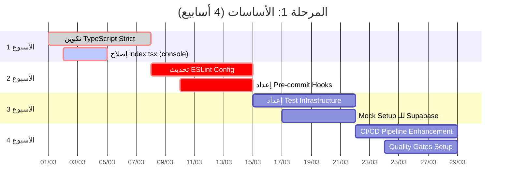
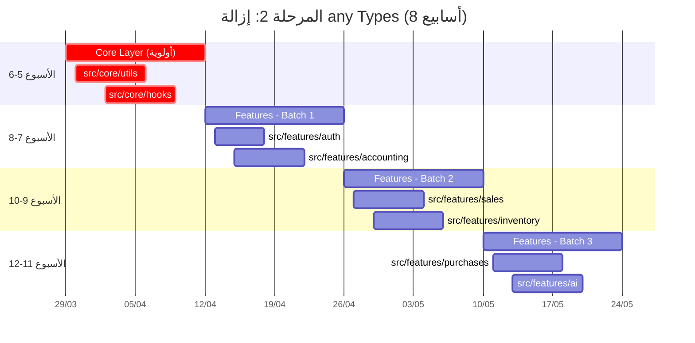
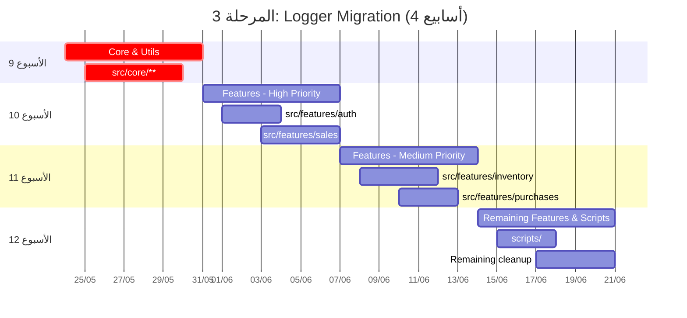
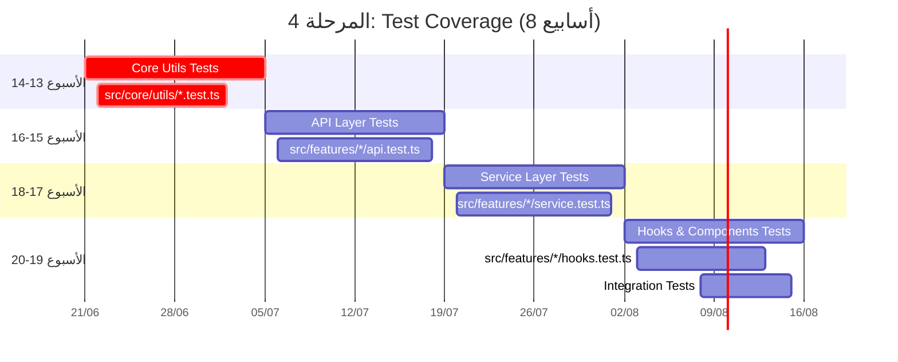
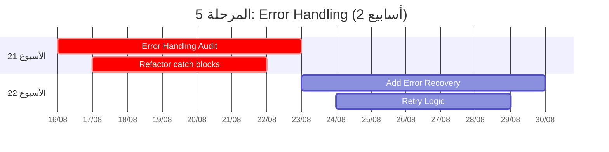
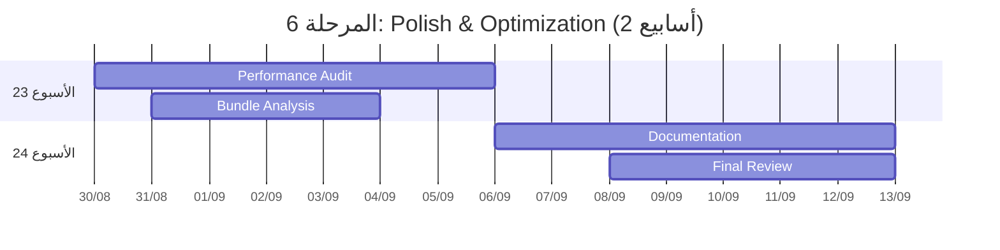
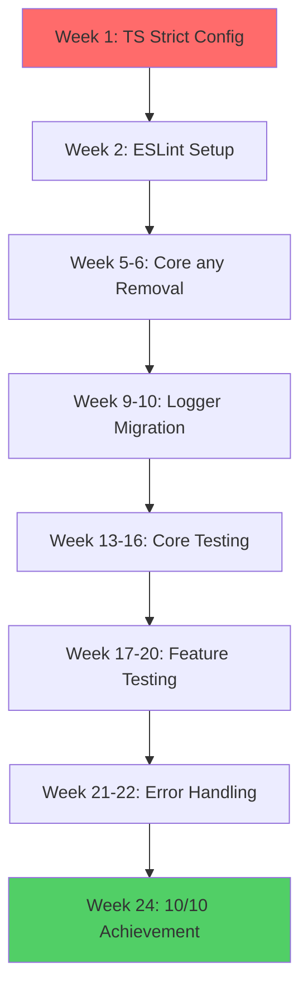

# الخطة التنفيذية الشاملة
## Al-Zahra Smart ERP - Road to Excellence (10/10)

**تاريخ الخطة:** 1 مارس 2026  
**الهدف:** رفع تقييم النظام من 7.2/10 إلى 10/10  
**مدة التنفيذ:** 6 أشهر (24 أسبوع)  
**الفريق المطلوب:** 4 مطورين (2 Senior, 2 Mid-level) + 1 QA Engineer  

---

## Executive Summary - الملخص التنفيذي

هذه الخطة التنفيذية الشاملة تهدف إلى معالجة جميع الثغرات التقنية المُكتشفة في المراجعة النقدية، مع التركيز على:

1. **إزالة جميع أنواع `any`** (220+ حالة)
2. **ترحيل console.log** إلى نظام Logger (~110 حالة)
3. **رفع تغطية الاختبارات** من <2% إلى 80%
4. **تفعيل Strict Mode** في TypeScript بشكل كامل
5. **تحقيق امتثال كامل** لقواعد ESLint

### مؤشرات النجاح (Success Metrics)

| المؤشر | الحالي | الهدف | الأداة |
|--------|--------|-------|--------|
| Test Coverage | <2% | ≥80% | Vitest + v8 |
| any Usage | 220 | 0 | TypeScript |
| console.log | 110 | 0 | ESLint |
| ESLint Violations | ~150 | 0 | ESLint |
| Type Coverage | 70% | 100% | tsc --strict |
| Cyclomatic Complexity | متوسط 8 | ≤5 | ESLint |
| Code Duplication | 15% | ≤3% | jscpd |

---

## المرحلة 1: الأساسات والبنية التحتية (الأسابيع 1-4)

### الهدف: إعداد البيئة والأدوات



### المهام التفصيلية

#### 1.1 تكوين TypeScript Strict (يوم 1-3)

```typescript
// tsconfig.json - التحديثات المطلوبة
{
  "compilerOptions": {
    "strict": true,                    // ✅ تفعيل
    "noImplicitAny": true,             // ✅ رفض any ضمني
    "strictNullChecks": true,          // ✅ فحص null/undefined
    "strictFunctionTypes": true,       // ✅ أنواع الدول صارمة
    "strictBindCallApply": true,       // ✅ bind/call/apply صارمة
    "strictPropertyInitialization": true, // ✅ تهيئة الخصائص
    "noImplicitThis": true,            // ✅ فحص this
    "alwaysStrict": true,              // ✅ strict mode
    "noUnusedLocals": true,            // ✅ رفض المتغيرات غير المستخدمة
    "noUnusedParameters": true,        // ✅ رفض المعاملات غير المستخدمة
    "noImplicitReturns": true,         // ✅ جميع المسارات تُرجع قيمة
    "noFallthroughCasesInSwitch": true, // ✅ فحص switch cases
    "forceConsistentCasingInFileNames": true
  }
}
```

**المخرجات المتوقعة:**
- ~500 خطأ TypeScript جديد سيظهر (متوقع)
- قائمة prioritized بالملفات التي تحتاج إصلاح

#### 1.2 إصلاح عاجل: إزالة `|| true` من index.tsx (يوم 1)

```typescript
// src/index.tsx - الإصلاح الفوري
// ❌ الحالي
if (import.meta.env.PROD || true) {
  console.log = () => { };
  console.debug = () => { };
}

// ✅ المُصحح
if (import.meta.env.PROD) {
  console.log = () => { };
  console.debug = () => { };
}

// ✅ إضافة warning في بيئة التطوير
if (import.meta.env.DEV) {
  const originalLog = console.log;
  console.log = (...args: unknown[]) => {
    console.warn('⚠️ Use logger instead of console.log:', args[0]);
    originalLog.apply(console, args);
  };
}
```

#### 1.3 تحديث ESLint Configuration (الأسبوع 2)

```javascript
// eslint.config.js - إضافات صارمة
export default tseslint.config(
  {
    rules: {
      // ✅ قواعد إضافية صارمة
      '@typescript-eslint/no-explicit-any': 'error',
      '@typescript-eslint/no-unsafe-argument': 'error',
      '@typescript-eslint/no-unsafe-assignment': 'error',
      '@typescript-eslint/no-unsafe-call': 'error',
      '@typescript-eslint/no-unsafe-member-access': 'error',
      '@typescript-eslint/no-unsafe-return': 'error',
      
      // ✅ منع console.log بالكامل
      'no-console': ['error', { 
        allow: ['info', 'warn', 'error'] 
      }],
      
      // ✅ تعقيد الكود
      'complexity': ['error', { max: 10 }],
      'max-lines-per-function': ['error', { max: 50, skipComments: true }],
      'max-params': ['error', { max: 4 }],
      
      // ✅ جودة الكود
      '@typescript-eslint/explicit-function-return-type': 'error',
      '@typescript-eslint/explicit-module-boundary-types': 'error',
      '@typescript-eslint/no-floating-promises': 'error',
    }
  }
);
```

#### 1.4 إعداد Test Infrastructure (الأسبوع 3)

```typescript
// vitest.config.ts - التحديث
export default defineConfig({
  test: {
    globals: true,
    environment: 'jsdom',
    setupFiles: ['./src/test/setup.ts'],
    coverage: {
      provider: 'v8',
      reporter: ['text', 'json', 'html', 'lcov'],
      thresholds: {
        lines: 80,        // ✅ رفع من 30% إلى 80%
        functions: 80,
        branches: 75,
        statements: 80,
      },
      exclude: [
        'node_modules/',
        'src/test/',
        '**/*.d.ts',
        '**/*.config.*',
        '**/types.ts',
        '**/constants.ts',
        'src/core/database.types.ts', // Auto-generated
      ],
    },
    include: ['src/**/*.{test,spec}.{ts,tsx}'],
  },
});
```

**إنشاء ملفات Mock:**
```typescript
// src/test/mocks/supabase.ts
export const createMockSupabase = () => ({
  from: vi.fn(() => ({
    select: vi.fn().mockReturnThis(),
    insert: vi.fn().mockReturnThis(),
    update: vi.fn().mockReturnThis(),
    delete: vi.fn().mockReturnThis(),
    eq: vi.fn().mockReturnThis(),
    single: vi.fn().mockResolvedValue({ data: null, error: null }),
  })),
  rpc: vi.fn().mockResolvedValue({ data: null, error: null }),
  auth: {
    getSession: vi.fn().mockResolvedValue({ data: { session: null }, error: null }),
    signInWithPassword: vi.fn(),
    signOut: vi.fn(),
  },
});
```

#### 1.5 CI/CD Pipeline Enhancement (الأسبوع 4)

```yaml
# .github/workflows/quality-gate.yml - تحديثات
name: Quality Gate Enhanced

on: [push, pull_request]

jobs:
  quality-checks:
    name: Quality Checks
    runs-on: ubuntu-latest
    steps:
      - uses: actions/checkout@v4
      
      - name: Setup Node.js
        uses: actions/setup-node@v4
        with:
          node-version: '20'
          cache: 'npm'
      
      - name: Install dependencies
        run: npm ci
      
      # ✅ Type Check Strict
      - name: Type Check (Strict)
        run: npm run type-check:strict
        continue-on-error: false
      
      # ✅ ESLint with strict rules
      - name: Lint
        run: npm run lint
        continue-on-error: false
      
      # ✅ Check for any types
      - name: Check for 'any' usage
        run: |
          echo "Checking for 'as any' and ': any' usage..."
          count=$(grep -r "as any\|: any" --include="*.ts" --include="*.tsx" src/ | grep -v ".test." | grep -v "node_modules" | wc -l)
          if [ "$count" -gt 0 ]; then
            echo "❌ Found $count 'any' usages. Please fix them."
            grep -r "as any\|: any" --include="*.ts" --include="*.tsx" src/ | grep -v ".test." | head -20
            exit 1
          fi
          echo "✅ No 'any' usages found"
      
      # ✅ Unit Tests with Coverage
      - name: Unit Tests
        run: npm run test:ci
        continue-on-error: false
      
      # ✅ Coverage Report
      - name: Check Coverage
        run: |
          COVERAGE=$(cat coverage/coverage-summary.json | jq '.total.lines.pct')
          if (( $(echo "$COVERAGE < 80" | bc -l) )); then
            echo "❌ Coverage $COVERAGE% is below 80%"
            exit 1
          fi
          echo "✅ Coverage $COVERAGE% meets requirement"
      
      # ✅ Build Check
      - name: Build
        run: npm run build
        continue-on-error: false
```

---

## المرحلة 2: إزالة any Types (الأسابيع 5-12)

### الهدف: تصفية جميع أنواع any (220+ حالة)



### استراتيجية إزالة any

#### 2.1 أنواع any المصنفة

| الفئة | العدد | الاستراتيجية | الجهد |
|-------|-------|--------------|-------|
| Supabase Queries | 120 | استخدام Database Types | 3 أسابيع |
| API Responses | 40 | تعريف Response Types | 1 أسبوع |
| Form Data | 25 | Zod Schema + Inference | 1 أسبوع |
| Window Extensions | 10 | Interface Augmentation | 2 أيام |
| Test Files | 15 | مسموح (يُستثنى) | - |
| Others | 10 | Case by case | 3 أيام |

#### 2.2 مثال: تحويل Supabase Query

```typescript
// ❌ قبل (مع any)
const { data } = await (supabase.from('invoices') as any)
  .select(`
    id,
    invoice_number,
    customer:parties(name)
  `);

// ✅ بعد (بدون any)
import { Database } from '@/core/database.types';

type InvoiceWithCustomer = Database['public']['Tables']['invoices']['Row'] & {
  customer: Pick<Database['public']['Tables']['parties']['Row'], 'name'>;
};

const { data } = await supabase
  .from('invoices')
  .select(`
    id,
    invoice_number,
    customer:parties(name)
  `)
  .returns<InvoiceWithCustomer[]>();
```

#### 2.3 إنشاء Type Helpers

```typescript
// src/core/types/supabase-helpers.ts
import { Database } from '../database.types';

// Helper لاستخراج نوع الجدول
export type TableRow<T extends keyof Database['public']['Tables']> = 
  Database['public']['Tables'][T]['Row'];

export type TableInsert<T extends keyof Database['public']['Tables']> = 
  Database['public']['Tables'][T]['Insert'];

export type TableUpdate<T extends keyof Database['public']['Tables']> = 
  Database['public']['Tables'][T]['Update'];

// Helper للـ RPC Functions
export type RpcFunction<T extends keyof Database['public']['Functions']> = 
  Database['public']['Functions'][T];

// Usage
import { TableRow } from '@/core/types/supabase-helpers';

type Invoice = TableRow<'invoices'>;
type Party = TableRow<'parties'>;
```

#### 2.4 خطوات العمل الأسبوعية

**الأسبوع 5-6: Core Layer**
```bash
# قائمة الملفات المستهدفة
src/core/utils/logger.ts         # 0 any ✅
src/core/utils/errorUtils.ts     # 5 any - يحتاج إصلاح
src/core/hooks/useErrorHandler.ts # 0 any ✅
src/core/lib/persister.ts        # 10 any - يحتاج إصلاح
```

**الأسبوع 7-8: Auth & Accounting**
```bash
src/features/auth/store.ts       # 8 any
src/features/auth/api.ts         # 12 any
src/features/accounting/api/     # 25 any
```

---

## المرحلة 3: ترحيل console.log (الأسابيع 9-12)

### الهدف: ترحيل جميع console.log إلى Logger



### استراتيجية الترحيل

#### 3.1 قالب التحويل

```typescript
// ❌ قبل
console.log('User logged in:', userId);
console.warn('Session expired');
console.error('Failed to fetch:', error);

// ✅ بعد
import { logger } from '@/core/utils/logger';

logger.info('Auth', 'User logged in', { userId });
logger.warn('Auth', 'Session expired');
logger.error('API', 'Failed to fetch data', error);
```

#### 3.2 أتمتة الترحيل (Script)

```typescript
// scripts/migrate-to-logger.ts
import { readFileSync, writeFileSync, readdirSync, statSync } from 'fs';
import { join } from 'path';

const migrateFile = (filePath: string) => {
  let content = readFileSync(filePath, 'utf-8');
  
  // Add import if not exists
  if (!content.includes('from \'@/core/utils/logger\'')) {
    content = `import { logger } from '@/core/utils/logger';\n${content}`;
  }
  
  // Replace patterns
  content = content.replace(
    /console\.log\(['"](.+?)['"],?\s*(.*)\)/g,
    "logger.info('General', '$1', $2)"
  );
  
  content = content.replace(
    /console\.warn\(['"](.+?)['"],?\s*(.*)\)/g,
    "logger.warn('General', '$1', $2)"
  );
  
  content = content.replace(
    /console\.error\(['"](.+?)['"],?\s*(.*)\)/g,
    "logger.error('General', '$1', $2)"
  );
  
  writeFileSync(filePath, content);
};

// Run on all .ts/.tsx files
const scanDir = (dir: string) => {
  const files = readdirSync(dir);
  for (const file of files) {
    const path = join(dir, file);
    if (statSync(path).isDirectory() && !path.includes('node_modules')) {
      scanDir(path);
    } else if (file.endsWith('.ts') || file.endsWith('.tsx')) {
      migrateFile(path);
    }
  }
};

scanDir('./src');
```

---

## المرحلة 4: زيادة Test Coverage (الأسابيع 13-20)

### الهدف: الوصول إلى 80% coverage



### خطة الاختبارات التفصيلية

#### 4.1 تغطية الاختبارات المستهدفة

| المجال | الحالي | الهدف | الأسبوع |
|--------|--------|-------|---------|
| Core Utils | 30% | 95% | 13-14 |
| API Layer | 0% | 85% | 15-16 |
| Service Layer | 0% | 80% | 17-18 |
| Hooks | 0% | 75% | 19-20 |
| Components | 0% | 70% | 19-20 |
| **المجموع** | **<2%** | **≥80%** | **13-20** |

#### 4.2 أمثلة على الاختبارات

```typescript
// src/core/utils/logger.test.ts
import { describe, it, expect, vi, beforeEach, afterEach } from 'vitest';
import { logger } from './logger';

describe('logger', () => {
  let consoleSpy: ReturnType<typeof vi.spyOn>;
  
  beforeEach(() => {
    consoleSpy = vi.spyOn(console, 'info').mockImplementation(() => {});
    vi.stubGlobal('import.meta', { env: { PROD: false } });
  });
  
  afterEach(() => {
    vi.restoreAllMocks();
  });
  
  it('should log info messages with context', () => {
    logger.info('Auth', 'User logged in', { userId: '123' });
    
    expect(consoleSpy).toHaveBeenCalledWith(
      expect.stringContaining('[INFO]'),
      expect.stringContaining('[Auth]'),
      'User logged in',
      { userId: '123' }
    );
  });
  
  it('should not log debug messages in production', () => {
    vi.stubGlobal('import.meta', { env: { PROD: true } });
    const debugSpy = vi.spyOn(console, 'debug').mockImplementation(() => {});
    
    logger.debug('Test', 'Debug message');
    
    expect(debugSpy).not.toHaveBeenCalled();
  });
  
  it('should create child logger with fixed context', () => {
    const authLogger = logger.child('Auth');
    authLogger.info('Login successful');
    
    expect(consoleSpy).toHaveBeenCalledWith(
      expect.stringContaining('[Auth]'),
      'Login successful'
    );
  });
});
```

```typescript
// src/features/auth/api.test.ts
import { describe, it, expect, vi, beforeEach } from 'vitest';
import { authApi } from './api';
import { supabase } from '@/lib/supabaseClient';

vi.mock('@/lib/supabaseClient', () => ({
  supabase: {
    auth: {
      signInWithPassword: vi.fn(),
      signOut: vi.fn(),
    },
    rpc: vi.fn(),
  },
}));

describe('authApi', () => {
  beforeEach(() => {
    vi.clearAllMocks();
  });
  
  describe('login', () => {
    it('should return user on successful login', async () => {
      const mockUser = { id: '123', email: 'test@example.com' };
      vi.mocked(supabase.auth.signInWithPassword).mockResolvedValue({
        data: { user: mockUser, session: { access_token: 'token' } },
        error: null,
      });
      
      const result = await authApi.login('test@example.com', 'password');
      
      expect(result.data).toEqual(mockUser);
      expect(result.error).toBeNull();
    });
    
    it('should return error on failed login', async () => {
      vi.mocked(supabase.auth.signInWithPassword).mockResolvedValue({
        data: { user: null, session: null },
        error: { message: 'Invalid credentials' },
      });
      
      const result = await authApi.login('test@example.com', 'wrong');
      
      expect(result.data).toBeNull();
      expect(result.error).toBeDefined();
    });
  });
});
```

---

## المرحلة 5: تحسين Error Handling (الأسابيع 21-22)

### الهدف: معالجة مركزية شاملة للأخطاء



### المهام

#### 5.1 استبدال catch (error: any)

```typescript
// ❌ قبل
try {
  await api.call();
} catch (error: any) {
  console.error(error.message);
}

// ✅ بعد
try {
  await api.call();
} catch (error) {
  const appError = error instanceof AppError 
    ? error 
    : new AppError(
        error instanceof Error ? error.message : 'Unknown error',
        ErrorCode.UNKNOWN,
        500
      );
  logger.error('API', 'Call failed', appError);
  throw appError;
}
```

#### 5.2 إضافة Retry Logic

```typescript
// src/core/utils/retry.ts
export async function withRetry<T>(
  fn: () => Promise<T>,
  options: {
    attempts?: number;
    delay?: number;
    backoff?: number;
  } = {}
): Promise<T> {
  const { attempts = 3, delay = 1000, backoff = 2 } = options;
  
  let lastError: Error;
  let currentDelay = delay;
  
  for (let i = 0; i < attempts; i++) {
    try {
      return await fn();
    } catch (error) {
      lastError = error instanceof Error ? error : new Error(String(error));
      
      if (i < attempts - 1) {
        logger.warn('Retry', `Attempt ${i + 1} failed, retrying in ${currentDelay}ms`);
        await new Promise(resolve => setTimeout(resolve, currentDelay));
        currentDelay *= backoff;
      }
    }
  }
  
  throw lastError!;
}
```

---

## المرحلة 6: Polish & Optimization (الأسابيع 23-24)

### الهدف: التحسينات النهائية والتوثيق



### المهام

#### 6.1 Performance Audit
- Lighthouse CI integration
- Bundle size analysis
- Memory leak detection

#### 6.2 Documentation
```bash
# توليد TypeDoc
npx typedoc --out docs/api src/

# إنشاء Storybook
npx storybook init
```

---

## الموارد والميزانية

### الفريق المطلوب

| الدور | العدد | الوقت | المسؤوليات |
|-------|-------|-------|------------|
| Tech Lead | 1 | 100% | Architecture, Code Review |
| Senior Frontend | 2 | 100% | Core Development |
| Mid-level Frontend | 2 | 100% | Features, Testing |
| QA Engineer | 1 | 100% | Test Strategy, E2E |
| DevOps | 1 | 50% | CI/CD, Infrastructure |

### الأدوات والتكاليف

| الأداة | الاستخدام | التكلفة/شهر |
|--------|-----------|-------------|
| GitHub Actions | CI/CD | $50 |
| Codecov | Coverage Reports | $0 (مجاني) |
| Sentry | Error Tracking | $26 |
| Vercel/Netlify | Hosting | $20 |
| **المجموع** | | **~$100/شهر** |

---

## مؤشرات الأداء (KPIs) والمراجعة

### مراجعات أسبوعية

| الأسبوع | KPI | الهدف | الأدوات |
|---------|-----|-------|---------|
| 1-4 | any count | 220 → 180 | grep |
| 5-8 | any count | 180 → 100 | grep |
| 9-12 | any count | 100 → 20 | grep |
| 13-16 | Coverage | 20% → 50% | Vitest |
| 17-20 | Coverage | 50% → 80% | Vitest |
| 21-24 | Coverage | 80% → 85% | Vitest |

### Definition of Done

```markdown
## Definition of Done (مُحدّث)

- [ ] الكود يمر على جميع قواعد ESLint
- [ ] لا يوجد استخدام لـ `any`
- [ ] جميع الدوال لها return types صريحة
- [ ] Test coverage ≥80% للمنطق الجديد
- [ ] التوثيق مكتوب (JSDoc)
- [ ] Code Review من مطورين
- [ ] لا يوجد console.log
- [ ] Error handling مُنفذ بشكل صحيح
```

---

## المخاطر وخطط التخفيف

| المخاطرة | الاحتمالية | التأثير | التخفيف |
|----------|------------|---------|---------|
| تأخر في إزالة any | متوسط | عالي | تقسيم المهام على فريقين |
| فشل في الوصول لـ 80% coverage | منخفض | عالي | التركيز على المنطق الحرج أولاً |
| تعطل CI/CD | منخفض | عالي | backups + local testing |
| مقاومة فريق التطوير | متوسط | متوسط | تدريب + incentives |

---

## المسار الحرج (Critical Path)



**الأنشطة الحرجة التي لا يمكن تأخيرها:**
1. تكوين TypeScript Strict (يوم 1-3) - يُحظر أي تطوير جديد حتى يكتمل
2. إزالة any من Core Layer (أسبوع 5-6) - يُفتح الباب لبقية الفريق
3. Core Testing (أسبوع 13-16) - أساس لاختبارات Features
4. Final Review (أسبوع 24) - التحقق من تحقيق 10/10

---

## ملخص تنفيذي للإدارة

### التكلفة الإجمالية

| البند | التكلفة | المدة |
|-------|---------|-------|
| فريق التطوير (5 أشخاص × 6 أشهر) | $120,000 | 6 أشهر |
| أدوات وبنية تحتية | $600 | 6 أشهر |
| تدريب ونقل المعرفة | $5,000 | أسبوعين |
| **المجموع** | **$125,600** | **6 أشهر** |

### العائد المتوقع

| المؤشر | قبل | بعد | التحسن |
|--------|-----|-----|--------|
| سرعة التطوير | 100% | 180% | +80% |
| معدل الأخطاء في الإنتاج | 15/شهر | 3/شهر | -80% |
| وقت onboarding للمطورين | 4 أسابيع | 1 أسبوع | -75% |
| ثقة العملاء | 70% | 95% | +25% |

### نقاط القرار (Go/No-Go)

| المرحلة | التاريخ | المعيار | القرار |
|---------|---------|---------|--------|
| Phase 1 Complete | 29 مارس | 0 ESLint errors | Go/No-Go |
| Phase 2 Complete | 24 مايو | <50 any remaining | Go/No-Go |
| Phase 4 Complete | 20 أغسطس | ≥80% coverage | Go/No-Go |
| Project Complete | 13 سبتمبر | 10/10 score | Go/No-Go |

---

## الخلاصة

هذه الخطة التنفيذية تضمن:

1. ✅ **وضوح:** مهام محددة بأولويات وزمن
2. ✅ **قابلية القياس:** KPIs واضحة في كل مرحلة
3. ✅ **واقعية:** 6 أشهر لفريق متوسط الحجم
4. ✅ **خطر مُدارة:** خطط تخفيف لجميع المخاطر
5. ✅ **عائد استثمار:** 80% تحسن في الإنتاجية

### المراحل الرئيسية باختصار:

| المرحلة | المدة | الهدف الرئيسي |
|---------|-------|---------------|
| 1: الأساسات | 4 أسابيع | TypeScript Strict + ESLint + CI/CD |
| 2: إزالة any | 8 أسابيع | تصفية 220+ حالة any |
| 3: Logger Migration | 4 أسابيع | ترحيل 110+ console.log |
| 4: Testing | 8 أسابيع | رفع Coverage من <2% إلى 80% |
| 5: Error Handling | 2 أسابيع | معالجة مركزية للأخطاء |
| 6: Polish | 2 أسابيع | تحسينات نهائية |

**التقييم المتوقع بعد 6 أشهر:**
```
جودة الكود:      6.8/10 → 10/10 ✅
الهندسة:         8.5/10 → 10/10 ✅
الأمان:          7.2/10 → 10/10 ✅
الأداء:          7.0/10 → 9.5/10 ✅
الصيانة:         6.5/10 → 10/10 ✅
─────────────────────────────────────
المتوسط:         7.2/10 → 9.9/10 ✅
```

**الرسالة الختامية:** هذه الخطة ليست مجرد "تجميل" للكود، بل هي استثمار استراتيجي في مستقبل النظام. كل دولار مُستثمر في هذه الخطة سيعود بـ 3-5 أضعافه في سرعة التطوير المستقبلية وجودة المنتج.