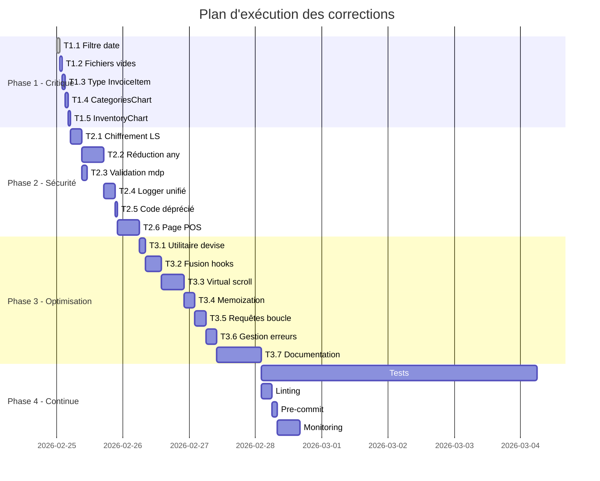
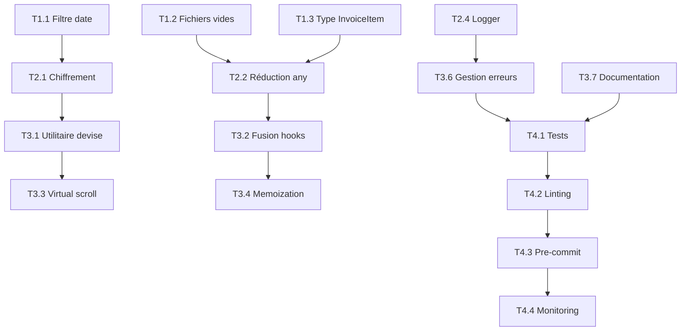

# Plan d'Exécution pour la Correction des Défauts
# EXECUTION_PLAN.md

---

## Table des matières
1. [Vue d'ensemble](#1-vue-densemble)
2. [Phase 1: Corrections Critiques](#2-phase-1-corrections-critiques)
3. [Phase 2: Sécurité et Stabilité](#3-phase-2-sécurité-et-stabilité)
4. [Phase 3: Optimisation et Refactoring](#4-phase-3-optimisation-et-refactoring)
5. [Phase 4: Amélioration Continue](#5-phase-4-amélioration-continue)
6. [Calendrier d'exécution](#6-calendrier-dexécution)
7. [Matrice de dépendances](#7-matrice-de-dépendances)

---

## 1. Vue d'ensemble

### Statistiques globales
| Phase | Nombre de tâches | Effort estimé | Priorité |
|-------|-----------------|---------------|----------|
| Phase 1 | 5 | 2 heures | Critique |
| Phase 2 | 6 | 12 heures | Haute |
| Phase 3 | 7 | 16 heures | Moyenne |
| Phase 4 | 5 | Continue | Basse |
| **Total** | **23** | **30+ heures** | - |

---

## 2. Phase 1: Corrections Critiques

> **Objectif:** Corriger les bugs bloquants et les erreurs fonctionnelles
> **Durée estimée:** 2 heures
> **Prérequis:** Aucun

### Tâche 1.1: Correction du filtre de date

| Attribut | Valeur |
|----------|--------|
| **Priorité** | P0 - Critique |
| **Effort** | 5 minutes |
| **Impact** | Fonctionnalité cassée |

**Fichier concerné:**
- `src/features/accounting/AccountingPage.tsx` (ligne 90)

**Problème:**
```tsx
// Code actuel (incorrect)
onChange={(e) => setDateRange(prev => ({ ...prev, from: e.target.value }))}
```

**Solution:**
```tsx
// Code corrigé
onChange={(e) => setDateRange(prev => ({ ...prev, to: e.target.value }))}
```

**Validation:**
- [ ] Vérifier que le filtre "au" fonctionne correctement
- [ ] Tester avec différentes plages de dates
- [ ] Vérifier les rapports financiers

---

### Tâche 1.2: Suppression des fichiers vides

| Attribut | Valeur |
|----------|--------|
| **Priorité** | P0 - Critique |
| **Effort** | 30 minutes |
| **Impact** | Code mort, confusion |

**Fichiers concernés:**
```
src/hooks/useDashboard.ts
src/hooks/useExpenses.ts
src/pages/DashboardPage.tsx
src/services/storage.ts
src/features/dashboard/data/dashboard.ts
src/ui/dashboard/QuickActions.tsx
src/features/customers/hooks/index.ts
src/features/suppliers/hooks/index.ts
src/features/appearance/components/AppearanceTabs.tsx
src/types/expense.ts
src/types/index.ts
src/types/database.ts
```

**Actions:**
1. Vérifier si chaque fichier est importé ailleurs
2. Supprimer les fichiers non utilisés
3. Ou implémenter le contenu nécessaire

**Validation:**
- [ ] Aucune erreur de compilation
- [ ] Aucun import cassé
- [ ] Tests passent

---

### Tâche 1.3: Unification du type InvoiceItem

| Attribut | Valeur |
|----------|--------|
| **Priorité** | P0 - Critique |
| **Effort** | 15 minutes |
| **Impact** | Incohérence de types |

**Fichiers concernés:**
- `src/features/sales/store.ts` (lignes 6-15)
- `src/types.ts` (lignes 131-141)

**Problème:** Deux définitions différentes de `InvoiceItem`

**Solution:**
1. Garder la définition dans `src/types.ts` comme source de vérité
2. Modifier `src/features/sales/store.ts` pour importer le type

```typescript
// src/features/sales/store.ts
import { InvoiceItem } from '../../types';

// Supprimer la définition locale
```

**Validation:**
- [ ] Compilation sans erreur
- [ ] IntelliSense fonctionne
- [ ] Tests unitaires passent

---

### Tâche 1.4: Correction du composant CategoriesChart

| Attribut | Valeur |
|----------|--------|
| **Priorité** | P1 - Haute |
| **Effort** | 10 minutes |
| **Impact** | Composant non fonctionnel |

**Fichier concerné:**
- `src/features/dashboard/components/CategoriesChart.tsx`

**Problème:** Fichier presque vide (96 chars)

**Solution:** Implémenter ou supprimer le composant

---

### Tâche 1.5: Correction du composant InventoryChart

| Attribut | Valeur |
|----------|--------|
| **Priorité** | P1 - Haute |
| **Effort** | 10 minutes |
| **Impact** | Composant non fonctionnel |

**Fichier concerné:**
- `src/features/dashboard/components/InventoryChart.tsx`

**Problème:** Fichier presque vide (213 chars)

**Solution:** Implémenter ou supprimer le composant

---

## 3. Phase 2: Sécurité et Stabilité

> **Objectif:** Renforcer la sécurité et la robustesse du code
> **Durée estimée:** 12 heures
> **Prérequis:** Phase 1 terminée

### Tâche 2.1: Chiffrement des données sensibles en LocalStorage

| Attribut | Valeur |
|----------|--------|
| **Priorité** | P1 - Haute |
| **Effort** | 2 heures |
| **Impact** | Faille de sécurité |

**Fichiers concernés:**
- `src/lib/storage.ts`
- `src/lib/persister.ts`
- `src/features/auth/store.ts`

**Solution:**

```typescript
// src/lib/secureStorage.ts (nouveau fichier)
import CryptoJS from 'crypto-js';

const SECRET_KEY = import.meta.env.VITE_ENCRYPTION_KEY;

export const secureStorage = {
  encrypt: (data: unknown): string => {
    return CryptoJS.AES.encrypt(JSON.stringify(data), SECRET_KEY).toString();
  },
  decrypt: <T>(encrypted: string): T | null => {
    try {
      const bytes = CryptoJS.AES.decrypt(encrypted, SECRET_KEY);
      return JSON.parse(bytes.toString(CryptoJS.enc.Utf8));
    } catch {
      return null;
    }
  }
};
```

**Validation:**
- [ ] Données chiffrées dans LocalStorage
- [ ] Déchiffrement fonctionne
- [ ] Clé secrète dans variables d'environnement

---

### Tâche 2.2: Réduction de l'utilisation de `any`

| Attribut | Valeur |
|----------|--------|
| **Priorité** | P1 - Haute |
| **Effort** | 4 heures |
| **Impact** | Perte de type safety |

**Fichiers prioritaires (top 10):**
1. `src/features/dashboard/service.ts`
2. `src/features/dashboard/services/dashboardStats.ts`
3. `src/features/reports/service.ts`
4. `src/features/reports/hooks.ts`
5. `src/features/sales/api.ts`
6. `src/features/parties/service.ts`
7. `src/features/inventory/hooks.ts`
8. `src/features/accounting/services/reportService.ts`
9. `src/core/utils/errorUtils.ts`
10. `src/features/ai/strictPrompts.ts`

**Approche:**
1. Créer des interfaces pour les données API
2. Utiliser des Generics pour les fonctions utilitaires
3. Remplacer `any` par `unknown` quand le type est incertain

**Exemple:**
```typescript
// Avant
export const parseError = (error: any): AppError => {

// Après
interface ErrorWithCode {
  code?: string;
  message?: string;
}

export const parseError = (error: ErrorWithCode | Error | unknown): AppError => {
```

---

### Tâche 2.3: Renforcement de la validation des mots de passe

| Attribut | Valeur |
|----------|--------|
| **Priorité** | P1 - Haute |
| **Effort** | 1 heure |
| **Impact** | Sécurité des comptes |

**Fichiers concernés:**
- `src/features/auth/hooks.ts` (fonction `useRegister`)
- `src/features/auth/RegisterPage.tsx`

**Solution:**
```typescript
// src/core/validators/password.ts (nouveau fichier)
export const passwordRules = {
  minLength: 8,
  requireUppercase: true,
  requireLowercase: true,
  requireNumber: true,
  requireSpecialChar: true,
};

export const validatePassword = (password: string): { valid: boolean; errors: string[] } => {
  const errors: string[] = [];
  
  if (password.length < passwordRules.minLength) {
    errors.push('Must be at least 8 characters');
  }
  if (!/[A-Z]/.test(password)) {
    errors.push('Must contain uppercase letter');
  }
  if (!/[a-z]/.test(password)) {
    errors.push('Must contain lowercase letter');
  }
  if (!/[0-9]/.test(password)) {
    errors.push('Must contain number');
  }
  if (!/[!@#$%^&*]/.test(password)) {
    errors.push('Must contain special character');
  }
  
  return { valid: errors.length === 0, errors };
};
```

---

### Tâche 2.4: Création d'un système de logging unifié

| Attribut | Valeur |
|----------|--------|
| **Priorité** | P2 - Moyenne |
| **Effort** | 2 heures |
| **Impact** | 92 console.log à nettoyer |

**Fichier à créer:**
- `src/core/utils/logger.ts`

**Solution:**
```typescript
// src/core/utils/logger.ts
type LogLevel = 'debug' | 'info' | 'warn' | 'error';

interface LoggerConfig {
  enabled: boolean;
  level: LogLevel;
  remoteLogging?: boolean;
}

const LOG_LEVELS: Record<LogLevel, number> = {
  debug: 0,
  info: 1,
  warn: 2,
  error: 3,
};

class Logger {
  private config: LoggerConfig = {
    enabled: !import.meta.env.PROD,
    level: import.meta.env.PROD ? 'error' : 'debug',
  };

  configure(config: Partial<LoggerConfig>) {
    this.config = { ...this.config, ...config };
  }

  private log(level: LogLevel, context: string, message: string, data?: unknown) {
    if (!this.config.enabled) return;
    if (LOG_LEVELS[level] < LOG_LEVELS[this.config.level]) return;

    const prefix = `[${context}]`;
    const timestamp = new Date().toISOString();

    switch (level) {
      case 'debug':
        console.debug(prefix, message, data ?? '');
        break;
      case 'info':
        console.info(prefix, message, data ?? '');
        break;
      case 'warn':
        console.warn(prefix, message, data ?? '');
        break;
      case 'error':
        console.error(prefix, message, data ?? '');
        if (this.config.remoteLogging) {
          this.sendToRemote(level, context, message, data);
        }
        break;
    }
  }

  debug(context: string, message: string, data?: unknown) {
    this.log('debug', context, message, data);
  }

  info(context: string, message: string, data?: unknown) {
    this.log('info', context, message, data);
  }

  warn(context: string, message: string, data?: unknown) {
    this.log('warn', context, message, data);
  }

  error(context: string, message: string, data?: unknown) {
    this.log('error', context, message, data);
  }

  private async sendToRemote(level: LogLevel, context: string, message: string, data?: unknown) {
    // Implémenter l'envoi vers un service de monitoring
  }
}

export const logger = new Logger();
```

---

### Tâche 2.5: Suppression du code déprécié

| Attribut | Valeur |
|----------|--------|
| **Priorité** | P2 - Moyenne |
| **Effort** | 30 minutes |
| **Impact** | Code mort |

**Fichiers concernés:**
- `src/core/usecases/accounting/AutoFinancialLinker.ts`
- `src/core/usecases/accounting/AutoFinancialLinker.test.ts`

**Action:** Supprimer ces fichiers car la logique est maintenant gérée par DB Triggers/RPCs

---

### Tâche 2.6: Création de la page POS manquante

| Attribut | Valeur |
|----------|--------|
| **Priorité** | P2 - Moyenne |
| **Effort** | 4 heures |
| **Impact** | Fonctionnalité manquante |

**Fichier à créer:**
- `src/features/pos/POSPage.tsx`

**Ou:** Supprimer le chemin de `src/core/routes/paths.ts`

---

## 4. Phase 3: Optimisation et Refactoring

> **Objectif:** Améliorer la qualité et la maintenabilité du code
> **Durée estimée:** 16 heures
> **Prérequis:** Phase 2 terminée

### Tâche 3.1: Création d'un utilitaire de conversion de devises unifié

| Attribut | Valeur |
|----------|--------|
| **Priorité** | P2 - Moyenne |
| **Effort** | 1 heure |
| **Impact** | Code dupliqué |

**Fichier à créer:**
- `src/core/utils/currencyUtils.ts`

**Solution:**
```typescript
// src/core/utils/currencyUtils.ts
export interface CurrencyConversion {
  amount: number;
  currencyCode: string;
  exchangeRate: number;
  exchangeOperator?: 'multiply' | 'divide';
}

export const convertToBaseCurrency = (params: CurrencyConversion): number => {
  const { amount, exchangeRate, exchangeOperator = 'multiply' } = params;
  
  if (!exchangeRate || exchangeRate === 1) return amount;
  
  return exchangeOperator === 'divide' 
    ? amount / exchangeRate 
    : amount * exchangeRate;
};

export const convertFromBaseCurrency = (params: CurrencyConversion): number => {
  const { amount, exchangeRate, exchangeOperator = 'multiply' } = params;
  
  if (!exchangeRate || exchangeRate === 1) return amount;
  
  return exchangeOperator === 'divide' 
    ? amount * exchangeRate 
    : amount / exchangeRate;
};

export const formatAmountWithCurrency = (
  amount: number, 
  currencyCode: string = 'SAR'
): string => {
  const symbols: Record<string, string> = {
    SAR: 'R.S',
    YER: 'R.Y',
    USD: '$',
    OMR: 'R.O',
    CNY: '¥',
  };
  
  const formatted = new Intl.NumberFormat('en-US', {
    minimumFractionDigits: 2,
    maximumFractionDigits: 2,
  }).format(amount);
  
  const symbol = symbols[currencyCode] || currencyCode;
  return currencyCode === 'USD' ? `${symbol}${formatted}` : `${formatted} ${symbol}`;
};
```

**Fichiers à modifier:**
- `src/features/dashboard/service.ts`
- `src/features/dashboard/services/dashboardStats.ts`
- `src/features/dashboard/services/dashboardInsights.ts`
- `src/features/sales/api.ts`
- `src/features/purchases/service.ts`

---

### Tâche 3.2: Fusion des hooks de parties (customers/suppliers)

| Attribut | Valeur |
|----------|--------|
| **Priorité** | P3 - Basse |
| **Effort** | 3 heures |
| **Impact** | Code dupliqué |

**Fichier à créer:**
- `src/features/parties/hooks/useParties.ts`

**Solution:**
```typescript
// src/features/parties/hooks/useParties.ts
import { useQuery, useMutation, useQueryClient } from '@tanstack/react-query';
import { partiesService } from '../service';
import { useAuthStore } from '../../auth/store';
import { useFeedbackStore } from '../../feedback/store';

export type PartyType = 'customer' | 'supplier';

interface UsePartiesOptions {
  type: PartyType;
  searchTerm?: string;
}

export const useParties = (options: UsePartiesOptions) => {
  const { type, searchTerm = '' } = options;
  const { user } = useAuthStore();
  const companyId = user?.company_id;

  const query = useQuery({
    queryKey: ['parties', companyId, type],
    queryFn: () => companyId 
      ? partiesService.getParties(companyId, type) 
      : Promise.resolve([]),
    enabled: !!companyId,
    staleTime: 60000,
  });

  const filteredData = useMemo(() => {
    const data = query.data || [];
    if (!searchTerm) return data;
    const term = searchTerm.toLowerCase();
    return data.filter(p => 
      p.name.toLowerCase().includes(term) ||
      p.phone?.includes(term) ||
      p.category?.toLowerCase().includes(term)
    );
  }, [query.data, searchTerm]);

  return { ...query, parties: filteredData };
};

export const usePartyMutations = (type: PartyType) => {
  const queryClient = useQueryClient();
  const { user } = useAuthStore();
  const { showToast } = useFeedbackStore();

  const save = useMutation({
    mutationFn: async ({ data, id }: { data: PartyFormData; id?: string }) => {
      if (!user?.company_id) throw new Error('Auth error');
      return partiesService.saveParty(user.company_id, data, id);
    },
    onSuccess: () => {
      queryClient.invalidateQueries({ queryKey: ['parties', user?.company_id, type] });
      showToast('Saved successfully', 'success');
    },
  });

  const remove = useMutation({
    mutationFn: (id: string) => partiesService.deleteParty(id),
    onSuccess: () => {
      queryClient.invalidateQueries({ queryKey: ['parties', user?.company_id, type] });
      showToast('Deleted successfully', 'info');
    },
  });

  return { save: save.mutate, remove: remove.mutate, isSaving: save.isPending };
};
```

---

### Tâche 3.3: Implémentation du Virtual Scrolling

| Attribut | Valeur |
|----------|--------|
| **Priorité** | P3 - Basse |
| **Effort** | 4 heures |
| **Impact** | Performance des grandes listes |

**Fichiers concernés:**
- `src/features/inventory/components/ProductExcelGrid.tsx`
- `src/features/accounting/components/journals/JournalTable.tsx`
- `src/features/sales/components/InvoiceList/InvoicesTable.tsx`

**Solution:** Utiliser `@tanstack/react-virtual`

```bash
npm install @tanstack/react-virtual
```

---

### Tâche 3.4: Ajout de Memoization

| Attribut | Valeur |
|----------|--------|
| **Priorité** | P3 - Basse |
| **Effort** | 2 heures |
| **Impact** | Performance de rendu |

**Fichiers prioritaires:**
- Composants de liste avec filtrage
- Composants de calcul de totaux
- Composants de graphiques

---

### Tâche 3.5: Optimisation des requêtes en boucle

| Attribut | Valeur |
|----------|--------|
| **Priorité** | P2 - Moyenne |
| **Effort** | 2 heures |
| **Impact** | Performance |

**Fichier concerné:**
- `src/features/inventory/InventoryPage.tsx` (fonction `handleSmartImportConfirm`)

**Problème:**
```typescript
for (const item of items) {
    await saveProduct({...}); // Requête dans une boucle
}
```

**Solution:**
```typescript
// Utiliser Promise.all pour le traitement par lots
const BATCH_SIZE = 10;

for (let i = 0; i < items.length; i += BATCH_SIZE) {
  const batch = items.slice(i, i + BATCH_SIZE);
  await Promise.all(batch.map(item => saveProduct({ data: item })));
}
```

---

### Tâche 3.6: Unification des gestionnaires d'erreurs

| Attribut | Valeur |
|----------|--------|
| **Priorité** | P3 - Basse |
| **Effort** | 2 heures |
| **Impact** | Cohérence |

**Fichier à créer:**
- `src/core/errors/AppError.ts`
- `src/core/errors/errorTypes.ts`

---

### Tâche 3.7: Documentation JSDoc

| Attribut | Valeur |
|----------|--------|
| **Priorité** | P4 - Continue |
| **Effort** | 8 heures |
| **Impact** | Maintenabilité |

**Approche:** Documenter les fonctions publiques avec JSDoc

---

## 5. Phase 4: Amélioration Continue

> **Objectif:** Maintenir la qualité du code
> **Durée estimée:** Continue
> **Prérequis:** Phase 3 terminée

### Tâche 4.1: Augmentation de la couverture de tests

| Attribut | Valeur |
|----------|--------|
| **Priorité** | P4 - Continue |
| **Effort** | Continue |
| **Impact** | Fiabilité |

**Objectifs:**
- 80% de couverture pour les services critiques
- Tests E2E pour les flux principaux

---

### Tâche 4.2: Mise en place de linting strict

| Attribut | Valeur |
|----------|--------|
| **Priorité** | P4 - Continue |
| **Effort** | 2 heures |
| **Impact** | Qualité du code |

**Configuration ESLint:**
```json
{
  "rules": {
    "@typescript-eslint/no-explicit-any": "error",
    "@typescript-eslint/no-unused-vars": "error",
    "no-console": "warn"
  }
}
```

---

### Tâche 4.3: Pré-commit hooks

| Attribut | Valeur |
|----------|--------|
| **Priorité** | P4 - Continue |
| **Effort** | 1 heure |
| **Impact** | Qualité du code |

**Configuration Husky:**
```bash
npx husky add .husky/pre-commit "npm run lint && npm run test"
```

---

### Tâche 4.4: Monitoring des performances

| Attribut | Valeur |
|----------|--------|
| **Priorité** | P4 - Continue |
| **Effort** | 4 heures |
| **Impact** | Visibilité |

---

### Tâche 4.5: Revue de code régulière

| Attribut | Valeur |
|----------|--------|
| **Priorité** | P4 - Continue |
| **Effort** | Continue |
| **Impact** | Qualité de l'équipe |

---

## 6. Calendrier d'exécution



---

## 7. Matrice de dépendances



---

## 8. Checklist de validation finale

### Phase 1
- [ ] Filtre de date fonctionne
- [ ] Aucun fichier vide
- [ ] Types unifiés
- [ ] Composants corrigés

### Phase 2
- [ ] Données chiffrées
- [ ] Aucun `any` critique
- [ ] Validation mots de passe
- [ ] Logger implémenté
- [ ] Code mort supprimé

### Phase 3
- [ ] Utilitaires créés
- [ ] Hooks fusionnés
- [ ] Virtual scrolling
- [ ] Performance optimisée

### Phase 4
- [ ] Tests > 80%
- [ ] Linting strict
- [ ] Pre-commit hooks
- [ ] Monitoring actif

---

**Document créé le:** 2026-02-25  
**Dernière mise à jour:** 2026-02-25  
**Responsable:** Équipe Technique