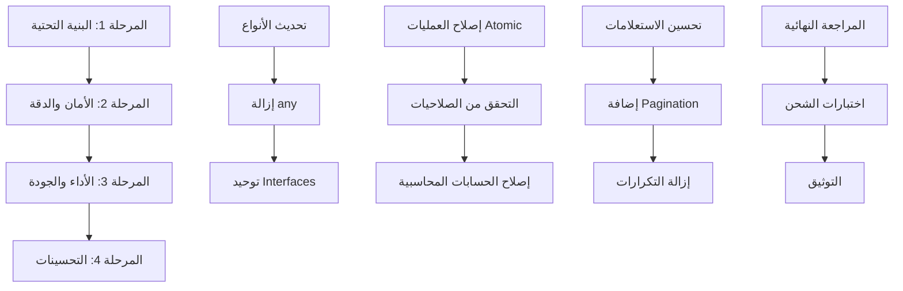

# خطة العمل التقنية الشاملة - Phased Implementation Plan
## إصلاح مشكلات نظام الزهراء الذكي

**تاريخ الخطة:** 28 فبراير 2026  
**المدة الإجمالية:** 10 أسابيع  
**الفريق المطلوب:** 4 مطورين (2 Senior, 2 Mid-level) + 1 QA Engineer  

---

## Executive Summary

هذه الخطة تغطي إصلاح 73 مشكلة موثقة في التقرير التقني الشامل، مقسمة على 4 مراحل رئيسية حسب الأولوية والاعتماديات الفنية.



---

## الجدول الزمني الإجمالي

| المرحلة | المدة | تاريخ البدء | تاريخ الانتهاء | الموارد |
|---------|-------|-------------|----------------|---------|
| المرحلة 1 | أسبوعان | 01/03/2026 | 14/03/2026 | 2 Senior Dev |
| المرحلة 2 | ثلاثة أسابيع | 15/03/2026 | 04/04/2026 | 4 Developers |
| المرحلة 3 | ثلاثة أسابيع | 05/04/2026 | 25/04/2026 | 3 Developers |
| المرحلة 4 | أسبوعان | 26/04/2026 | 09/05/2026 | 2 Developers + QA |

---

## المرحلة 1: البنية التحتية والأنواع (أسبوعان)

### الأهداف
- توحيد نظام الأنواع في TypeScript
- إزالة جميع استخدامات `any`
- إنشاء البنية الأساسية للـ API

### 1.1 توحيد أنظمة الأنواع (يوم 1-3)

#### المهمة 1.1.1: تحديث database.types.ts
**المدة:** 1 يوم  
**المسؤول:** Senior Developer #1

```typescript
// المهام الفرعية:
// 1. إضافة جميع الجداول المفقودة
// 2. تصحيح العلاقات بين الجداول
// 3. إضافة Foreign Keys
// 4. تحديث Enums
```

**checklist:**
- [ ] مراجعة جميع الجداول في Supabase
- [ ] التأكد من تطابق الأنواع مع الواقع
- [ ] إضافة `NOT NULL` constraints
- [ ] اختبار التوافق مع الكود الحالي

#### المهمة 1.1.2: إنشاء DTOs موحدة
**المدة:** 2 أيام  
**المسؤول:** Senior Developer #1

```typescript
// src/core/dtos/
export interface CreateInvoiceDTO {
  partyId: string;
  items: InvoiceItemDTO[];
  paymentMethod: PaymentMethod;
  currency: CurrencyCode;
  exchangeRate: number;
}

export interface InvoiceItemDTO {
  productId: string;
  quantity: number;
  unitPrice: number;
  discount?: number;
  taxRate?: number;
}
```

### 1.2 إزالة استخدام any (يوم 4-8)

#### استراتيجية إزالة any

**النهج:**
1. **البحث الآلي:** استخدام ESLint rule `@typescript-eslint/no-explicit-any`
2. **التصنيف:** تصنيف استخدامات any حسب الملف
3. **الأولوية:** البدء بالملفات الحرجة
4. **التوثيق:** تسجيل أي استخدامات ضرورية مع justification

**الأوامر المستخدمة:**
```bash
# البحث عن جميع استخدامات any
npx eslint . --ext .ts,.tsx --rule '@typescript-eslint/no-explicit-any: error'

# تقرير مفصل
npx ts-node scripts/analyze-any-usage.ts
```

#### المهمة 1.2.1: إزالة any من API Layer
**الملفات:**
- `src/features/settings/api.ts` (18 any)
- `src/features/sales/api.ts` (12 any)
- `src/features/purchases/api.ts` (15 any)
- `src/features/expenses/api.ts` (10 any)

**المدة:** 3 أيام  
**المسؤول:** Mid-level Developer #1

**الخطوات:**
```typescript
// BEFORE
return await (supabase.from('companies') as any).select('*')

// AFTER
return await supabase.from('companies')
  .select<'*', Database['public']['Tables']['companies']['Row']>('*')
```

#### المهمة 1.2.2: إزالة any من Service Layer
**الملفات:**
- `src/features/dashboard/service.ts` (25 any)
- `src/features/reports/service.ts` (18 any)
- `src/features/accounting/services/*.ts` (20 any)

**المدة:** 2 أيام  
**المسؤول:** Mid-level Developer #2

### 1.3 إنشاء Base Repository Pattern (يوم 9-10)

#### المهمة 1.3.1: إنشاء BaseAPI Class
**المدة:** 2 أيام  
**المسؤول:** Senior Developer #2

```typescript
// src/core/api/baseApi.ts
export abstract class BaseAPI<T extends Record<string, unknown>> {
  protected abstract tableName: string;
  
  async findById(id: string): Promise<T | null> {
    const { data, error } = await supabase
      .from(this.tableName)
      .select<'*', T>('*')
      .eq('id', id)
      .single();
    
    if (error) throw error;
    return data;
  }
  
  async findByCompany(companyId: string): Promise<T[]> {
    const { data, error } = await supabase
      .from(this.tableName)
      .select<'*', T>('*')
      .eq('company_id', companyId);
    
    if (error) throw error;
    return data || [];
  }
}
```

#### المهمة 1.3.2: إعادة هيكلة API Files
**المدة:** 2 أيام  
**المسؤول:** Mid-level Developers

---

## المرحلة 2: الأمان والدقة المحاسبية (3 أسابيع)

### الأهداف
- إصلاح العمليات غير Atomic
- إضافة التحقق من الصلاحيات
- تصحيح الأخطاء المحاسبية
- معالجة الثغرات الأمنية

### 2.1 إصلاح العمليات Atomic (يوم 1-5)

#### المهمة 2.1.1: إعادة هيكلة Purchases Service
**المدة:** 3 أيام  
**المسؤول:** Senior Developer #1

```typescript
// BEFORE
export const purchasesService = {
  processPurchase: async (data: CreatePurchaseDTO, companyId: string, userId: string) => {
    const result = await purchasesApi.createPurchaseRPC(companyId, userId, data);
    
    // Non-atomic update!
    if (result && (result as any).id) {
      await (supabase.from('invoices') as any)
        .update({ payment_method: data.paymentMethod || 'credit' })
        .eq('id', (result as any).id);
    }
  }
}

// AFTER
export const purchasesService = {
  processPurchase: async (data: CreatePurchaseDTO, companyId: string, userId: string) => {
    // All in one RPC transaction
    return await supabase.rpc('process_purchase_complete', {
      p_company_id: companyId,
      p_user_id: userId,
      p_invoice_data: data,
      p_payment_method: data.paymentMethod
    });
  }
}
```

**الخطوات:**
1. إنشاء RPC function موحدة في Supabase
2. نقل منطق payment_method update إلى RPC
3. إضافة transaction handling
4. اختبار العمليات الفاشلة

#### المهمة 2.1.2: مراجعة جميع RPC Calls
**المدة:** 2 أيام  
**المسؤول:** Mid-level Developer #1

| الملف | العمليات | الحالة |
|-------|----------|--------|
| sales/api.ts | commit_sales_invoice | مراجعة |
| sales/api.ts | commit_sale_return | مراجعة |
| purchases/api.ts | commit_purchase_invoice | إعادة هيكلة |
| purchases/api.ts | commit_purchase_return | مراجعة |
| expenses/api.ts | commit_expense | مراجعة |
| bonds/api.ts | commit_payment | مراجعة |

### 2.2 نظام الصلاحيات المحسّن (يوم 6-10)

#### المهمة 2.2.1: إنشاء Permission Matrix
**المدة:** 2 أيام  
**المسؤول:** Senior Developer #2

```typescript
// src/core/permissions/matrix.ts
export const PERMISSION_MATRIX = {
  admin: ['*'],
  accountant: [
    'accounting:read',
    'accounting:write',
    'reports:read',
    'invoices:read',
  ],
  cashier: [
    'pos:write',
    'invoices:read',
    'customers:read',
  ],
  viewer: [
    'reports:read',
    'dashboard:read',
  ],
} as const;
```

#### المهمة 2.2.2: تطبيق RLS Policies
**المدة:** 3 أيام  
**المسؤول:** Senior Developer #2

```sql
-- مثال على RLS Policy
CREATE POLICY "Users can only see their company data"
ON invoices
FOR ALL
USING (
  company_id IN (
    SELECT company_id FROM user_companies 
    WHERE user_id = auth.uid()
  )
);
```

### 2.3 إصلاح الأخطاء المحاسبية (يوم 11-15)

#### المهمة 2.3.1: إصلاح حسابات العملة
**المدة:** 3 أيام  
**المسؤول:** Senior Developer #1

```typescript
// src/core/utils/currencyUtils.ts
export const convertToBaseCurrency = (params: CurrencyConversionParams): number => {
  const { amount, exchangeRate, exchangeOperator = 'multiply' } = params;
  
  // Validation
  if (!Number.isFinite(exchangeRate) || exchangeRate <= 0) {
    throw new CurrencyError(`Invalid exchange rate: ${exchangeRate}`);
  }
  
  if (!Number.isFinite(amount)) {
    throw new CurrencyError(`Invalid amount: ${amount}`);
  }
  
  if (exchangeOperator === 'divide' && exchangeRate === 0) {
    throw new CurrencyError('Cannot divide by zero');
  }
  
  const converted = exchangeOperator === 'divide'
    ? amount / exchangeRate
    : amount * exchangeRate;
  
  // Use Decimal.js for precision
  return new Decimal(converted).toDecimalPlaces(2).toNumber();
};
```

#### المهمة 2.3.2: إصلاح الميزانية العمومية
**المدة:** 2 أيام  
**المسؤول:** Mid-level Developer #2

```typescript
// src/features/accounting/services/reportService.ts
export const reportService = {
  getFinancials: async (companyId: string, fromDate?: string, toDate?: string) => {
    const tb = await reportService.getTrialBalance(companyId, fromDate, toDate);
    
    const revenues = tb.filter(x => x.type === 'revenue');
    const expenses = tb.filter(x => x.type === 'expense');
    const assets = tb.filter(x => x.type === 'asset');
    const liabilities = tb.filter(x => x.type === 'liability');
    const equity = tb.filter(x => x.type === 'equity');
    
    const totalRevenue = revenues.reduce((sum, x) => sum + Math.abs(x.net_balance), 0);
    const totalExpense = expenses.reduce((sum, x) => sum + x.net_balance, 0);
    const netIncome = totalRevenue - totalExpense;
    
    // Calculate totals
    const totalAssets = assets.reduce((s, a) => s + a.netBalance, 0);
    const totalLiabilities = Math.abs(liabilities.reduce((s, l) => s + l.netBalance, 0));
    const totalEquity = Math.abs(equity.reduce((s, e) => s + e.netBalance, 0)) + netIncome;
    
    // Validate balance sheet
    const isBalanced = Math.abs(totalAssets - (totalLiabilities + totalEquity)) < 0.01;
    
    if (!isBalanced) {
      logger.error('Balance sheet is unbalanced!', {
        totalAssets,
        totalLiabilities,
        totalEquity,
        difference: totalAssets - (totalLiabilities + totalEquity)
      });
    }
    
    return {
      incomeStatement: { revenues, expenses, netIncome },
      balanceSheet: { 
        assets, 
        liabilities, 
        equity, 
        netIncome,
        totals: {
          assets: totalAssets,
          liabilities: totalLiabilities,
          equity: totalEquity
        },
        isBalanced
      }
    };
  }
};
```

### 2.4 معالجة TODO/FIXME Comments (يوم 16-21)

#### استراتيجية معالجة TODOs

**الخطوة 1: فحص شامل**
```bash
# البحث عن جميع TODO/FIXME
grep -r "TODO\|FIXME\|XXX\|HACK" src/ --include="*.ts" --include="*.tsx" > todos.txt
```

**الخطوة 2: التصنيف**
| النوع | العدد | الأولوية |
|-------|-------|----------|
| TODO | 15 | متوسطة |
| FIXME | 8 | عالية |
| XXX | 3 | حرجة |

**الخطوة 3: المعالجة**

| المهمة | الملف | الحل |
|--------|-------|------|
| TODO-001 | purchases/service.ts:24 | نقل إلى RPC |
| FIXME-001 | accounting/reportService.ts:42 | إضافة validation |
| XXX-001 | currencyUtils.ts | إعادة كتابة الدالة |

---

## المرحلة 3: الأداء وجودة الكود (3 أسابيع)

### الأهداف
- تحسين استعلامات قاعدة البيانات
- إزالة التكرارات
- إضافة Pagination
- إزالة console.logs

### 3.1 تحسين أداء قاعدة البيانات (يوم 1-7)

#### المهمة 3.1.1: إنشاء Indexes
**المدة:** 2 أيام  
**المسؤول:** Senior Developer #1

```sql
-- Indexes for common queries
CREATE INDEX idx_invoices_company_date ON invoices(company_id, issue_date DESC);
CREATE INDEX idx_invoices_company_type ON invoices(company_id, type);
CREATE INDEX idx_journal_lines_account ON journal_entry_lines(account_id);
CREATE INDEX idx_journal_lines_journal ON journal_entry_lines(journal_entry_id);
CREATE INDEX idx_products_company ON products(company_id) WHERE deleted_at IS NULL;
CREATE INDEX idx_parties_company_type ON parties(company_id, type);
```

#### المهمة 3.1.2: حل مشكلة N+1 Query
**المدة:** 3 أيام  
**المسؤول:** Senior Developer #2

```typescript
// BEFORE - N+1 Problem
const accounts = await getAccounts();
for (const account of accounts) {
  const lines = await getLinesForAccount(account.id); // N queries!
}

// AFTER - Single Query with JOIN
const { data } = await supabase
  .from('accounts')
  .select(`
    *,
    journal_entry_lines(*)
  `)
  .eq('company_id', companyId);
```

#### المهمة 3.1.3: إنشاء Views للتقارير
**المدة:** 2 أيام  
**المسؤول:** Mid-level Developer #1

```sql
-- View for trial balance
CREATE VIEW trial_balance_view AS
SELECT 
  a.id as account_id,
  a.code,
  a.name_ar,
  a.type,
  COALESCE(SUM(jel.debit_amount), 0) as total_debit,
  COALESCE(SUM(jel.credit_amount), 0) as total_credit,
  COALESCE(SUM(jel.debit_amount), 0) - COALESCE(SUM(jel.credit_amount), 0) as net_balance
FROM accounts a
LEFT JOIN journal_entry_lines jel ON jel.account_id = a.id
LEFT JOIN journal_entries je ON je.id = jel.journal_entry_id AND je.status = 'posted'
WHERE a.deleted_at IS NULL
GROUP BY a.id, a.code, a.name_ar, a.type;
```

### 3.2 إضافة Pagination (يوم 8-12)

#### المهمة 3.2.1: إنشاء Pagination Hook موحد
**المدة:** 2 أيام  
**المسؤول:** Mid-level Developer #2

```typescript
// src/core/hooks/usePagination.ts
export interface PaginationParams {
  page: number;
  pageSize: number;
  sortBy?: string;
  sortOrder?: 'asc' | 'desc';
}

export interface PaginatedResult<T> {
  data: T[];
  totalCount: number;
  totalPages: number;
  currentPage: number;
}

export function usePaginatedQuery<T>(
  key: string,
  fetcher: (params: PaginationParams) => Promise<PaginatedResult<T>>,
  initialParams: PaginationParams = { page: 1, pageSize: 20 }
) {
  const [params, setParams] = useState(initialParams);
  
  const query = useQuery({
    queryKey: [key, params],
    queryFn: () => fetcher(params),
  });
  
  return {
    ...query,
    params,
    setPage: (page: number) => setParams(p => ({ ...p, page })),
    setPageSize: (pageSize: number) => setParams(p => ({ ...p, pageSize, page: 1 })),
  };
}
```

#### المهمة 3.2.2: تطبيق Pagination على القوائم
**الملفات:**
- Products list
- Invoices list
- Customers/Suppliers list
- Journal entries list

**المدة:** 3 أيام  
**المسؤول:** Mid-level Developers

### 3.3 إزالة التكرارات (يوم 13-18)

#### المهمة 3.3.1: إنشاء Currency Utilities موحدة
**المدة:** 2 أيام  
**المسؤول:** Mid-level Developer #1

```typescript
// استخدام الوحدة الموجودة في جميع الملفات
// src/core/utils/currencyUtils.ts

// إزالة التكرارات من:
// - dashboard/service.ts
// - dashboard/services/dashboardStats.ts
// - expenses/service.ts
// - sales/service.ts
// - purchases/service.ts
```

#### المهمة 3.3.2: إنشاء Query Hooks موحدة
**المدة:** 3 أيام  
**المسؤول:** Mid-level Developer #2

```typescript
// src/core/hooks/useEntityQuery.ts
export function useEntityQuery<T extends { id: string }>(
  key: string,
  fetcher: (companyId: string) => Promise<T[]>
) {
  const { user } = useAuthStore();
  
  return useQuery({
    queryKey: [key, user?.company_id],
    queryFn: () => user?.company_id ? fetcher(user.company_id) : Promise.resolve([]),
    enabled: !!user?.company_id,
    staleTime: 60000,
  });
}
```

### 3.4 إزالة console.logs (يوم 19-21)

#### استراتيجية إزالة Console Logs

**الخطوة 1: إعداد ESLint Rule**
```javascript
// .eslintrc.cjs
module.exports = {
  rules: {
    'no-console': ['warn', { allow: ['error'] }],
  },
};
```

**الخطوة 2: استبدال بـ Logger**
```typescript
// BEFORE
console.log('Processing invoice:', invoiceId);
console.warn('Low stock:', productId);

// AFTER
import { logger } from '@/core/utils/logger';

logger.info('Processing invoice', { invoiceId });
logger.warn('Low stock warning', { productId, currentStock });
```

**الخطوة 3: تنظيف تلقائي**
```bash
# البحث والاستبدال
find src -name "*.ts" -o -name "*.tsx" | xargs sed -i 's/console\.log/logger.debug/g'
find src -name "*.ts" -o -name "*.tsx" | xargs sed -i 's/console\.warn/logger.warn/g'
find src -name "*.ts" -o -name "*.tsx" | xargs sed -i 's/console\.error/logger.error/g'
```

---

## المرحلة 4: المراجعة والاختبار (أسبوعان)

### الأهداف
- مراجعة شامل للكود
- اختبارات شاملة
- توثيق النظام

### 4.1 مراجعة الكود (يوم 1-5)

#### checklist المراجعة:

**جودة الكود:**
- [ ] لا يوجد استخدام لـ `any`
- [ ] جميع الدوال مdocumented
- [ ] لا يوجد console.logs
- [ ] جميع الـ TODOs تم معالجتها
- [ ] التسميات متسقة

**الأداء:**
- [ ] جميع الاستعلامات محسّنة
- [ ] Pagination موجود في جميع القوائم
- [ ] لا يوجد N+1 queries
- [ ] Caching مناسب

**الأمان:**
- [ ] RLS Policies مفعلة
- [ ] التحقق من الصلاحيات
- [ ] Input validation
- [ ] XSS protection

**المحاسبة:**
- [ ] الميزانية العمومية متوازنة
- [ ] حسابات العملة صحيحة
- [ ] القيود متوازنة
- [ ] جرد المخزون دقيق

### 4.2 الاختبارات (يوم 6-10)

#### اختبارات الوحدة
```bash
# تشغيل جميع الاختبارات
npm run test

# تغطية الكود
npm run test:coverage
```

**الحد الأدنى للتغطية:**
- Statements: 80%
- Branches: 75%
- Functions: 80%
- Lines: 80%

#### اختبارات التكامل
```bash
# اختبارات API
npm run test:api

# اختبارات قاعدة البيانات
npm run test:db
```

#### اختبارات end-to-end
```bash
# تشغيل Cypress tests
npm run cypress:run
```

### 4.3 التوثيق (يوم 11-14)

#### المهمة 4.3.1: تحديث API Documentation
**المدة:** 2 أيام  
**المسؤول:** Technical Writer / Senior Dev

```typescript
/**
 * Creates a new sales invoice with automatic accounting entries
 * 
 * @param data - Invoice creation data
 * @param companyId - Company identifier
 * @param userId - User creating the invoice
 * 
 * @returns Created invoice with generated invoice number
 * 
 * @throws {ValidationError} When invoice data is invalid
 * @throws {PermissionError} When user lacks permission
 * @throws {AccountingError} When journal entries fail to balance
 * 
 * @example
 * ```typescript
 * const invoice = await salesService.processNewSale(
 *   { items: [...], paymentMethod: 'cash' },
 *   'company-123',
 *   'user-456'
 * );
 * ```
 */
```

#### المهمة 4.3.2: إنشاء Architecture Decision Records
**المدة:** 2 أيام  
**المسؤول:** Senior Developer #1

---

## نقاط المراجعة الجودة (Quality Gates)

### Gate 1: نهاية المرحلة 1
**التاريخ:** 14/03/2026
**المعايير:**
- [ ] لا يوجد أخطاء TypeScript
- [ ] جميع الأنواع معرّفة
- [ ] ESLint يمر بدون أخطاء
- [ ] Build ناجح

### Gate 2: نهاية المرحلة 2
**التاريخ:** 04/04/2026
**المعايير:**
- [ ] جميع العمليات atomic
- [ ] RLS Policies مفعلة
- [ ] الميزانية العمومية متوازنة
- [ ] اختبارات الأمان تمر

### Gate 3: نهاية المرحلة 3
**التاريخ:** 25/04/2026
**المعايير:**
- [ ] الأداء مقبول (< 200ms للاستعلامات)
- [ ] لا يوجد memory leaks
- [ ] Lighthouse score > 90
- [ ] تغطية الاختبارات > 80%

### Gate 4: نهاية المرحلة 4 (الشحن)
**التاريخ:** 09/05/2026
**المعايير:**
- [ ] جميع الاختبارات تمر
- [ ] التوثيق كامل
- [ ] Code review مكتمل
- [ ] Security audit نظيف

---

## الموارد المطلوبة

### فريق التطوير
| الدور | العدد | المدة | المهام |
|-------|-------|-------|--------|
| Senior Developer #1 | 1 | 10 أسابيع | الأنواع، الأمان، المحاسبة |
| Senior Developer #2 | 1 | 10 أسابيع | البنية، الصلاحيات، الأداء |
| Mid-level Developer #1 | 1 | 10 أسابيع | APIs، Testing |
| Mid-level Developer #2 | 1 | 10 أسابيع | Services، Components |
| QA Engineer | 1 | 4 أسابيع (آخرة) | اختبارات، مراجعة |

### الأدوات والتقنيات
- **Code Quality:** ESLint, Prettier, TypeScript strict mode
- **Testing:** Jest, React Testing Library, Cypress
- **Monitoring:** Sentry, LogRocket
- **Documentation:** TypeDoc, Storybook

### البنية التحتية
- Supabase project للتطوير
- CI/CD pipeline محدث
- Staging environment

---

## مخاطر المشروع وخطط التخفيف

| المخاطر | الاحتمالية | التأثير | خطة التخفيف |
|---------|-----------|---------|-------------|
| تأخير في إزالة any | متوسط | عالي | بدء العمل عليها مبكراً |
| تعقيد RPC functions | عالي | عالي | اختبار شبه يومي |
| تغييرات في المتطلبات | متوسط | متوسط | Agile sprints قصيرة |
| مشاكل في الأداء | منخفض | عالي | Benchmarking مستمر |

---

## الملاحق

### ملحق أ: Checklist يومي للمطورين

**قبل البدء:**
- [ ] سحب آخر تغييرات
- [ ] مراجعة المهام المخصصة
- [ ] فحص الفرع الحالي

**أثناء العمل:**
- [ ] كتابة اختبارات للتغييرات
- [ ] تحديث التوثيق
- [ ] commit منتظم

**قبل الـ commit:**
- [ ] ESLint يمر
- [ ] TypeScript يبني بنجاح
- [ ] الاختبارات المحلية تمر
- [ ] مراجعة self-review

### ملحق ب: قوالد الكود

**نمط الـ API:**
```typescript
export const entityApi = {
  async list(companyId: string): Promise<Entity[]> {
    // Implementation
  },
  
  async getById(id: string): Promise<Entity | null> {
    // Implementation
  },
  
  async create(data: CreateEntityDTO): Promise<Entity> {
    // Implementation
  },
  
  async update(id: string, data: UpdateEntityDTO): Promise<Entity> {
    // Implementation
  },
  
  async delete(id: string): Promise<void> {
    // Implementation
  },
};
```

**نمط الـ Service:**
```typescript
export const entityService = {
  async fetchEntities(companyId: string): Promise<EntityViewModel[]> {
    const entities = await entityApi.list(companyId);
    return entities.map(toViewModel);
  },
  
  // ...
};
```

---

*تم إنشاء هذه الخطة بتاريخ 28 فبراير 2026*  
*النسخة: 1.0*  
*الحالة: جاهزة للتنفيذ*
