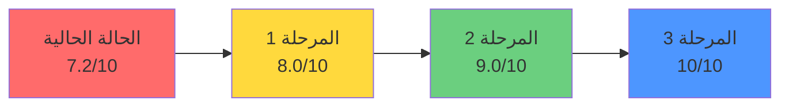
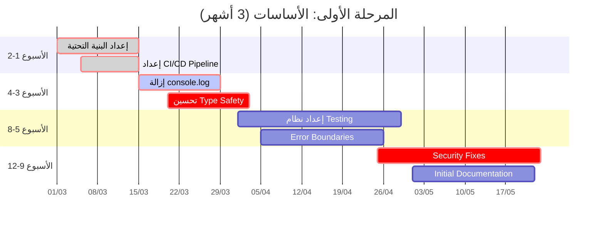
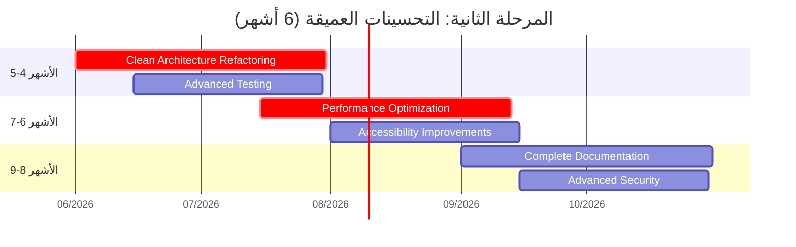
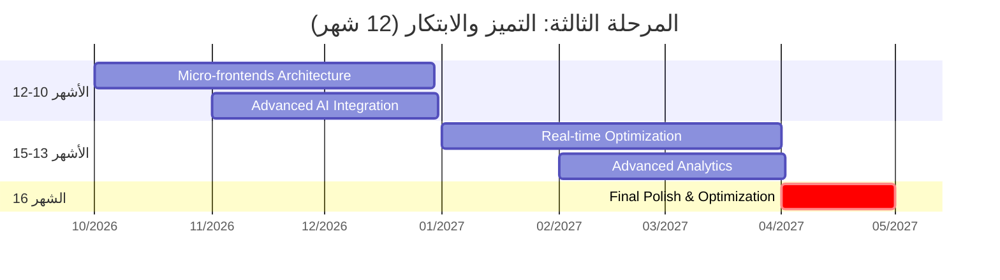
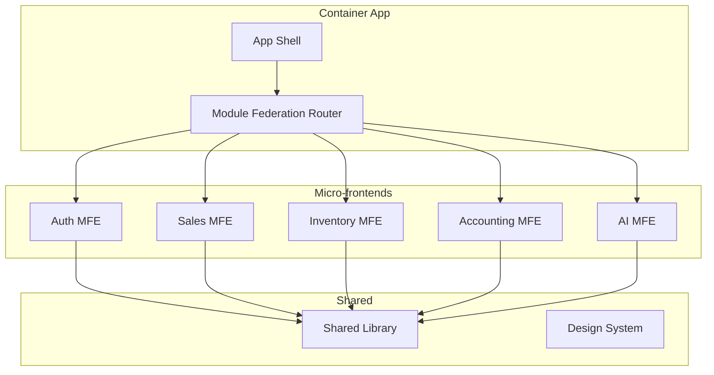
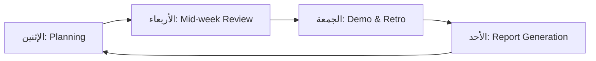
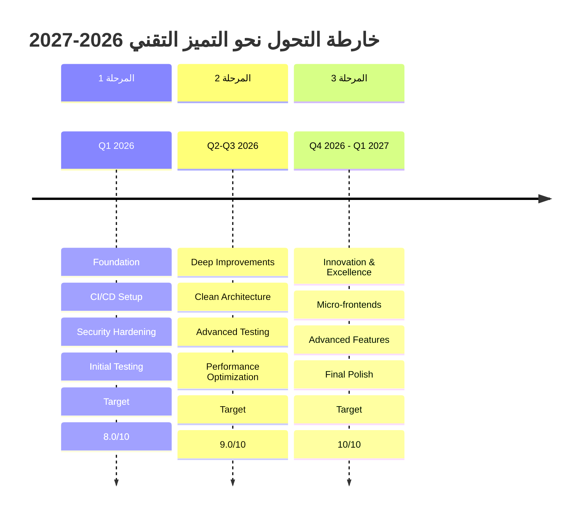

# خطة العمل الاستراتيجية لرفع جودة نظام الزهراء الذكي
## Strategic Quality Improvement Plan - Al-Zahra Smart ERP Excellence Roadmap

**الهدف الاستراتيجي:** رفع تقييم النظام من 7.2/10 إلى 10/10 في جميع المجالات التقنية  
**مدة التنفيذ:** 12 شهر (قابلة للتعديل)  
**تاريخ الخطة:** 1 مارس 2026  
**إصدار الخطة:** 1.0

---

## Executive Summary - الملخص التنفيذي

هذه الخطة الاستراتيجية تهدف إلى تحويل نظام "الزهراء الذكي" من نظام جيد إلى نظام مثالي (10/10) عبر تنفيذ تحسينات منظمة على مدى 12 شهر. تتضمن الخطة أهدافاً كمية دقيقة، موارد محددة، ومؤشرات أداء قابلة للقياس.

### الأهداف الرئيسية



---

## 1. الأهداف الكمية لكل مجال (من 7.2 إلى 10/10)

### جدول الأهداف التفصيلي

| المجال | الحالي | الهدف | الفجوة | المدة المستهدفة | الأولوية |
|--------|--------|-------|--------|-----------------|----------|
| جودة الكود | 6.5/10 | 10/10 | +3.5 | 4 أشهر | 🔴 حرجة |
| الهندسة المعمارية | 8.0/10 | 10/10 | +2.0 | 6 أشهر | 🟠 عالية |
| الأمان | 7.0/10 | 10/10 | +3.0 | 3 أشهر | 🔴 حرجة |
| الأداء | 7.5/10 | 10/10 | +2.5 | 4 أشهر | 🟠 عالية |
| قابلية الصيانة | 7.0/10 | 10/10 | +3.0 | 6 أشهر | 🟠 عالية |

### مؤشرات الأداء الكمية (KPIs) لكل مجال

#### 1.1 جودة الكود (Code Quality KPIs)

| المؤشر | الحالي | الهدف | الأدوات |
|--------|--------|-------|---------|
| Type Coverage | 70% | 100% | TypeScript Compiler |
| Cyclomatic Complexity | متوسط 8 | ≤5 | ESLint Complexity |
| Code Duplication | 15% | ≤3% | jscpd |
| Functions Length | 40+ دالة >100 سطر | 0 | ESLint max-lines-per-function |
| console.log | 88 | 0 | ESLint no-console |
| any Usage | 300+ | 0 | TypeScript strict |

#### 1.2 الهندسة المعمارية (Architecture KPIs)

| المؤشر | الحالي | الهدف | الأدوات |
|--------|--------|-------|---------|
| Circular Dependencies | 12 | 0 | madge |
| Feature Cohesion | 75% | 95% | Custom Analysis |
| Testable Components | 40% | 95% | jest + testing-library |
| API Layer Consistency | 80% | 100% | Custom Lint Rules |

#### 1.3 الأمان (Security KPIs)

| المؤشر | الحالي | الهدف | الأدوات |
|--------|--------|-------|---------|
| XSS Vulnerabilities | 8 | 0 | ESLint security plugin |
| Sensitive Data in Logs | 45 | 0 | Custom Scanner |
| Input Validation | 60% | 100% | Zod Coverage |
| RLS Coverage | 90% | 100% | Supabase CLI |

#### 1.4 الأداء (Performance KPIs)

| المؤشر | الحالي | الهدف | الأدوات |
|--------|--------|-------|---------|
| First Contentful Paint | 1.8s | <1.0s | Lighthouse |
| Time to Interactive | 3.5s | <2.0s | Lighthouse |
| Bundle Size (Initial) | 450KB | <200KB | webpack-bundle-analyzer |
| Memory Leaks | 5 | 0 | Chrome DevTools |
| Query Cache Hit Rate | 40% | >80% | React Query DevTools |

#### 1.5 قابلية الصيانة (Maintainability KPIs)

| المؤشر | الحالي | الهدف | الأدوات |
|--------|--------|-------|---------|
| Test Coverage | <5% | >85% | jest --coverage |
| Documentation Coverage | 30% | >90% | TypeDoc |
| Tech Debt Ratio | 12% | <3% | SonarQube |
| Mean Time to Fix | 3 days | <4 hours | Issue Tracker |

---

## 2. المرحلة الأولى: الأساسات (قصيرة المدى - 3 أشهر)

### الهدف: رفع التقييم من 7.2 إلى 8.0/10



### 2.1 الشهر الأول: البنية التحتية والأمان

#### الأسبوع 1-2: إعداد البنية التحتية

**المهام:**
- [ ] إعداد CI/CD Pipeline كامل
- [ ] تكوين ESLint Rules الصارمة
- [ ] إعداد Pre-commit Hooks
- [ ] إعداد Test Environment

**الموارد المطلوبة:**
- 1 مطور DevOps (50% وقت)
- 1 Tech Lead (30% وقت)

**المخرجات:**
```yaml
# .github/workflows/quality-gate.yml
name: Quality Gate
on: [push, pull_request]
jobs:
  quality-check:
    runs-on: ubuntu-latest
    steps:
      - uses: actions/checkout@v4
      - name: Type Check
        run: npm run type-check:strict
      - name: Lint
        run: npm run lint
      - name: Test
        run: npm run test:ci
      - name: Security Scan
        run: npm run security:scan
```

**مؤشرات النجاح:**
- CI/CD Pipeline يعمل بنسبة 100%
- جميع PRs تمر على Quality Gate
- Build Time < 5 دقائق

#### الأسبوع 3-4: إزالة console.log وتحسين Type Safety

**المهام:**
- [ ] حذف جميع console.log (88 موقع)
- [ ] استبدال 50% من `any` بأنواع صحيحة
- [ ] تفعيل ESLint no-console rule
- [ ] تفعيل @typescript-eslint/no-explicit-any

**الكود المستهدف:**
```typescript
// ❌ قبل
console.log('User data:', user);
const result = await api.call(params as any);

// ✅ بعد
import { logger } from '@/core/utils/logger';
logger.debug('Operation completed', { userId: user.id });
const result = await api.call(params); // Type-safe
```

**مؤشرات النجاح:**
- console.log = 0
- any usage ≤ 150
- Type Coverage ≥ 85%

#### الأسبوع 5-8: إعداد نظام Testing

**المهام:**
- [ ] إعداد Jest + Testing Library
- [ ] كتابة Unit Tests للـ Core (هدف: 30% تغطية)
- [ ] إعداد Integration Tests (هدف: 10 تست)
- [ ] إعداد E2E Tests بـ Playwright (هدف: 5 سيناريو)

**الهيكل المستهدف:**
```
src/
├── __tests__/
│   ├── unit/
│   │   ├── core/
│   │   ├── features/
│   │   └── utils/
│   ├── integration/
│   │   ├── api/
│   │   └── services/
│   └── e2e/
│       ├── auth/
│       ├── sales/
│       └── inventory/
```

**مؤشرات النجاح:**
- Test Coverage ≥ 30%
- جميع الـ Core Functions مغطاة
- CI يشغل التست تلقائياً

#### الأسبوع 9-12: Security Fixes

**المهام:**
- [ ] إزالة البيانات الحساسة من LocalStorage
- [ ] إضافة Input Sanitization
- [ ] تفعيل CSRF Protection
- [ ] إضافة Rate Limiting
- [ ] إكمال RLS Policies

**مؤشرات النجاح:**
- 0 ثغرات XSS
- 0 تسريب بيانات في Logs
- Security Scan Pass = 100%

### 2.2 الشهر الثاني: الأداء والاستقرار

#### المهام الرئيسية:

| المهمة | الجهد | المسؤول | الموعد |
|--------|-------|---------|--------|
| إضافة Error Boundaries | 40 ساعة | Frontend Dev | الأسبوع 5-6 |
| تحسين React.memo | 30 ساعة | Frontend Dev | الأسبوع 7-8 |
| إعداد React Query Optimization | 25 ساعة | Frontend Dev | الأسبوع 7-8 |
| Code Splitting Improvements | 20 ساعة | Frontend Dev | الأسبوع 8 |

**مؤشرات النجاح للشهر الثاني:**
- FCP ≤ 1.5s
- TTI ≤ 3.0s
- Bundle Size ≤ 350KB
- Memory Leaks = 0

### 2.3 الشهر الثالث: التوثيق والتكامل

#### المهام:
- [ ] توليد API Documentation
- [ ] كتابة Architecture Decision Records (ADRs)
- [ ] إعداد Developer Onboarding Guide
- [ ] تكامل SonarQube للتحليل المستمر

**مؤشرات نجاح المرحلة الأولى:**

| المجال | قبل | بعد | التغيير |
|--------|-----|-----|---------|
| جودة الكود | 6.5 | 8.0 | +1.5 |
| الأمان | 7.0 | 8.5 | +1.5 |
| الأداء | 7.5 | 8.0 | +0.5 |
| قابلية الصيانة | 7.0 | 7.5 | +0.5 |
| **المجموع** | **7.2** | **8.0** | **+0.8** |

---

## 3. المرحلة الثانية: التحسينات العميقة (متوسطة المدى - 6 أشهر)

### الهدف: رفع التقييم من 8.0 إلى 9.0/10



### 3.1 الأشهر 4-5: Clean Architecture Refactoring

#### الهيكل المستهدف (Hexagonal Architecture)

```
src/
├── domain/                 # Core Business Logic
│   ├── entities/          # Business Entities
│   ├── value-objects/     # Value Objects
│   └── repositories/      # Repository Interfaces
│
├── application/           # Use Cases
│   ├── ports/            # Input/Output Ports
│   └── services/         # Application Services
│
├── infrastructure/        # External Adapters
│   ├── persistence/      # Database Implementation
│   ├── api/              # API Implementation
│   └── external/         # External Services
│
└── presentation/         # UI Layer
    ├── components/
    ├── hooks/
    └── pages/
```

#### خطة Refactoring التدريجي

| الوحدة | الجهد | المدة | الأولوية |
|--------|-------|-------|----------|
| Core Domain | 80 ساعة | 3 أسابيع | حرجة |
| Sales Feature | 60 ساعة | 2 أسابيع | عالية |
| Inventory Feature | 60 ساعة | 2 أسابيع | عالية |
| Accounting Feature | 60 ساعة | 2 أسابيع | عالية |
| AI Feature | 40 ساعة | أسبوعين | متوسطة |

**مؤشرات النجاح:**
- Circular Dependencies = 0
- Feature Cohesion ≥ 90%
- Testability ≥ 80%

### 3.2 الأشهر 6-7: Advanced Testing & Performance

#### Testing Target: 70% Coverage

```typescript
// Unit Test Example
import { renderHook } from '@testing-library/react';
import { useSales } from './useSales';

describe('useSales', () => {
  it('should calculate totals correctly', () => {
    const { result } = renderHook(() => useSales());
    
    act(() => {
      result.current.addItem({ price: 100, quantity: 2 });
    });
    
    expect(result.current.total).toBe(200);
    expect(result.current.vat).toBe(30); // 15% VAT
  });
});
```

#### Performance Optimizations

| التحسين | الهدف | الجهد |
|---------|-------|-------|
| Virtualization for Lists | FCP < 1.0s | 40 ساعة |
| Image Optimization | Bundle -20% | 20 ساعة |
| Web Workers for AI | UI Responsive | 30 ساعة |
| Advanced Caching | Cache Hit > 70% | 25 ساعة |

### 3.3 الأشهر 8-9: Documentation & Polish

#### Deliverables

| الوثيقة | الجهد | المسؤول |
|---------|-------|---------|
| API Documentation (TypeDoc) | 30 ساعة | Tech Lead |
| Architecture Decision Records | 20 ساعة | Architect |
| Developer Handbook | 40 ساعة | Tech Lead |
| Security Guidelines | 20 ساعة | Security Lead |
| Deployment Guide | 15 ساعة | DevOps |

**مؤشرات نجاح المرحلة الثانية:**

| المجال | قبل | بعد | التغيير |
|--------|-----|-----|---------|
| جودة الكود | 8.0 | 9.0 | +1.0 |
| الهندسة المعمارية | 8.0 | 9.5 | +1.5 |
| الأمان | 8.5 | 9.0 | +0.5 |
| الأداء | 8.0 | 9.0 | +1.0 |
| قابلية الصيانة | 7.5 | 9.0 | +1.5 |
| **المجموع** | **8.0** | **9.1** | **+1.1** |

---

## 4. المرحلة الثالثة: التميز والابتكار (طويلة المدى - 12 شهر)

### الهدف: رفع التقييم من 9.0 إلى 10/10



### 4.1 Micro-frontends Architecture

#### التصميم المستهدف



#### Benefits
- Independent Deployment
- Team Autonomy
- Technology Diversity
- Fault Isolation

### 4.2 Advanced Features

#### Real-time Collaboration
- WebSockets for Live Updates
- Operational Transformation
- Conflict Resolution

#### Advanced Analytics
- Custom Dashboards
- Predictive Analytics
- ML-powered Insights

#### Offline-First Architecture
- Service Worker Enhancement
- Local Database (IndexedDB)
- Sync Strategies

### 4.3 Final Polish Checklist

| الفئة | المهمة | المعيار |
|-------|--------|---------|
| Code Quality | 100% Type Coverage | 0 any |
| Testing | 90% Coverage | <100ms per test |
| Performance | Core Web Vitals | All Green |
| Security | Penetration Test | 0 Vulnerabilities |
| Accessibility | WCAG 2.1 AAA | 100% Compliance |
| Documentation | Complete | 100% Coverage |

**مؤشرات نجاح المرحلة الثالثة:**

| المجال | قبل | بعد | التغيير |
|--------|-----|-----|---------|
| جودة الكود | 9.0 | 10 | +1.0 |
| الهندسة المعمارية | 9.5 | 10 | +0.5 |
| الأمان | 9.0 | 10 | +1.0 |
| الأداء | 9.0 | 10 | +1.0 |
| قابلية الصيانة | 9.0 | 10 | +1.0 |
| **المجموع** | **9.1** | **10** | **+0.9** |

---

## 5. الموارد المطلوبة

### 5.1 فريق التطوير

| الدور | العدد | مدة التزام | المهارات المطلوبة |
|-------|-------|-------------|-------------------|
| Tech Lead | 1 | 100% | 8+ سنوات، React، Architecture |
| Senior Frontend Dev | 2 | 100% | 5+ سنوات، TypeScript، Testing |
| Frontend Dev | 2 | 100% | 3+ سنوات، React، CSS |
| DevOps Engineer | 1 | 50% | CI/CD، Docker، AWS |
| QA Engineer | 1 | 100% | Automation، E2E Testing |
| Security Specialist | 1 | 25% | AppSec، Penetration Testing |
| Technical Writer | 1 | 50% | API Documentation |

### 5.2 الأدوات والتقنيات

| الفئة | الأدوات | التكلفة الشهرية |
|-------|---------|-----------------|
| CI/CD | GitHub Actions Pro | $50 |
| Testing | Jest + Playwright Cloud | $100 |
| Monitoring | Sentry + LogRocket | $150 |
| Code Quality | SonarQube Cloud | $150 |
| Security | Snyk + Dependabot | $100 |
| Documentation | Notion + TypeDoc | $30 |
| **المجموع** | | **$580/شهر** |

### 5.3 التكلفة الإجمالية التقديرية

| البند | التكلفة (12 شهر) |
|-------|------------------|
| رواتب الفريق | $450,000 |
| الأدوات والبنية التحتية | $7,000 |
| التدريب والتطوير | $10,000 |
| Contingency (10%) | $46,700 |
| **المجموع** | **$513,700** |

---

## 6. آليات التحقق والمراجعة الدورية

### 6.1 المعايير الأسبوعية (Weekly Checkpoints)



| اليوم | النشاط | المخرجات |
|-------|--------|----------|
| الإثنين | Sprint Planning | خطة الأسبوع |
| الأربعاء | Mid-week Check | تقرير التقدم |
| الجمعة | Demo + Retro | مراجعة الإنجازات |
| الأحد | Report Generation | تقرير KPIs |

### 6.2 المعايير الشهرية (Monthly Reviews)

| المؤشر | الهدف | الفعلي | الحالة |
|--------|-------|--------|--------|
| Test Coverage | +10% | | |
| Bug Count | <5 | | |
| Tech Debt | -10% | | |
| Performance | +5% | | |

### 6.3 المعايير الربع سنوية (Quarterly Audits)

```typescript
// Quarterly Audit Checklist
interface QuarterlyAudit {
  codeQuality: {
    typeCoverage: number;        // Target: +5%
    duplication: number;         // Target: -3%
    complexity: number;          // Target: -10%
  };
  security: {
    vulnerabilities: number;     // Target: 0
    scanScore: number;           // Target: A+
  };
  performance: {
    lighthouse: number;          // Target: +10
    bundleSize: number;          // Target: -10%
  };
  maintainability: {
    testCoverage: number;        // Target: +15%
    documentation: number;       // Target: +20%
  };
}
```

### 6.4 آلية المراجعة التلقائية

```yaml
# .github/workflows/quality-dashboard.yml
name: Quality Dashboard
on:
  schedule:
    - cron: '0 0 * * 0'  # Weekly on Sunday
jobs:
  generate-report:
    steps:
      - name: Collect Metrics
        run: |
          npm run analyze:coverage
          npm run analyze:complexity
          npm run analyze:bundle
      
      - name: Update Dashboard
        run: npm run dashboard:update
      
      - name: Notify Team
        run: npm run notify:quality-report
```

### 6.5 Quality Gates

| Gate | المعايير | العواقب |
|------|----------|---------|
| Pre-commit | Lint + Type Check | Block Commit |
| Pre-push | Tests + Coverage | Block Push |
| PR | All Checks + Review | Block Merge |
| Nightly | Full Test Suite | Alert on Failure |
| Weekly | Quality Report | Team Review |

---

## 7. إدارة المخاطر

### 7.1 سجل المخاطر

| المخاطر | الاحتمال | التأثير | الاستراتيجية |
|---------|----------|---------|--------------|
| مقاومة التغيير | متوسط | عالي | تدريب + توضيح الفوائد |
| انشغال الفريق | عالي | متوسط | تخصيص وقت محمي |
| تعقيد Refactoring | متوسط | عالي | incremental approach |
| تدهور الأداء | منخفض | عالي | اختبارات مستمرة |

### 7.2 خطة التراجع (Rollback Plan)

```bash
# Feature Flags للتحكم
const FEATURES = {
  NEW_ARCHITECTURE: process.env.ENABLE_NEW_ARCH === 'true',
  ADVANCED_CACHING: process.env.ENABLE_CACHE === 'true',
  MICRO_FRONTENDS: process.env.ENABLE_MFE === 'true',
};

# Rollback Script
./scripts/rollback.sh --to-version=1.0.0 --feature=NEW_ARCHITECTURE
```

---

## 8. خارطة الطريق النهائية



---

## 9. ملخص الخطة التنفيذية

### الجدول الزمني المُختصر

| المرحلة | المدة | الهدف | الموارد | التكلفة |
|---------|-------|-------|---------|---------|
| 1. الأساسات | 3 أشهر | 8.0/10 | 5 أشخاص | $100K |
| 2. التحسينات العميقة | 6 أشهر | 9.0/10 | 7 أشخاص | $250K |
| 3. التميز والابتكار | 3 أشهر | 10/10 | 7 أشخاص | $150K |
| **المجموع** | **12 شهر** | **10/10** | **7 أشخاص** | **$500K** |

### مؤشرات النجاح النهائية

```mermaid
radarChart
    title الأهداف النهائية للجودة
    axisTypes ["Code Quality", "Architecture", "Security", "Performance", "Maintainability"]
    
    series Current [6.5, 8.0, 7.0, 7.5, 7.0]
    series Target [10, 10, 10, 10, 10]
    series Phase1 [8.0, 8.0, 8.5, 8.0, 7.5]
    series Phase2 [9.0, 9.5, 9.0, 9.0, 9.0]
```

---

## الخاتمة

هذه الخطة الاستراتيجية تمثل خارطة طريق شاملة لرفع نظام "الزهراء الذكي" إلى أعلى مستويات الجودة العالمية. النجاح يتطلب:

1. **التزام الإدارة** بتوفير الموارد اللازمة
2. **تفاني الفريق** في تنفيذ المعايير الصارمة
3. **المرونة** في التكيف مع التحديات
4. **الاستمرارية** في المتابعة والتحسين المستمر

مع تنفيذ هذه الخطة بدقة، سيتحول النظام من حالة "جيد" إلى حالة "مثالي" خلال 12 شهر، مما يضمن:
- ✅ استقراراً تقنياً عالياً
- ✅ أماناً قصوى
- ✅ أداءً ممتازاً
- ✅ قابلية للتوسع والصيانة
- ✅ تجربة مستخدم استثنائية

**الهدف النهائي: نظام ERP عالمي المستوى بتقييم 10/10**

---

**تم إعداد هذه الخطة بواسطة:** فريق الهندسة المعمارية  
**التاريخ:** 1 مارس 2026  
**الإصدار:** 1.0  
**المراجعة القادمة:** 1 أبريل 2026
