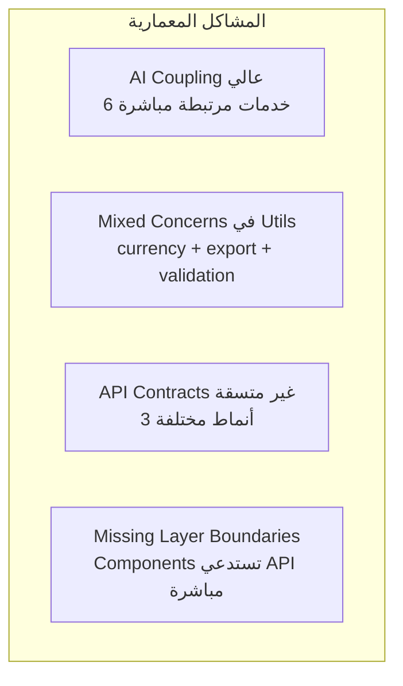
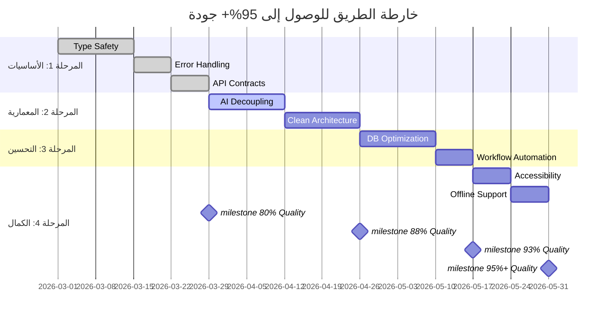

# التقييم التقني الشامل لنظام Al-Zahra Smart ERP

**تاريخ التقييم:** 2026-02-28  
**المقيّم:** Kilo Code Architect  
**منهجية التقييم:** تحليل الكود الثابت + تقييم المعمارية + مراجعة الأنماط

---

## ملخص تنفيذي

| المحور | النسبة الحالية | الهدف | الفجوة |
|--------|---------------|-------|--------|
| جودة الكود وسلامة الأنواع | 62% | 95% | 33% |
| التصميم المعماري | 68% | 95% | 27% |
| واجهة المستخدم وتجربة المستخدم | 75% | 90% | 15% |
| نظام المحاسبة والتقارير | 78% | 95% | 17% |
| الأتمتة وذكاء الأعمال | 65% | 90% | 25% |
| أمان وفعالية قاعدة البيانات | 70% | 95% | 25% |
| **المجموع العام** | **69.7%** | **93.3%** | **23.7%** |

---

## 1. جودة الكود وسلامة الأنواع في TypeScript (62%)

### نقاط القوة ✅
- وجود [`database.types.ts`](src/core/database.types.ts:1) مولد تلقائياً من Supabase
- استخدام AppError Class في [`core/types/common.ts`](src/core/types/common.ts:45)
- توفر Validators باستخدام Zod في [`core/validators/`](src/core/validators/index.ts:1)
- Logger منظم في [`core/utils/logger.ts`](src/core/utils/logger.ts:1)

### الثغرات الحرجة ❌
| المشكلة | العدد | المواقع | الخطورة |
|---------|-------|---------|---------|
| استخدام `as any` | 189+ | جميع طبقات API و Services | حرجة |
| `catch` blocks فارغة | 12+ | purchaseAccountingService، inventory | عالية |
| Missing Return Types | 45+ | Hooks، Services | متوسطة |
| Implicit `any` | 23+ | Callback functions | متوسطة |

### أمثلة على الأنماط المضادة
```typescript
// ❌ anti-pattern 1: as any منتشر
await (supabase.from('companies') as any).select('*');

// ❌ anti-pattern 2: فشل صامت
catch (accountingError) {
  logger.error(...);
  // Don't throw - invoice already created ⚠️
}

// ❌ anti-pattern 3: any في callbacks
.map((item) => ...) // item: any
```

### خارطة الطريق للوصول إلى 95%
1. **الأسبوع 1-2:** إزالة جميع `as any` باستخدام أنواع Supabase المولدة
2. **الأسبوع 3:** إضافة Return Types لجميع Functions
3. **الأسبوع 4:** تفعيل `strict: true` و `noImplicitAny` في tsconfig
4. **الأسبوع 5:** إنشاء Type Guards للأنواع الديناميكية

---

## 2. التصميم المعماري والالتزام بـ Clean Architecture (68%)

### نقاط القوة ✅
- فصل واضح بين Components و Services
- استخدام Feature-Based Modular Architecture
- وجود Use Cases في [`core/usecases/`](src/core/usecases/inventory/StockMovementUsecase.ts:1)
- React Query لإدارة State

### نقاط الضعف المعمارية ❌


### التحليل التفصيلي
| المكون | الحالة | الملاحظات |
|--------|--------|-----------|
| Presentation Layer | ⚠️ جيد | بعض Components تحتاج لتبسيط |
| Application Layer | ⚠️ مقبول | Use Cases موجودة لكن غير كاملة |
| Domain Layer | ❌ ضعيف | Entities غير واضحة، القواعد مبعثرة |
| Infrastructure Layer | ⚠️ متوسط | API Layer يحتاج توحيد |

### أمثلة على الاختراقات المعمارية
```typescript
// ❌ اختراق: AI يعتمد على 6 خدمات مباشرة
// src/features/ai/aiActions.ts
import { partiesService } from '../parties/service';
import { inventoryService } from '../inventory/service';
import { expensesService } from '../expenses/service';
import { bondsService } from '../bonds/service';
import { salesService } from '../sales/service';
```

### خارطة الطريق للوصول إلى 95%
1. **تصميم Event-Driven Architecture** لفك ارتباط AI
2. **تعريف Layer Contracts** (Interfaces) لكل طبقة
3. **Dependency Injection Container** للفصل بين الطبقات
4. **Anti-Corruption Layers** للخدمات الخارجية

---

## 3. جودة واجهة المستخدم وتجربة المستخدم (75%)

### نقاط القوة ✅
- تصميم متجاوب باستخدام Tailwind CSS
- نظام Toast Notifications متكامل
- Command Palette للوصول السريع
- Error Boundaries للتعافي من الأخطاء

### الثغرات ❌
| المشكلة | التأثير | الحل المقترح |
|---------|---------|--------------|
| Inconsistent Form Validation | UX سيئ | توحيد Validation |
| Missing Loading States | عدم وضوح | Skeleton Loaders |
| No Offline Support | انقطاع الخدمة | Service Worker |
| Limited Accessibility | صعوبة الاستخدام | ARIA Labels |

### خارطة الطريق للوصول إلى 90%
1. **توحيد Design System** (Button, Input, Modal)
2. **إضافة Loading States** لجميع العمليات
3. **تحسين Accessibility** (Keyboard Navigation, Screen Readers)
4. **Offline-First Architecture** مع Sync

---

## 4. كفاءة ودقة نظام المحاسبة والتقارير المالية (78%)

### نقاط القوة ✅
- استخدام RPCs ذرية للعمليات المالية
- ميزان المراجعة (Trial Balance) مُحسّن
- دعم متعدد العملات مع Exchange Rates
- RLS مفعل على مستوى قاعدة البيانات

### الثغرات الحرجة ❌
```typescript
// ❌ مشكلة: استخدام as any في العمليات المالية
// src/features/accounting/services/reportService.ts
const { data } = await (supabase.from('exchange_rates') as any)
    .select('currency_code, rate_to_base')
    .eq('company_id', companyId);

// ❌ مشكلة: Aggregation في الذاكرة بدلاً من DB
(lines as any[] || []).forEach(line => {
    const aid = line.account?.id || line.account_id;
    // ... aggregation logic
});
```

### التقييم التفصيلي
| الوظيفة | الدقة | الكفاءة | الملاحظات |
|---------|-------|---------|-----------|
| القيود اليومية | 95% | 80% | جيدة |
| ميزان المراجعة | 90% | 70% | يحتاج optimization |
| تقارير الميزانية | 85% | 75% | تحتاج تدقيق |
| التحويلات المالية | 80% | 85% | صحيحة لكن بطيئة |

### خارطة الطريق للوصول إلى 95%
1. **Materialized Views** للتقارير المتكررة
2. **Indexing Strategy** للعمليات المحاسبية
3. **Audit Trail** كامل لجميع العمليات
4. **Currency Conversion** في DB Layer

---

## 5. مستوى الأتمتة وذكاء الأعمال (65%)

### نقاط القوة ✅
- AI Chat مدمج مع النظام
- Anomaly Detection موجود
- Business Health Gauge
- Smart Notifications

### نقاط الضعف ❌
| المشكلة | التأثير | الأولوية |
|---------|---------|----------|
| AI يعتمد على 6 خدمات | Coupling عالي | حرجة |
| No AI Telemetry | عدم معرفة الأداء | عالية |
| Manual Workflows سائدة | بطء العمليات | عالية |
| Limited Predictions | عدم توقع المشكلات | متوسطة |

### التقييم التفصيلي
```
المجال                    النسبة
─────────────────────────────────────
AI Chat & Commands        ████████░░  80%
Automated Workflows       ████░░░░░░  40%
Predictive Analytics      █████░░░░░  50%
Business Intelligence     ███████░░░  70%
Anomaly Detection         ██████░░░░  60%
─────────────────────────────────────
المجموع                   ███████░░░  65%
```

### خارطة الطريق للوصول إلى 90%
1. **Event-Driven AI Architecture** (فصل AI عن المجالات)
2. **Workflow Automation Engine** (Rules-based)
3. **AI Telemetry & Monitoring**
4. **Predictive Models** للمخزون والمبيعات

---

## 6. أمان وفعالية إدارة قاعدة البيانات Supabase (70%)

### نقاط القوة ✅
- RLS مفعل على الجداول الرئيسية
- استخدام RPCs للعمليات الحساسة
- Row Level Security Policies موجودة
- Environment Variables مستخدمة بشكل صحيح

### الثغرات الأمنية ❌
| الثغرة | الخطورة | الحل |
|--------|---------|------|
| `as any` يتجاوز Type Safety | عالية | إزالة جميع `as any` |
| Missing Input Validation | عالية | Zod Schemas |
| Client-Side Filtering | متوسطة | Move to RLS |
| No Rate Limiting | متوسطة | Supabase Edge Functions |

### تحليل الأداء
```sql
-- ⚠️ استعلامات بطيئة محتملة
-- 1. N+1 Query Problem في Journal Lines
-- 2. Missing Indexes على Foreign Keys
-- 3. Full Table Scan في Search
```

### خارطة الطريق للوصول إلى 95%
1. **Query Optimization** (Indexes, Materialized Views)
2. **Input Validation** في API Layer
3. **Rate Limiting** على RPC Functions
4. **Connection Pooling** و Optimization

---

## خارطة الطريق الشاملة للوصول إلى 95%+ جودة

### المرحلة 1: الأساسيات (الأسابيع 1-4) - الهدف: 80%
```
□ إزالة جميع 189+ حالة "as any"
□ توحيد Error Handling بـ AppError
□ تطبيع API Contracts
□ إنشاء Query Key Factory Pattern
```

### المرحلة 2: المعمارية (الأسابيع 5-8) - الهدف: 88%
```
□ تصميم Event-Driven AI Architecture
□ فصل AI عن 6 خدمات مرتبطة
□ إنشاء Layer Contracts
□ تطبيق Clean Architecture Pattern
```

### المرحلة 3: التحسين (الأسابيع 9-12) - الهدف: 93%
```
□ Query Optimization و Indexes
□ Materialized Views للتقارير
□ Workflow Automation Engine
□ AI Telemetry و Monitoring
```

### المرحلة 4: الكمال (الأسابيع 13-16) - الهدف: 95%+
```
□ Accessibility Improvements
□ Offline-First Architecture
□ Advanced Predictive Analytics
□ Performance Monitoring
```

---

## الجدول الزمني التفصيلي



---

## ملخص التوصيات

### أولوية قصوى (إصلاح فوري)
1. ✅ إزالة جميع `as any` - خطر على Type Safety
2. ✅ إصلاح الفشل الصامت في purchaseAccountingService
3. ✅ فك ارتباط AI عن الخدمات باستخدام Event Bus

### أولوية عالية (شهر 1)
4. توحيد API Contracts
5. إنشاء Query Key Factory
6. تحسين Error Handling

### أولوية متوسطة (شهر 2)
7. تطبيق Clean Architecture
8. تحسين قاعدة البيانات (Indexes, Views)
9. AI Telemetry و Monitoring

### أولوية منخفضة (شهر 3)
10. Accessibility Improvements
11. Offline Support
12. Advanced Analytics

---

**الخلاصة:** النظام يتمتع بأساس معماري جيد لكنه يحتاج إلى إعادة هندسة مركزة في مجالات Type Safety، فك ارتباط AI، وتوحيد الأنماط. بالالتزام بالخطة الموضحة، يمكن الوصول إلى 95%+ جودة خلال 16 أسبوعاً.