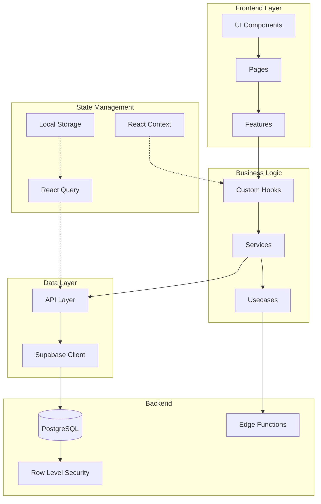

# تحليل بنية الكود والهيكلة - نظام الزهراء الذكي

## 📊 نظرة عامة على البنية

### الهيكل العام للمشروع

```
src/
├── app/                    # إعدادات التطبيق والمسارات
├── config/                 # التكوينات
├── core/                   # النواة الأساسية
│   ├── components/         # مكونات أساسية (ErrorBoundary)
│   ├── entities/           # الكيانات الأساسية
│   ├── hooks/              # hooks الأساسية
│   ├── lib/                # مكتبات أساسية (persistence, react-query, sync)
│   ├── permissions/        # نظام الصلاحيات
│   ├── routes/             # تعريف المسارات
│   ├── services/           # خدمات أساسية (OfflineManager, Storage)
│   ├── store/              # حالة التطبيق
│   ├── types/              # الأنواع الأساسية
│   ├── usecases/           # حالات الاستخدام (Business Logic)
│   ├── utils/              # أدوات مساعدة
│   └── validators/         # مدققات البيانات
├── data/                   # البيانات الثابتة والثوابت
├── features/               # الميزات (Feature-based Architecture)
│   ├── accounting/         # المحاسبة
│   ├── ai/                 # الذكاء الاصطناعي
│   ├── appearance/         # المظهر
│   ├── auth/               # المصادقة
│   ├── bonds/              # السندات
│   ├── command/            # الأوامر
│   ├── customers/          # العملاء
│   ├── dashboard/          # لوحة التحكم
│   ├── expenses/           # المصروفات
│   ├── feedback/           # التغذية الراجعة
│   ├── inventory/          # المخزون
│   ├── notifications/      # الإشعارات
│   ├── parties/            # الأطراف
│   ├── pos/                # نقطة البيع
│   ├── purchases/          # المشتريات
│   ├── reports/            # التقارير
│   ├── returns/            # المرتجعات
│   ├── sales/              # المبيعات
│   ├── settings/           # الإعدادات
│   ├── smart-import/       # الاستيراد الذكي
│   ├── suppliers/          # الموردين
│   └── vehicles/           # المركبات
├── hooks/                  # hooks عامة
├── lib/                    # مكتبات خارجية
├── pages/                  # صفحات إضافية
├── scripts/                # سكريبتات
├── test/                   # اختبارات
├── types/                  # أنواع عامة
└── ui/                     # واجهة المستخدم
    ├── base/               # مكونات أساسية (Button, Modal, Input, etc.)
    ├── cards/              # بطاقات
    ├── common/             # مكونات مشتركة (ExcelTable, AIChat, etc.)
    ├── components/         # مكونات متقدمة (AdvancedTabBar, LoadingStates)
    ├── dashboard/          # مكونات لوحة التحكم
    ├── hooks/              # hooks واجهة المستخدم
    ├── layout/             # التخطيط (Header, Sidebar, MainLayout)
    └── pos/                # مكونات نقطة البيع
```

---

## 🏗️ أنماط التصميم المستخدمة

### 1. Feature-Based Architecture ✅

**الوصف:** كل ميزة لها مجلد مستقل يحتوي على كل ما يخصها

**المزايا:**
- سهولة العثور على الكود
- فصل واضح بين الميزات
- يسهل فريق العمل على ميزات مختلفة
- يسهل الاختبار

**مثال:**
```
features/inventory/
├── api/              # طلبات API
├── components/       # مكونات المخزون
├── hooks/            # hooks المخزون
├── pages/            # صفحات المخزون
├── services/         # خدمات المخزون
├── types.ts          # أنواع المخزون
├── constants.ts      # ثوابت المخزون
└── index.ts          # تصدير
```

### 2. Layered Architecture ✅

**الطبقات:**
```
Component → Hook → Service → API → Supabase
```

**الفوائد:**
- فصل المسؤوليات (Separation of Concerns)
- سهولة الاختبار
- سهولة الاستبدال (يمكن تغيير Supabase بسهولة)

### 3. Repository Pattern ✅

**التطبيق:**
- كل feature له مجلد `api/` يحتوي على طلبات Supabase
- مجلد `services/` يحتوي على منطق الأعمال
- مجلد `hooks/` يحتوي على hooks React

### 4. Singleton Pattern ✅

**التطبيق:**
- عميل Supabase واحد فقط في `src/lib/supabaseClient.ts`
- QueryClient واحد في `src/lib/queryClient.ts`

---

## 🔧 البنية التقنية

### 1. إدارة الحالة (State Management)

**الحل:**
- **Server State:** TanStack Query (React Query)
- **Client State:** React Context + Hooks
- **Local Storage:** Persister مخصص

**المزايا:**
- تحديث تلقائي للبيانات
- إدارة الكاش
- Offline Support

### 2. التوجيه (Routing)

**الحل:**
- React Router DOM v6
- HashRouter للتوافق
- Lazy Loading للصفحات
- Route Guards (AuthGuard, GuestGuard)

### 3. التصميم (Styling)

**الحل:**
- Tailwind CSS
- CSS Variables للثيمات
- Dark Mode Support
- RTL Support

### 4. التحقق من البيانات (Validation)

**الحل:**
- Zod للتحقق من الأنواع
- Validators مخصصة لكل feature

### 5. الترجمة (i18n)

**الحل:**
- ملفات JSON للترجمة (ar.json, en.json)
- Hook مخصص `useTranslation`

---

## 📈 إحصائيات الكود

### حجم المشروع
- **إجمالي الملفات:** ~500+ ملف
- **Features:** 22 ميزة
- **UI Components:** 100+ مكون
- **Hooks:** 50+ hook
- **Services:** 30+ خدمة

### أكبر الميزات (حسب عدد الملفات)
1. **inventory/** - ~100 ملف (الأكبر)
2. **dashboard/** - ~40 ملف
3. **sales/** - ~30 ملف
4. **accounting/** - ~25 ملف
5. **expenses/** - ~20 ملف

---

## ✅ نقاط القوة

### 1. تنظيم ممتاز
- Feature-based architecture واضحة
- فصل بين الطبقات
- تسمية متسقة

### 2. أمان قوي
- RLS في Supabase
- Tenant Isolation
- Route Guards
- Validators

### 3. أداء جيد
- Lazy Loading
- React Query للكاش
- Code Splitting

### 4. تجربة مستخدم ممتازة
- RTL Support
- Dark Mode
- PWA Support
- Command Palette
- AI Integration

### 5. قابلية الصيانة
- كود منظم
- توثيق جيد (SUPABASE_RULES.md)
- أنواع TypeScript صارمة

---

## ⚠️ مجالات للتحسين

### 1. أخطاء TypeScript
- وجود ملفات أخطاء كبيرة (ts_errors_v3.txt: 107KB)
- **التوصية:** إصلاح تدريجي، الأولوية للأخطاء الحرجة

### 2. ملفات فارغة
- `ProductCardView.tsx` (0 chars)
- `supabase-types.ts` (0 chars)
- **التوصية:** إكمال أو حذف

### 3. تكرار الكود
- بعض المكونات مشابهة في features مختلفة
- **التوصية:** استخراج مكونات مشتركة

### 4. الاختبارات
- نسبة الاختبارات منخفضة
- **التوصية:** زيادة تغطية الاختبارات

### 5. التوثيق
- لا يوجد README شامل
- **التوصية:** إضافة README.md شامل

---

## 🎯 توصيات للتحسين

### قصيرة المدى (1-2 أسبوع)
1. ✅ إصلاح أخطاء TypeScript الحرجة
2. ✅ حذف الملفات الفارغة غير المستخدمة
3. ✅ إضافة README.md

### متوسطة المدى (1-2 شهر)
1. 📊 زيادة تغطية الاختبارات إلى 60%+
2. 🔧 استخراج مكونات مشتركة متكررة
3. 📚 توثيق API endpoints

### طويلة المدى (3-6 شهر)
1. 🚀 تحسين الأداء (Bundle Size)
2. 🔄 إعادة هيكلة بعض الميزات الكبيرة
3. 📱 تحسين تجربة الموبايل

---

## 📐 مخطط البنية



---

## 📊 مقارنة مع أفضل الممارسات

| المعيار | الحالة | التقييم |
|---------|--------|---------|
| Feature-based Architecture | ✅ مطبق | ممتاز |
| Separation of Concerns | ✅ مطبق | ممتاز |
| TypeScript Strict Mode | ⚠️ جزئي | جيد |
| Testing Coverage | ⚠️ منخفض | يحتاج تحسين |
| Documentation | ⚠️ جزئي | جيد |
| Performance Optimization | ✅ مطبق | ممتاز |
| Security (RLS) | ✅ مطبق | ممتاز |
| Accessibility | ⚠️ جزئي | جيد |
| Error Handling | ✅ مطبق | ممتاز |
| Offline Support | ✅ مطبق | ممتاز |

---

## 🏆 الخلاصة

التطبيق يمتاز بـ **بنية قوية ومنظمة** تستخدم أفضل الممارسات في تطوير تطبيقات React. النقاط الرئيسية:

1. **Feature-based architecture** تسهل الصيانة والتوسع
2. **Layered architecture** تضمن فصل المسؤوليات
3. **أمان قوي** مع RLS و Route Guards
4. **أداء جيد** مع Lazy Loading و React Query
5. **تجربة مستخدم ممتازة** مع RTL و Dark Mode

**التوصية الرئيسية:** التركيز على إصلاح أخطاء TypeScript وزيادة تغطية الاختبارات لتحسين جودة الكود بشكل عام.
