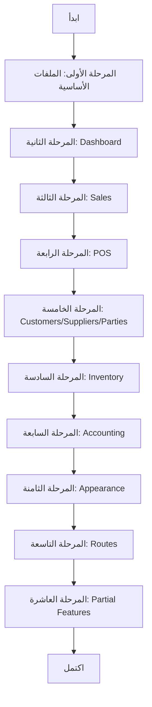

# خطة إكمال الواجهة الأمامية - Alzhra Smart

## نظرة عامة

هذا المستند يحتوي على خطة شاملة لإكمال جميع الميزات والخدمات غير المكتملة في المشروع.

---

## المرحلة الأولى: الملفات الأساسية (Critical)

### 1.1 Types و Constants

```
src/
├── types.ts                 [ PRIORITY: HIGH ]
├── constants.tsx            [ PRIORITY: HIGH ]
├── core/
│   └── lib/
│       ├── persister.ts     [ PRIORITY: HIGH ]
│       └── react-query.ts   [ PRIORITY: HIGH ]
└── data/
    ├── constants.tsx        [ PRIORITY: HIGH ]
    └── dashboard.ts         [ PRIORITY: MEDIUM ]
```

**الإجراءات المطلوبة:**
- [`src/types.ts`](src/types.ts): إضافة الأنواع الأساسية المشتركة
- [`src/constants.tsx`](src/constants.tsx): إضافة الثوابت المشتركة
- [`src/core/lib/persister.ts`](src/core/lib/persister.ts): تنفيذ نظام persistence
- [`src/core/lib/react-query.ts`](src/core/lib/react-query.ts): إعداد React Query
- [`src/data/constants.tsx`](src/data/constants.tsx): إضافة الثوابت
- [`src/data/dashboard.ts`](src/data/dashboard.ts): إضافة بيانات Dashboard الافتراضية

---

## المرحلة الثانية: Dashboard

### 2.1 المكونـات المفقودة

```
src/features/dashboard/
├── components/
│   ├── InventoryChart.tsx      [ PRIORITY: HIGH ]
│   ├── SalesChart.tsx          [ PRIORITY: HIGH ]
│   ├── StatsGrid.tsx           [ PRIORITY: HIGH ]
│   └── WelcomeSection.tsx      [ PRIORITY: HIGH ]
├── data/
│   └── dashboard.ts             [ PRIORITY: MEDIUM ]
└── hooks/
    └── useDashboard.ts          [ PRIORITY: HIGH ]
```

**الإجراءات المطلوبة:**
- تنفيذ مخططات المخزون والمبيعات
- تنفيذ شبكة الإحصائيات
- تنفيذ قسم الترحيب
- تنفيذ hooks لاسترجاع بيانات Dashboard

---

## المرحلة الثالثة: Sales

### 3.1 الملفات المفقودة

```
src/features/sales/
├── seed.ts                                             [ PRIORITY: LOW ]
├── components/
│   ├── Analytics/
│   │   └── SalesAnalytics.tsx                         [ PRIORITY: MEDIUM ]
│   ├── CreateInvoice/
│   │   ├── InvoiceCart.tsx                            [ PRIORITY: HIGH ]
│   │   ├── InvoiceItemsGrid.tsx                       [ PRIORITY: HIGH ]
│   │   ├── InvoiceSummary.tsx                          [ PRIORITY: HIGH ]
│   │   └── ProductSearch.tsx                          [ PRIORITY: HIGH ]
│   ├── InvoiceList/
│   │   ├── InvoicesTable.tsx                          [ PRIORITY: HIGH ]
│   │   └── SalesStats.tsx                             [ PRIORITY: MEDIUM ]
│   └── Returns/
│       └── SalesReturns.tsx                            [ PRIORITY: MEDIUM ]
├── hooks/
│   ├── index.ts                                        [ PRIORITY: HIGH ]
│   ├── useProductSearch.ts                             [ PRIORITY: HIGH ]
│   ├── useSalesAnalytics.ts                           [ PRIORITY: MEDIUM ]
│   └── useSalesSeed.ts                                [ PRIORITY: LOW ]
└── views/
    ├── CreateInvoiceView.tsx                          [ PRIORITY: HIGH ]
    ├── InvoiceListView.tsx                            [ PRIORITY: HIGH ]
    ├── SalesAnalyticsView.tsx                         [ PRIORITY: MEDIUM ]
    └── SalesReturnsView.tsx                           [ PRIORITY: MEDIUM ]
```

---

## المرحلة الرابعة: POS

### 4.1 الملفات المفقودة

```
src/features/pos/
└── components/
    └── POSHeader.tsx              [ PRIORITY: MEDIUM ]
```

---

## المرحلة الخامسة: Customers & Suppliers & Parties

### 5.1 Customers

```
src/features/customers/hooks/
├── index.ts                      [ PRIORITY: HIGH ]
├── useCustomersData.ts           [ PRIORITY: HIGH ]
└── useCustomersView.ts          [ PRIORITY: HIGH ]
```

### 5.2 Suppliers

```
src/features/suppliers/hooks/
├── index.ts                      [ PRIORITY: HIGH ]
├── useSuppliersData.ts           [ PRIORITY: HIGH ]
└── useSuppliersView.ts          [ PRIORITY: HIGH ]
```

### 5.3 Parties

```
src/features/parties/
├── index.ts                      [ PRIORITY: HIGH ]
└── hooks/
    ├── index.ts                  [ PRIORITY: HIGH ]
    ├── usePartiesData.ts         [ PRIORITY: HIGH ]
    └── usePartiesView.ts         [ PRIORITY: HIGH ]
```

---

## المرحلة السادسة: Inventory

### 6.1 الملفات المفقودة

```
src/features/inventory/
├── store.ts                      [ PRIORITY: HIGH ]
└── components/
    └── ProductCardView.tsx      [ PRIORITY: MEDIUM ]
```

---

## المرحلة السابعة: Accounting

### 7.1 الملفات المفقودة

```
src/features/accounting/
├── api.ts                        [ PRIORITY: HIGH ]
└── components/
    ├── AccountingStats.tsx       [ PRIORITY: MEDIUM ]
    ├── AccountsTable.tsx         [ PRIORITY: MEDIUM ]
    ├── ActionToolbar.tsx         [ PRIORITY: MEDIUM ]
    ├── AddAccountModal.tsx       [ PRIORITY: MEDIUM ]
    ├── AddJournalEntryModal.tsx  [ PRIORITY: MEDIUM ]
    ├── BalanceSheet.tsx          [ PRIORITY: MEDIUM ]
    ├── ExcelTable.tsx           [ PRIORITY: LOW ]
    ├── FinancialStatementsView.tsx [ PRIORITY: MEDIUM ]
    ├── IncomeStatement.tsx      [ PRIORITY: MEDIUM ]
    ├── JournalTable.tsx         [ PRIORITY: MEDIUM ]
    ├── LedgerView.tsx           [ PRIORITY: MEDIUM ]
    ├── SubNavigation.tsx        [ PRIORITY: MEDIUM ]
    └── TrialBalanceView.tsx     [ PRIORITY: MEDIUM ]
```

**ملاحظة:** التنفيذ موجود في المجلدات الفرعية (accounts/, journals/, layout/, overview/, reports/, shared/, treasury/)

---

## المرحلة الثامنة: Appearance

### 8.1 الملفات المفقودة

```
src/features/appearance/
├── store.ts                      [ PRIORITY: HIGH ]
└── components/
    └── AppearanceTabs.tsx       [ PRIORITY: MEDIUM ]
```

---

## المرحلة التاسعة: ميزات غير متصلة

### 9.1 Parties - إضافة للـ Routes

```typescript
// src/app/routes.tsx
// إضافة:
const PartiesPage = lazy(() => import('../features/parties/PartiesPage'));

// إضافة مسار:
<Route path={ROUTES.DASHBOARD.PARTIES} element={<Suspense fallback={<PageLoader />}><PartiesPage partyType="customer" /></Suspense>} />
```

### 9.2 Parties - مسار جديد

```typescript
// src/core/routes/paths.ts
// إضافة:
PARTIES: '/parties',
PARTIES_CUSTOMERS: '/parties/customers',
PARTIES_SUPPLIERS: '/parties/suppliers',
```

### 9.3 AI - إضافة للـ Routes

```typescript
// src/app/routes.tsx
// إضافة:
const AIPage = lazy(() => import('../features/ai/AIPage'));

// إضافة مسار:
<Route path={ROUTES.DASHBOARD.AI} element={<Suspense fallback={<PageLoader />}><AIPage /></Suspense>} />
```

---

## المرحلة العاشرة: ميزات شبه مكتملة

### 10.1 Feedback

```
src/features/feedback/
├── FeedbackPage.tsx              [ PRIORITY: LOW ]
├── components/
│   ├── FeedbackList.tsx         [ PRIORITY: LOW ]
│   └── FeedbackForm.tsx         [ PRIORITY: LOW ]
└── hooks/
    └── useFeedback.ts           [ PRIORITY: LOW ]
```

### 10.2 Command Palette

```
src/features/command/
├── CommandPage.tsx              [ PRIORITY: LOW ]
├── components/
│   └── CommandResults.tsx       [ PRIORITY: LOW ]
└── hooks/
    └── useCommand.ts           [ PRIORITY: LOW ]
```

### 10.3 Smart-import

```
src/features/smart-import/
├── api.ts                       [ PRIORITY: MEDIUM ]
├── hooks.ts                     [ PRIORITY: MEDIUM ]
├── service.ts                   [ PRIORITY: MEDIUM ]
└── pages/
    └── SmartImportPage.tsx     [ PRIORITY: MEDIUM ]
```

---

## ملخص الأولويات

| المرحلة | الأولوية | عدد الملفات |
|---------|----------|-------------|
| المرحلة الأولى: الأساسية | Critical | 6 |
| المرحلة الثانية: Dashboard | High | 6 |
| المرحلة الثالثة: Sales | High | 16 |
| المرحلة الرابعة: POS | Medium | 1 |
| المرحلة الخامسة: Customers/Suppliers/Parties | High | 12 |
| المرحلة السادسة: Inventory | High | 2 |
| المرحلة السابعة: Accounting | Medium | 14 |
| المرحلة الثامنة: Appearance | Medium | 2 |
| المرحلة التاسعة: Routes | High | - |
| المرحلة العاشرة: Partial | Low | 10 |

---

## مخطط بياني ل سير العمل



---

## الخطوات التالية المقترحة

1. **البدء بالملفات الأساسية** - لأن معظم المكونات الأخرى تعتمد عليها
2. **إكمال Dashboard** - لأنها الصفحة الرئيسية
3. **إصلاح Routes** - لإضافة Parties و AI
4. **إكمال Sales و Inventory** - لأنهما الميزات الأساسية
5. **إكمال الميزات المتبقية** - للتكامل النهائي
