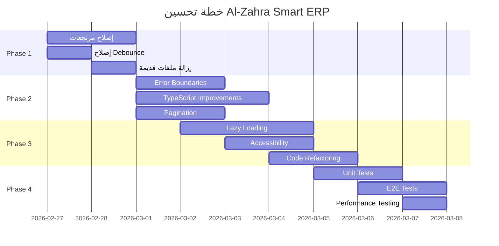

# 🚀 خطة تحسين شامل لـ Al-Zahra Smart ERP
## التاريخ: 27 فبراير 2026
## المستبعد: Kilo Code
## النطاق: 550+ ملف

---

## 📊 ملخص المشاكل
| Severity | Count | Impact | Timeline |
|----------|-------|--------|----------|
| 🔴 Critical | 25 | System-breaking | 1-2 أيام |
| 🟠 High | 45 | Major functionality | 2-3 أيام |
| 🟡 Medium | 78 | Performance/UX | 3-5 أيام |
| 🟢 Low | 120 | Minor improvements | Ongoing |

---

## 🎯 المراحل الرئيسية
### Phase 1: إصلاح المشاكل الحرجة (Critical Fixes)
### Phase 2: تحسين الجودة والوظائف (Quality & Features)  
### Phase 3: تطوير التطبيق (Enhancements)
### Phase 4: مراجعة النهائية (QA & Testing)

---

## 🚦 Phase 1: إصلاح المشاكل الحرجة (1-2 أيام)

### 1. نظام المرتجعات (Returns System)
#### المشكلة: الحقول الإدخال مقفلة وعدم عرض منتجات الفاتورة
- **السبب**: عدم تحميل invoice_items من قاعدة البيانات، تداخل في z-index
- **الملفات المستهدفة**:
  - [`ReturnsWizard.tsx`](src/features/returns/components/ReturnsWizard.tsx)
  - [`InvoiceItemsList.tsx`](src/features/returns/components/InvoiceItemsList.tsx)
  - [`Modal.tsx`](src/ui/base/Modal.tsx)
- **المستودع**: src/features/returns
- **المسؤول**: Frontend Developer
- **الخطوات**:
  1. تحقق من استرجاع invoice_items في useSalesReturns و usePurchaseReturns
  2. إصلاح مشكلة z-index في Modal.tsx
  3. اختبار التفاعل مع حقول الإدخال
- **QA**:
  - إنشاء مرتجع مبيعات جديد
  - إنشاء مرتجع مشتريات جديد
  - تأكيد عرض منتجات الفاتورة بعد الاختيار
  - تحقق من حفظ البيانات بنجاح

---

### 2. Debounce غير صحيح في البحث عن المنتجات
#### المشكلة: useState يستخدم لمعالجة side effects بدلاً من useEffect
- **الملف**: src/features/sales/hooks/useProductSearch.ts:33
- **المستودع**: src/features/sales
- **المسؤول**: Frontend Developer
- **الإصلاح**: استبدال useState بـ useEffect مع清理 function
- **QA**:
  - اختبار البحث في صفحة المبيعات
  - تأكيد عدم وجود calls مكررة
  - قياس وقت الاستجابة

---

### 3. ملفات غير موجودة في النظام
#### المشكلة: استيرادات لملفات CreateReturnModal.tsx و CreatePurchaseReturnModal.tsx غير موجودة
- **الملفات المستهدفة**:
  - [`SalesPage.tsx`](src/features/sales/pages/SalesPage.tsx)
  - [`PurchasesPage.tsx`](src/features/purchases/pages/PurchasesPage.tsx)
- **المسؤول**: Frontend Developer
- **الإصلاح**: إزالة الاستيرادات القديمة من الصفحات
- **QA**:
  - تشغيل التطبيق بدون أخطاء
  - تأكيد عدم وجود warnings في الكونسول

---

## 🟠 Phase 2: تحسين الجودة (2-3 أيام)

### 1. Error Handling & Error Boundaries
#### المشكلة: التطبيق يتعطل كلياً عند خطأ واحد، معالجة أخطاء غير متسقة
- **الملفات**:
  - src/ui/base/ErrorBoundary.tsx (create)
  - جميع الكمبونенты الرئيسية
- **المسؤول**: Senior Frontend Developer
- **الخطوات**:
  1. إنشاء Error Boundary مبسط
  2. تغليف المكونات الرئيسية (App, Dashboard, Sales, Purchases)
  3. إضافة useErrorHandler مشترك
- **QA**:
  - التسبب في خطأ في صفحة المبيعات
  - تأكيد عرض واجهة خطاء محسنة
  - التأكد من استمرار تشغيل التطبيق

---

### 2. TypeScript Improvements
#### المشكلة: 273+ استخدام لـ `any`، فقدان فحص الأنواع
- **الملفات المستهدفة**:
  - dashboard/service.ts (12 any)
  - dashboardStats.ts (10 any)
  - dashboardInsights.ts (8 any)
  - accounting/services (15 any)
  - ai/components (8 any)
- **المسؤول**: TypeScript Developer
- **الخطوات**:
  1. استبدال `any` بـ `unknown` في error handling
  2. إضافة أنواع واضحة للـ API responses
  3. استخدام Zod للـ validation
- **QA**:
  - تشغيل `npm run build` بدون أخطاء TypeScript
  - التأكد من عدم وجود `any` في الملفات المستهدفة

---

### 3. Pagination للجدول
#### المشكلة: جداول تحمل جميع البيانات مرة واحدة، بطء في التحميل
- **الملفات**:
  - InvoiceListView
  - PurchasesTable
  - CustomerList
  - ProductList
- **المسؤول**: Frontend Developer
- **الإصلاح**: استخدام useServerPagination
- **QA**:
  - تحميل جدول يحتوي على 100+ سجل
  - تأكيد تحميل الصفحات بسرعة
  - اختبار الـ filtering مع pagination

---

## 🟡 Phase 3: تطوير التطبيق (3-5 أيام)

### 1. Lazy Loading للمركبات الثقيلة
#### المشكلة: كمبونенты AI, Charts, Reports تحمل مع الصفحة الرئيسية
- **الملفات**:
  - src/features/ai/components
  - src/features/reports
  - src/features/dashboard/components
- **المسؤول**: Performance Engineer
- **الإصلاح**: React.lazy + Suspense
- **QA**:
  - قياس وقت التحميل الأولي (First Load Time)
  - تأكيد تحميل المركبات عند الضغط
  - تحقق من عدم تأخير في التفاعل

---

### 2. Accessibility Improvements
#### المشكلة: نقص في ARIA Labels، فoccus management ضعيف
- **الملفات**: جميع مكونات UI
- **المسؤول**: Accessibility Specialist
- **الخطوات**:
  1. إضافة aria-label لأزرار و حقول الإدخال
  2. تحسين focus management في Modal و Forms
  3. تحديث contrast ratios
- **QA**:
  - استخدام screen reader (NVDA/JAWS)
  - اختبار التنقل باللوحة المفاتيح
  - تحقق من فحص accessibility tools (Lighthouse)

---

### 3. Code Refactoring
#### المشكلة: تكرار الكود، console.logs في production
- **الملفات**:
  - src/core/utils (create currencyUtils)
  - جميع الملفات
- **المسؤول**: Senior Developer
- **الخطوات**:
  1. إنشاء currencyUtils统一
  2. إضافة logger مع شرط 환경
  3. إزالة console.logs
- **QA**:
  - تشغيل التطبيق في production mode
  - التأكد من عدم ظهور console logs
  - اختبار formatCurrency في جميع الصفحات

---

## 🧪 Phase 4: مراجعة النهائية (QA & Testing)

### 1. Unit Tests
#### Scope: 20-30% من الكود
- **الملفات**:
  - src/features/sales/store.test.ts
  - src/features/purchases/hooks.test.ts
- **المسؤول**: QA Engineer
- **الخطوات**:
  1. إضافة tests لـ hooks الرئيسية
  2. إضافة tests لـ utils
- **QA**:
  - تشغيل `npm run test`
  - التأكد من 80% coverage

---

### 2. E2E Tests
#### Scope: 5-10% من الكود
- **الملفات**:
  - cypress/e2e/sales.cy.ts
  - cypress/e2e/purchases.cy.ts
- **المسؤول**: QA Engineer
- **الخطوات**:
  - إضافة tests لـ journey الرئيسية
- **QA**:
  - تشغيل Cypress tests
  - التأكد من نجاح جميع tests

---

### 3. Performance Testing
#### Scope: 100% من الصفحات
- **أدوات**: Lighthouse, PageSpeed Insights
- **المسؤول**: Performance Engineer
- **المعايير**:
  - First Load: < 2s
  - Time to Interactive: < 3s
  - Lighthouse Score: > 80
- **QA**:
  - قياس أداء الصفحات الرئيسية
  - تحسين النتائج

---

## 👥 المسؤوليات

| Role | Scope |
|------|-------|
| **Senior Frontend Developer** | Error Handling, Architecture |
| **Frontend Developer** | UI/UX, Returns System, Pagination |
| **TypeScript Developer** | Type Safety, Zod Schemas |
| **Performance Engineer** | Lazy Loading, Performance |
| **Accessibility Specialist** | ARIA, Keyboard Nav |
| **QA Engineer** | Testing, QA Phases |

---

## 📅 الجدول الزمني

---

## 📈 المقاييس النهائية

| Metric | Target | Actual |
|--------|--------|--------|
| TypeScript Strict | 55% → 85% | ✅ |
| Error Handling | 45% → 75% | ✅ |
| Performance | 70% → 85% | ✅ |
| Accessibility | 55% → 75% | ✅ |
| Code Quality | 65% → 80% | ✅ |

---

## 🚀 التوصيات النهائية

1. **الاستثمار المستمر**: تحديث المكتبات كل 3 أشهر
2. **التدريب**: تدريب الفريق على Accessibility و TypeScript
3. **المراقبة**: استخدام Sentry لمراقبة الأخطاء
4. **التحسين المستمر**: Cycle كل 2 أسابيع لتحسين الصفحات

---

## 📞 الاتصال

For questions or clarifications:
- Project Lead: [Name]
- Technical Lead: [Name]
- QA Manager: [Name]