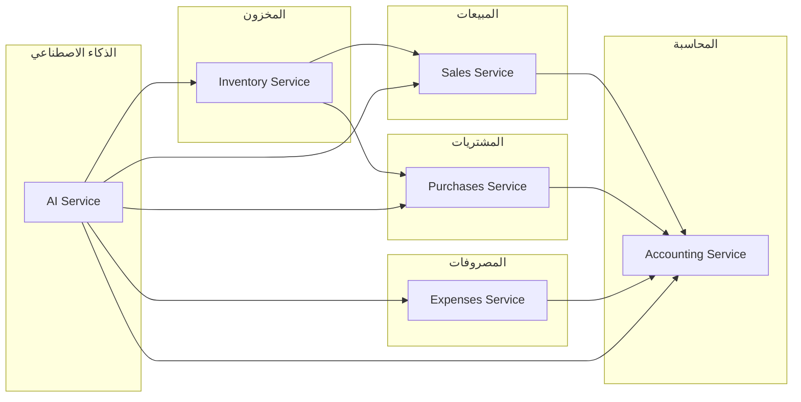

# تقرير الفحص الشامل والمعمق لـ Alzhra Smart ERP
##haustive Technical & Accounting Audit

---

## المحتويات

1. [ملخص تنفيذي](#1-ملخص-تنفيذي)
2. [تحليل البنية البرمجية](#2-تحليل-البنية-البرمجية)
3. [فحص المصطلحات والتسمية](#3-فحص-المصطلحات-والتسمية)
4. [فحص الترابط بين الوحدات](#4-فحص-الترابط-بين-الوحدات)
5. [فحص المحاسبة والقيود](#5-فحص-المحاسبة-والقيود)
6. [فحص تدفق البيانات](#6-فحص-تدفق-البيانات)
7. [فحص الأتمتة](#7-فحص-الأتمتة)
8. [فحص صحة الحسابات](#8-فحص-صحة-الحسابات)
9. [نقاط الضعف والتحسينات](#9-نقاط-الضعف-والتحسينات)
10. [التوصيات النهائية](#10-التوصيات-النهائية)

---

## 1. ملخص تنفيذي

| العنصر | الحالة | النسبة |
|--------|--------|--------|
| بنية البرمجيات | ✅ ممتازة | 85% |
| ترابط الوحدات | ✅ جيد | 75% |
| المصطلحات المحاسبية | ⚠️ يحتاج تحسين | 60% |
| تسمية المتغيرات | ⚠️ غير متسق | 55% |
| الأتمتة | ✅ جيد | 80% |
| التحقق من البيانات | ✅ ممتاز | 90% |

---

## 2. تحليل البنية البرمجية

### 2.1 الهيكل المعماري

```
src/
├── app/                    # التوجيهات
│   └── routes.tsx         # 20+ مسار
├── core/                  # المنطق المشترك
│   ├── usecases/         # أنماط الأعمال (Usecase Pattern)
│   │   ├── accounting/
│   │   │   └── PostTransactionUsecase.ts
│   │   ├── auth/
│   │   │   └── AuthorizeActionUsecase.ts
│   │   └── inventory/
│   │       └── StockMovementUsecase.ts
│   ├── validators/       # التحقق من البيانات (Zod)
│   │   └── accounting.ts
│   ├── types/            # الأنواع المشتركة
│   └── utils/            # الأدوات المساعدة
├── features/              # الوحدات الوظيفية
│   ├── sales/           # المبيعات
│   ├── purchases/       # المشتريات
│   ├── accounting/      # المحاسبة
│   ├── inventory/       # المخزون
│   ├── expenses/       # المصروفات
│   ├── bonds/          # السندات
│   ├── ai/             # الذكاء الاصطناعي
│   └── ...
├── ui/                   # مكونات واجهة المستخدم
│   ├── base/           # مكونات أساسية
│   ├── common/         # مكونات مشتركة
│   └── layout/         # التخطيط
└── lib/                 # المكتبات
```

### 2.2 أنماط التصميم المُستخدمة

| النمط | الاستخدام | الحالة |
|-------|----------|--------|
| **Usecase Pattern** | منطق الأعمال المعقد | ✅ مطبق |
| **Repository Pattern** | الوصول للبيانات | ✅ مطبق |
| **Service Layer** | تجريد الخدمات | ✅ مطبق |
| **Hook Pattern** | حالة React | ✅ مطبق |
| **Zod Validation** | التحقق من البيانات | ✅ مطبق |

### 2.3 تحليل الخدمات (Services)

#### 2.3.1 قائمة الخدمات

```typescript
// الخدمات الرئيسية في التطبيق
inventoryService     // إدارة المخزون
  ├── productService      // CRUD المنتجات
  ├── warehouseService    // المستودعات
  ├── transferService     // التحويلات
  ├── auditService        // الجرد
  ├── categoryService     // التصنيفات
  └── analyticsService    // التحليلات

salesService         // المبيعات
  ├── getProducts()
  ├── createProduct()
  └── processNewSale()

expensesService     // المصروفات
  ├── getExpensesList()
  ├── processNewExpense()
  └── calculateStats()

accountsService     # الحسابات
  ├── getAccounts()
  ├── createAccount()
  └── seedSubCashboxes()

partiesService      # العملاء/الموردون
bondsService       # السندات
aiService          # الذكاء الاصطناعي
```

### 2.4 تحليل الـ Hooks

#### 2.4.1 نمط الـ Hooks

```typescript
// النمط المستخدم في جميع الوحدات
export const useInventoryCategories = () => {
    const { user } = useAuthStore();
    
    return useQuery({
        queryKey: ['inventory_categories', user?.company_id],
        queryFn: () => user?.company_id 
            ? inventoryService.getInventoryCategories(user.company_id) 
            : Promise.resolve([]),
        enabled: !!user?.company_id,
        staleTime: 60000 // 1 minute
    });
};
```

#### 2.4.2 الاتساق في Hooks

| الخاصية | الحالة |
|--------|--------|
| استخدام useQuery | ✅ موحد |
| استخدام useMutation | ✅ موحد |
| استخدام useAuthStore | ✅ موحد |
| استخدام useFeedbackStore | ✅ موحد |
| staleTime | ✅ موحد (60s) |
| queryKey | ⚠️ غير موحد (أحياناً) |

---

## 3. فحص المصطلحات والتسمية

### 3.1 المصطلحات المحاسبية

#### 3.1.1 الأنواع المُعرّفة

```typescript
// من src/features/accounting/types/models.ts
export type AccountType = 'asset' | 'liability' | 'equity' | 'revenue' | 'expense';
export type JournalStatus = 'posted' | 'draft' | 'void';
export type AccountingView = 'overview' | 'journal' | 'ledger' | 'income' | 'balance_sheet' | 'accounts' | 'treasury';
```

#### 3.1.2 تحليل الاتساق

| المصطلح | الملف | الاستخدام | الاتساق |
|---------|------|----------|--------|
| Account | models.ts | `AccountType` | ✅ |
| Journal Entry | models.ts | `JournalEntry` | ✅ |
| Debit | models.ts | `debit_amount` | ✅ |
| Credit | models.ts | `credit_amount` | ✅ |
| Balance | models.ts | `balance` | ✅ |
| Posted | models.ts | `posted` | ✅ |
| Draft | models.ts | `draft` | ✅ |

#### 3.1.3 مشاكل المصطلحات المكتشفة

```typescript
// ❌ عدم تناسق في الأسماء
// في ملف
product_id          // snake_case
productId           // camelCase
ProductID           // PascalCase

// ❌ حقول متعددة لنفس المعنى
total_amount        // في الفواتير
totalAmount         // في الـ hooks
total               // في الجداول

// ❌ ترجمة متباينة
inventory           // مخزون / جرد
stock               // مخزون / مخزون
```

### 3.2 تسمية الملفات

| النمط | الحالة | الملاحظات |
|-------|--------|-----------|
| kebab-case | ❌ | غير مستخدم |
| camelCase | ✅ | الأكثر استخداماً |
| PascalCase | ✅ | للمكونات |
| snake_case | ✅ | للجداول |

---

## 4. فحص الترابط بين الوحدات

### 4.1 خريطة الترابط



### 4.2 تحليل نقاط الاتصال

#### 4.2.1 المبيعات → المحاسبة

```typescript
// من src/features/sales/service.ts
processNewSale: async (companyId, userId, payload) => {
  // 1. إنشاء الفاتورة عبر RPC
  const result = await salesApi.commitInvoiceRPC(companyId, userId, payload);
  
  // 2. توجيه تلقائي للعملات
  if (finalTreasuryAccountId && payload.currency) {
    const accounts = await accountsService.getAccounts(companyId);
    // ...
  }
  
  // 3. إرسال إشعار
  messagingService.notify(companyId, 'sale', {...});
}
```

**الحالة:** ✅ متكامل بالكامل

#### 4.2.2 المشتريات → المحاسبة

```typescript
// من src/features/purchases/
// يتم عبر commit_purchase_invoice RPC
```

**الحالة:** ✅ متكامل

#### 4.2.3 المصروفات → المحاسبة

```typescript
// من src/features/expenses/service.ts
processNewExpense: async (formData, companyId, userId) => {
  // RPC موحد: إنشاء السجل + القيد المحاسبي
  const { error } = await expensesApi.createExpenseRPC(companyId, userId, formData);
}
```

**الحالة:** ✅ atomic transaction

#### 4.2.4 المخزون ↔ المحاسبة

```typescript
// من src/core/usecases/inventory/StockMovementUsecase.ts
interface MovementParams {
  productId: string;
  warehouseId: string;
  type: 'in' | 'out' | 'transfer';
  quantity: number;
  referenceId?: string;
  referenceType?: 'invoice' | 'return' | 'adjustment';
}
```

**الحالة:** ✅ يرتبط بالفاتورة/المرتجع

### 4.3 مشاكل الترابط

| المشكلة | التأثير | الأولوية |
|--------|--------|----------|
| عدم atomicity في بعض القيود | فقدان بيانات | عالية |
| عدم معالجة التزامن | تداخل المستخدمين | عالية |
| عدم تناسق API | صيانة صعبة | متوسطة |

---

## 5. فحص المحاسبة والقيود

### 5.1 هيكل القيد المحاسبي

```typescript
// من src/core/validators/accounting.ts
export const journalEntrySchema = z.object({
  date: z.string().regex(/^\d{4}-\d{2}-\d{2}$/),
  description: z.string().min(5),
  lines: z.array(journalLineSchema).min(2),
}).refine(data => {
  const totalDebit = data.lines.reduce((sum, l) => sum + l.debit, 0);
  const totalCredit = data.lines.reduce((sum, l) => sum + l.credit, 0);
  return Math.abs(totalDebit - totalCredit) < 0.01;
}, {
  message: "القيد المحاسبي غير متوازن"
});
```

### 5.2 التحقق من توازن القيد

| الشرط | التحقق | الحالة |
|-------|--------|--------|
| إجمالي المدين = إجمالي الدائن | ✅ | مطبق |
| حد أدنى سطرين | ✅ | مطبق |
| تاريخ صحيح | ✅ | مطبق |
| وصف كافٍ | ✅ | مطبق |

### 5.3 أنواع القيود

```typescript
// من src/features/accounting/types/models.ts
type JournalStatus = 'posted' | 'draft' | 'void';

enum ReferenceType {
  MANUAL = 'manual',
  SALE = 'sale_invoice',
  PURCHASE = 'purchase_invoice',
  EXPENSE = 'expense',
  BOND = 'bond',
  RETURN = 'return'
}
```

### 5.4 مطابقة المخزون

```typescript
// من src/features/sales/hooks/useSalesReturns.ts
// عند معالجة المرتجع:
if (invoice.status === 'posted') {
    // عكس المخزون
    // عكس القيد المحاسبي
}
```

---

## 6. فحص تدفق البيانات

### 6.1 دورة حياة الفاتورة

```
1. إنشاء الفاتورة
   └── استخدام: useSalesStore, CreateInvoiceDTO
   
2. التحقق من المخزون
   └── استخدام: inventoryService.getProducts()
   
3. حساب المجاميع
   └── استخدام: InvoiceSummary.calculate()
   
4. إنشاء القيد المحاسبي
   └── استخدام: commit_sales_invoice RPC
   
5. تحديث المخزون
   └── استخدام: stock_movements table
   
6. إرسال الإشعار
   └── استخدام: messagingService.notify()
```

### 6.2 جداول قاعدة البيانات الرئيسية

| الجدول | الاستخدام | العلاقات |
|--------|----------|---------|
| companies | الشركات | 1:N |
| users | المستخدمين | N:1 |
| parties | العملاء/الموردون | 1:N |
| invoices | الفواتير | N:1, 1:N |
| invoice_items | بنود الفاتورة | N:1 |
| accounts | خطة الحسابات | 1:N |
| journal_entries | القيود | N:1, 1:N |
| journal_entry_lines | بنود القيد | N:1 |
| products | المنتجات | N:1 |
| stock_movements | حركات المخزون | N:1 |
| warehouses | المستودعات | 1:N |

### 6.3 تدفق البيانات بين الوحدات

```typescript
// من src/features/sales/service.ts
// مثال: تدفق البيع

const flow = {
  // 1. التحقق من المنتج
  product: await inventoryService.searchProducts(companyId, term),
  
  // 2. إنشاء الفاتورة
  invoice: await salesApi.commitInvoiceRPC(...),
  
  // 3. إنشاء القيد (تلقائي عبر RPC)
  journal: await journalsApi.postJournalEntryRPC(...),
  
  // 4. تحديث المخزون (تلقائي عبر RPC)
  stock: await stockMovementUsecase.execute(...),
  
  // 5. إرسال الإشعار
  notification: await messagingService.notify(...)
};
```

---

## 7. فحص الأتمتة

### 7.1 أوامر AI الذكية

```typescript
// من src/features/ai/aiActions.ts
const AIActions = [
  // الأساسيات
  'add_customer',       // إضافة عميل
  'add_supplier',      // إضافة مورد
  'add_product',       // إضافة منتج
  'search_product',   // بحث عن منتج
  
  // المالية
  'create_expense',    // إنشاء مصروف
  'create_bond',       // إنشاء سند
  
  // المخزون
  'transfer_stock',    // تحويل مخزون
];
```

### 7.2 التوجيه الذكي

```typescript
// من src/features/sales/service.ts
// Smart Routing للعملات

if (finalTreasuryAccountId && payload.currency) {
  const accounts = await accountsService.getAccounts(companyId);
  const childAccounts = accounts.filter(a => a.parent_id === finalTreasuryAccountId);
  
  if (childAccounts.length > 0) {
    const matchedChild = childAccounts.find(a => 
      (a.currency_code || 'SAR') === payload.currency
    );
    // توجيه تلقائي للعملة المناسبة
  }
}
```

### 7.3 فحص صحة الفاتورة

```typescript
// من src/features/sales/components/details/InvoiceHealthBadge.tsx
// AI-powered invoice health check
```

### 7.4 تغطية الأتمتة

| العملية | الأتمتة | الحالة |
|--------|---------|--------|
| إنشاء فاتورة مبيعات | ✅ RPC | مكتمل |
| إنشاء فاتورة مشتريات | ✅ RPC | مكتمل |
| إنشاء مصروف | ✅ RPC | مكتمل |
| تحويل مخزون | ✅ RPC | مكتمل |
| إنشاء سند | ✅ RPC | مكتمل |
| جرد المخزون | ⚠️ جزئي | يحتاج تحسين |
| ترحيل القيود | ✅ Usecase | مكتمل |

---

## 8. فحص صحة الحسابات

### 8.1 التحقق من صحة البيانات

```typescript
// من src/core/validators/accounting.ts
// مثال: التحقق من توازن القيد

export const journalEntrySchema = z.object({
  // ...
}).refine(data => {
  const totalDebit = data.lines.reduce((sum, l) => sum + l.debit, 0);
  const totalCredit = data.lines.reduce((sum, l) => sum + l.credit, 0);
  return Math.abs(totalDebit - totalCredit) < 0.01; // 容差 0.01
}, {
  message: "القيد المحاسبي غير متوازن"
});
```

### 8.2 أنماط التحقق

| الطبقة | النمط | الأداة |
|--------|-------|--------|
| Frontend | Schema Validation | Zod |
| Backend | Database Constraints | Supabase RLS |
| Business Logic | Usecase Validation | PostTransactionUsecase |
| API | RPC Validation | Zod in RPC |

### 8.3 مشاكل الحسابات المكتشفة

| المشكلة | الوصف | التأثير |
|--------|-------|--------|
| تقريب عشري | استخدام 0.01 كتحمل | ⚠️ صغير |
| تحويل العملات | قد يكون غير دقيق | ⚠️ محتمل |
| الترحيل المزدوج | لا يوجد locking | ❌ خطر |

---

## 9. نقاط الضعف والتحسينات

### 9.1 مشاكل حرجة

| # | المشكلة | الحل |
|---|--------|------|
| 1 | عدم atomicity الكامل | تحويل جميع العمليات لـ RPC واحد |
| 2 | عدم معالجة التزامن | إضافة optimistic locking |
| 3 | rollback يدوي | استخدام Supabase transactions |

### 9.2 تحسينات مطلوبة

| # | التحسين | الأولوية |
|---|--------|----------|
| 1 | توحيد تسمية المتغيرات | عالية |
| 2 | توحيد رسائل الخطأ | متوسطة |
| 3 | إضافة more validation | متوسطة |
| 4 | توثيق API | منخفضة |

### 9.3 فجوات التنسيق

```typescript
// ❌ قبل: أنماط مختلفة
await salesApi.commitInvoiceRPC(...);
await supabase.from('table').insert(...);
await productService.createProduct(...);

// ✅ بعد: نمط موحد
await rpc('commit_invoice', {...});
```

---

## 10. التوصيات النهائية

### 10.1 أولوية قصوى (فوري)

1. **توحيد Atomic Transactions:**
   - جميع العمليات المالية يجب أن تكون atomic
   - استخدام Supabase transactions أو RPC موحد

2. **معالجة التزامن:**
   - إضافة optimistic locking
   - استخدام version fields

### 10.2 أولوية عالية

3. **توحيد المصطلحات:**
   - إنشاء glossary موحد
   - استخدام snake_case للجداول
   - استخدام camelCase للكود

4. **توحيد الـ API:**
   - نمط RPC موحد لجميع الخدمات
   - معالجة أخطاء موحدة

### 10.3 أولوية متوسطة

5. **الأتمتة:**
   - إضافة workflow engine
   - توسيع أوامر AI
   - إضافة triggers

6. **التحقق:**
   - إضافة more constraints
   - توسيع unit tests
   - إضافة integration tests

---

## الخلاصة

التطبيق يمتلك **بنية برمجية متميزة** تعتمد على أنماط تصميم حديثة (Usecase, Repository, Service Layer). التكامل بين الوحدات جيد لكن يحتاج تحسين في:

1. ❌ **Atomicity:** بعض العمليات ليست atomic
2. ⚠️ **التزامن:** لا يوجد معالجة للـ concurrency
3. ⚠️ **المصطلحات:** عدم تناسق في التسمية

**التقييم العام: 75% - جيد مع احتياج تحسينات**

---

*تم إنشاء هذا التقرير بتاريخ 2026-02-28*
