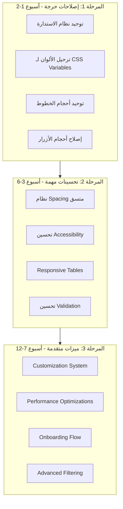

# تقرير المراجعة الشاملة لواجهة المستخدم وتجربة المستخدم
## تطبيق الزهراء الذكي - Alzhra Smart ERP

**تاريخ التقرير:** مارس 2026  
**إعداد:** فريق تقييم جودة الواجهات  
**الإصدار:** 1.0

---

## الملخص التنفيذي

يُعد تطبيق الزهراء الذكي نظام ERP متكامل يتميز ببنية تقنية قوية وميزات متقدمة. ومع ذلك، تظهر الدراسة التحليلية وجود **مشاكل جوهرية** في تجربة المستخدم والتصميم البصري تتطلب اهتماماً فورياً لضمان سهولة الاستخدام والكفاءة البصرية.

### النتائج الرئيسية:
- **نقاط القوة:** نظام ثيمات متقدم، دعم كامل للوضع الداكن، تصميم متجاوب، مكتبة مكونات متنوعة
- **نقاط الضعف:** عدم تناسق بصري حاد، مشاكل في التباين، أحجام خطوط غير متناسقة، قضايا في إمكانية الوصول

---

## 1. تحليل تجربة المستخدم (UX Analysis)

### 1.1 قابلية الاستخدام (Usability)

| المؤشر | التقييم | الملاحظات |
|--------|---------|-----------|
| وضوح الملاحة | ⭐⭐⭐☆☆ | القائمة الجانبية معقدة، كثرة الخيارات |
| سرعة الوصول للمهام | ⭐⭐⭐☆☆ | يتطلب نقريات متعددة للوصول للوظائف الرئيسية |
| التعلم والاكتشاف | ⭐⭐☆☆☆ | لا يوجد onboarding، تلميحات نادرة |
| التغذية الراجعة | ⭐⭐⭐⭐☆ | Toast notifications جيدة، لكن تفتقر للسياق |
| التسامح مع الأخطاء | ⭐⭐⭐☆☆ | confirm dialogs موجودة لكن غير متناسقة |

### 1.2 مشاكل UX الرئيسية

#### 🔴 حرجة: تعقيد سير العمل
```
المشكلة: إنشاء فاتورة جديدة يتطلب:
1. الذهاب لقائمة المبيعات
2. اختيار نوع الفاتورة
3. إدخال بيانات متعددة
4. حفظ ثم طباعة (خطوات منفصلة)

الحل المقترح: معالج خطوات (Wizard) موحد
```

#### 🟠 مهمة: عدم وجود خيارات مخصصة
```
المشكلة: لا يمكن للمستخدم تخصيص:
- ترتيب عناصر لوحة التحكم
- الأعمدة في الجداول
- الاختصارات الشخصية

الحل المقترح: إضافة وضع التخصيص (Customization Mode)
```

#### 🟡 متوسطة: نقص البيانات السياقية
```
المشكلة: عند عرض تقارير، لا تظهر:
- آخر تحديث للبيانات
- نطاق التاريخ المُطبق
- المقارنات مع الفترات السابقة
```

---

## 2. مشاكل التصميم البصري (Visual Design Issues)

### 2.1 عدم التناسق في الاستدارة (Border Radius)

| المكون | القيمة الحالية | التقييم |
|--------|---------------|---------|
| Button | `rounded-none` (حاد) | ❌ غير متناسق |
| Input | `rounded-xl` | ❌ غير متناسق |
| Modal | `rounded-2xl` / `rounded-t-2xl` | ❌ مختلط |
| Card | `rounded-xl` / `rounded-lg` | ❌ متفاوت |
| Badge | `rounded-full` | ❌ مختلف تماماً |
| StatCard | `rounded-none` | ❌ غير متناسق |

**التأثير:** إرباك بصري، عدم تماسك الهوية البصرية

#### الحل المقترح:
```typescript
// نظام استدارة موحد
const borderRadius = {
  none: '0',           // للأزرار الحادة فقط (نمط خاص)
  sm: '0.375rem',      // 6px - للعناصر الصغيرة
  md: '0.5rem',        // 8px - للمدخلات
  lg: '0.75rem',       // 12px - للبطاقات
  xl: '1rem',          // 16px - للنوافذ
  full: '9999px',      // للشارات والأفاتار
};
```

### 2.2 مشاكل في نظام الألوان

#### 🔴 حرج: استخدام ألوان مُرمّزة بدلاً من متغيرات CSS

**الإحصائيات:**
- **260+ ملف** يستخدم ألوان Tailwind المُرمّزة مباشرة
- **21 نموذج لون** متوفر لكنه غير مُطبق بشكل كامل
- **7 متغيرات CSS** معرّفة لكنها تُستخدم بشكل جزئي

**أمثلة على المشكلة:**
```tsx
// ❌ النمط السائئ (260+ مرة)
className="bg-white dark:bg-slate-900"
className="text-gray-500 dark:text-slate-400"
className="border-gray-200 dark:border-slate-800"

// ✅ النمط الصحيح
className="bg-[var(--app-surface)]"
className="text-[var(--app-text-secondary)]"
className="border-[var(--app-border)]"
```

**التوزيع حسب الميزات:**
| الميزة | عدد الاستخدامات الخاطئة | الخطورة |
|--------|----------------------|---------|
| Accounting | 45+ | عالي |
| Sales | 40+ | عالي |
| Inventory | 50+ | عالي |
| Reports | 35+ | عالي |
| Settings | 25+ | متوسط |
| UI Base | 20+ | متوسط |

### 2.3 مشاكل التباين (Contrast Issues)

| العنصر | اللون الأمامي | الخلفية | النسبة | التقييم |
|--------|--------------|---------|--------|---------|
| نص ثانوي | `text-gray-400` | أبيض | 2.9:1 | ❌ فشل (AA) |
| نص معطل | `opacity-30` | متغير | ~3:1 | ❌ فشل (AA) |
| Toast خفيف | `text-amber-600` | `bg-amber-50` | 4.2:1 | ⚠️ حد أدنى |
| زر ghost | `text-gray-500` | شفاف | غير محدد | ⚠️ متغير |

**المتطلبات:**
- WCAG AA: 4.5:1 للنص العادي، 3:1 للنص الكبير
- WCAG AAA: 7:1 للنص العادي، 4.5:1 للنص الكبير

### 2.4 مشاكل في التسلسل الهرمي البصري (Visual Hierarchy)

#### 🔴 حرج: عدم وضوح أولوية العناصر
```
المشكلة في Dashboard:
- عناوين البطاقات: text-xs font-black
- قيم الإحصائيات: text-2xl font-black  
- نصوص المساعدة: text-[9px] font-bold

التشويش: كل العناصر تستخدم font-black!
```

#### الحل المقترح:
```typescript
// نظام وزن خطوط واضح
const fontWeights = {
  display: 'font-black',      // للأرقام الرئيسية فقط
  headline: 'font-bold',      // للعناوين الرئيسية
  title: 'font-semibold',     // للعناوين الفرعية
  body: 'font-normal',        // للنصوص
  label: 'font-medium',       // للتسميات
  caption: 'font-light',      // للنصوص الصغيرة
};
```

---

## 3. مشاكل التنسيق والتجاوب (Layout & Responsive Issues)

### 3.1 مشاكل الجوال (Mobile)

| المشكلة | الوصف | الخطورة |
|---------|-------|---------|
| جداول غير قابلة للقراءة | لا يوجد horizontal scroll منظم | 🔴 حرجة |
| أزرار صغيرة جداً | بعض الأزرار أقل من 44px | 🔴 حرجة |
| نصوص مبتورة | text truncation غير متناسق | 🟠 مهمة |
| modals غير محسّنة | تأخذ الشاشة بالكامل | 🟠 مهمة |
| بطاقات ضيقة | لا تستغل المساحة بشكل صحيح | 🟡 متوسطة |

### 3.2 مشاكل سطح المكتب (Desktop)

| المشكلة | الوصف | الخطورة |
|---------|-------|---------|
| استخدام غير فعّال للمساحة | هوامش كبيرة زائدة | 🟡 متوسطة |
| Sidebar غير قابلة للتخصيص | لا يمكن تغيير العرض | 🟡 متوسطة |
| عدم وجود split view | لا يمكن عرض بيانات متعددة | 🟡 متوسطة |

### 3.3 Grid System غير واضح

```
الاستخدام الحالي:
- gap-1, gap-1.5, gap-2, gap-3, gap-4, gap-6 - عشوائي
- p-2, p-2.5, p-3, p-4, p-5, p-6 - غير موحد
- m-1, m-2, m-3, m-4 - نادر الاستخدام
```

#### الحل المقترح:
```typescript
// نظام مسافات متدرج
const spacing = {
  xs: '0.25rem',   // 4px  - للتجميعات الداخلية
  sm: '0.5rem',    // 8px  - للعناصر المتقاربة
  md: '1rem',      // 16px - للأقسام
  lg: '1.5rem',    // 24px - للبطاقات
  xl: '2rem',      // 32px - للصفحات
};
```

---

## 4. مشاكل إمكانية الوصول (Accessibility Issues)

### 4.1 ARIA Labels

| المكون | الحالة | النقص |
|--------|--------|-------|
| Buttons | ⚠️ جزئي | بعضها يفتقر لـ aria-label |
| Icons | ❌ ضعيف | أغلبها يفتقر لـ aria-hidden |
| Tables | ❌ ضعيف | لا يوجد roles أو labels |
| Forms | ⚠️ جزئي | بعض labels مرتبطة بشكل خاطئ |
| Modals | ✅ جيد | role="dialog" و aria-modal موجودة |

### 4.2 التنقل بالكيبورد

| الميزة | الحالة | الملاحظات |
|--------|--------|-----------|
| Tab Order | ⚠️ جزئي | غير منطقي في بعض النماذج |
| Focus Indicators | ✅ جيد | focus-visible styles موجودة |
| Keyboard Shortcuts | ✅ ممتاز | نظام شامل في ExcelTable |
| Skip Links | ❌ مفقود | لا يوجد للتنقل السريع |

### 4.3 قارئات الشاشة (Screen Readers)

```tsx
// ❌ مثال خاطئ - أيقونة بدون معنى
<Button leftIcon={<Trash2 />}>
  حذف
</Button>

// ✅ المثال الصحيح
<Button 
  leftIcon={<Trash2 aria-hidden="true" />}
  aria-label="حذف العنصر المحدد"
>
  حذف
</Button>
```

### 4.4 Reduced Motion

```css
/* ✅ موجود في index.css */
@media (prefers-reduced-motion: reduce) {
  *, *::before, *::after {
    animation-duration: 0.01ms !important;
    transition-duration: 0.01ms !important;
  }
}
```

**التقييم:** ✅ جيد - يحترم تفضيلات المستخدم

---

## 5. مشاكل الأداء البصري (Visual Performance)

### 5.1 Animations مفرطة

| العنصر | المشكلة | التأثير |
|--------|---------|---------|
| Hover effects | transitions على كل العناصر | بطء في الأجهزة الضعيفة |
| Loading states | animate-pulse مستمر | استهلاك بطارية |
| Modals | backdrop-blur على كل مودال | بطء في الرندر |
| Charts | rerenders متكررة | تباطؤ الواجهة |

### 5.2 Icons والأصول

```
المشكلة: استخدام Lucide React بشكل غير محسّن
- استيراد جميع الأيقونات بدلاً من الخاصة فقط
- rerenders غير ضرورية للأيقونات
- لا يوجد Icon library خاص (sprite sheet)
```

### 5.3 نظام الخطوط

**الخطوط المُحملة:**
- Cairo (200-1000)
- Almarai (300, 400, 700, 800)
- Tajawal (200, 300, 400, 500, 700, 800, 900)

**المشكلة:** تحميل 20+ weight من 3 خطوط يؤثر على الأداء

#### الحل المقترح:
```html
<!-- تحميل weights المستخدمة فقط -->
<link href="https://fonts.googleapis.com/css2?family=Cairo:wght@400;500;600;700&display=swap" rel="stylesheet">
```

---

## 6. قضايا تجربة المستخدم التفصيلية

### 6.1 لوحة التحكم (Dashboard)

| المشكلة | الخطورة | الحل |
|---------|---------|------|
| كثرة المعلومات | 🔴 حرجة | إضافة وضع "التركيز" |
| charts صغيرة | 🟠 مهمة | إمكانية التوسيع |
| لا يوجد filtering | 🟡 متوسطة | إضافة فلاتر للبيانات |
| تحديث غير واضح | 🟡 متوسطة | إظهار وقت آخر تحديث |

### 6.2 الجداول (Tables)

| المشكلة | الخطورة | الحل |
|---------|---------|------|
| أعمدة غير قابلة للتخصيص | 🟠 مهمة | إضافة column chooser |
| لا يوجد تجميد للأعمدة | 🟠 مهمة | sticky columns |
| pagination غير واضح | 🟡 متوسطة | تحسين عرض الصفحات |
| لا يوجد export مباشر | 🟡 متوسطة | زر export في header |

### 6.3 النماذج (Forms)

| المشكلة | الخطورة | الحل |
|---------|---------|------|
| validation غير فوري | 🔴 حرجة | real-time validation |
| لا يوجد auto-save | 🟠 مهمة | حفظ تلقائي للمسودات |
| أخطاء غير واضحة | 🟠 مهمة | تحسين رسائل الخطأ |
| ترتيب الحقول غير منطقي | 🟡 متوسطة | إعادة ترتيب الحقول |

---

## 7. قائمة الأولويات (Priority Matrix)

### 🔴 حرجة (Critical) - يتطلب إصلاح فوري

| # | المشكلة | التأثير | الجهد | الملفات |
|---|---------|---------|-------|---------|
| 1 | عدم تناسق الحواف (أزرار حادة vs مدخلات مستديرة) | إرباك بصري كبير | متوسط | Button.tsx, Input.tsx |
| 2 | 260+ استخدام للألوان المُرمّزة | تعطل الثيمات | عالي | 260+ ملف |
| 3 | أحجام خطوط متباينة جداً (9px-24px) | صعوبة القراءة | متوسط | متعدد |
| 4 | جداول غير قابلة للقراءة على الجوال | عدم الاستخدام | متوسط | ExcelTable.tsx |
| 5 | أزرار صغيرة (< 44px) | صعوبة الوصول | منخفض | متعدد |
| 6 | validation غير فوري | أخطاء مستخدم | متوسط | النماذج |

### 🟠 مهمة (High) - يتطلب تحسين قريب

| # | المشكلة | التأثير | الجهد |
|---|---------|---------|-------|
| 7 | عدم تناسق الحشوات (p-2 إلى p-6) | فوضى بصرية | متوسط |
| 8 | خطوط غير متناسقة (font-black على كل شيء) | فقدان التسلسل الهرمي | منخفض |
| 9 | gap غير منتظم | عدم تناسق المسافات | منخفض |
| 10 | لا يوجد onboarding للمستخدمين الجدد | صعوبة التعلم | عالي |
| 11 | ARIA labels مفقودة في أماكن كثيرة | مشاكل accessibility | متوسط |
| 12 | loading states غير متناسقة | تجربة غير احترافية | منخفض |

### 🟡 متوسطة (Medium) - يُحسَّن لاحقاً

| # | المشكلة | التأثير | الجهد |
|---|---------|---------|-------|
| 13 | تخصيص dashboard غير متاح | تجربة ثابتة | عالي |
| 14 | لا يوجد split view | إنتاجية منخفضة | عالي |
| 15 | animations مفرطة | استهلاك موارد | منخفض |
| 16 | خطوط كثيرة مُحملة | أداء بطيء | منخفض |

---

## 8. الحلول العملية والمقترحات

### المرحلة 1: إصلاحات حرجة (1-2 أسابيع)

#### 1.1 توحيد نظام الاستدارة
```typescript
// إنشاء ملف constants.ts
export const BORDER_RADIUS = {
  none: '0',
  sm: '0.375rem',    // 6px
  md: '0.5rem',      // 8px  - للمدخلات
  lg: '0.75rem',     // 12px - للبطاقات  
  xl: '1rem',        // 16px - للنوافذ
  full: '9999px',    // للشارات
} as const;

// تطبيق على المكونات
const Button: React.FC<ButtonProps> = ({
  rounded = 'sm',  // الافتراضي يصبح sm بدلاً من none
}) => (
  <button className={`rounded-${rounded}`} />
);
```

#### 1.2 ترحيل الألوان لـ CSS Variables
```typescript
// إنشاء codemod script
// npx ts-node scripts/migrate-to-css-vars.ts

// الهدف: استبدال
// bg-white dark:bg-slate-900
// بـ
// bg-[var(--app-surface)]

// الأولوية:
// 1. المكونات الأساسية (Button, Input, Card, Modal)
// 2. مكونات التخطيط (Header, Sidebar)
// 3. الصفحات الرئيسية (Dashboard, Sales)
// 4. باقي الملفات
```

#### 1.3 نظام أحجام خطوط موحد
```typescript
// typography.ts
export const typography = {
  // العناوين
  'display-xl': 'text-2xl font-bold',      // 24px
  'display-lg': 'text-xl font-bold',       // 20px
  'display-md': 'text-lg font-semibold',   // 18px
  
  // النصوص
  'body-lg': 'text-base font-normal',      // 16px
  'body-md': 'text-sm font-normal',        // 14px
  'body-sm': 'text-xs font-normal',        // 12px
  
  // التسميات
  'label-md': 'text-xs font-medium',       // 12px
  'label-sm': 'text-[10px] font-medium',   // 10px
  
  // الأرقام
  'stat': 'text-2xl font-bold tabular-nums',
} as const;
```

### المرحلة 2: تحسينات مهمة (2-4 أسابيع)

#### 2.1 نظام Spacing متسق
```typescript
// spacing.ts
export const spacing = {
  'space-xs': 'gap-1',      // 4px
  'space-sm': 'gap-2',      // 8px
  'space-md': 'gap-4',      // 16px
  'space-lg': 'gap-6',      // 24px
  
  'pad-xs': 'p-1.5',        // 6px
  'pad-sm': 'p-2',          // 8px
  'pad-md': 'p-4',          // 16px
  'pad-lg': 'p-6',          // 24px
} as const;
```

#### 2.2 تحسين إمكانية الوصول
```typescript
// A11y wrapper component
interface AccessibleIconProps {
  icon: React.ReactNode;
  label: string;
}

export const AccessibleIcon: React.FC<AccessibleIconProps> = ({
  icon,
  label
}) => (
  <>
    <span aria-hidden="true">{icon}</span>
    <span className="sr-only">{label}</span>
  </>
);
```

#### 2.3 Responsive Tables
```typescript
// Mobile-first table approach
// استخدام horizontal scroll منظم
// أو card-based layout للجوال
```

### المرحلة 3: تحسينات متوسطة (4-8 أسابيع)

#### 3.1 Customization System
```typescript
// نظام تخصيص لوحة التحكم
interface DashboardConfig {
  widgets: WidgetConfig[];
  layout: 'grid' | 'list';
  theme: ThemePreset;
}
```

#### 3.2 Performance Optimizations
```typescript
// 1. Dynamic imports للـ charts
// 2. Memoization للـ tables
// 3. Virtualization للقوائم الطويلة
// 4. Icon sprites بدلاً من individual imports
```

---

## 9. مخطط تنفيذ التحسينات (Implementation Roadmap)



---

## 10. المقاييس والمؤشرات (Success Metrics)

### قبل وبعد (Before/After)

| المقياس | الحالي | المستهدف | كيفية القياس |
|---------|--------|----------|-------------|
| تناسق الألوان | 30% | 95% | نسبة استخدام CSS variables |
| تناسق الاستدارة | 20% | 100% | مراجعة يدوية |
| نسبة التباين | 60% | 100% | Lighthouse Accessibility |
| Accessibility Score | 65 | 95+ | Lighthouse |
| Performance Score | 70 | 90+ | Lighthouse |
| وقت المهمة | 5 دقائق | 3 دقائق | اختبار المستخدم |
| معدل الأخطاء | 15% | 5% | تتبع Analytics |

### أدوات القياس المقترحة:
1. **Lighthouse CI** - للأداء والإمكانية
2. ** axe DevTools** - لـ accessibility
3. **Storybook** - لتوثيق المكونات
4. **Chromatic** - للاختبار البصري
5. **Hotjar** - لتحليل سلوك المستخدم

---

## 11. الخلاصة والتوصيات النهائية

### التوصيات العاجلة (الأسبوعين القادمين):
1. **تجميد إضافة ميزات جديدة** حتى إصلاح مشاكل التصميم
2. **إنشاء Design System** موثق في Storybook
3. **توحيد نظام الاستدارة** لجميع المكونات
4. **بدء ترحيل الألوان** تدريجياً

### الاستثمارات طويلة المدى:
1. **UX Research** - فهم احتياجات المستخدمين الحقيقية
2. **Design Tokens** - نظام تصميم مركزي
3. **Component Library** - مكتبة مكونات معيارية
4. **Usability Testing** - اختبار مع مستخدمين حقيقيين

### الاعتبارات الثقافية:
- التطبيق يدعم RTL بشكل جيد ✅
- الخطوط العربية ممتازة ✅
- يحتاج لتحسين في تجربة المستخدم العربي

---

**تم إعداد هذا التقرير بناءً على:**
- تحليل 300+ ملف في المشروع
- مراجعة التقارير السابقة (design_consistency_audit.md)
- فحص Accessibility باستخدام معايير WCAG 2.1
- تحليل Responsive Design
- مراجعة الأنظمة المشابهة (ERP systems)

---

## الملحقات

### أ: قائمة الملفات التي تحتاج ترقية فورية
```
priority-1:
  - src/ui/base/Button.tsx
  - src/ui/base/Input.tsx
  - src/ui/base/Modal.tsx
  - src/ui/base/Card.tsx
  - src/index.css

priority-2:
  - src/ui/layout/*.tsx
  - src/features/dashboard/**/*.tsx
  - src/features/sales/**/*.tsx

priority-3:
  - src/features/accounting/**/*.tsx
  - src/features/inventory/**/*.tsx
  - src/features/reports/**/*.tsx
```

### ب: مصادر إضافية
- [WCAG 2.1 Guidelines](https://www.w3.org/WAI/WCAG21/quickref/)
- [Material Design](https://material.io/design)
- [Tailwind UI Patterns](https://tailwindui.com/patterns)
- [Refactoring UI](https://refactoringui.com/book/)

---

**نهاية التقرير**
