# تقرير الفحص الشامل: التكامل والأتمتة والترابط الوظيفي

## الملخص التنفيذي

تم إجراء فحص معمق لتطبيق **Alzhra Smart ERP** يغطي البنية الوظيفية والأتمتة والترابط بين الوحدات. التطبيق يتمتع ببنية معقدة ومتطورة تربط بين المحاسبة والمخزون والمبيعات والمشتريات والأصول الذكية (AI).

---

## 1. الهيكل الوظيفي للتطبيق

### 1.1 الوحدات الرئيسية (Modules)


### 1.2 قائمة المسارات (Routes)

| المسار | الوحدة | الوظيفة |
|--------|-------|---------|
| `/` | Dashboard | لوحة التحكم الرئيسية |
| `/sales` | Sales | إدارة الفواتير |
| `/purchases` | Purchases | إدارة المشتريات |
| `/accounting` | Accounting | القيود والتقارير |
| `/inventory` | Inventory | إدارة المخزون |
| `/pos` | POS | نقطة البيع |
| `/expenses` | Expenses | المصروفات |
| `/bonds` | Bonds | السندات المالية |
| `/clients` | Customers | العملاء |
| `/suppliers` | Suppliers | الموردين |
| `/reports` | Reports | التقارير |
| `/ai-brain` | AI | الذكاء الاصطناعي |

---

## 2. المصطلحات المحاسبية

### 2.1 الأنواع المُعرّفة

```typescript
// من src/features/accounting/types/models.ts
export type AccountType = 'asset' | 'liability' | 'equity' | 'revenue' | 'expense';
export type JournalStatus = 'posted' | 'draft' | 'void';
export type AccountingView = 'overview' | 'journal' | 'ledger' | 'income' | 'balance_sheet' | 'accounts' | 'treasury';
```

### 2.2 تحليل المصطلحات

| المصطلح الإنجليزي | المصطلح العربي | الاستخدام | الحالة |
|-----------------|--------------|----------|--------|
| Account | حساب | المحاسبة | ✅ موحد |
| Journal Entry | قيد محاسبي | المحاسبة | ✅ موحد |
| Debit | مدين | المحاسبة | ✅ موحد |
| Credit | دائن | المحاسبة | ✅ موحد |
| Balance Sheet | ميزانية عمومية | التقارير | ✅ موحد |
| Income Statement | قائمة الدخل | التقارير | ✅ موحد |
| Invoice | فاتورة | المبيعات/المشتريات | ✅ موحد |
| Return | مرتجع | المبيعات/المشتريات | ✅ موحد |

### 2.3 مشاكل المصطلحات

| الموقع | المصطلح المستخدم | المشكلة |
|-------|-----------------|--------|
| بعض الواجهات | "قيد" vs "أخرى" | عدم تناسق |
| تقارير المخزون | أصناف راكدة vs stale | اختلاف الترجمة |
| المصروفات | مصروف vs تكلفة | استخدام متبادل |

---

## 3. الترابط بين الوحدات (Data Flow)

### 3.1 مبيعات → محاسبة

```typescript
// من src/features/sales/service.ts
processNewSale: async (companyId, userId, payload) => {
  // 1. إنشاء الفاتورة
  const result = await salesApi.commitInvoiceRPC(companyId, userId, enhancedPayload);
  
  // 2. التوجيه الذكي للعملات
  if (finalTreasuryAccountId && payload.currency) {
    const accounts = await accountsService.getAccounts(companyId);
    const childAccounts = accounts.filter(a => a.parent_id === finalTreasuryAccountId);
    // توجيه تلقائي للعملة المناسبة
  }
  
  // 3. إرسال إشعار
  messagingService.notify(companyId, 'sale', {...});
}
```

**الحالة:** ✅ متكامل بالكامل

### 3.2 مصروفات → محاسبة

```typescript
// من src/features/expenses/service.ts
processNewExpense: async (formData, companyId, userId) => {
  // استدعاء RPC الموحد الذي يقوم بإنشاء السجل والقيد المحاسبي معاً
  const { error } = await expensesApi.createExpenseRPC(companyId, userId, formData);
  
  messagingService.notify(companyId, 'expense', {...});
}
```

**الحالة:** ✅ متكامل بالكامل (Atomic Transaction)

### 3.3 مشتريات → محاسبة

```typescript
// من database.types.ts
commit_purchase_invoice: {
  Args: {
    p_company_id, p_user_id, p_supplier_id, p_invoice_number,
    p_issue_date, p_items, p_notes, p_currency, p_exchange_rate
  }
}
```

**الحالة:** ✅ متكامل

### 3.4 مرتجعات المبيعات

```typescript
// من database.types.ts
commit_sale_return: {
  Args: {
    p_company_id, p_user_id, p_party_id, p_items, p_notes,
    p_currency, p_exchange_rate, p_reference_invoice_id, p_return_reason
  }
}
```

**الحالة:** ✅ مرتبط بالفاتورة الأصلية

---

## 4. الأتمتة والذكاء الاصطناعي

### 4.1 إجراءات AI المُعرّفة

```typescript
// من src/features/ai/aiActions.ts
const AIActions = [
  // الأساسيات
  'add_customer',      // إضافة عميل
  'add_supplier',      // إضافة مورد  
  'add_product',       // إضافة منتج
  'search_product',    // بحث عن منتج
  
  // المالية
  'create_expense',    // إنشاء مصروف
  'create_bond',       // إنشاء سند
  
  // التحويلات
  'transfer_stock',    // تحويل مخزون
]
```

### 4.2 التكامل مع الخدمات

```typescript
// من src/features/ai/aiActions.ts
export async function executeAIAction(action, companyId, userId) {
  switch (action.action) {
    case 'add_customer':
      await partiesService.saveParty(companyId, {...});
      break;
    case 'add_product':
      await inventoryService.createProduct({...}, companyId, userId);
      break;
    case 'create_expense':
      await expensesService.processNewExpense({...});
      break;
  }
}
```

**التكامل:** ✅ يتصل بجميع الخدمات الرئيسية

### 4.3 أوامر AI الذكية

| الأمر | الوظيفة | الحالة |
|-------|--------|--------|
| Voice Invoice | إنشاء فاتورة صوتياً | ✅ موجود |
| Smart Routing | توجيه تلقائي للعملات | ✅ موجود |
| Health Check | فحص صحة الفاتورة | ✅ موجود |
| Auto Suggestions | اقتراحات ذكية للقيود | ✅ موجود |

---

## 5. مشاكل التكامل المُحددة

### 5.1 مشاكلatomicity

```typescript
// من src/features/accounting/api/journalsApi.ts
// TODO: Migrate to a single Supabase RPC for true atomic transactions.
// Current approach inserts header + lines in two steps with manual rollback.
postJournalEntryRPC: async (companyId, userId, data) => {
  // 1. إنشاء رأس القيد
  const response1 = await supabase.from('journal_entries').insert(...);
  
  // 2. إدخال الأسطر (إذا فشل يتم حذف الرأس يدوياً)
  try {
    const { error: lError } = await supabase.from('journal_entry_lines').insert(lines);
    if (lError) {
      await supabase.from('journal_entries').delete().eq('id', journalData.id); // Rollback
    }
  }
}
```

**المشكلة:** ❌ ليست atomic حقيقية - تعتمد على rollback يدوي

### 5.2 مشاكل التزامن (Concurrency)

```typescript
// من src/features/sales/service.ts
// لا يوجد معالجة للـ concurrency
// 여러 사용자가 동시에 같은 재고를 수정할 경우 문제 발생 가능
```

**المشكلة:** ❌ لا يوجد optimistic locking

### 5.3 عدم تناسق في معالجة الأخطاء

```typescript
// في بعض الوحدات
throw new Error("some error");  // رسالة إنجليزية

// في وحدات أخرى
throw new Error("الرسالة بالعربية");
```

**المشكلة:** ❌ عدم تناسق في رسائل الخطأ

---

## 6. تناسق الخدمات (Service Consistency)

### 6.1 مقارنة الخدمات

| الخدمة | طريقة الإنشاء | طريقة التحديث | طريقة الحذف | الحالة |
|-------|-------------|-------------|-----------|--------|
| Sales | RPC | RPC | API | ✅ |
| Purchases | RPC | RPC | API | ✅ |
| Expenses | RPC | - | API | ⚠️ جزئي |
| Inventory | Service | Service | API | ✅ |
| Accounting | API | API | API | ✅ |
| Bonds | RPC | RPC | - | ⚠️ جزئي |

### 6.2 اختلاف أنماط API

```typescript
// نمط 1: RPC
await salesApi.commitInvoiceRPC(companyId, userId, payload);

// نمط 2: Direct API
await supabase.from('table').insert(data);

// نمط 3: Service Layer
await productService.createProduct(data, companyId, userId);
```

**المشكلة:** ⚠️ ثلاثة أنماط مختلفة - يحتاج توحيد

---

## 7. هيكل قاعدة البيانات

### 7.1 الجداول الرئيسية

```
┌─────────────────┐     ┌──────────────────┐
│   companies     │     │    users         │
├─────────────────┤     ├──────────────────┤
│ id              │     │ id               │
│ name            │     │ email            │
│ settings        │     │ full_name        │
└─────────────────┘     └──────────────────┘
         │
         ├──────────┬──────────┬──────────┐
         ▼          ▼          ▼          ▼
    ┌─────────┐ ┌─────────┐ ┌─────────┐ ┌─────────┐
    │invoices │ │products │ │accounts │ │parties  │
    └─────────┘ └─────────┘ └─────────┘ └─────────┘
```

### 7.2 الوظائف المُخزنة (Stored Functions)

| الوظيفة | الوظيفة | الوصف |
|--------|--------|-------|
| commit_sales_invoice | ✅ | إنشاء فاتورة مبيعات |
| commit_purchase_invoice | ✅ | إنشاء فاتورة مشتريات |
| commit_sale_return | ✅ | إنشاء مرتجع مبيعات |
| commit_purchase_return | ✅ | إنشاء مرتجع مشتريات |
| create_financial_bond | ✅ | إنشاء سند مالي |
| get_warehouses_with_stats | ✅ | جلب المستودعات |

---

## 8. نقاط القوة في التكامل

### 8.1 نقاط القوة ✅

1. **RPC مُتّسق:** جميع العمليات المالية تستخدم Supabase RPC
2. **تعدد العملات:** دعم SAR, YER, USD مع تحويل تلقائي
3. **AI مُتّصل:** جميع الخدمات متصلة بواجهة AI
4. **إشعارات:** نظام إشعارات موحد
5. **دليل الحسابات:** شجرة حسابات متصلة

### 8.2 البيانات المشتركة

```typescript
// الحقول المشتركة في جميع المعاملات
{
  company_id: string,    // الشركة
  created_by: string,    // المستخدم
  created_at: string,    // الوقت
  currency_code: string, // العملة
  exchange_rate: number  // سعر الصرف
}
```

---

## 9. المشاكل والتوصيات

### 9.1 مشاكل حرجة

| المشكلة | التأثير | الحل المقترح |
|---------|--------|-------------|
| عدم atomicity في القيود | فقدان البيانات عند الفشل | تحويل لـ RPC واحد |
| عدم معالجة التزامن | تداخل البيانات | إضافة optimistic locking |
| rollback يدوي | عدم اكتمال المعاملة | استخدام transactions |

### 9.2 تحسينات مطلوبة

1. **توحيد أنماط API:**
   - جميع الخدمات يجب أن تستخدم نفس النمط
   - يفضل RPC للمعاملات المعقدة

2. **معالجة الأخطاء:**
   - توحيد رسائل الخطأ
   - إضافة error codes
   - تسجيل مركزي للأخطاء

3. **التحقق من البيانات:**
   - إضافة validation مُوحّد
   - استخدام Zod أو Yup

4. **التوثيق:**
   - توثيق جميع الوظائف
   - إضافة JSDoc للخدمات

---

## 10. خريطة الترابط النهائية

```mermaid
graph LR
    subgraph "الواجهة الأمامية"
        UI[React Components]
    end
    
    subgraph "الخدمات"
        SS[Sales Service]
        PS[Purchase Service]
        ES[Expense Service]
        IS[Inventory Service]
        AS[Accounting Service]
        AIS[AI Service]
    end
    
    subgraph "الطبقة البيانات"
        API[Supabase API]
        RPC[RPC Functions]
    end
    
    UI --> SS
    UI --> PS
    UI --> ES
    UI --> IS
    UI --> AS
    UI --> AIS
    
    SS --> API
    SS --> RPC
    PS --> RPC
    ES --> RPC
    IS --> API
    AS --> API
    AIS --> SS
    AIS --> PS
    AIS --> ES
    AIS --> IS
```



---

## الخلاصة

التطبيق يمتلك **بنية تكاملية متقدمة** تربط بين:
- ✅ المحاسبة والمالية
- ✅ المبيعات والمشتريات
- ✅ المخزون والمستودعات
- ✅ الذكاء الاصطناعي

**المشاكل الرئيسية:**
- ❌ عدم atomicity في بعض المعاملات
- ❌ عدم معالجة التزامن
- ❌ عدم تناسق أنماط API
- ⚠️ توحيد رسائل الخطأ

**التوصية:** تحسين الطبقة البيانات لتكون atomic بالكامل مع إضافة معالجة التزامن مناسبة.
