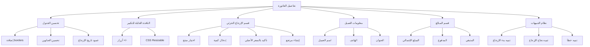

# خطة تحسين تفاصيل الفاتورة

## ملخص المهمة
تحسين نافذة تفاصيل الفاتورة في نظام الزهراء سمارت لإضافة:
1. جدول محسّن بخطوط للأعمدة والخلايا
2. نافذة قابلة للتكبير/التصغير
3. أيقونة داخل تفاصيل الفاتورة
4. إمكانية الإرجاع الجزئي للمنتجات
5. تاريخ الإرجاع لكل منتج
6. معلومات العميل والموقع بشكل موسع
7. قسم المبالغ المدفوعة والمتبقية
8. نظام تنبيهات عند الإرجاع

---

## الملفات المطلوب تعديلها

### 1. `src/ui/base/Modal.tsx`
- إضافة دعم خاصية التكبير/التصغير (Resizable)
- إضافة أزرار التحكم بالحجم
- إضافة أنماط CSS للحجم المتغير

### 2. `src/features/sales/components/details/InvoiceDetailsModal.tsx`
- تحسين تصميم الجدول بخطوط كاملة
- إضافة أيقونة الشركة/المتجر
- إضافة قسم الإرجاع الجزئي
- إضافة أزرار الإجراءات
- إضافة عمود تاريخ الإرجاع
- إضافة معلومات العميل المتقدمة
- إضافة قسم المبالغ

### 3. `src/features/purchases/components/PurchaseDetailsModal.tsx`
- نفس التحسينات للمشتريات

---

## خطوات التنفيذ

### الخطوة 1: تحديث مكون Modal
```
- إضافة state للتحكم بالحجم
- إضافة أزرار (+/-) للتكبير والتصغير
- إضافة resize CSS handler
- دعم size prop: 'sm' | 'md' | 'lg' | 'xl' | '2xl' | '3xl' | '4xl' | '5xl' | 'full' | 'resizable'
```

### الخطوة 2: تحسين جدول تفاصيل الفاتورة
```
- إضافة border كامل للخلايا
- تحسين تنسيق العناوين
- إضافة ألوان متناوبة للصفوف (zebra striping)
- تحسين محاذاة النصوص
- إضافة عمود "تاريخ الإرجاع" لكل منتج
```

### الخطوة 3: إضافة أيقونة
```
- أيقونة Company/Building في ترويسة النافذة
- أو أيقونة مخصصة للشركة من إعدادات النظام
```

### الخطوة 4: إضافة أزرار الإجراءات
```
- زر طباعة
- زر تصدير PDF
- زر تصدير Excel
- زر إرجاع (جديد)
```

### الخطوة 5: إضافة قسم الإرجاع الجزئي
```
- عرض قائمة بالمنتجات في الفاتورة
- حقل إدخال الكمية للإرجاع
- عرض السعر الأصلي (للقراءة فقط)
- عرض الإجمالي المحسوب
- زر تأكيد الإرجاع
```

### الخطوة 6: إضافة معلومات العميل المتقدمة
```
- اسم العميل
- رقم الهاتف
- العنوان
- أي معلومات إضافية متاحة
```

### الخطوة 7: إضافة قسم المبالغ
```
- المبلغ الإجمالي للفاتورة
- المبالغ المدفوعة
- المبلغ المتبقي
- حالة الدفع
```

### الخطوة 8: نظام التنبيهات
```
- تنبيه عند بدء عملية الإرجاع
- تنبيه عند استكمال الإرجاع
- تنبيه في حال تجاوز الكمية المتاحة للإرجاع
```

---

## المخطط التقني



---

## ملاحظات التنفيذ

1. **الإرجاع الجزئي**: يتم تمرير بيانات الفاتورة الأصلية لنموذج الإرجاع
2. **السعر**: يتم قفل سعر المنتج بسعر الفاتورة الأصلية (غير قابل للتعديل)
3. **التوافق**: يعمل على الوضع الليلي والنهاري
4. **الأداء**: لا يؤثر على أداء التحميل
5. **التنبيهات**: تظهر بشكل toast notification

---

## الحالة: في انتظار الموافقة للتنفيذ
