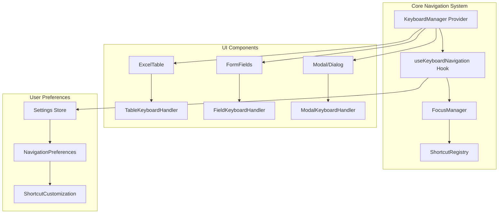

# خطة تطوير نظام التنقل ولوحة المفاتيح المتكامل

## ملخص المشروع

هذا المستند يحدد خطة شاملة لتطوير وتحسين نظام التنقل ولوحة المفاتيح في تطبيق "الزهراء سمارت" لتجربة مستخدم متميزة في إدخال البيانات.

---

## 1. الوضع الحالي (Baseline Analysis)

### 1.1 ما تم إنجازه بالفعل

| المكون | الحالة | الملف |
|--------|--------|-------|
| تنقل بالأسهم في الجداول | ✅ موجود | `src/ui/common/useTableKeyboardNavigation.ts` |
| Tab/Shift+Tab للتنقل | ✅ موجود | نفس الملف |
| Enter للدخول في وضع التعديل | ✅ موجود | نفس الملف |
| تمييز الخلية المحددة | ✅ موجود (outline blue) | `ExcelTable.tsx` |
| Ctrl+K لفتح المساعد الذكي | ✅ موجود | `AIChatButton.tsx` |
|.themeStore للتفضيلات | ✅ موجود (Zustand) | `src/lib/themeStore.ts` |

### 1.2 الفجوات والمطلوب تطويره

1. **تنقل موحد بين جميع المكونات** - الجداول، القوائم، النماذج
2. **اختصارات النسخ واللصق والتحديد** - Ctrl+C, Ctrl+V, Ctrl+A
3. **دعم RTL/LTR للتنقل** - تبديل اتجاه الأسهم
4. **عرض الاختصارات مرئياً** - تلميحات أدوات shortcuts hints
5. **تنقل ذكي في النماذج** - Enter للحقل التالي
6. **ملء تلقائي وحقول متكررة** - autofill
7. **مؤشرات بصرية محسنة** - دليل التركيز والحقول المطلوبة

---

## 2. الهيكل المقترح



---

## 3. قائمة المهام التفصيلية

### المرحلة 1: البنية الأساسية (Core Infrastructure)

#### 1.1 إنشاء نظام إدارة لوحة المفاتيح المركزي

**الملف:** `src/ui/common/keyboard/KeyboardManager.tsx`

```typescript
interface KeyboardManagerProps {
  children: React.ReactNode;
  // إعدادات التنقل
  navigationMode?: 'tabular' | 'grid' | 'freestyle';
  rtlMode?: boolean;
  shortcuts?: ShortcutConfig;
}
```

**المهام:**
- [ ] إنشاء provider للتنقل المركزي
- [ ] تسجيل shortcuts بشكل ديناميكي
- [ ] دعم الأولوية بين المكونات المتداخلة

#### 1.2 إنشاء مخزن الإعدادات

**الملف:** `src/lib/navigationStore.ts`

```typescript
interface NavigationSettings {
  // طريقة التنقل
  navigationMode: 'arrow-keys' | 'tab-only' | 'hybrid';
  
  // اتجاه RTL/LTR للتنقل
  arrowKeyDirection: 'ltr' | 'rtl';
  
  // سلوك Enter
  enterBehavior: 'next-field' | 'submit' | 'edit-cell';
  
  // الاختصارات
  shortcuts: ShortcutPreset;
  
  // المؤشرات البصرية
  showFocusIndicator: boolean;
  focusIndicatorStyle: 'outline' | 'highlight' | 'cursor';
  
  // الملء التلقائي
  autoFillEnabled: boolean;
  autoFillDelay: number;
}
```

**المهام:**
- [ ] إنشاء Zustand store للتفضيلات
- [ ] دعم persist للتخزين المحلي
- [ ] إضافة واجهة في صفحة الإعدادات

### المرحلة 2: تطوير مكون الجدول (ExcelTable Enhancement)

#### 2.1 تحسين useTableKeyboardNavigation

**الملف:** `src/ui/common/useTableKeyboardNavigation.ts` (تطوير)

**الإضافات المطلوبة:**

| المفتاح | الإجراء الحالي | الإجراء الجديد المطلوب |
|---------|---------------|----------------------|
| Arrow Keys | ✅ تنقل بين الخلايا | ✅ مع دعم RTL |
| Tab | ✅ صف واحد للأمام | + Shift+Tab للخلف |
| Enter | ✅ تعديل أو تنقل | + حفظ وتنقل |
| Escape | ❌ غير موجود | إلغاء التعديل |
| Ctrl+C | ❌ غير موجود | نسخ القيمة |
| Ctrl+V | ❌ غير موجود | لصق القيمة |
| Ctrl+A | ❌ غير موجود | تحديد الكل |
| Ctrl+S | ❌ غير موجود | حفظ الصف |
| Delete | ❌ غير موجود | حذف المحتوى |
| Home/End | ❌ غير موجود | أول/آخر عمود |
| PageUp/Down | ❌ غير موجود | تنقل الصفحات |

**المهام:**
- [ ] إضافة دعم RTL لأزرار الأسهم
- [ ] إضافة اختصارات النسخ واللصق
- [ ] تحسين Enter behavior
- [ ] إضافة Escape للإلغاء
- [ ] دعم Multi-cell selection

#### 2.2 تحسين المؤشر البصري

**الملف:** `src/ui/common/ExcelTable.tsx`

```typescript
// أنماط المؤشر المقترحة
interface FocusIndicator {
  style: 'outline' | 'fill' | 'border' | 'cursor';
  color: string; // متغير من theme
  animation: 'none' | 'pulse' | 'glow';
}
```

**المهام:**
- [ ] إضافة أنماط متعددة للمؤشر
- [ ] إضافة تأثيرات بصرية (glow, pulse)
- [ ] دعم RTL mirroring للمؤشر
- [ ] إضافة شريط حالة (status bar) للاختصارات

### المرحلة 3: تطوير تنقل النماذج (Forms Navigation)

#### 3.1 إنشاء useFormKeyboardNavigation

**الملف:** `src/ui/common/hooks/useFormKeyboardNavigation.ts`

```typescript
interface UseFormKeyboardNavigationProps {
  // الحقول المرتبة
  fieldOrder: string[];
  // وظيفة الحفظ
  onSave?: () => void | Promise<void>;
  // وظيفة الحذف
  onDelete?: () => void | Promise<void>;
  // التحقق من الصحة
  validateField?: (field: string) => boolean;
}

interface FormNavigationResult {
  // الحالية
  currentField: string | null;
  // التنقل
  goToField: (field: string) => void;
  goToNext: () => void;
  goToPrevious: () => void;
  // الإجراءات
  save: () => void;
  delete: () => void;
  // الحالة
  isFirstField: boolean;
  isLastField: boolean;
}
```

**المهام:**
- [ ] إنشاء hook للتنقل بين الحقول
- [ ] دعم Enter للحقل التالي
- [ ] دعم Tab/Shift+Tab
- [ ] دعم Ctrl+Enter للإرسال

#### 3.2 تحسين Input component

**الملف:** `src/ui/base/Input.tsx` (تطوير)

**المهام:**
- [ ] إضافة دعم Enter key callback
- [ ] إضافة دعم Tab key callback
- [ ] إضافة focus indicator محسّن
- [ ] إضافة required indicator
- [ ] دعم autofill

### المرحلة 4: اختصارات لوحة المفاتيح (Keyboard Shortcuts)

#### 4.1 إنشاء نظام shortcuts موحد

**الملف:** `src/ui/common/keyboard/useShortcuts.ts`

```typescript
interface Shortcut {
  key: string;
  modifiers: ('ctrl' | 'alt' | 'shift' | 'meta')[];
  action: () => void;
  description: string;
  descriptionAr: string;
  category: 'navigation' | 'editing' | 'selection' | 'form' | 'global';
}

const DEFAULT_SHORTCUTS: Shortcut[] = [
  // التنقل
  { key: 'ArrowUp', modifiers: [], action: 'moveUp', ... },
  { key: 'ArrowDown', modifiers: [], action: 'moveDown', ... },
  { key: 'Tab', modifiers: ['shift'], action: 'movePrevious', ... },
  
  // التحرير
  { key: 'c', modifiers: ['ctrl'], action: 'copy', ... },
  { key: 'v', modifiers: ['ctrl'], action: 'paste', ... },
  { key: 'a', modifiers: ['ctrl'], action: 'selectAll', ... },
  { key: 's', modifiers: ['ctrl'], action: 'save', ... },
  
  // الإجراءات
  { key: 'Enter', modifiers: ['ctrl'], action: 'submit', ... },
  { key: 'Escape', modifiers: [], action: 'cancel', ... },
];
```

**المهام:**
- [ ] إنشاء registry للاختصارات
- [ ] إضافة نظام الأولوية
- [ ] دعم التعطيل المؤقت
- [ ] إضافة تلميحات مرئية

#### 4.2 إضافة Keyboard Shortcuts Panel

**الملف:** `src/ui/common/keyboard/KeyboardShortcutsPanel.tsx`

**المهام:**
- [ ] عرض جميع الاختصارات المتاحة
- [ ] فلترة حسب السياق
- [ ] دعم التخصيص
- [ ] تلميحات سريعة (tooltips)

### المرحلة 5: دعم RTL/LTR

#### 5.1 إنشاء RTL Navigation Hook

**الملف:** `src/ui/common/hooks/useRTLNavigation.ts`

```typescript
interface UseRTLNavigationProps {
  rtlMode: boolean; // من الإعدادات
  onDirectionChange?: (direction: 'ltr' | 'rtl') => void;
}

interface RTLNavigationResult {
  // تبديل的方向
  leftKey: 'ArrowLeft' | 'ArrowRight';
  rightKey: 'ArrowRight' | 'ArrowLeft';
  // تنقل RTL
  isRTL: boolean;
  // functions
  getNextCell: (current: CellPosition) => CellPosition;
  getPreviousCell: (current: CellPosition) => CellPosition;
}
```

**المهام:**
- [ ] تحويل ArrowLeft/ArrowRight حسب RTL
- [ ] تحويل Home/End behavior
- [ ] تحويل Tab behavior
- [ ] دعم التبديل الديناميكي

### المرحلة 6: واجهة الإعدادات (Settings Interface)

#### 6.1 إضافة قسم لوحة المفاتيح في الإعدادات

**الملف:** `src/features/settings/KeyboardSettingsPage.tsx`

**الأقسام:**
1. **طريقة التنقل** (Navigation Mode)
   - أسهم لوحة المفاتيح فقط
   - Tab فقط
   - كلاهما (Hybrid)

2. **اتجاه التنقل** (Navigation Direction)
   - من اليسار لليمين
   - من اليمين لليسار

3. **سلوك Enter** (Enter Behavior)
   - الانتقال للحقل التالي
   - إرسال النموذج
   - تحرير الخلية

4. **الاختصارات** (Shortcuts)
   - عرض جميع الاختصارات
   - تخصيص الاختصارات

5. **المؤشرات البصرية** (Visual Indicators)
   - نمط المؤشر
   - لون المؤشر
   - تأثيرات بصرية

**المهام:**
- [ ] إنشاء صفحة الإعدادات
- [ ] ربطها مع navigationStore
- [ ] إضافة معاينة مباشرة

---

## 4. خريطة الملفات المطلوب إنشاؤها/تعديلها

### ملفات جديدة

| الملف | الوصف |
|------|-------|
| `src/lib/navigationStore.ts` | مخزن إعدادات التنقل |
| `src/ui/common/keyboard/KeyboardManager.tsx` | Provider للتنقل |
| `src/ui/common/keyboard/KeyboardShortcutsPanel.tsx` | لوحة الاختصارات |
| `src/ui/common/hooks/useFormKeyboardNavigation.ts` | تنقل النماذج |
| `src/ui/common/hooks/useRTLNavigation.ts` | دعم RTL |
| `src/ui/common/hooks/useClipboard.ts` | clipboard operations |
| `src/features/settings/KeyboardSettingsPage.tsx` | صفحة الإعدادات |

### ملفات للتعديل

| الملف | التعديلات |
|------|----------|
| `src/ui/common/useTableKeyboardNavigation.ts` | إضافة RTL، shortcuts |
| `src/ui/common/ExcelTable.tsx` | تحسين المؤشر، status bar |
| `src/ui/base/Input.tsx` | callbacks للتنقل |
| `src/lib/themeStore.ts` | إضافة إعدادات التنقل |
| `src/app/routes.tsx` | إضافة صفحة الإعدادات |

---

## 5. تفاصيل التنفيذ

### 5.1 تنقل الجداول (Table Navigation)

```typescript
// مثال على تنقل RTL في الجداول
const getNavigationDirection = (rtl: boolean) => {
  if (rtl) {
    return {
      ArrowRight: 'previous',  // في RTL، اليمين = السابق
      ArrowLeft: 'next',       // في RTL، اليسار = التالي
      Home: 'lastColumn',      // Home = آخر عمود
      End: 'firstColumn',     // End = первый عمود
    };
  }
  return {
    ArrowRight: 'next',
    ArrowLeft: 'previous',
    Home: 'firstColumn',
   Column',
  };
 End: 'last};
```

### 5.2 تنقل النماذج (Form Navigation)

```typescript
// مثال على Enter للتقدم
const handleFieldKeyDown = (e: React.KeyboardEvent, fieldIndex: number) => {
  if (e.key === 'Enter' && !e.shiftKey) {
    e.preventDefault();
    if (isLastField) {
      // إذا كان آخر حقل، أرسل النموذج
      onSubmit?.();
    } else {
      // 否则، انتقل للحقل التالي
      goToField(fields[fieldIndex + 1]);
    }
  }
  
  if (e.key === 'Enter' && e.shiftKey) {
    // Shift+Enter = حقل سابق
    e.preventDefault();
    goToPrevious();
  }
};
```

### 5.3 النسخ واللصق

```typescript
// مثال على clipboard
const handleCopy = () => {
  const value = getCellValue(currentRow, currentCol);
  navigator.clipboard.writeText(value);
  showToast('تم النسخ');
};

const handlePaste = async () => {
  const text = await navigator.clipboard.readText();
  setCellValue(currentRow, currentCol, text);
  // التحديث في قاعدة البيانات
  onCellUpdate?.(currentRow, currentCol, text);
};
```

---

## 6. الجدول الزمني المقترح

### الأسبوع 1: البنية الأساسية
- [ ] إنشاء KeyboardManager
- [ ] إنشاء navigationStore
- [ ] ربط الإعدادات مع themeStore

### الأسبوع 2: تطوير الجداول
- [ ] تحسين useTableKeyboardNavigation
- [ ] إضافة RTL support
- [ ] إضافة clipboard operations

### الأسبوع 3: تطوير النماذج
- [ ] إنشاء useFormKeyboardNavigation
- [ ] تحسين Input component
- [ ] إضافة keyboard shortcuts

### الأسبوع 4: الواجهة والإعدادات
- [ ] إنشاء KeyboardShortcutsPanel
- [ ] إنشاء KeyboardSettingsPage
- [ ] الاختبار والتوثيق

---

## 7. الاعتبارات الفنية

### التوافقية
- ✅ React 18+
- ✅ TypeScript
- ✅ Tailwind CSS
- ✅ Zustand (state management)
- ✅ RTL (اللغة العربية)

### الأداء
- استخدام useCallback/useMemo
- Event delegation للوحات المفاتيح
- Lazy loading للاختصارات

### إمكانية الوصول (Accessibility)
- ARIA labels للحقول
- التركيز المرئي
- دعم قارئات الشاشة

---

## 8. نقاط المراجعة (Checkpoints)

1. **✅ مراجعة البنية** - هل الهيكل مناسب؟
2. **⬜ تطوير core** - هل Provider يعمل؟
3. **⬜ تطوير الجداول** - هل التنقل سلس؟
4. **⬜ تطوير النماذج** - هل Enter يعمل؟
5. **⬜ الاختصارات** - هل الكوت cut/paste يعمل؟
6. **⬜ الإعدادات** - هل المستخدم يستطيع التخصيص؟
7. **⬜ الاختبار** - هل everything يعمل؟

---

## 9. التالي المتوقع

هل تريد أن أبدأ بتنفيذ أي مرحلة محددة من هذه الخطة؟

أو هل تريد تعديل أي جزء من المتطلبات؟
