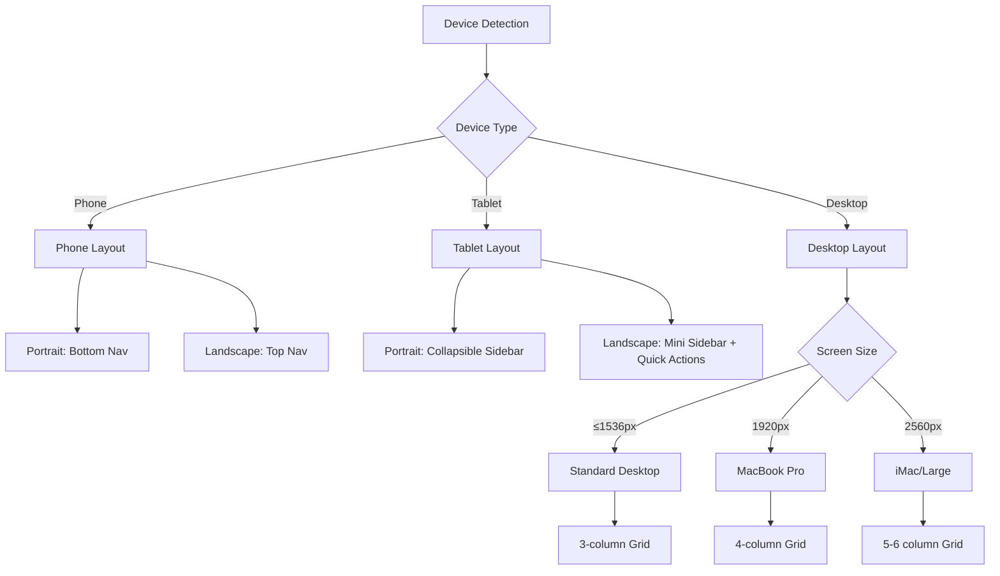
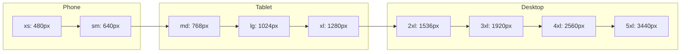

# خطة تحسين التصميم والأبعاد للشاشات الكبيرة (Mac) مع الحفاظ على التوافق مع الأجهزة الأخرى

## ملخص المشروع

هذا المستند يحدد خطة تفصيلية لتحسين تجربة المستخدم على الشاشات الكبيرة (Mac) مع الحفاظ على تجربة متسقة للأجهزة الأخرى (iPad/iPhone) بشكل متماسك.

---

## المرحلة 1: تحليل الوضع الراهن وتحديد الفجوات

### 1.1 تحليل البنية التحتية للتصميم الحالي

| العنصر | الحالة الحالية | الملاحظات |
|--------|---------------|-----------|
| [`useBreakpoint.ts`](src/lib/hooks/useBreakpoint.ts) |_default breakpoints | sm: 640, md: 768, lg: 1024, xl: 1280, 2xl: 1536 |
| [`tailwind.config.js`](tailwind.config.js) | default config | لا توجد نقاط توقف مخصصة للشاشات الكبيرة |
| [`MainLayout.tsx`](src/ui/layout/MainLayout.tsx) | sidebar + header | w-20 (collapsed), w-64 (expanded) |
| [`Sidebar.tsx`](src/ui/layout/Sidebar.tsx) | responsive drawer | mobile drawer + desktop sidebar |
| [`index.css`](src/index.css) | theme variables | CSS custom properties موجودة |

### 1.2 تحديد فجوات التصميم

```
┌─────────────────────────────────────────────────────────────────────┐
│                        الفجوات المحددة                              │
├─────────────────────────────────────────────────────────────────────┤
│ ❌ عدم وجود نقاط توقف للشاشات الكبيرة (1920px+)                     │
│ ❌ عدم تخطيط محتوى الـ Dashboard للعرض العريض                       │
│ ❌ عدم وجود-handling خاص لوضع iPad landscape/portrait              │
│ ❌ عدم وجود تحكم ديناميكي في حجم المكونات حسب حجم الشاشة            │
│ ❌ عدم وجود وضع tablet-specific layout                              │
└─────────────────────────────────────────────────────────────────────┘
```

---

## المرحلة 2: توسيع نظام Breakpoints

### 2.1 إضافة نقاط توقف جديدة للشاشات الكبيرة

**الملف:** [`tailwind.config.js`](tailwind.config.js)

```javascript
theme: {
  extend: {
    screens: {
      // الحالية
      'sm': '640px',
      'md': '768px', 
      'lg': '1024px',
      'xl': '1280px',
      '2xl': '1536px',
      // الجديد - شاشات Mac
      '3xl': '1920px',   // MacBook Pro 16"
      '4xl': '2560px',   // iMac 27"
      '5xl': '3440px',   // Mac Studio
    },
    maxWidth: {
      'app': '1920px',
      'mac': '2560px',
    }
  }
}
```

### 2.2 تحديث [`useBreakpoint.ts`](src/lib/hooks/useBreakpoint.ts)

```typescript
const BREAKPOINTS = {
  // Mobile
  'xs': 480,        // iPhone SE - Small phones
  'sm': 640,        // iPhone - Standard phones
  // Tablet  
  'md': 768,        // iPad mini
  'lg': 1024,       // iPad Air/Pro landscape
  'xl': 1280,       // iPad Pro 12.9" portrait
  // Desktop
  '2xl': 1536,      // MacBook Air 13"
  '3xl': 1920,      // MacBook Pro 14"
  '4xl': 2560,      // MacBook Pro 16" / iMac 24"
  '5xl': 3440,      // iMac 27" / Large displays
};

type BreakpointKey = keyof typeof BREAKPOINTS;
```

### 2.3 إضافة Hook للكشف عن الجهاز

**ملف جديد:** [`src/lib/hooks/useDevice.ts`](src/lib/hooks/useDevice.ts)

```typescript
interface DeviceInfo {
  isMac: boolean;
  isIPad: boolean;
  isIPhone: boolean;
  isTablet: boolean;
  isMobile: boolean;
  isDesktop: boolean;
  devicePixelRatio: number;
  screenWidth: number;
  screenHeight: number;
  orientation: 'portrait' | 'landscape';
}

// Hook returns device type and screen dimensions
export const useDevice = (): DeviceInfo => { ... }
```

---

## المرحلة 3: تحسين Layout الرئيسي

### 3.1 تحديث [`MainLayout.tsx`](src/ui/layout/MainLayout.tsx)

```typescript
//新增响应式布局逻辑
const MainLayout: React.FC = () => {
  const { width } = useWindowSize();
  const { isIPad, isMac, isTablet } = useDevice();
  
  //动态边栏宽度
  const sidebarWidth = useMemo(() => {
    if (width >= 2560) return 'w-24';      // 超大屏幕
    if (width >= 1920) return 'w-28';        // 大屏幕 Mac
    if (width >= 1536) return 'w-24';        // 标准桌面
    return isTablet ? 'w-20' : 'w-20';        // 平板
  }, [width, isTablet]);
  
  //主内容区域最大宽度
  const contentMaxWidth = useMemo(() => {
    if (width >= 2560) return 'max-w-[2400px]';
    if (width >= 1920) return 'max-w-[1800px]';
    if (width >= 1536) return 'max-w-[1400px]';
    return 'max-w-full';
  }, [width]);
  
  return (
    <div className={`h-screen ${contentMaxWidth}`}>
      {/* Sidebar with dynamic width */}
      <Sidebar isCollapsed={isSidebarCollapsed} />
      
      {/* Main content */}
      <main className={sidebarWidth}>
        <Header />
        <Outlet />
      </main>
    </div>
  );
};
```

### 3.2 تحسين Sidebar للشاشات الكبيرة

**الملف:** [`Sidebar.tsx`](src/ui/layout/Sidebar.tsx)

```typescript
//动态边栏行为
const Sidebar: React.FC<SidebarProps> = ({ isCollapsed, ...props }) => {
  const { width } = useWindowSize();
  const { isMac, isIPad } = useDevice();
  
  //大屏幕 Mac 自动展开边栏
  useEffect(() => {
    if (width >= 1920 && isMac) {
      setAutoExpanded(true);
    }
  }, [width, isMac]);
  
  //平板模式
  const isTabletMode = isIPad && width < 1024;
  
  return (
    <aside className={cn(
      //动态宽度
      width >= 2560 ? 'w-28' :
      width >= 1920 ? 'w-24' :
      width >= 1536 ? 'w-22' :
      'w-20',
      
      //平板下可收起
      isTabletMode && 'lg:w-20',
      
      //大屏幕下显示更多内容
      width >= 1920 && 'lg:px-4'
    )}>
      {/* Navigation items with icons and labels */}
      <SidebarNav 
        showLabels={!isCollapsed || width >= 1920}
        iconSize={width >= 1920 ? 'lg' : 'md'}
      />
    </aside>
  );
};
```

---

## المرحلة 4: تحسين تجربة iPad/iPhone

### 4.1 نظام جديد للكشف عن Orientation

**ملف جديد:** [`src/lib/hooks/useOrientation.ts`](src/lib/hooks/useOrientation.ts)

```typescript
type Orientation = 'portrait' | 'landscape';
type DeviceCategory = 'phone' | 'tablet' | 'desktop';

interface OrientationState {
  orientation: Orientation;
  deviceCategory: DeviceCategory;
  isLandscape: boolean;
  isPortrait: boolean;
  isTabletLandscape: boolean;
  isTabletPortrait: boolean;
  isPhoneLandscape: boolean;
  isPhonePortrait: boolean;
}

export const useOrientation = (): OrientationState => { ... }
```

### 4.2 مخطط Layout للجهاز والاتجاه

```
┌─────────────────────────────────────────────────────────────────┐
│                    مخطط الاستجابة للأجهزة                        │
├──────────────────┬──────────────────┬──────────────────────────┤
│ الجهاز            │_orientation      │ التخطيط                  │
├──────────────────┼──────────────────┼──────────────────────────┤
│ iPhone SE        │ Portrait         │ عمود واحد،nav سفلي       │
│ iPhone SE        │ Landscape        │ عمود واحد،nav علوي       │
│ iPhone 14/15     │ Portrait         │ عمود واحد،nav سفلي       │
│ iPhone 14/15     │ Landscape        │ عمود واحد مع تقسيم       │
│ iPad mini        │ Portrait         │ عمودين،sidebar منبثق     │
│ iPad mini        │ Landscape        │ عمودين + sidebar         │
│ iPad Air/Pro     │ Portrait         │ 3 أعمدة،sidebar منبثق    │
│ iPad Air/Pro     │ Landscape        │ 3 أعمدة + sidebar        │
│ MacBook Air/Pro  │ -                │ Sidebar + 3-4 أعمدة      │
│ iMac 24"+        │ -                │ Sidebar موسع + 4-5 أعمدة │
└──────────────────┴──────────────────┴──────────────────────────┘
```

### 4.3 تحديث Navigation للهاتف والتابلت

**الملف:** [`MainLayout.tsx`](src/ui/layout/MainLayout.tsx)

```typescript
//手机和平板的不同导航策略
const MobileNavigation = ({ orientation }: { orientation: Orientation }) => {
  //竖屏：底部导航
  if (orientation === 'portrait') {
    return <BottomNav />;
  }
  
  //横屏：顶部导航
  return <TopNav />;
};

const TabletNavigation = ({ isLandscape }: { isLandscape: boolean }) => {
  //横屏平板：侧边栏 + 底部快捷键
  if (isLandscape) {
    return (
      <>
        <Sidebar mode="mini" />
        <QuickActionsBar />
      </>
    );
  }
  
  //竖屏平板：可折叠侧边栏
  return <CollapsibleSidebar />;
};
```

---

## المرحلة 5: تحسين مكونات Dashboard والصفحات

### 5.1 نظام شبكة ديناميكي

**مبدأ:** عدد الأعمدة يتغير حسب حجم الشاشة

```typescript
// Hook calculates optimal column count
const useGridColumns = () => {
  const { width } = useWindowSize();
  const { isMac, isIPad, orientation } = useDevice();
  
  return useMemo(() => {
    // Large Mac displays
    if (width >= 2560) return 6;  // 6 columns for iMac
    if (width >= 1920) return 5;   // 5 columns for MBP 16"
    if (width >= 1536) return 4;   // 4 columns for MBP 14"
    
    // Standard desktop
    if (width >= 1280) return 3;
    
    // Tablet landscape
    if (isIPad && orientation === 'landscape') return 3;
    
    // Tablet portrait
    if (isIPad && orientation === 'portrait') return 2;
    
    // Phone
    return 1;
  }, [width, isMac, isIPad, orientation]);
};
```

### 5.2 Card المكونات القابلة للتوسع

```typescript
// StatsCard with responsive sizing
const StatsCard: React.FC<StatsCardProps> = ({ 
  title, 
  value, 
  icon 
}) => {
  const { width } = useWindowSize();
  
  const padding = width >= 1920 ? 'p-6' : 
                 width >= 1280 ? 'p-5' : 'p-4';
                 
  const iconSize = width >= 1920 ? 'size-8' :
                   width >= 1024 ? 'size-6' : 'size-5';
                   
  const textSize = width >= 1920 ? 'text-3xl' : 
                   width >= 768 ? 'text-2xl' : 'text-xl';
  
  return (
    <div className={`${padding} bg-card rounded-xl`}>
      <div className={iconSize}>{icon}</div>
      <div className={textSize}>{value}</div>
    </div>
  );
};
```

### 5.3 جدول البيانات المتجاوب

```typescript
// ExcelTable with responsive mode
const ExcelTable: React.FC = () => {
  const { width, orientation } = useWindowSize();
  const { isTablet, isPhone } = useDevice();
  
  // Table responsive modes
  const tableMode = useMemo(() => {
    if (isPhone) return 'compact';           // 手机：紧凑模式
    if (width < 768) return 'card';          // 小平板：卡片模式
    if (isTablet && orientation === 'portrait') return 'card';  // 竖屏平板：卡片
    if (width < 1280) return 'condensed';    // 小桌面：紧凑
    if (width >= 1920) return 'expanded';    // 大屏幕：扩展模式
    return 'standard';                       // 默认
  }, [width, orientation, isTablet, isPhone]);
  
  return (
    <div data-table-mode={tableMode}>
      {/* 不同的表格渲染 */}
    </div>
  );
};
```

---

## المرحلة 6: أنماط CSS جديدة

### 6.1 إضافة أنماط للشاشات الكبيرة

**الملف:** [`src/index.css`](src/index.css)

```css
/* Large screen styles */
@media (min-width: 1920px) {
  :root {
    --spacing-base: 1.25rem;  /* 增加间距 */
    --font-size-base: 1.125rem;
  }
  
  /* Larger cards on big screens */
  .card-responsive {
    padding: 1.5rem;
  }
  
  /* More content visible */
  .sidebar-content {
    padding: 1rem;
  }
}

@media (min-width: 2560px) {
  :root {
    --spacing-base: 1.5rem;
    --font-size-base: 1.25rem;
  }
  
  /* Ultra-wide layouts */
  .layout-ultra-wide {
    max-width: 2800px;
    margin: 0 auto;
  }
}

/* Tablet specific */
@media (min-width: 768px) and (max-width: 1024px) {
  .tablet-layout {
    /* Tablet specific styles */
  }
}

/* Orientation specific */
@media (orientation: landscape) and (max-height: 500px) {
  /* Compact landscape mode for phones */
  .landscape-compact .nav-items {
    gap: 0.5rem;
  }
}
```

### 6.2 CSS Variables للتجاوب

```css
:root {
  /* Spacing that scales with screen */
  --space-xs: 0.25rem;
  --space-sm: 0.5rem;
  --space-md: 1rem;
  --space-lg: 1.5rem;
  --space-xl: 2rem;
  
  /* Font sizes that scale */
  --text-xs: 0.75rem;
  --text-sm: 0.875rem;
  --text-base: 1rem;
  --text-lg: 1.125rem;
  --text-xl: 1.25rem;
  
  /* Component sizes */
  --sidebar-width: 16rem;
  --sidebar-collapsed: 5rem;
  --header-height: 4rem;
}

/* Scale on large screens */
@media (min-width: 1920px) {
  :root {
    --space-md: 1.25rem;
    --space-lg: 2rem;
    --text-base: 1.125rem;
    --sidebar-width: 18rem;
    --header-height: 4.5rem;
  }
}
```

---

## المرحلة 7: تحسينات خاصة بالـ Mac

### 7.1 دعم Retina/HiDPI

```typescript
// Hook for HiDPI displays
const useHiDPI = () => {
  const [isHiDPI, setIsHiDPI] = useState(false);
  
  useEffect(() => {
    const mediaQuery = window.matchMedia(
      '(-webkit-min-device-pixel-ratio: 2), (min-resolution: 192dpi)'
    );
    setIsHiDPI(mediaQuery.matches);
    
    const handler = (e: MediaQueryListEvent) => setIsHiDPI(e.matches);
    mediaQuery.addEventListener('change', handler);
    return () => mediaQuery.removeEventListener('change', handler);
  }, []);
  
  return isHiDPI;
};

// Usage in components
const ChartComponent = () => {
  const isHiDPI = useHiDPI();
  
  return (
    <ResponsiveContainer 
      // Higher resolution for Retina
      pixelRatio={isHiDPI ? 2 : 1}
    >
      <LineChart data={data}>
        {/* ... */}
      </LineChart>
    </ResponsiveContainer>
  );
};
```

### 7.2 Touch/Click适应

```typescript
// Device-aware interactions
const useInteractionMode = () => {
  const { isMac, isIPad, isIPhone } = useDevice();
  const { isHoverable } = usePrefersReducedMotion();
  
  return useMemo(() => {
    if (isIPhone || isIPad) {
      return {
        type: 'touch',
        hitSlop: 8,
        feedbackStyle: 'ripple',
        hoverEffects: false,
      };
    }
    
    if (isMac) {
      return {
        type: 'trackpad',
        hitSlop: 4,
        feedbackStyle: 'highlight',
        hoverEffects: true,
        scrollBehavior: 'smooth',
      };
    }
    
    return {
      type: 'mouse',
      hitSlop: 4,
      feedbackStyle: 'highlight', 
      hoverEffects: true,
    };
  }, [isMac, isIPad, isIPhone]);
};
```

---

## المرحلة 8: اختبار والتحقق

### 8.1 قائمة الأجهزة للم اختبار

```
┌─────────────────────────────────────────────────────────────────┐
│                    قائمة الأجهزة المستهدفة                       │
├────────────────────────┬─────────────┬──────────────────────────┤
│ الجهاز                  │ الدقة       │_orientation              │
├────────────────────────┼─────────────┼──────────────────────────┤
│ iPhone SE              │ 375x667     │ Portrait/Landscape       │
│ iPhone 14/15           │ 390x844     │ Portrait/Landscape       │
│ iPhone 14/15 Pro Max  │ 430x932     │ Portrait/Landscape       │
│ iPad mini              │ 768x1024    │ Portrait/Landscape      │
│ iPad Air               │ 820x1180    │ Portrait/Landscape      │
│ iPad Pro 11"           │ 834x1194    │ Portrait/Landscape      │
│ iPad Pro 12.9"         │ 1024x1366   │ Portrait/Landscape      │
│ MacBook Air 13"        │ 1470x956    │ -                        │
│ MacBook Pro 14"        │ 1512x982    │ -                        │
│ MacBook Pro 16"        │ 1728x1117   │ -                        │
│ iMac 24"               │ 2048x1152   │ -                        │
│ iMac 27"               │ 2560x1440   │ -                        │
│ Mac Studio             │ 3456x2234   │ -                        │
└────────────────────────┴─────────────┴──────────────────────────┘
```

### 8.2 نقاط التحقق الرئيسية

| النقطة | المعيار | الأدوات |
|--------|---------|---------|
|_layout | Sidebar لا يتجاوز 25% من الشاشة على الشاشات الكبيرة | Chrome DevTools |
|الصور | لا stretching على أي جهاز | Visual inspection |
|الأداء | TTI < 3s على جميع الأجهزة | Lighthouse |
|التجاوب | لا horizontal scroll إلا للضرورة | Browser testing |
|الت Accessible | WCAG 2.1 AA على الأقل | axe-core |

---

## المرحلة 9: التنفيذ والتوزيع

### 9.1 الأولويات

```
┌─────────────────────────────────────────────────────────────────┐
│                      ترتيب التنفيذ                              │
├─────┬──────────────────────────────────────┬────────────────────┤
│ م   │ المهمة                                │ الأولوية          │
├─────┼──────────────────────────────────────┼────────────────────┤
│ 1   │ إضافة breakpoints جديدة              │ P0 (حرجة)         │
│ 2   │ تحديث useDevice hook                 │ P0 (حرجة)         │
│ 3   │ تحسين MainLayout                     │ P0 (حرجة)         │
│ 4   │ تحسين Sidebar                        │ P1 (عالية)        │
│ 5   │ إضافة useOrientation                 │ P1 (عالية)        │
│ 6   │ تحديث CSS للشاشات الكبيرة            │ P1 (عالية)        │
│ 7   │ تحسين Dashboard grid                 │ P2 (متوسطة)      │
│ 8   │ تحسين Tables                         │ P2 (متوسطة)      │
│ 9   │ إضافة HiDPI support                 │ P2 (متوسطة)      │
│ 10  │ Testing & QA                         │ P1 (عالية)        │
└─────┴──────────────────────────────────────┴────────────────────┘
```

### 9.2 الملفات المطلوب تعديلها

```
📁 src/
├── lib/hooks/
│   ├── useBreakpoint.ts          # [تعديل] إضافة breakpoints جديدة
│   ├── useDevice.ts              # [جديد] كشف نوع الجهاز
│   └── useOrientation.ts         # [جديد] كشف_orientation
├── ui/layout/
│   ├── MainLayout.tsx            # [تعديل] Layout ديناميكي
│   └── Sidebar.tsx               # [تعديل] Sidebar متجاوب
├── features/dashboard/
│   └── components/
│       └── StatsGrid.tsx         # [تعديل] Grid ديناميكي
├── ui/common/
│   └── ExcelTable.tsx            # [تعديل] Table متجاوب
├── index.css                     # [تعديل] أنماط جديدة
└── tailwind.config.js            # [تعديل] إعدادات breakpoints
```

---

## ملخص الجدول الزمني

| المرحلة | الوصف | المخرجات |
|---------|-------|----------|
| 1 | تحليل الوضع الراهن | تقرير الفجوات |
| 2 | توسيع Breakpoints | [`tailwind.config.js`](tailwind.config.js) محدث, [`useBreakpoint.ts`](src/lib/hooks/useBreakpoint.ts) محدث |
| 3 | تحسين Layout | [`MainLayout.tsx`](src/ui/layout/MainLayout.tsx), [`Sidebar.tsx`](src/ui/layout/Sidebar.tsx) |
| 4 | دعم iPad/iPhone | [`useOrientation.ts`](src/lib/hooks/useOrientation.ts), [`useDevice.ts`](src/lib/hooks/useDevice.ts) |
| 5 | تحسين المكونات | StatsGrid, ExcelTable, Cards |
| 6 | CSS Styles | [`index.css`](src/index.css) محدث |
| 7 | Mac optimizations | HiDPI, Touch/Click adaptation |
| 8 | Testing | تقرير الاختبار |
| 9 | Release | إصدار محدث |

---

## المخططات (Mermaid)

### الهيكل العام للتصميم المتجاوب



### نقاط التوقف (Breakpoints)



---

*آخر تحديث: 2026-03-13*
