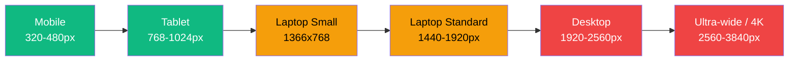

# خطة تحسين التصميم التكيفي للشاشات الكبيرة — AlzhraERP

> **الهدف:** تحويل التطبيق من تصميم mobile-first فقط إلى تصميم responsive-adaptive كامل يستغل مساحات الشاشات الكبيرة (13″–27″+) بذكاء، مع **الحفاظ على تصميم الهاتف الحالي دون أي تغيير**.

---

## 1. تحليل الوضع الحالي

### 1.1 البنية الحالية

| العنصر | الحالة الحالية | المشكلة على الشاشات الكبيرة |
|--------|---------------|---------------------------|
| **نظام Breakpoints** | `useBreakpoint.ts` يدعم حتى `5xl` (3440px) و Tailwind config متطابق | ✅ البنية موجودة لكنها غير مستغلة في المكونات |
| **القائمة الجانبية** | تتسع تدريجياً `w-20` → `w-36` حسب المقاس | ⚠️ تظل مخفية (collapsed) افتراضياً ولا يوجد وضع expanded دائم |
| **Dashboard Grid** | `grid-cols-1 md:grid-cols-2` فقط | ❌ على شاشة 2560px يظهر عمودين فقط — إهدار هائل للمساحة |
| **POS Page** | Split view: كارت `w-[400px] lg:w-[450px]` + grid منتجات | ⚠️ الكارت صغير جداً على شاشات 27″، المنتجات تتمدد بلا حدود |
| **الجداول (Tables)** | تمتد بعرض %100 | ⚠️ أعمدة نحيفة جداً على الشاشات العريضة، صعوبة في القراءة |
| **المحتوى الرئيسي** | `max-w-none px-0` — بلا حد أقصى | ❌ النصوص تمتد عبر 3000px مما يصعب القراءة |
| **Scaling** | `--scale` CSS variable + `font-size: clamp(...)` | ⚠️ scaling بدائي، لا يأخذ في الاعتبار كثافة المعلومات |

### 1.2 أنماط الشاشات المستهدفة



| الفئة | الدقة | نسبة العرض | المساحة المتاحة (بعد sidebar) | الأولوية |
|-------|-------|-----------|------------------------------|----------|
| 📱 Phone | 320–480px | 9:16–9:19.5 | كامل الشاشة | ✅ ممتاز — لا تغيير |
| 📱 Tablet | 768–1024px | ~4:3 | 700–960px | ✅ جيد — تحسينات طفيفة |
| 💻 Laptop | 1366×768–1440×900 | ~16:9 | 1280–1350px | 🟡 متوسط — الأولوية الأولى |
| 🖥️ Desktop | 1920×1080–2560×1440 | 16:9 | 1840–2480px | 🔴 ضعيف — الأولوية الثانية |
| 🖥️ Ultra-wide | 3440×1440 | 21:9 | 3360px | 🔴 ضعيف جداً — الأولوية الثالثة |
| 🖥️ 4K | 3840×2160 | 16:9 | 3760px | 🔴 ضعيف جداً — الأولوية الثالثة |

---

## 2. استراتيجية التصميم التكيفي (Adaptive Strategy)

### 2.1 المبادئ الأساسية

1. **Mobile-first without compromise:** جميع `@media` queries تستخدم `min-width` فقط — لا نلمس mobile إطلاقاً
2. **Progressive Enhancement:** كل Breakpoint يضيف تحسينات ولا يسلب شيئاً
3. **Content-driven Layout:** المحتوى يحدد التخطيط، وليس العكس
4. **Reading Comfort:** `max-width: 75ch` للنصوص الطويلة، `max-width: 1400px` للمحتوى العام
5. **Density Awareness:** كلما كبرت الشاشة، نعرض معلومات أكثر في آنٍ واحد، لا مجرد تكبير العناصر

### 2.2 نظام نقاط الكسر الذكي (Smart Breakpoint Matrix)

```
┌────────────┬──────────────┬──────────────────────┬─────────────────────────────────┐
│ Breakpoint │ Width        │ Device               │ What Changes                     │
├────────────┼──────────────┼──────────────────────┼─────────────────────────────────┤
│ (mobile)   │ < 768px      │ Phone                │ ✅ NO CHANGES — preserved as-is  │
├────────────┼──────────────┼──────────────────────┼─────────────────────────────────┤
│ md         │ ≥ 768px      │ Tablet Portrait      │ Sidebar visible, basic 2-col    │
├────────────┼──────────────┼──────────────────────┼─────────────────────────────────┤
│ lg         │ ≥ 1024px     │ Tablet Landscape     │ Sidebar expands, 2-3 col grids  │
├────────────┼──────────────┼──────────────────────┼─────────────────────────────────┤
│ xl         │ ≥ 1280px     │ Laptop 13-14"        │ 3-col grids, sidebar persistent │
├────────────┼──────────────┼──────────────────────┼─────────────────────────────────┤
│ 2xl        │ ≥ 1536px     │ Laptop 15-17"        │ 3-4 col grids, content max-w    │
├────────────┼──────────────┼──────────────────────┼─────────────────────────────────┤
│ 3xl        │ ≥ 1920px     │ Desktop 21-24"       │ 4-col grids, multi-panel views  │
├────────────┼──────────────┼──────────────────────┼─────────────────────────────────┤
│ 4xl        │ ≥ 2560px     │ Desktop 27" / iMac   │ 5-col, side panels, dual-view   │
├────────────┼──────────────┼──────────────────────┼─────────────────────────────────┤
│ 5xl        │ ≥ 3440px     │ Ultra-wide / 4K      │ Max density, permanent panels   │
└────────────┴──────────────┴──────────────────────┴─────────────────────────────────┘
```

---

## 3. المكونات المستهدفة — مصفوفة الأولويات

### 3.1 الأولوية القصوى (HIGH) — تأثير فوري على كل المستخدمين

| # | المكون | المسار | المشكلة | الحل |
|---|--------|--------|---------|------|
| 1 | **MainLayout** | `src/ui/layout/MainLayout.tsx` | المحتوى بلا `max-width`، الـ sidebar دائم الـ collapse | إضافة content container + sidebar expanded persistent |
| 2 | **DashboardPage** | `src/features/dashboard/DashboardPage.tsx` | `md:grid-cols-2` فقط لكل المقاسات | `xl:grid-cols-3 2xl:grid-cols-4 4xl:grid-cols-5` |
| 3 | **Sidebar** | `src/ui/layout/Sidebar.tsx` | لا وضع expanded دائم للشاشات الكبيرة | Expanded persistent mode عند `3xl`+ مع إمكانية التصغير |
| 4 | **POSPage** | `src/features/pos/pages/POSPage.tsx` | Cart ضيق جداً، product grid متمدد بلا حدود | Cart width dynamic, product grid max-columns |

### 3.2 الأولوية المتوسطة (MEDIUM) — تحسين تجربة صفحات محددة

| # | المكون | المسار | المشكلة | الحل |
|---|--------|--------|---------|------|
| 5 | **InventoryPage** | `src/features/inventory/InventoryPage.tsx` | جدول واحد طويل، لا split-view | `3xl`: split view — جدول + تفاصيل جانبية |
| 6 | **SalesPage** | `src/features/sales/pages/SalesPage.tsx` | تبويبات عمودية، مساحة مهدرة | `xl`: تبويبات أفقية موسعة مع side panel |
| 7 | **ProductDetailModal** | `src/features/inventory/components/ProductDetailModal.tsx` | Modal ضيق جداً على الشاشات الكبيرة | `xl`: modal عرض 60%، `2xl`: split-panel detail |
| 8 | **ExcelTable / ExcelGrid** | `src/ui/common/ExcelTable.tsx` | أعمدة رفيعة وهدر مساحة | `2xl`: كثافة أعمدة أعلى + sticky columns |

### 3.3 الأولوية المنخفضة (LOW) — تحسينات جمالية

| # | المكون | المسار | المشكلة | الحل |
|---|--------|--------|---------|------|
| 9 | **Header** | `src/ui/layout/Header.tsx` | ضيق، لا يستغل المساحة | `xl`: توسيع search bar + breadcrumbs |
| 10 | **MicroHeader** | `src/ui/base/MicroHeader.tsx` | تبويبات مكدسة | `xl`: تبويبات موسعة + actions inline |
| 11 | **StatsGrid** | `src/ui/dashboard/StatsGrid.tsx` | كروت صغيرة | `xl`: كروت أكبر + توزيع أفقي أفضل |
| 12 | **SettingsPage** | `src/features/settings/SettingsPage.tsx` | عمود واحد | `lg`: عمودين (قائمة + محتوى) |

---

## 4. خطة التنفيذ التقنية

### 4.1 المرحلة الأولى: نظام التخطيط الأساسي (Layout Foundation)

#### 4.1.1 إنشاء `src/ui/layout/ContentContainer.tsx` — مكون جديد

غلاف ذكي للمحتوى يطبق `max-width` مناسب لكل breakpoint:

```tsx
// src/ui/layout/ContentContainer.tsx
import { cn } from '../../core/utils';

interface ContentContainerProps {
  children: React.ReactNode;
  /** Allow full-width content on ultra-wide screens for tables/dashboards */
  fluid?: boolean;
  className?: string;
}

const ContentContainer: React.FC<ContentContainerProps> = ({ children, fluid, className }) => (
  <div className={cn(
    'mx-auto w-full px-3 md:px-4 lg:px-6 xl:px-8',
    !fluid && 'max-w-[1400px] 3xl:max-w-[1800px] 4xl:max-w-[2200px] 5xl:max-w-[2800px]',
    className
  )}>
    {children}
  </div>
);
```

#### 4.1.2 تحديث `MainLayout.tsx` — إضافة content wrapper

```tsx
// تعديل السطر 133-142 في MainLayout.tsx
<main className={cn(
  "flex-1 overflow-y-auto custom-scrollbar relative scroll-smooth",
  mainPaddingBottom
)}>
  <ErrorBoundary>
    <Suspense fallback={<PageLoader />}>
      <Outlet />
    </Suspense>
  </ErrorBoundary>
</main>
```

**التعديل:** لا نضيف `ContentContainer` هنا لأن بعض الصفحات (مثل POS) تحتاج full-width. بدلاً من ذلك، كل صفحة تقرر استخدام `ContentContainer` أم لا.

#### 4.1.3 تحديث `sidebarSizing.ts` — دعم expanded persistent للشاشات الكبيرة

```ts
// إضافة إلى sidebarSizing.ts
export const shouldPersistExpandedSidebar = (breakpoint: string): boolean => {
  // على الشاشات الكبيرة جداً (1920+)، القائمة الجانبية تكون موسعة دائماً
  return breakpoint === '3xl' || breakpoint === '4xl' || breakpoint === '5xl';
};

export const getExpandedSidebarWidth = ({ breakpoint, isIPad, isTabletLandscape }: SidebarWidthOptions) => {
  if (breakpoint === '5xl') return 'w-80';    // ultra-wide: narrower sidebar, more content
  if (breakpoint === '4xl') return 'w-80';
  if (breakpoint === '3xl') return 'w-72';    // desktop: comfortable sidebar
  if (isIPad && isTabletLandscape) return 'w-64';
  return 'w-64';                               // default expanded
};
```

#### 4.1.4 تحديث `MainLayout.tsx` — sidebar expanded persistent

```tsx
// في MainLayout.tsx، تعديل حالة الـ sidebar collapse:
const [isSidebarCollapsed, setIsSidebarCollapsed] = useState(() => {
  if (typeof window === 'undefined') return false;
  const width = window.innerWidth;
  // Expanded by default on large screens
  return width < getBreakpointValue('3xl');
});

// مزامنة تلقائية عند تغيير حجم الشاشة
useEffect(() => {
  const isWide = window.innerWidth >= getBreakpointValue('3xl');
  if (isWide) {
    setIsSidebarCollapsed(false); // expanded on large screens
  }
  // لا نفرض collapse على الشاشات الصغيرة — المستخدم يتحكم
}, [breakpoint]);
```

### 4.2 المرحلة الثانية: تحسين Dashboard (أكبر أثر)

#### 4.2.1 تحديث `DashboardPage.tsx` — grid responsive

**الحالي:**
```tsx
<div className="grid grid-cols-1 md:grid-cols-2 gap-3">
```

**المقترح:**
```tsx
<div className={cn(
  "grid gap-3 md:gap-4 xl:gap-5",
  "grid-cols-1",           // phone: 1 column
  "md:grid-cols-2",        // tablet: 2 columns
  "xl:grid-cols-3",        // laptop: 3 columns
  "2xl:grid-cols-4",       // large laptop: 4 columns
  "3xl:grid-cols-4",       // desktop: 4 columns (wider cards)
  "4xl:grid-cols-5"        // ultra-wide: 5 columns
)}>
```

#### 4.2.2 تحديث `StatsGrid` — توزيع أفقي أفضل

```tsx
// StatsGrid يصبح:
<div className={cn(
  "grid gap-3",
  "grid-cols-2 sm:grid-cols-2 md:grid-cols-4",
  "xl:grid-cols-4 2xl:grid-cols-4",
  "3xl:grid-cols-5 4xl:grid-cols-6"  // شاشات كبيرة: صف واحد أفقي
)}>
```

#### 4.2.3 إضافة `DashboardPage` لـ ContentContainer

```tsx
// في DashboardPage.tsx
<div className="flex flex-col h-full bg-[var(--app-bg)] font-cairo relative">
  <MicroHeader ... />
  <div className="flex-1 overflow-y-auto px-1.5 md:px-3 py-3 custom-scrollbar pb-24 relative z-10">
    <ContentContainer> {/* ← جديد */}
      {/* كل المحتوى الحالي */}
    </ContentContainer>
  </div>
</div>
```

### 4.3 المرحلة الثالثة: تحسين POS Page

#### 4.3.1 Cart width ديناميكي

```tsx
// في POSPage.tsx، تعديل عرض cart sidebar
<aside className={cn(
  isDesktop ? [
    'w-[380px]',          // default
    'lg:w-[420px]',       // laptop
    'xl:w-[480px]',       // large laptop
    '2xl:w-[540px]',      // desktop
    '3xl:w-[600px]',      // large desktop
    'border-r'
  ] : (activeMobileTab === 'cart' ? 'w-full' : 'hidden'),
  'flex flex-col h-full bg-white dark:bg-slate-900 shadow-2xl relative z-20 transition-all duration-300 dark:border-slate-800'
)}>
```

#### 4.3.2 Product Grid max-columns

```tsx
// في ProductGrid.tsx — إضافة max-columns حسب حجم الشاشة
// داخل الـ grid container:
className={cn(
  "grid gap-3 p-3",
  "grid-cols-2 sm:grid-cols-3 md:grid-cols-3",
  "lg:grid-cols-4 xl:grid-cols-5",
  "2xl:grid-cols-6 3xl:grid-cols-7",
  "4xl:grid-cols-8"
)}
```

### 4.4 المرحلة الرابعة: تحسين صفحات Inventory و Sales

#### 4.4.1 InventoryPage — Split View على الشاشات الكبيرة

```tsx
// شاشات 3xl+: عرض Split — القائمة على اليمين، التفاصيل على اليسار
{isWideDesktop && selectedProduct ? (
  <div className="flex h-full">
    <div className="w-[480px] 4xl:w-[560px] border-r border-[var(--app-border)] overflow-y-auto">
      <ProductDetailPane product={selectedProduct} ... />
    </div>
    <div className="flex-1 overflow-hidden flex flex-col">
      <InventoryViewRenderer ... />
    </div>
  </div>
) : (
  <InventoryViewRenderer ... />
)}
```

#### 4.4.2 SalesPage — أفقية موسعة

```tsx
// SalesPage: التبويبات تتحول من عمودية إلى أفقية مع side panel
<div className={cn(
  "flex gap-4",
  "flex-col xl:flex-row"  // عمودي على الصغير، أفقي على الكبير
)}>
  <div className="xl:w-72 2xl:w-80 shrink-0">
    {/* قائمة تبويبات جانبية دائمة على الشاشات الكبيرة */}
    <AdvancedTabBar tabs={TABS} orientation={isDesktop ? 'vertical' : 'horizontal'} ... />
  </div>
  <div className="flex-1 min-w-0">
    {/* محتوى التبويب النشط */}
  </div>
</div>
```

### 4.5 المرحلة الخامسة: نظام CSS موحد للـ Responsive Typography & Spacing

#### 4.5.1 إضافة نظام spacing responsive في `index.css`

```css
/* ============================================================
   Responsive Content Density System
   ============================================================ */

/* Laptop: زيادة المسافات البيضاء بشكل مريح */
@media (min-width: 1280px) {
  :root {
    --content-padding: 2rem;
    --card-padding: 1.5rem;
    --section-gap: 1.5rem;
  }
}

/* Desktop: مساحات أوسع + قراءة مريحة */
@media (min-width: 1920px) {
  :root {
    --content-padding: 2.5rem;
    --card-padding: 2rem;
    --section-gap: 2rem;
  }

  /* تحسين قابلية قراءة النصوص الطويلة */
  .prose-container {
    max-width: 75ch;
    margin-left: auto;
    margin-right: auto;
  }
}

/* Ultra-wide: تنظيم المحتوى في أعمدة متعددة */
@media (min-width: 2560px) {
  :root {
    --content-padding: 3rem;
    --card-padding: 2.25rem;
    --section-gap: 2.25rem;
  }
}
```

#### 4.5.2 تعديل `html { font-size }` في `index.css`

```css
/* الاستبدال من clamp بسيط إلى نظام متدرج أكثر دقة */
html {
  font-size: 14px; /* base for mobile */
}

@media (min-width: 768px) {
  html { font-size: 15px; }
}

@media (min-width: 1280px) {
  html { font-size: 16px; }
}

@media (min-width: 1920px) {
  html { font-size: 17px; }
}

@media (min-width: 2560px) {
  html { font-size: 18px; }
}
```

> **ملاحظة:** هذا يستبدل `font-size: clamp(14px, calc(14px + 0.25vw), 20px)` الحالي لتحكم أدق وتجنب scaling مبالغ فيه على شاشات 4K.

---

## 5. الحفاظ على الهوية البصرية واتساق التجربة

### 5.1 مبادئ الحفاظ على الاتساق

| المبدأ | التطبيق |
|--------|---------|
| **نظام الألوان** | CSS variables `--app-*` — لا تغيير عليها، كل المكونات تستخدمها |
| **الخطوط** | `font-cairo` موحد، تغيير `font-size` فقط وليس `font-family` |
| **الزوايا** | `border-radius` يزيد تدريجياً مع حجم الشاشة (موجود حالياً) — إبقاؤه |
| **الظلال** | `box-shadow` بنفس `--shadow-strength` — لا تغيير |
| **الـ Spacing** | استخدام Tailwind spacing scale فقط، لا ارتجال |
| **الـ Dark Mode** | كل قاعدة `@media` يجب أن تعمل مع `dark:` prefix |

### 5.2 قواعد صارمة

1. **لا نلمس أي className يبدأ بـ `max-` أو `sm:` أو أي محدد أقل من `md:`** — هذه للهاتف حصراً
2. **كل إضافة جديدة تستخدم `@media (min-width: ...)` فقط** — progressive enhancement
3. **كل مكون جديد يحترم `dir="rtl"`** — التطبيق عربي بالكامل
4. **الـ sidebar width offsets** يجب أن تتطابق مع `sidebarSizing.ts` في كل مكان

---

## 6. نموذج الاختبار

### 6.1 مصفوفة الاختبار

| Device | Resolution | Viewport | اختبار |
|--------|-----------|----------|--------|
| iPhone SE | 375×667 | 375px | Mobile layout — zero regression |
| iPhone 14 Pro Max | 430×932 | 430px | Mobile layout — zero regression |
| iPad Air | 820×1180 | 820px | Tablet layout |
| iPad Pro 12.9″ | 1024×1366 | 1024px | Tablet landscape |
| MacBook Air 13″ | 1440×900 | 1440px | Laptop small |
| MacBook Pro 14″ | 1512×982 | 1512px | Laptop standard |
| MacBook Pro 16″ | 1728×1117 | 1728px | Laptop large |
| Desktop 24″ | 1920×1080 | 1920px | Desktop standard |
| Desktop 27″ | 2560×1440 | 2560px | Desktop large |
| Ultra-wide 34″ | 3440×1440 | 3440px | Ultra-wide |
| 4K Monitor 32″ | 3840×2160 | 3840px | 4K |

### 6.2 أدوات الاختبار

1. **Chrome DevTools Device Mode** — كل الأجهزة أعلاه
2. **Responsively App** — اختبار متزامن لكل المقاسات
3. **Polypane** — للفحص البصري الشامل
4. **Lighthouse** — فحص performance بعد التعديلات

### 6.3 معايير النجاح

- [ ] لا يوجد أي Horizontal scroll غير مقصود
- [ ] كل النصوص قابلة للقراءة (لا تتجاوز 75 حرف في السطر للمحتوى الطويل)
- [ ] الـ Sidebar يعمل بشكل صحيح في RTL و LTR
- [ ] الـ Grid layouts تتكيف تلقائياً دون تكسير
- [ ] الـ Modals لا تتجاوز 70% من عرض الشاشة على desktop
- [ ] زمن التحميل لا يزيد عن 200ms إضافية (التحسينات CSS فقط)
- [ ] الهاتف: صفر تغييرات — تطابق 100% مع الإصدار الحالي

---

## 7. الجدول الزمني للتنفيذ

```
┌─────────────────────────────────────────────────────────────────┐
│ Sprint 1  ████████  Layout Foundation                           │
│            • ContentContainer + MainLayout sidebar persistent    │
│            • تحديث sidebarSizing + useBreakpoint                 │
│            • CSS responsive typography system                    │
├─────────────────────────────────────────────────────────────────┤
│ Sprint 2  ████████  Dashboard + Stats                           │
│            • DashboardPage grid responsive multi-column          │
│            • StatsGrid توزيع أفقي ذكي                            │
│            • كل Widgets تتكيف مع العرض الجديد                     │
├─────────────────────────────────────────────────────────────────┤
│ Sprint 3  ████████  POS + Product Grid                          │
│            • Cart width dynamic per breakpoint                   │
│            • ProductGrid max-columns per screen                  │
│            • Search dropdown width adaptive                      │
├─────────────────────────────────────────────────────────────────┤
│ Sprint 4  ████████  Inventory + Sales                           │
│            • Inventory split-view على 3xl+                      │
│            • Sales tabs horizontal + side panel                  │
│            • ProductDetailModal responsive sizing                │
├─────────────────────────────────────────────────────────────────┤
│ Sprint 5  ████████  Polish + Testing                            │
│            • ExcelTable responsive columns                       │
│            • Settings page 2-column layout                       │
│            • اختبار كامل على كل المقاسات                          │
│            • Lighthouse audit                                    │
└─────────────────────────────────────────────────────────────────┘
```

---

## 8. المخاطر والاعتبارات

| المخاطرة | الاحتمال | التخفيف |
|----------|---------|---------|
| تكسير mobile layout | منخفض | كل التعديلات `min-width` فقط + اختبار regression |
| بطء في الأداء | منخفض جداً | التعديلات CSS بحتة، لا JavaScript إضافي ثقيل |
| تعارض مع RTL | متوسط | اختبار كل تعديل مع `dir="rtl"` و `dir="ltr"` |
| عدم توافق مع dark mode | منخفض | استخدام `dark:` prefix و CSS variables حصراً |
| صعوبة في الصيانة مستقبلاً | منخفض | توثيق كل breakpoint واستخدامه في ملف مركزي |

---

## 9. ملخص سير العمل (Architect → Code → Review → Merge)

1. **Architect mode:** هذه الخطة ← ✅ أنت هنا
2. **Code mode:** تنفيذ Sprint 1 (Layout Foundation)
3. **Code mode:** تنفيذ Sprint 2 (Dashboard + Stats)
4. **Code mode:** تنفيذ Sprint 3 (POS + Product Grid)
5. **Code mode:** تنفيذ Sprint 4 (Inventory + Sales)
6. **Code mode:** تنفيذ Sprint 5 (Polish + Testing)
7. **Review mode:** مراجعة كافة التغييرات مقابل `main`
8. **Merge:** بعد اجتياز كل الاختبارات

---

> **جاهز للبدء؟** عند الموافقة على هذه الخطة، سننتقل إلى `Code mode` لتنفيذ Sprint 1.