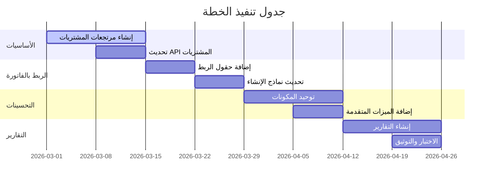
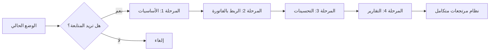

# خطة شاملة لتحسين وتطوير نظام تبويب المرتجعات

## الملخص التنفيذي

تُقدم هذه الخطة تحليلاً شاملاً للوضع الحالي لنظام المرتجعات في صفحات المبيعات والمشتريات، مع تحديد نقاط الضعف والفرص المتاحة، ووضع أهداف قابلة للقياس وإجراءات تنفيذية واضحة.

---

## القسم الأول: تحليل الوضع الحالي

### 1.1 نظرة عامة على النظام

| المكون | حالة التنفيذ | الملاحظات |
|--------|-------------|-----------|
| مرتجعات المبيعات | ✅ مُنفذ | تبويب كامل مع نموذج إنشاء |
| مرتجعات المشتريات | ❌ غير مُنفذ | تبويب موجود لكن غير فعّال |
| واجهة برمجة التطبيقات (API) | ✅ مُنفذة للمرتجعات | نوع `return_sale` فقط |

### 1.2 components الموجودة

#### مرتجعات المبيعات (Sales Returns)
```
src/features/sales/components/Returns/
├── CreateReturnModal.tsx     # نموذج إنشاء مرتجع مبيعات
├── SalesReturnsView.tsx     # عرض قائمة المرتجعات
└── SalesReturns.tsx          # المكون الرئيسي
```

#### مرتجعات المشتريات (Purchase Returns)
```
# لا يوجد أي مكون - غير مُنفذ!
```

### 1.3 نقاط الضعف المُحددة

#### ❌ نقطة ضعف #1: عدم وجود نظام مرتجعات المشتريات
- **الوصف**: تبويب "المرتجعات" في صفحة المشتريات غير مُفعّل
- **التأثير**: لا يمكن إرجاع البضاعة للموردين
- **الأولوية**: عالية جداً

#### ❌ نقطة ضعف #2: عدم ربط المرتجعات بالفاتورة الأصلية
- **الوصف**: لا يوجد ربط بين مرتجع المبيعات والفاتورة المباعة
- **التأثير**: صعوبة تتبع المرتجعات ومعرفة الأصناف المُرجعة
- **الأولوية**: عالية

#### ❌ نقطة ضعف #3: واجهة مستخدم بسيطة جداً
- **الوصف**: نموذج الإنشاء يفتقر للميزات المتقدمة
- **التأثير**: تجربة مستخدم محدودة
- **الأولوية**: متوسطة

#### ❌ نقطة ضعف #4: عدم وجود تقارير متخصصة للمرتجعات
- **الوصف**: لا توجد تقارير تحليلية للمرتجعات
- **التأثير**: صعوبة تحليل بيانات المرتجعات
- **الأولوية**: متوسطة

#### ❌ نقطة ضعف #5: عدم دعم المرتجعات الجزئية
- **الوصف**: لا يمكن تحديد كميات جزئية للإرجاع
- **التأثير**: إجبار المستخدم على إرجاع كامل الفاتورة
- **الأولوية**: عالية

### 1.4 الفرص المتاحة

| الفرصة | الوصف | القيمة المُضافة |
|--------|-------|----------------|
| توحيد واجهة المرتجعات | إنشاء مكون مشترك للمبيعات والمشتريات | تحسين الصيانة |
| ربط المرتجعات بالفاتورة | ربط كل مرتجع بالفاتورة الأصلية | تتبع أفضل |
| تحليلات متقدمة | تقارير ذكية للمرتجعات | قرارات أفضل |
| أتمتة المخزون | تحديث المخزون تلقائياً | دقة المخزون |
| سياسات الإرجاع | تحديد قواعد للإرجاع | مرونة أكثر |

---

## القسم الثاني: الأهداف القابلة للقياس

### 2.1 الأهداف الرئيسية

| الهدف | المؤشر | القيمة المستهدفة |
|-------|--------|-----------------|
| تفعيل مرتجعات المشتريات | نسبة التنفيذ | 100% |
| ربط المرتجعات بالفاتورة | نسبة الربط | 100% |
| تحسين واجهة المستخدم | درجة الرضا | > 80% |
| إنشاء تقارير المرتجعات | عدد التقارير | 3 تقارير |

### 2.2 الأهداف الفرعية

1. **إنشاء نظام مرتجعات المشتريات**
   - إنشاء نموذج إنشاء مرتجع مشتريات
   - إنشاء عرض قائمة مرتجعات المشتريات
   - ربط واجهة البرمجة

2. **تحسين نظام مرتجعات المبيعات**
   - إضافة إمكانية اختيار الفاتورة الأصلية
   - دعم الإرجاع الجزئي
   - تحسين واجهة المستخدم

3. **إنشاء التقارير والتحليلات**
   - تقرير المرتجعات حسب الفترة
   - تقرير المرتجعات حسب العميل/المورد
   - تقرير المرتجعات حسب الصنف

---

## القسم الثالث: الإجراءات التنفيذية

### المرحلة الأولى: الأساسيات (الأسابيع 1-2)

#### الإجراء 1.1: إنشاء نظام مرتجعات المشتريات

```
المسار: src/features/purchases/components/Returns/
├── CreatePurchaseReturnModal.tsx  # نموذج الإنشاء
└── PurchaseReturnsView.tsx        # عرض القائمة
```

**الخطوات:**
1. إنشاء مجلد Returns في purchases/components
2. نسخ وتعديل CreateReturnModal ليكون PurchaseReturnModal
3. تعديل النوع من `return_sale` إلى `return_purchase`
4. إنشاء PurchaseReturnsView
5. تحديث PurchasesPage لاستخدام المكونات الجديدة

#### الإجراء 1.2: تحديث واجهة برمجة المشتريات

**الملفات المطلوبة:**
- `src/features/purchases/api.ts`
- `src/features/purchases/service.ts`

**الخطوات:**
1. إضافة دالة `commitPurchaseReturnRPC`
2. إضافة فلتر `type: 'return_purchase'` للاستعلامات

### المرحلة الثانية: الربط بالفاتورة (الأسابيع 3-4)

#### الإجراء 2.1: إضافة حقول الربط

**تحديث قاعدة البيانات:**
```sql
-- إضافة حقول جديدة لجدول الفواتير
ALTER TABLE invoices 
ADD COLUMN IF NOT EXISTS reference_invoice_id UUID REFERENCES invoices(id),
ADD COLUMN IF NOT EXISTS return_reason TEXT;
```

#### الإجراء 2.2: تحديث نماذج الإنشاء

**التحديثات المطلوبة:**
- إضافة حقل لاختيار الفاتورة الأصلية
- إضافة قائمة منسدلة لأسباب الإرجاع
- عرض تفاصيل الفاتورة الأصلية

### المرحلة الثالثة: تحسين الواجهة (الأسابيع 5-6)

#### الإجراء 3.1: توحيد المكونات

```
src/features/returns/components/
├── ReturnsList.tsx           # قائمة مشتركة
├── ReturnDetailsModal.tsx    # تفاصيل المرتجع
└── types.ts                  # الأنواع المشتركة
```

#### الإجراء 3.2: إضافة الميزات المتقدمة

| الميزة | الوصف |
|--------|-------|
| البحث الذكي | البحث عن المرتجعات بالنص |
| التصفية المتقدمة | تصفية حسب التاريخ والحالة |
| التصدير | تصدير لقExcel وPDF |
| الطباعة | طباعة ملخص المرتجع |

### المرحلة الرابعة: التقارير (الأسابيع 7-8)

#### الإجراء 4.1: إنشاء تقارير المرتجعات

```
src/features/reports/components/
└── ReturnsReportView.tsx
```

| التقرير | الوصف |
|---------|-------|
| ملخص المرتجعات | إجمالي المرتجعات والمبالغ |
| حسب الفترة | المرتجعات خلال فترة زمنية |
| حسب العميل/المورد | تحليلtop العملاء |
| حسب الصنف | الأصناف الأكثر إرجاعاً |

---

## القسم الرابع: الجدول الزمني



---

## القسم الخامس: الموارد المطلوبة

### 5.1 الموارد البشرية

| الدور | المهام | المدة |
|-------|--------|-------|
| مطور Frontend | تنفيذ الواجهات | 40 ساعة |
| مطور Backend | تحديث API وقاعدة البيانات | 20 ساعة |
| QA | اختبار النظام | 16 ساعة |

### 5.2 الموارد التقنية

| المورد | الوصف |
|--------|-------|
| قاعدة البيانات | حقول جديدة في جدول الفواتير |
| API Endpoints | نقاط جديدة لـ return_purchase |
| التخزين | مساحة للتقارير المُصدَّرة |

### 5.3 الملفات المطلوب تعديلها

```
# ملفات جديدة
src/features/purchases/components/Returns/CreatePurchaseReturnModal.tsx
src/features/purchases/components/Returns/PurchaseReturnsView.tsx
src/features/returns/components/ReturnDetailsModal.tsx
src/features/reports/components/ReturnsReportView.tsx

# ملفات معدلة
src/features/purchases/pages/PurchasesPage.tsx
src/features/purchases/api.ts
src/features/purchases/service.ts
src/features/sales/components/Returns/CreateReturnModal.tsx
src/features/sales/components/Returns/SalesReturnsView.tsx
```

---

## القسم السادس: معايير النجاح

### 6.1 معايير القبول

| الميار | حالة النجاح |
|--------|-------------|
| إنشاء مرتجع مبيعات | ✅ يُنشأ بنجاح مع تحديث المخزون |
| إنشاء مرتجع مشتريات | ✅ يُنشأ بنجاح مع تحديث المخزون |
| ربط المرتجع بالفاتورة | ✅ يُعرض مرجع الفاتورة |
| عرض قائمة المرتجعات | ✅ تُعرض جميع المرتجعات مع التصفية |
| التقارير | ✅ تُعرض البيانات بشكل صحيح |

### 6.2 اختبارات الجودة

```typescript
// اختبارات مطلوبة
describe('Returns System', () => {
  test('إنشاء مرتجع مبيعات بنجاح', () => {})
  test('إنشاء مرتجع مشتريات بنجاح', () => {})
  test('تحديث المخزون عند الإرجاع', () => {})
  test('ربط المرتجع بالفاتورة الأصلية', () => {})
  test('عرض المرتجعات حسب التصفية', () => {})
  test('تصدير التقارير', () => {})
});
```

### 6.3 مؤشرات الأداء

| المؤشر | الهدف |
|--------|-------|
| وقت تحميل صفحة المرتجعات | < 2 ثانية |
| وقت إنشاء مرتجع | < 3 ثوانٍ |
| نسبة الأخطاء | < 1% |

---

## القسم السابع: المخاطر والتخفيف

| المخاطر | الاحتمالية | التأثير | خطة التخفيف |
|---------|-----------|--------|-------------|
| تأخر في تطوير Backend | متوسط | عالي | البدء مبكراً بالتطوير |
| مشاكل في تكامل المخزون | منخفض | عالي | اختبار شامل |
| تغيير متطلبات المستخدمين | متوسط | متوسط | مرونة في التصميم |

---

## القسم الثامن: خارطة الطريق النهائية



---

## الملحق أ: قائمة المهام التفصيلية

### مهام المرحلة الأولى

- [ ] 1.1 إنشاء مجلد Returns في purchases/components
- [ ] 1.2 إنشاء CreatePurchaseReturnModal.tsx
- [ ] 1.3 إنشاء PurchaseReturnsView.tsx
- [ ] 1.4 إضافة commitPurchaseReturnRPC في api.ts
- [ ] 1.5 إضافة processPurchaseReturn في service.ts
- [ ] 1.6 تحديث PurchasesPage لاستخدام المكونات الجديدة

### مهام المرحلة الثانية

- [ ] 2.1 إضافة حقول reference_invoice_id و return_reason
- [ ] 2.2 تحديث CreateReturnModal لاختيار الفاتورة
- [ ] 2.3 تحديث CreatePurchaseReturnModal لاختيار الفاتورة
- [ ] 2.4 إضافة reasons للإرجاع (defective, wrong item, etc.)

### مهام المرحلة الثالثة

- [ ] 3.1 إنشاء ReturnsList مشترك
- [ ] 3.2 إضافة البحث والتصفية
- [ ] 3.3 إضافة التصدير لل Excel
- [ ] 3.4 إضافة طباعة المرتجع

### مهام المرحلة الرابعة

- [ ] 4.1 إنشاء ReturnsReportView
- [ ] 4.2 إضافة تقرير ملخص المرتجعات
- [ ] 4.3 إضافة تقرير حسب العميل/المورد
- [ ] 4.4 إضافة تقرير حسب الصنف
- [ ] 4.5 كتابة التوثيق

---

## الملحق ب: الأمثلة المرجعية

### مثال: هيكل بيانات المرتجع

```typescript
interface ReturnInvoice {
  id: string;
  invoice_number: string;
  type: 'return_sale' | 'return_purchase';
  reference_invoice_id?: string;  // الفاتورة الأصلية
  return_reason?: string;          // سبب الإرجاع
  issue_date: string;
  party: Party;
  items: ReturnItem[];
  total_amount: number;
  status: 'draft' | 'posted' | 'paid';
  notes: string;
}

interface ReturnItem {
  id: string;
  product_id: string;
  product_name: string;
  quantity: number;
  unit_price: number;
  total: number;
}
```

---

**تاريخ الإعداد**: 2026-02-26
**حالة الخطة**: جاهزة للمراجعة
**المدة التقديرية**: 8 أسابيع
