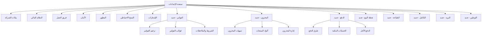

# خطة تحسين وتطوير صفحة الإعدادات
## Settings Page Improvement Plan

---

## نظرة عامة | Overview

هذا المستند يوضح خطة شاملة لتحسين صفحة الإعدادات وإضافة الإعدادات المطلوبة لباقي مكونات التطبيق.

---

## الهيكل الحالي | Current Structure

### الأقسام الموجودة:
1. **بيانات الشركة (Company Profile)** - ✅ مكتمل
   - معلومات الهوية
   - بيانات الاتصال

2. **النظام المالي (Financial Settings)** - ✅ مكتمل
   - إعدادات الضريبة والخصومات
   - السنوات المالية
   - إدارة العملات

3. **فريق العمل (Team)** - ✅ مكتمل
   - إدارة أعضاء الفريق
   - دعوات المستخدمين

4. **الأمان (Security)** - ✅ مكتمل
   - إعدادات الأمان
   - إدارة الصلاحيات

5. **المظهر (Appearance)** - ✅ مكتمل
   - تخصيص الألوان
   - الخطوط
   - التأثيرات

6. **النسخ الاحتياطي (Backup)** - ✅ مكتمل
   - إعدادات النسخ الاحتياطي

7. **الإشعارات (Notifications)** - ✅ مكتمل
   - إعدادات الإشعارات

---

## الأقسام المطلوب إضافتها | Required New Sections

### 1. إعدادات الفواتير (Invoice Settings) - 🔴 عالي الأولوية

```typescript
interface InvoiceSettings {
  // ترقيم الفواتير
  invoice_prefix: string;           // بادئة رقم الفاتورة (مثال: INV-)
  invoice_start_number: number;     // رقم البداية
  invoice_suffix_format: string;    // تنسيق الرقم (YYYY-MM-XXXX)
  
  // ترقيم الفواتير
  quote_prefix: string;             // بادئة عرض السعر
  quote_start_number: number;
  
  // ترقيم المرتجعات
  return_prefix: string;            // بادئة المرتجعات
  
  // الإعدادات الافتراضية
  default_payment_terms: number;    // شروط الدفع الافتراضية (أيام)
  default_due_date_days: number;    // أيام الاستحقاق
  auto_generate_number: boolean;    // توليد تلقائي للرقم
  
  // قالب الفاتورة
  invoice_template: 'simple' | 'detailed' | 'custom';
  show_logo: boolean;
  show_tax_details: boolean;
  show_bank_details: boolean;
  
  // ملاحظات افتراضية
  default_notes_ar: string;
  default_notes_en: string;
  default_terms_ar: string;
  default_terms_en: string;
}
```

**المكونات المطلوبة:**
- `InvoiceNumberingSettings.tsx`
- `InvoiceTemplateSettings.tsx`
- `DefaultTermsSettings.tsx`

---

### 2. إعدادات المخزون (Inventory Settings) - 🔴 عالي الأولوية

```typescript
interface InventorySettings {
  // المستودع الافتراضي
  default_warehouse_id: string;
  
  // تنبيهات المخزون
  low_stock_threshold: number;      // حد التنبيه (عدد القطع)
  low_stock_alert_enabled: boolean;
  low_stock_alert_email: boolean;
  low_stock_alert_push: boolean;
  
  // إعدادات المنتجات
  auto_generate_sku: boolean;       // توليد تلقائي لـ SKU
  sku_prefix: string;
  sku_format: string;               // تنسيق الكود
  
  // طرق التقييم
  inventory_valuation_method: 'fifo' | 'lifo' | 'weighted_average';
  
  // الحركات
  require_approval_for_transfers: boolean;
  allow_negative_stock: boolean;    // السماح بالمخزون السالب
  
  // الجرد
  enable_stock_audit: boolean;
  audit_frequency: 'monthly' | 'quarterly' | 'yearly';
}
```

**المكونات المطلوبة:**
- `InventoryAlertsSettings.tsx`
- `ProductCodeSettings.tsx`
- `StockManagementSettings.tsx`

---

### 3. إعدادات الدفع (Payment Settings) - 🔴 عالي الأولوية

```typescript
interface PaymentSettings {
  // طرق الدفع المتاحة
  available_payment_methods: PaymentMethod[];
  
  // طريقة الدفع الافتراضية
  default_payment_method: 'cash' | 'card' | 'bank_transfer' | 'credit';
  
  // الحسابات البنكية
  bank_accounts: BankAccount[];
  
  // إعدادات الدفع الآجل
  default_credit_days: number;
  max_credit_limit: number;
  require_approval_for_credit: boolean;
  
  // خصم الدفع المبكر
  early_payment_discount_enabled: boolean;
  early_payment_discount_percent: number;
  early_payment_discount_days: number;
}

interface PaymentMethod {
  id: string;
  name_ar: string;
  name_en: string;
  type: 'cash' | 'card' | 'bank_transfer' | 'credit' | 'wallet';
  is_active: boolean;
  icon: string;
}

interface BankAccount {
  id: string;
  bank_name: string;
  account_name: string;
  account_number: string;
  iban: string;
  is_default: boolean;
}
```

**المكونات المطلوبة:**
- `PaymentMethodsSettings.tsx`
- `BankAccountsManager.tsx`
- `CreditSettings.tsx`

---

### 4. إعدادات نقطة البيع (POS Settings) - 🟡 متوسط الأولوية

```typescript
interface POSSettings {
  // الشاشة
  show_product_images: boolean;
  grid_view_default: boolean;
  categories_on_top: boolean;
  
  // الطباعة
  auto_print_receipt: boolean;
  receipt_printer: string;
  receipt_paper_size: '58mm' | '80mm';
  receipt_template: 'simple' | 'detailed';
  
  // السلة
  allow_discount_in_cart: boolean;
  allow_price_edit: boolean;
  require_customer_for_sale: boolean;
  
  // الصوت
  scan_beep_enabled: boolean;
  
  // الإغلاق
  auto_clear_cart_after_sale: boolean;
  ask_for_cash_drawer: boolean;
}
```

**المكونات المطلوبة:**
- `POSDisplaySettings.tsx`
- `POSReceiptSettings.tsx`
- `POSCartSettings.tsx`

---

### 5. إعدادات الطباعة (Print Settings) - 🟡 متوسط الأولوية

```typescript
interface PrintSettings {
  // إعدادات عامة
  default_paper_size: 'A4' | 'A5' | 'Letter';
  default_orientation: 'portrait' | 'landscape';
  
  // الفواتير
  invoice_paper_size: 'A4' | 'A5' | 'thermal';
  invoice_copies: number;
  print_invoice_logo: boolean;
  
  // التقارير
  report_paper_size: 'A4' | 'A3';
  report_orientation: 'portrait' | 'landscape';
  
  // العناوين
  company_header_on_all: boolean;
  show_page_numbers: boolean;
  
  // PDF
  pdf_quality: 'low' | 'medium' | 'high';
  embed_fonts: boolean;
}
```

**المكونات المطلوبة:**
- `PrintGeneralSettings.tsx`
- `InvoicePrintSettings.tsx`
- `ReportPrintSettings.tsx`

---

### 6. إعدادات التكامل (Integration Settings) - 🟡 متوسط الأولوية

```typescript
interface IntegrationSettings {
  // هيئة الزكاة والضريبة (ZATCA)
  zatca_enabled: boolean;
  zatca_environment: 'sandbox' | 'production';
  zatca_vat_number: string;
  zatca_api_key?: string;
  zatca_secret?: string;
  
  // نقاط البيع
  pos_integration_enabled: boolean;
  pos_provider?: string;
  
  // الدفع الإلكتروني
  payment_gateway_enabled: boolean;
  payment_gateway?: 'mada' | 'visa' | 'mastercard' | 'applepay';
  
  // المحاسبة
  accounting_integration_enabled: boolean;
  accounting_provider?: string;
}
```

**المكونات المطلوبة:**
- `ZATCASettings.tsx`
- `PaymentGatewaySettings.tsx`
- `ThirdPartyIntegrations.tsx`

---

### 7. إعدادات البريد الإلكتروني (Email Settings) - 🟢 منخفض الأولوية

```typescript
interface EmailSettings {
  // SMTP
  smtp_enabled: boolean;
  smtp_host: string;
  smtp_port: number;
  smtp_username: string;
  smtp_password: string;
  smtp_encryption: 'ssl' | 'tls' | 'none';
  
  // المرسل
  sender_name: string;
  sender_email: string;
  reply_to: string;
  
  // القوالب
  email_templates: EmailTemplate[];
  
  // الإرسال التلقائي
  auto_send_invoices: boolean;
  auto_send_statements: boolean;
  statement_frequency: 'weekly' | 'monthly';
}

interface EmailTemplate {
  id: string;
  type: 'invoice' | 'quote' | 'receipt' | 'statement' | 'reminder';
  subject_ar: string;
  subject_en: string;
  body_ar: string;
  body_en: string;
}
```

**المكونات المطلوبة:**
- `SMTPSettings.tsx`
- `EmailTemplatesManager.tsx`
- `AutoEmailSettings.tsx`

---

### 8. إعدادات الترجمة والتوطين (Localization Settings) - 🟢 منخفض الأولوية

```typescript
interface LocalizationSettings {
  // اللغة
  default_language: 'ar' | 'en';
  fallback_language: 'ar' | 'en';
  
  // التاريخ
  date_format: 'DD/MM/YYYY' | 'MM/DD/YYYY' | 'YYYY-MM-DD';
  hijri_dates_enabled: boolean;
  timezone: string;
  
  // الأرقام
  number_format: 'arabic' | 'western';
  decimal_separator: '.' | ',';
  thousands_separator: ',' | '.' | ' ';
  
  // العملة
  currency_symbol_position: 'before' | 'after';
  currency_decimal_places: number;
}
```

**المكونات المطلوبة:**
- `LanguageSettings.tsx`
- `DateFormatSettings.tsx`
- `NumberFormatSettings.tsx`

---

## مخطط هيكل الإعدادات الجديد



---

## متجر الإعدادات الموحد (Settings Store)

```typescript
// src/features/settings/settingsStore.ts

interface AppSettings {
  // الإعدادات المحلية
  invoice: InvoiceSettings;
  inventory: InventorySettings;
  payment: PaymentSettings;
  pos: POSSettings;
  print: PrintSettings;
  integration: IntegrationSettings;
  email: EmailSettings;
  localization: LocalizationSettings;
  
  // الإجراءات
  loadSettings: () => Promise<void>;
  saveSettings: (section: string, data: any) => Promise<void>;
  resetSettings: (section: string) => Promise<void>;
  exportSettings: () => Promise<string>;
  importSettings: (data: string) => Promise<void>;
}
```

---

## خطة التنفيذ

### المرحلة الأولى: الإعدادات الأساسية (عالي الأولوية)
1. إنشاء `settingsStore.ts` موحد
2. إضافة قسم إعدادات الفواتير
3. إضافة قسم إعدادات المخزون
4. إضافة قسم إعدادات الدفع

### المرحلة الثانية: إعدادات نقطة البيع والطباعة
5. إضافة قسم إعدادات نقطة البيع
6. إضافة قسم إعدادات الطباعة

### المرحلة الثالثة: التكامل والتخصيص
7. إضافة قسم التكامل (ZATCA)
8. إضافة قسم البريد الإلكتروني
9. إضافة قسم التوطين

---

## الملفات المطلوب إنشاؤها

### المكونات الجديدة:
```
src/features/settings/components/
├── invoice/
│   ├── InvoiceNumberingSettings.tsx
│   ├── InvoiceTemplateSettings.tsx
│   └── DefaultTermsSettings.tsx
├── inventory/
│   ├── InventoryAlertsSettings.tsx
│   ├── ProductCodeSettings.tsx
│   └── StockManagementSettings.tsx
├── payment/
│   ├── PaymentMethodsSettings.tsx
│   ├── BankAccountsManager.tsx
│   └── CreditSettings.tsx
├── pos/
│   ├── POSDisplaySettings.tsx
│   ├── POSReceiptSettings.tsx
│   └── POSCartSettings.tsx
├── print/
│   ├── PrintGeneralSettings.tsx
│   └── InvoicePrintSettings.tsx
├── integration/
│   ├── ZATCASettings.tsx
│   └── ThirdPartyIntegrations.tsx
├── email/
│   ├── SMTPSettings.tsx
│   └── EmailTemplatesManager.tsx
└── localization/
    ├── LanguageSettings.tsx
    └── DateFormatSettings.tsx
```

### المتجر والأنواع:
```
src/features/settings/
├── settingsStore.ts          # متجر الإعدادات الموحد
├── types/
│   ├── invoice.types.ts
│   ├── inventory.types.ts
│   ├── payment.types.ts
│   ├── pos.types.ts
│   ├── print.types.ts
│   ├── integration.types.ts
│   ├── email.types.ts
│   └── localization.types.ts
└── api/
    └── settingsApi.ts        # API لحفظ الإعدادات
```

---

## ملخص

| القسم | الأولوية | عدد المكونات | الحالة |
|-------|----------|--------------|--------|
| الفواتير | 🔴 عالي | 3 | جديد |
| المخزون | 🔴 عالي | 3 | جديد |
| الدفع | 🔴 عالي | 3 | جديد |
| نقطة البيع | 🟡 متوسط | 3 | جديد |
| الطباعة | 🟡 متوسط | 2 | جديد |
| التكامل | 🟡 متوسط | 2 | جديد |
| البريد | 🟢 منخفض | 2 | جديد |
| التوطين | 🟢 منخفض | 2 | جديد |

**المجموع:** 8 أقسام جديدة، 20 مكون جديد
