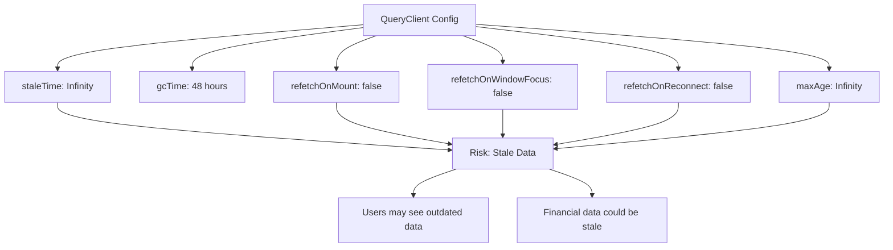
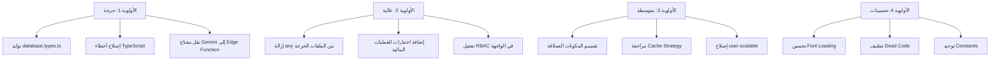

# 🔍 تقرير الفحص التقني الشامل — نظام الزهراء ERP

**تاريخ التقرير:** 2026-03-05  
**النسخة:** 1.0.0  
**المراجع:** Kilo Code — Senior Technical Auditor  

---

## جدول المحتويات

1. [التقييم العام](#1-التقييم-العام)
2. [نقاط القوة](#2-نقاط-القوة)
3. [نقاط الضعف والمشكلات](#3-نقاط-الضعف-والمشكلات)
4. [الأداء والسرعة](#4-الأداء-والسرعة)
5. [الأمان](#5-الأمان)
6. [تجربة المستخدم UX/UI](#6-تجربة-المستخدم-uxui)
7. [التوصيات والمقترحات](#7-التوصيات-والمقترحات)
8. [التقييم الختامي](#8-التقييم-الختامي)

---

## 1. التقييم العام

### ملخص المشروع

| البند | القيمة |
|-------|--------|
| **اسم المشروع** | Al-Zahra Smart ERP |
| **التقنيات الأساسية** | React 19, TypeScript, Vite 5, Supabase, TanStack Query, Zustand, Tailwind CSS |
| **الوظائف الرئيسية** | نقطة بيع POS، مبيعات ومشتريات، محاسبة مالية، مخزون، مصروفات، سندات، تقارير، ذكاء اصطناعي Gemini، إدارة عملاء وموردين |
| **عدد الوحدات (Features)** | 22 وحدة وظيفية |
| **الهيكل المعماري** | Feature-based architecture مع طبقات Component → Hook → Service → API → Supabase |
| **اللغة** | عربية أساسية مع دعم ثنائي اللغة AR/EN |
| **الاستضافة** | Netlify/Vercel + Supabase Backend |

### التقييم الإجمالي

نظام الزهراء ERP هو تطبيق متقدم وطموح يُظهر مستوى عالٍ من الهندسة المعمارية والتخطيط. التطبيق يغطي نطاقاً واسعاً من الوظائف المحاسبية والتجارية مع دمج ذكاء اصطناعي. ومع ذلك، يعاني من عدة مشكلات تقنية تحتاج معالجة فورية، أبرزها: كثافة الأخطاء التايبسكربت، الاستخدام المفرط لنوع `any`، وضعف التغطية الاختبارية.

---

## 2. نقاط القوة

### 2.1 هيكلة معمارية متقدمة ✅

- **Feature-based Architecture:** كل وحدة وظيفية مُنظمة في مجلد مستقل يحتوي على `api/`, `hooks/`, `services/`, `components/`, `types/` — وهو نمط متقدم يسهّل الصيانة والتوسع.
- **طبقات واضحة (Layered Architecture):** التزام موثّق في [`SUPABASE_RULES.md`](SUPABASE_RULES.md) بمسار `Component → Hook → Service → API → Supabase`، مما يمنع الاقتران المباشر.
- **فصل المنطق عن العرض:** استخدام Use Cases في [`src/core/usecases/`](src/core/usecases/) يُظهر تطبيقاً جزئياً لنمط Clean Architecture.

### 2.2 إدارة حالة الخادم المتقدمة ✅

- **TanStack Query + IndexedDB Persistence:** الكاش يُحفظ لمدة 48 ساعة عبر [`src/lib/queryClient.ts`](src/lib/queryClient.ts) مع `staleTime: Infinity` — مما يوفر تجربة offline-first ممتازة.
- **Query Keys منظمة:** مفاتيح الاستعلام مُنظمة هرمياً في [`src/core/lib/react-query.tsx`](src/core/lib/react-query.tsx) مما يسهّل invalidation الدقيقة.
- **Optimistic UI:** التوثيق يفرض تحديث الكاش فوراً بعد التعديل.

### 2.3 نظام أمان متعدد الطبقات ✅

- **إخفاء أخطاء قاعدة البيانات في الإنتاج:** [`src/index.tsx`](src/index.tsx:16) يعترض fetch للطلبات الفاشلة ويستبدل رسائل الخطأ الخام برسائل عامة.
- **قمع Console في الإنتاج:** `console.log` و `console.debug` مُعطّلتان في بيئة الإنتاج.
- **Custom Fetch مع Retry:** [`src/lib/supabaseClient.ts`](src/lib/supabaseClient.ts:16) يحتوي على timeout + retry logic مع exponential backoff.
- **ESLint Security Plugin:** [`eslint.config.js`](eslint.config.js:106) يتضمن `eslint-plugin-security` مع قواعد صارمة.
- **RLS Enforcement:** [`SUPABASE_RULES.md`](SUPABASE_RULES.md:46) يفرض Row Level Security على مستوى قاعدة البيانات.

### 2.4 تجربة مطور متميزة ✅

- **TypeScript Strict Mode:** [`tsconfig.json`](tsconfig.json:20) يُفعّل كل خيارات الصرامة بما فيها `exactOptionalPropertyTypes`.
- **ESLint Rules صارمة:** قواعد مثل `complexity: max 10` و `max-lines-per-function: 50` و `no-explicit-any: error`.
- **Husky + Lint-Staged:** فحص تلقائي قبل كل commit.
- **Logger مركزي:** [`src/core/utils/logger.ts`](src/core/utils/logger.ts) يوفر نظام تسجيل موحد مع مستويات وألوان و deduplication.
- **Zod Validators:** مخططات تحقق شاملة في [`src/core/validators/index.ts`](src/core/validators/index.ts) للفواتير والقيود المحاسبية.

### 2.5 ذكاء اصطناعي مدمج ✅

- **تحليل مالي بالذكاء الاصطناعي:** [`src/features/ai/service.ts`](src/features/ai/service.ts) يُولّد تحليلات عميقة عبر Gemini مع health_score, risk_analysis, anomalies.
- **10+ خدمات AI:** تسعير ذكي، توقع مبيعات، كشف شذوذ، تقسيم عملاء، تقييم موردين.
- **AI Chat مدمج:** [`src/features/ai/useAIChat.ts`](src/features/ai/useAIChat.ts) يوفر واجهة محادثة ذكية.

### 2.6 تنوع الوظائف ✅

- 22 وحدة وظيفية تغطي: POS، مبيعات، مشتريات، محاسبة، مخزون، مصروفات، سندات، تقارير، مركبات، استيراد ذكي، إشعارات، مظهر قابل للتخصيص.
- دعم **Multi-currency** مع أسعار صرف ديناميكية.
- دعم **ZATCA** للفوترة الإلكترونية السعودية.
- **Service Worker** للعمل دون اتصال.
- دعم **Feature Flags** للتحكم بإطلاق الميزات تدريجياً عبر [`src/config/featureFlags.ts`](src/config/featureFlags.ts).

---

## 3. نقاط الضعف والمشكلات

### 🔴 مشكلات حرجة (Critical)

#### 3.1 كثافة أخطاء TypeScript الهائلة

| ملف الأخطاء | الحجم |
|-------------|-------|
| `tsc_errors.txt` | 79,752 chars |
| `tsc_errors_2.txt` | 39,438 chars |
| `ts_errors.txt` | 114,350 chars |
| `ts_errors_v2.txt` | 114,232 chars |
| `ts_errors_v3.txt` | 107,704 chars |
| `errors.txt` | 16,417 chars |

**التأثير:** وجود مئات أخطاء TypeScript يعني أن `tsc --noEmit` يفشل، مما يُبطل قيمة TypeScript Strict Mode المُعلنة في الإعدادات. الأخطاء تشمل:
- `TS2322` (Type mismatch): عدم توافق أنواع بين الطبقات
- `TS7006` (Implicit any): بارامترات بدون أنواع صريحة
- `TS2769` (No overload matches): استعلامات Supabase لجداول غير موجودة في `database.types.ts`
- `TS6133/TS6196` (Unused variables/imports): متغيرات واستيرادات غير مستخدمة
- `TS2375` مع `exactOptionalPropertyTypes`: عدم التوافق مع الخصائص الاختيارية

**الجذر:** ملف [`src/core/database.types.ts`](src/core/database.types.ts) حجمه **0 بايت** (فارغ)، و [`supabase-types.ts`](supabase-types.ts) أيضاً **فارغ**. هذا يعني أن كل استعلام Supabase مكشوف تايبسكربتياً.

#### 3.2 استخدام `any` المفرط (96+ موقع)

تم رصد **96 استخدام لنوع `any`** في ملفات `.ts` وحدها، رغم أن قاعدة ESLint تحظره (`@typescript-eslint/no-explicit-any: error`). أبرز المواقع:

| الملف | عدد الاستخدامات | الخطورة |
|-------|------------------|---------|
| [`src/features/dashboard/services/dashboardStats.ts`](src/features/dashboard/services/dashboardStats.ts) | 12+ | عالية |
| [`src/features/dashboard/hooks/index.ts`](src/features/dashboard/hooks/index.ts) | 15+ | عالية |
| [`src/features/auth/api.ts`](src/features/auth/api.ts:5) | 6+ | حرجة (بيانات المستخدم) |
| [`src/features/inventory/hooks/useInventoryManagement.ts`](src/features/inventory/hooks/useInventoryManagement.ts) | 5+ | عالية |
| [`src/features/pos/store.ts`](src/features/pos/store.ts:7) | 4+ | عالية |
| [`src/lib/supabaseClient.ts`](src/lib/supabaseClient.ts:18) | 3+ | عالية |

**التأثير:** يُبطل فائدة TypeScript في اكتشاف الأخطاء مبكراً ويزيد احتمال أخطاء runtime.

#### 3.3 ملف أنواع قاعدة البيانات فارغ

[`src/core/database.types.ts`](src/core/database.types.ts) — **0 بايت**. هذا يعني:
- لا يوجد type-checking على استعلامات Supabase
- الاستعلامات لجداول مثل `customer_activities` و `customer_notes` تفشل في TypeScript
- `supabase.from('table')` لا يُنتج أي تحقق من النوع

### 🟠 مشكلات متوسطة (Medium)

#### 3.4 تغطية اختبارية ضعيفة جداً

| نوع الاختبار | العدد | التغطية |
|-------------|-------|---------|
| Unit Tests | ~5 ملفات | < 5% |
| E2E Tests | 1 ملف فقط (`e2e/auth.spec.ts`) | < 1% |
| Integration Tests | 0 | 0% |

ملفات الاختبار الموجودة:
- [`src/core/utils.test.ts`](src/core/utils.test.ts) — 1,714 chars
- [`src/core/utils/currencyUtils.test.ts`](src/core/utils/currencyUtils.test.ts) — 6,236 chars
- [`src/core/utils/logger.test.ts`](src/core/utils/logger.test.ts) — 9,088 chars
- [`src/core/usecases/inventory/StockMovementUsecase.test.ts`](src/core/usecases/inventory/StockMovementUsecase.test.ts) — 4,116 chars
- [`src/ui/base/PageLoader.test.tsx`](src/ui/base/PageLoader.test.tsx) — 349 chars
- [`src/ui/common/StatCard.test.tsx`](src/ui/common/StatCard.test.tsx) — 1,393 chars

**التأثير:** لا توجد اختبارات للعمليات المالية الحرجة (فواتير، قيود محاسبية، POS checkout) — مما يزيد مخاطر الأخطاء في بيئة الإنتاج بشكل كبير.

#### 3.5 مكونات عملاقة (God Components)

| الملف | الحجم | الوصف |
|-------|-------|-------|
| [`src/features/auth/LandingPage.tsx`](src/features/auth/LandingPage.tsx) | 35,999 chars | صفحة الهبوط — ضخمة جداً |
| [`src/ui/common/ExcelTable.tsx`](src/ui/common/ExcelTable.tsx) | 38,939 chars | جدول Excel — يحتاج تقسيم |
| [`src/ui/common/AIChatPanel.tsx`](src/ui/common/AIChatPanel.tsx) | 26,956 chars | لوحة الدردشة الذكية |
| [`src/features/ai/service.ts`](src/features/ai/service.ts) | 23,631 chars | خدمة الذكاء الاصطناعي |
| [`src/features/accounting/components/journals/AddJournalEntryModal.tsx`](src/features/accounting/components/journals/AddJournalEntryModal.tsx) | 22,326 chars | نموذج القيد المحاسبي |
| [`src/features/bonds/components/BondsAnalyticsView.tsx`](src/features/bonds/components/BondsAnalyticsView.tsx) | 20,599 chars | تحليلات السندات |

**التأثير:** يتعارض مع قاعدة `max-lines-per-function: 50` المُعلنة في ESLint. يُصعّب الصيانة والاختبار.

#### 3.6 `useInvalidateQueries` غير مُطبّق

[`src/core/lib/react-query.tsx`](src/core/lib/react-query.tsx:210) — hook يحتوي على دوال فارغة بتعليقات "Will be implemented":
```typescript
invalidateAll: () => {
    // Will be implemented with queryClient.invalidateQueries()
},
```

#### 3.7 QueryClient مُكرر

يوجد تعريفان منفصلان للـ QueryClient:
- [`src/lib/queryClient.ts`](src/lib/queryClient.ts) — QueryClient الأصلي مع persistence (مُستخدم فعلياً)
- [`src/core/lib/react-query.tsx`](src/core/lib/react-query.tsx:145) — `createQueryClient` factory — بإعدادات مختلفة

هذا يخلق احتمالية تضارب في الإعدادات.

#### 3.8 ازدواجية في التعريفات

- نوع `Product` مُعرّف في [`src/types.ts`](src/types.ts:46) وأيضاً في [`src/core/validators/index.ts`](src/core/validators/index.ts:143) (Zod export type)
- نوع `Invoice` مُعرّف في كلا الملفين أيضاً
- `ErrorBoundary` موجود في [`src/core/components/ErrorBoundary.tsx`](src/core/components/ErrorBoundary.tsx) وأيضاً في [`src/ui/base/ErrorBoundary.tsx`](src/ui/base/ErrorBoundary.tsx)

### 🟡 مشكلات بسيطة (Low)

#### 3.9 تعليقات مُتبقية (Dead Code Comments)

```typescript
// في routes.tsx:
// import { Users, Truck, Building2, ... } from 'lucide-react';
```

#### 3.10 ثوابت مُعرّفة في مسارين

- [`src/constants.tsx`](src/constants.tsx) (8,284 chars)
- [`src/data/constants.tsx`](src/data/constants.tsx) (7,781 chars)

#### 3.11 Service Worker مُسجّل ثم مُلغى فوراً

[`src/index.tsx`](src/index.tsx:79) يُلغي تسجيل كل Service Workers عند التحميل، بينما [`sw.js`](sw.js) لا يزال موجوداً — يُشير إلى حالة انتقالية غير مُنظفة.

---

## 4. الأداء والسرعة

### 4.1 Code Splitting و Lazy Loading ✅ (جيد)

[`src/app/routes.tsx`](src/app/routes.tsx:21) يستخدم `React.lazy()` لكل الصفحات غير الحرجة:
- الصفحات الحرجة (Auth, Dashboard) مُحمّلة eagerly
- 16 صفحة مُحمّلة lazily مع `Suspense` و `PageLoader` fallback

### 4.2 Manual Chunks (Bundle Splitting) ✅ (جيد)

[`vite.config.ts`](vite.config.ts:37) يُقسّم الحزم بشكل ذكي:
- `vendor-react`: React + Router
- `vendor-data`: Supabase + TanStack + Zustand
- `vendor-charts`: Recharts
- `vendor-icons`: Lucide React
- `vendor-heavy-utils`: XLSX, jsPDF, html2canvas

### 4.3 Cache Strategy ⚠️ (تحتاج مراجعة)



**تحليل:** `staleTime: Infinity` + `refetchOnMount: false` + `maxAge: Infinity` يعني أن البيانات لا تُحدّث تلقائياً أبداً. هذا ممتاز للأداء لكنه **خطير للبيانات المالية** — قد يرى المستخدم أرصدة قديمة ما لم يُبطل الكاش يدوياً بعد كل mutation.

### 4.4 Font Loading ⚠️

[`index.html`](index.html:17) يُحمّل **3 خطوط عربية** (Almarai, Cairo, Tajawal) بأوزان متعددة — قد يُبطئ First Contentful Paint.

### 4.5 مكتبات ثقيلة في الحزمة

| المكتبة | الحجم التقريبي | الاستخدام |
|---------|---------------|---------|
| `recharts` | ~230KB gzipped | رسوم بيانية |
| `xlsx-js-style` | ~120KB gzipped | تصدير Excel |
| `jspdf` + `html2canvas` | ~150KB gzipped | تصدير PDF |
| `framer-motion` | ~80KB gzipped | رسوم متحركة |

**تحسين:** `recharts` و `framer-motion` مُحمّلتان مبكراً. يُفضّل lazy import لـ framer-motion في الصفحات التي لا تحتاجها.

### 4.6 ملخص الأداء

| المعيار | التقييم | التعليق |
|---------|---------|---------|
| Code Splitting | ✅ جيد جداً | Lazy loading لكل الصفحات الثانوية |
| Bundle Optimization | ✅ جيد | Manual chunks لفصل المكتبات |
| Caching | ⚠️ عدواني جداً | staleTime: Infinity خطر على البيانات المالية |
| Initial Load | ⚠️ متوسط | 3 خطوط Google Fonts + مكتبات ثقيلة |
| Runtime Perf | ✅ جيد | React 19 + Vite 5 |

---

## 5. الأمان

### 5.1 نقاط قوة أمنية ✅

| الميزة | الملف | التفاصيل |
|--------|-------|----------|
| إخفاء أخطاء DB | [`src/index.tsx`](src/index.tsx:16) | Interceptor يستبدل رسائل PostgreSQL بأخرى عامة |
| قمع console.log | [`src/index.tsx`](src/index.tsx:12) | في بيئة الإنتاج فقط |
| ESLint Security | [`eslint.config.js`](eslint.config.js:106) | detect-eval, detect-unsafe-regex, timing-attacks, etc. |
| RLS Enforcement | [`SUPABASE_RULES.md`](SUPABASE_RULES.md:46) | موثّق كقاعدة إلزامية |
| MFA Support | [`src/features/auth/api.ts`](src/features/auth/api.ts:16) | enrollMFA, challengeMFA, verifyMFA |
| Session Timeout | [`src/features/auth/store.ts`](src/features/auth/store.ts:23) | 15 ثانية timeout للجلسة |
| Password Validation | [`src/core/validators/index.ts`](src/core/validators/index.ts:22) | 8+ chars, uppercase, lowercase, number, special |
| Custom Headers | [`src/lib/supabaseClient.ts`](src/lib/supabaseClient.ts:98) | `x-application-name` header |

### 5.2 ثغرات أمنية محتملة 🔴

#### 5.2.1 مفتاح AI API مكشوف محتملاً

[`src/features/ai/aiProvider.ts`](src/features/ai/aiProvider.ts) يستخدم `@google/genai` مباشرة من العميل — إذا كان مفتاح Gemini API مُخزّناً في متغيرات بيئة frontend (`VITE_*`), فهو **مكشوف بالكامل** في الحزمة المبنية.

**الخطورة:** 🔴 حرجة — يجب نقل استدعاءات AI إلى Supabase Edge Function.

#### 5.2.2 إعدادات Google Drive في العميل

[`src/features/settings/services/googleDriveService.ts`](src/features/settings/services/googleDriveService.ts) يتعامل مع OAuth tokens مباشرة في العميل — يحتاج مراجعة.

#### 5.2.3 `parseError` يقبل `any`

[`src/core/utils/errorUtils.ts`](src/core/utils/errorUtils.ts:12): `parseError = (error: any)` — لا يوجد sanitization للرسائل قبل عرضها، مما قد يسمح بـ XSS عبر رسائل خطأ مُصنّعة.

#### 5.2.4 localStorage للجلسة

[`src/lib/supabaseClient.ts`](src/lib/supabaseClient.ts:93): `storage: window.localStorage` — الجلسات مُخزّنة في localStorage وليس httpOnly cookies، مما يجعلها عرضة لهجمات XSS.

### 5.3 نظام الصلاحيات RBAC

[`src/core/permissions/index.tsx`](src/core/permissions/index.tsx) يُقدّم 5 أدوار (admin, manager, accountant, sales, viewer) مع 22 صلاحية. النظام:
- ✅ مُعرّف بشكل واضح
- ⚠️ client-side فقط — يحتاج تطبيق على مستوى RLS في Supabase
- ⚠️ لا يوجد `usePermission` hook مُستخدم في المكونات (الفحص لم يعثر على استخدام فعلي في الصفحات)

### 5.4 ملخص الأمان

| المعيار | التقييم | التعليق |
|---------|---------|---------|
| Authentication | ✅ جيد | Supabase Auth + MFA |
| Authorization (RLS) | ⚠️ متوسط | موثّق لكن لا يمكن التحقق من التطبيق |
| Client Authorization | ⚠️ ضعيف | RBAC مُعرّف لكن غير مُستخدم فعلياً |
| API Keys | 🔴 خطر | مفتاح Gemini قد يكون مكشوفاً |
| Data Sanitization | ⚠️ متوسط | لا يوجد sanitization لرسائل الخطأ |
| Session Storage | ⚠️ متوسط | localStorage بدل httpOnly cookies |

---

## 6. تجربة المستخدم UX/UI

### 6.1 نقاط القوة

#### صفحة الهبوط

- [`src/features/auth/LandingPage.tsx`](src/features/auth/LandingPage.tsx) — صفحة هبوط غنية بالرسوم المتحركة (framer-motion)
- عرض تجريبي mockup للنظام
- عداد أرقام متحرك (AnimatedCounter)
- دعم RTL/LTR

#### نظام الثيمات

- [`src/lib/themeStore.ts`](src/lib/themeStore.ts) — نظام ثيمات متقدم مع:
  - Light/Dark/System mode
  - ألوان accent قابلة للتخصيص
  - خطوط قابلة للتغيير
  - تأثيرات Glass effect
  - Presets جاهزة
  - Draft → Save pattern

#### التنقل على الهاتف

- [`src/ui/layout/MainLayout.tsx`](src/ui/layout/MainLayout.tsx:95) — شريط تنقل سفلي للهاتف مع أيقونات وتأثيرات
- Sidebar قابل للطي مع mobile overlay
- Responsive breakpoints

#### تجربة Offline

- [`src/lib/offlineService.ts`](src/lib/offlineService.ts) — نظام queue في IndexedDB
- شريط تنبيه عند فقدان الاتصال
- مزامنة تلقائية عند العودة

#### Command Palette

- اختصار `Ctrl+K` لفتح لوحة الأوامر
- [`src/ui/base/CommandPalette.tsx`](src/ui/base/CommandPalette.tsx)

### 6.2 مشكلات UX/UI

| المشكلة | الخطورة | التفاصيل |
|---------|---------|----------|
| `user-scalable=no` | 🟠 متوسطة | [`index.html`](index.html:8) يمنع التكبير — مشكلة accessibility |
| رسالة Offline باللغة الإنجليزية | 🟡 بسيطة | "Offline Mode Active - Data synced to neural local cache" |
| حجم خط صغير جداً | 🟡 بسيطة | `text-[8px]` و `text-[9px]` في التنقل — صعب القراءة |
| لا يوجد Skeleton Loading | ⚠️ متوسطة | بعض المكونات تستخدم `PageLoader` فقط بدل skeleton |
| صفحة 404 بسيطة | 🟡 بسيطة | [`routes.tsx`](src/app/routes.tsx:38) — تصميم بسيط بدون توجيه ذكي |

### 6.3 Accessibility (إمكانية الوصول)

| المعيار | التقييم |
|---------|---------|
| `aria-label` | ✅ مُستخدم في أزرار التنقل |
| `dir="rtl"` | ✅ مُطبّق على مستوى HTML |
| Keyboard Navigation | ✅ `useTableKeyboardNavigation` hook متقدم |
| Color Contrast | ⚠️ لم يُفحص |
| Screen Reader | ⚠️ لا يوجد `aria-live` regions واضحة |
| Focus Management | ⚠️ لا يوجد focus trap في modals |
| `user-scalable=no` | 🔴 يمنع التكبير — انتهاك WCAG 2.1 |

---

## 7. التوصيات والمقترحات

### خطة العمل المُرتبة حسب الأولوية



### الأولوية 1 — حرجة

| # | المهمة | الملفات المتأثرة |
|---|--------|-----------------|
| 1 | تشغيل `npx supabase gen types typescript` لتوليد `database.types.ts` | [`src/core/database.types.ts`](src/core/database.types.ts) |
| 2 | إصلاح أخطاء TypeScript المتعلقة بالأنواع — البدء بملفات الـ API والـ Services | `errors.txt`, ملفات API |
| 3 | نقل استدعاءات Gemini AI إلى Supabase Edge Function وعدم تمرير المفتاح للعميل | [`src/features/ai/aiProvider.ts`](src/features/ai/aiProvider.ts) |
| 4 | إزالة ملفات تقارير الأخطاء من المستودع (`tsc_errors*.txt`, `ts_errors*.txt`, `errors.txt`) وإضافتها لـ `.gitignore` | Root directory |

### الأولوية 2 — عالية

| # | المهمة | الملفات المتأثرة |
|---|--------|-----------------|
| 5 | استبدال `any` بأنواع صريحة في خدمات Dashboard و Auth | [`src/features/dashboard/services/`](src/features/dashboard/services/), [`src/features/auth/api.ts`](src/features/auth/api.ts) |
| 6 | كتابة اختبارات integration للعمليات المالية: POS checkout, إنشاء فاتورة, قيد محاسبي | `src/features/sales/`, `src/features/accounting/` |
| 7 | تطبيق `usePermission` guard في المكونات (ليس فقط تعريف الصلاحيات) | كل الصفحات المحمية |
| 8 | إصلاح `useInvalidateQueries` أو حذف الكود الميت | [`src/core/lib/react-query.tsx`](src/core/lib/react-query.tsx:210) |
| 9 | مراجعة وتوحيد QueryClient (إزالة التكرار بين `queryClient.ts` و `react-query.tsx`) | [`src/lib/queryClient.ts`](src/lib/queryClient.ts), [`src/core/lib/react-query.tsx`](src/core/lib/react-query.tsx) |

### الأولوية 3 — متوسطة

| # | المهمة | الملفات المتأثرة |
|---|--------|-----------------|
| 10 | تقسيم `LandingPage.tsx` إلى sections مستقلة (Hero, Features, HowItWorks, Auth) | [`src/features/auth/LandingPage.tsx`](src/features/auth/LandingPage.tsx) |
| 11 | تقسيم `ExcelTable.tsx` إلى مكونات أصغر | [`src/ui/common/ExcelTable.tsx`](src/ui/common/ExcelTable.tsx) |
| 12 | مراجعة `staleTime: Infinity` — إضافة refetch strategy للحسابات المالية | [`src/lib/queryClient.ts`](src/lib/queryClient.ts) |
| 13 | إزالة `user-scalable=no` من `index.html` | [`index.html`](index.html:8) |
| 14 | ترجمة رسالة Offline إلى العربية | [`src/ui/layout/MainLayout.tsx`](src/ui/layout/MainLayout.tsx:81) |
| 15 | تنظيف Service Worker — حذف `sw.js` بالكامل أو إعادة تفعيله | [`sw.js`](sw.js), [`src/index.tsx`](src/index.tsx:79) |

### الأولوية 4 — تحسينات

| # | المهمة | الملفات المتأثرة |
|---|--------|-----------------|
| 16 | استخدام `font-display: swap` واستضافة الخطوط محلياً | [`index.html`](index.html:17) |
| 17 | توحيد الثوابت — دمج `src/constants.tsx` و `src/data/constants.tsx` | كلا الملفين |
| 18 | حذف ErrorBoundary المُكرر — الاحتفاظ بنسخة واحدة | [`src/core/components/ErrorBoundary.tsx`](src/core/components/ErrorBoundary.tsx), [`src/ui/base/ErrorBoundary.tsx`](src/ui/base/ErrorBoundary.tsx) |
| 19 | إضافة `aria-live` regions للإشعارات وتنبيهات الأخطاء | المكونات الأساسية |
| 20 | إضافة focus trap في الـ modals | [`src/ui/base/Modal.tsx`](src/ui/base/Modal.tsx) |
| 21 | Lazy import لـ `framer-motion` في الصفحات التي تستخدمها فقط | استيرادات المكتبة |

---

## 8. التقييم الختامي

### الدرجات التفصيلية

| المعيار | الدرجة من 10 | التعليق |
|---------|-------------|---------|
| **الهيكلة المعمارية** | 8.5/10 | Feature-based architecture ممتازة مع طبقات واضحة |
| **جودة الكود** | 4.5/10 | إعدادات صارمة لكنها غير مُطبّقة فعلياً — مئات أخطاء TS |
| **Type Safety** | 3.0/10 | database.types.ts فارغ + 96 استخدام any |
| **الأمان** | 6.0/10 | طبقات أمان جيدة لكن مفتاح AI مكشوف محتملاً |
| **الأداء** | 7.5/10 | Code splitting ممتاز — Cache strategy عدوانية |
| **التغطية الاختبارية** | 2.0/10 | 5 اختبارات فقط لتطبيق ERP مالي |
| **تجربة المستخدم** | 7.5/10 | ثيمات وتأثيرات متقدمة — accessibility يحتاج عمل |
| **التوثيق** | 7.0/10 | SUPABASE_RULES و SYSTEM_PROMPT ممتازان |
| **الابتكار** | 8.5/10 | AI مدمج + offline-first + multi-currency + ZATCA |
| **قابلية الصيانة** | 5.5/10 | مكونات عملاقة وتكرار في التعريفات |

### التقييم النهائي

## ⭐ 6.0 / 10

### الخلاصة التنفيذية

نظام الزهراء ERP هو مشروع **طموح ومتقدم هندسياً** يتفوق في التصميم المعماري، تنوع الوظائف، ودمج الذكاء الاصطناعي. ومع ذلك، يعاني من **فجوة كبيرة بين النوايا والتطبيق** — الإعدادات الصارمة (TypeScript strict, ESLint rules) مُعلنة لكنها غير مُطبّقة فعلياً كما يتضح من مئات أخطاء TypeScript و96 استخدام لـ `any`. 

**الخطر الأكبر** هو غياب التغطية الاختبارية للعمليات المالية (فواتير، قيود محاسبية، POS) — في تطبيق ERP مالي، هذا يعني أن أي تعديل قد يُسبب خطأ غير مكتشف في الحسابات.

**التوصية:** تجميد الميزات الجديدة والتركيز على:
1. توليد `database.types.ts` وإصلاح الأنواع
2. كتابة اختبارات للعمليات المالية الحرجة
3. نقل مفتاح AI إلى backend

هذه الخطوات الثلاث وحدها كفيلة برفع التقييم إلى **7.5+/10**.

---

*تم إعداد هذا التقرير بناءً على فحص شامل للكود المصدري وفقاً لمعايير OWASP، WCAG 2.1، وأفضل الممارسات في هندسة البرمجيات.*
